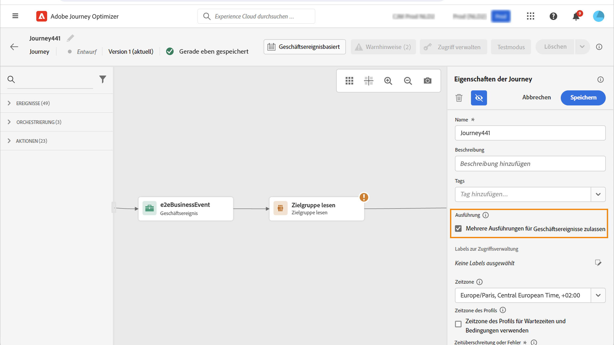

# Profileintrittsverwaltung {#entry-management}

Die Verwaltung des Profileintritts hängt von der Art der Journey ab. In Adobe Journey Optimizer sind die folgenden Arten von Journeys verfügbar:

* **Unitäres Ereignis**-Journeys: Diese Journeys beginnen mit einem unitären Ereignis. Wenn das Ereignis empfangen wird, tritt das verknüpfte Profil in die Journey ein. [Weitere Informationen](#entry-unitary)

* **Geschäftsereignis**-Journeys: Diese Journeys beginnen mit einem Geschäftsereignis, unmittelbar gefolgt von einer Aktivität **Zielgruppe lesen**. Nach Empfang des Ereignisses treten die der angegebenen Zielgruppe angehörenden Profile in die Journey ein.  Für jedes Profil wird eine Instanz dieser Journey erstellt. [Weitere Informationen](#entry-business)

* **Zielgruppe lesen**-Journeys: Diese Journeys beginnen mit einer Aktivität **Zielgruppe lesen**. Wenn die Journey ausgeführt wird, treten die der angegebenen Zielgruppe angehörenden Profile in die Journey ein. Für jedes Profil wird eine Instanz dieser Journey erstellt. Diese Journeys können wiederkehrend oder einmalig sein. [Weitere Informationen](#entry-read-audience)

* **Zielgruppen-Qualifizierungs**-Journeys: Diese Journeys beginnen mit einem Zielgruppen-Qualifizierungsereignis. Diese Journeys überwachen die Ein- und Austritte von Profilen in Zielgruppen. In diesem Fall tritt das verknüpfte Profil die Journey ein. [Weitere Informationen](#entry-unitary)

Für alle Journey-Typen gilt, dass ein Profil nicht mehrmals zur gleichen Zeit in derselben Journey vorhanden sein kann. Um zu überprüfen, ob sich eine Person in einer Journey befindet, wird die Profilidentität als Schlüssel verwendet. Das System lässt nicht zu, dass sich derselbe Schlüssel, z. B. der `CRMID=3224`, an verschiedenen Stellen auf derselben Journey befindet.

## Journeys für unitäre Ereignisse und Zielgruppen-Qualifizierungen{#entry-unitary}

In den Journeys **Unitäre Ereignisse** und **Zielgruppenqualifikation** können Sie den erneuten Eintritt aktivieren oder deaktivieren:

* Wenn der erneute Eintritt aktiviert ist, kann ein Profil mehrmals in eine Journey eintreten, aber erst dann, wenn es aus der vorherigen Instanz der Journey vollständig ausgetreten ist.

* Wenn der erneute Eintritt deaktiviert ist, kann ein Profil nicht mehrmals innerhalb des globalen Journey-Timeout-Zeitraums in dieselbe Journey eintreten.  Weitere Informationen finden Sie in [diesem Abschnitt](../building-journeys/journey-properties.md#global_timeout).

Standardmäßig ist bei Journeys der erneute Eintritt erlaubt. Wenn die Option **Erneuten Eintritt erlauben** aktiviert ist, wird das Feld **Wartezeit bis zum erneuten Eintritt** angezeigt. Damit können Sie die Wartezeit definieren, bevor ein Profil erneut in die Journey eintreten kann.  Dadurch wird verhindert, dass Journeys fälschlicherweise mehrmals für dasselbe Ereignis ausgelöst werden. Standardmäßig ist das Feld auf 5 Minuten eingestellt. Die maximale Wartezeit beträgt 91 Tage ([maximale globale Wartezeit](journey-properties.md#global_timeout)).

<!--
When a journey ends, its status is **[!UICONTROL Closed]**. New individuals can no longer enter the journey. Persons already in the journey automatically exit the journey. 
-->

Nach dem Zeitraum für den erneuten Eintritt können Profile erneut in die Journey eintreten. Um dies zu vermeiden und den erneuten Eintritt für diese Profile vollständig zu deaktivieren, können Sie eine Bedingung hinzufügen, um anhand von Profil- oder Zielgruppendaten zu testen, ob das Profil bereits eingetreten ist oder nicht.

<!--
Due to the 30-day journey timeout, when journey reentrance is not allowed, we cannot make sure the reentrance blocking will work more than 91 days. Indeed, as we remove all information about persons who entered the journey 91 days after they enter, we cannot know the person entered previously, more than 91 days ago. -->

## Geschäfts-Journeys {#entry-business}

<!--
Business events follow reentrance rules in the same way as for unitary events. If a journey allows reentrance, the next business event will be processed.
-->

Um in **Geschäfts-Journeys** mehrere Ausführungen für Geschäftsereignisse zuzulassen, aktivieren Sie die entsprechende Option im Abschnitt **[!UICONTROL Ausführung]** der Journey-Eigenschaften.

Im Falle von Geschäftsereignissen werden für eine bestimmte Journey die bei der ersten Ausführung abgerufenen Zielgruppendaten innerhalb eines Zeitfensters von einer Stunde wiederverwendet.

Ein Profil kann mehrmals gleichzeitig in derselben Journey vorhanden sein, aber im Kontext verschiedener Geschäftsereignisse.

Weitere Informationen hierzu finden Sie in diesem [Abschnitt](../event/about-creating-business.md).

## „Zielgruppe lesen“-Journeys {#entry-read-audience}

**Zielgruppe-lesen**-Journeys können wiederkehrend oder einmalig sein:

* Für nicht wiederkehrende/einmalige Journeys: Das Profil tritt nur einmal in die Journey ein.

* Für wiederkehrende Journeys: Standardmäßig treten bei jeder Wiederholung alle Profile der Zielgruppe in die Journey ein. Sie müssen die Journey beenden, bevor sie in einer anderen Instanz wieder eintreten können.

Für wiederkehrende Zielgruppe-lesen-Journeys stehen zwei Optionen zur Verfügung. 

* Option **Inkrementelles Lesen**: Wenn eine Journey mit einer wiederkehrenden Aktion vom Typ **Zielgruppe lesen** zum ersten Mal ausgeführt wird, treten alle Profile in der Zielgruppe in die Journey ein. Mit dieser Option haben Sie die Möglichkeit, nach dem ersten Auftreten nur die Personen anzusprechen, die seit der letzten Journey-Ausführung in die Zielgruppe eingetreten sind.

  >[!NOTE]
  >
  >Wenn Sie auf eine [benutzerdefinierte Upload-Zielgruppe](../audience/about-audiences.md#segments-in-journey-optimizer) in Ihrer Journey abzielen, werden Profile nur bei der ersten Wiederholung abgerufen, wenn diese Option in einer wiederkehrenden Journey aktiviert ist, da diese Zielgruppen fixiert sind.

* **Erneuten Eintritt bei Wiederholung erzwingen**: Mit dieser Option können Sie alle noch in der Journey vorhandenen Profile bei der nächsten Ausführung automatisch austreten lassen. Wenn die Lebensdauer Ihrer Profile in dieser Journey länger als die Häufigkeit der Wiederholungen sein kann (zum Beispiel, wenn Sie Warteaktivitäten verwenden), aktivieren Sie diese Option nicht. So stellen Sie sicher, dass die Profile ihre Journey abschließen können.

Weitere Informationen hierzu finden Sie in diesem [Abschnitt](../building-journeys/read-audience.md#configuring-segment-trigger-activity).

<!--
After 91 days, a Read audience journey switches to the **Finished** status. This behavior is set for 91 days only (i.e. journey timeout default value) as all information about profiles who entered the journey is removed 91 days after they entered. Persons still in the journey automatically are impacted. They exit the journey after the 30 day timeout. 
-->
