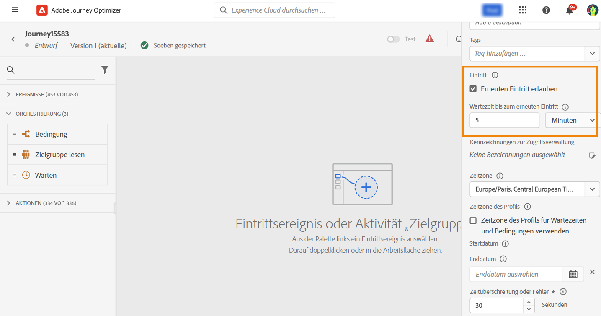

# Profileintritt-Verwaltung {#entry-management}

Standardmäßig ist bei neuen Journeys der erneute Eintritt erlaubt. Sie können die Option für „einmalige“ Journeys deaktivieren, z. B. wenn Sie ein einmaliges Geschenk anbieten möchten, wenn eine Person einen Shop betritt. In diesem Fall möchten Sie nicht, dass der Kunde die Journey erneut betreten und das Angebot erneut wahrnehmen kann.

Wenn eine Journey beendet wird, lautet ihr Status **[!UICONTROL Geschlossen]**. Neue Personen können nicht mehr in die Journey eintreten. Personen, die sich bereits in der Journey befinden, beenden die Journey wie gewohnt.

Nach der standardmäßigen globalen maximalen Wartezeit von 30 Tagen wird der Status der Journey in **Beendet** geändert.  [Weitere Informationen](journey-gs.md#global_timeout).

## Einheitliche Journeys{#entry-unitary}

Einzelne Journey (beginnend mit einem Ereignis oder einer Zielgruppenqualifikation) enthalten eine Schutzmaßnahme, die verhindert, dass Journey fälschlicherweise mehrmals für dasselbe Ereignis ausgelöst werden. Der erneute Profil-Eintritt wird standardmäßig fünf Minuten lang vorübergehend blockiert. Wenn beispielsweise ein Ereignis um 12:01 Uhr eine Journey für ein bestimmtes Profil auslöst und um 12:03 Uhr ein weiteres eintrifft (unabhängig davon, ob es sich um dasselbe Ereignis oder ein anderes handelt, das dieselbe Journey auslöst), wird diese Journey für dieses Profil nicht erneut gestartet.

Zusätzlich:

* Wenn der erneute Eintritt aktiviert ist, kann ein Profil mehrmals in eine Journey eintreten, aber erst dann, wenn es aus der vorherigen Instanz der Journey vollständig ausgetreten ist.

* Wenn der erneute Eintritt deaktiviert ist, kann ein Profil nicht mehrmals in dieselbe Journey eintreten.

## Audience-Journey lesen{#entry-read-segment}

In einer Audience lesen-Journey:

* Für nicht wiederkehrende Journeys: Das Profil tritt nur einmal in die Journey ein.

* Für wiederkehrende Journey: das Profil gibt bei jeder Wiederholung die Journey ein, wenn es sich im erwarteten Status der Zielgruppe befindet. Wenn es sich noch in der Journey einer früheren Wiederkehr befindet, fängt es wieder von vorn an.

Bei Geschäftsereignissen beginnen Journey mit einer **Audience lesen** Aktivität: Da diese Journey auf dem Empfang eines Geschäftsereignisses basiert, wird, wenn das Profil in der erwarteten Zielgruppe qualifiziert ist, für jedes empfangene Geschäftsereignis die Journey angezeigt, d. h., dieses Profil kann mehrere Male in derselben Journey, aber gleichzeitig im Kontext verschiedener Geschäftsereignisse sein.

<!--
# Profile entry management {#entry-management}

There are two main types of journeys:

* event-based journeys: starting with an event, these journeys are unitary, they are associated to one individual. When the event is received, the individual enters the journey. [Read more](#entry-unitary)
* read segment journeys: starting with a read segment, these are batch journeys. Individuals belonging to the segment all enter the same journey. These journeys can be recurring or one-shot. [Read more](#entry-read-segment)

In both journey types, a profile cannot be present multiple times in the same journey, at the same time.

## Unitary journeys{#entry-unitary}

In unitary journeys, you can enable or disable re-entrance:

* If re-entrance is enabled, a profile can enter a journey several times, but cannot do it until he fully exited that previous instance of the journey.

* If re-entrance is disabled, a profile cannot enter multiple times the same journey

By default, new journeys allow re-entrance. You can uncheck the option for “one shot” journeys, for example if you want to offer a one-time gift when a person enters a shop. In that case, you don't want the customer to be able to re-enter the journey and receive the offer again. When a journey ends, its status is **[!UICONTROL Closed]**. New individuals can no longer enter the journey. Persons already in the journey finish the journey normally. [Learn more](journey-gs.md#entrance)

After the default global timeout of 30 days, the journey switches to the **Finished** status. New individuals can no longer enter the journey. Persons already in the journey finish the journey normally.Due to the 30-day journey timeout, when journey re-entrance is not allowed, we cannot make sure the re-entrance blocking will work more than 30 days. Indeed, as we remove all information about persons who entered the journey 30 days after they enter, we cannot know the person entered previously, more than 30 days ago. [Learn more](journey-gs.md#global_timeout).

Unitary journeys (starting with an event or a segment qualification) include a guardrail that prevents journeys from being erroneously triggered multiple times for the same event. Profile re-entrance is temporally blocked by default for 5 minutes. For instance, if an event triggers a journey at 12:01 for a specific profile and another one arrives at 12:03 (whether it is the same event or a different one triggering the same journey) that journey will not start again for this profile.

The key is also used to check that a person is in a journey. Indeed, a person cannot be at two different places in the same journey. As a result, the system does not allow the same key, for example the key CRMID=3224, to be at different places in the same journey.

## Read segment journeys{#entry-read-segment}

In a read segment journey:

* For non-recurring journeys: the profile enters once and only once the journey.

* For recurring journeys: by default, all the profiles belonging to the segment enters the journey on each recurrence. They must finish the journey before they can reenter in another occurrence. 

>[!NOTE]
>
>Two options are available for recurring read segment journeys. The **Force reentrance on recurrence** option makes all the profiles still present in the journey automatically exit it on the next execution. The **Incremental read** option only targets the individuals who entered the segment since the last execution of the journey. Refer to this [section](../building-journeys/read-segment.md#configuring-segment-trigger-activity)

In business event journeys starting with a **Read segment** activity: knowing that this journey is based on the reception of a business event, if the profile is qualified in the expected segment, they will enter the journey for each business event received, meaning that this profile can be multiple times in the same journey, at the same time, but in the context of different business events.
-->