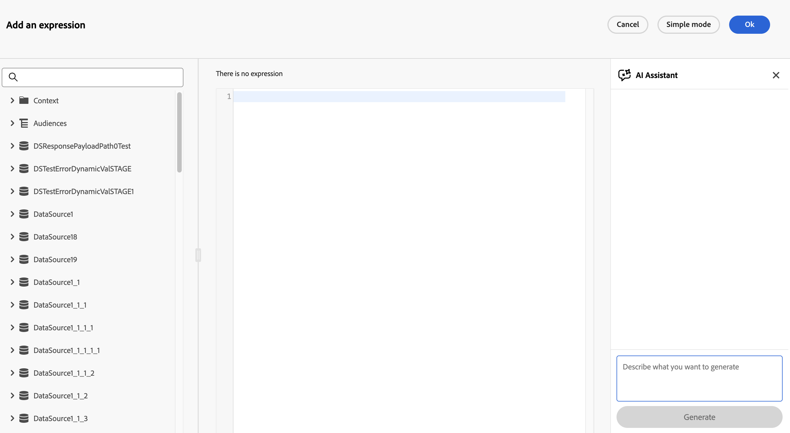

# Generieren von Ausdrücken mit dem Ausdrucksassistenten {#expression-agent}

>[!CONTEXTUALHELP]
>id="journeyExpAI"
>title="Generieren von Ausdrücken mit dem Ausdrucksassistenten"
>abstract="Der Ausdrucksassistent verwendet generative KI, um Ausdrücke direkt im erweiterten Ausdruckseditor von Journey zu erstellen und zu generieren. Zum Beispiel in Bedingungen **Aktivitäten des Typs** Optimieren“ oder **Warten** Aktivitäten, die ein benutzerdefiniertes Datum verwenden. Beschreiben Sie, was Sie benötigen, und der Assistent generiert den entsprechenden Ausdruck für Sie."

>[!AVAILABILITY]
>
>Diese Funktion befindet sich derzeit in der **öffentlichen Betaversion**. Ausführliche Informationen zum Veröffentlichungszyklus und zur Verfügbarkeitsphase finden Sie unter [Veröffentlichungszyklus für Journey Optimizer](../../rn/releases.md).
>
>Bevor Sie den Ausdrucksassistenten verwenden, lesen Sie die zugehörigen [Leitplanken und Einschränkungen](../../content-management/gs-generative.md#generative-guardrails), die für Funktionen der generativen KI in Journey Optimizer gelten.

Der Ausdrucksassistent ist eine KI-gestützte Funktion, die in den erweiterten Ausdruckseditor von Journey integriert ist. Damit können Sie gültige Ausdrücke aus einfachen Eingabeaufforderungen generieren.

Er ist überall dort verfügbar, wo die Journey **[!UICONTROL Erweiterter Ausdruckseditor]** geöffnet wird. Dies ist beispielsweise der Fall, wenn Sie Bedingungen und Routing innerhalb einer **[Aktivität „Optimieren](../optimize.md)** konfigurieren oder wenn Sie eine [**[!UICONTROL Warten &#x200B;]**-Aktivität](../wait-activity.md) konfigurieren, die ein benutzerdefiniertes Datum verwendet und einen `dateTimeOnly`-Ausdruck benötigt.

## Ausdruck erzeugen {#generate}

So generieren Sie einen Ausdruck mit dem Ausdrucksassistenten:

1. Öffnen Sie den **[!UICONTROL erweiterten Ausdruckseditor]** auf Ihrem Journey, z. B. über eine Verzweigungsbedingung, eine **[!UICONTROL Optimieren]**-Aktivität oder eine **[!UICONTROL Warten]**-Aktivität mit einem benutzerdefinierten Datum.

   

1. Beschreiben Sie im Textfeld den Ausdruck, den Sie im Klartext generieren möchten. Beispiel:

   * *„Benutzer aus den USA und älter als 18“*
   * *„Kunden, die in den letzten 30 Tagen einen Kauf getätigt haben“*

   Ideen [&#x200B; Sie am &#x200B;](#example-prompts) dieser Seite unter „Beispielaufforderungen“.

1. Klicken Sie auf **[!UICONTROL Generieren]**, um Ihre Eingabeaufforderung zu senden.

   Der Assistent beginnt mit der Generierung des entsprechenden Ausdrucks und zeigt während der Generierung Statusmeldungen an.

   >[!NOTE]
   >
   >Wenn der Assistent keinen gültigen Ausdruck generieren kann (z. B. wenn Ihre Eingabeaufforderung auf Felder verweist, die nicht in verfügbaren Datenquellen vorhanden sind), wird eine Fehlermeldung angezeigt. Überarbeiten Sie in diesem Fall Ihre Eingabeaufforderung, um die in Ihrer Journey-Konfiguration verfügbaren Feldnamen und Datenquellen zu verwenden, und generieren Sie dann erneut.

1. Sobald der Ausdruck fertig ist, überprüfen Sie das Ergebnis im Bedienfeld.

   

   * Klicken Sie auf , bevor Sie das Programm anwenden, um die Ausgabe des Assistenten für das von Ihnen angeforderte Szenario zu überprüfen.

   * Klicken Sie **[!UICONTROL Anwenden]**, um den generierten Ausdruck direkt in den erweiterten Ausdruckseditor einzufügen (dieselbe Platzierung, die Sie manuell einfügen würden).
   * Verwenden Sie das Kopiersteuerelement, um den vorgeschlagenen Ausdruckstext zu erfassen und ihn bei Bedarf an einer anderen Stelle einzufügen.

## Beispiel-Eingabeaufforderungen {#example-prompts}

Die folgenden Listen sind nur Ideen für Eingabeaufforderungen. Sie zeigen keine generierte Ausdruckssyntax an. Die genaue Ausgabe hängt von den Feldern und Aktivitäten ab, die in Ihrem Journey definiert sind.

### Journey-Ereignis und benutzerdefinierte Aktion {#example-prompts-event-action}

* *„Ereignis mit einem Auftragspreis von mehr als 100“*
* *„Ereignis, bei dem die Bestellung in den letzten 7 Tagen erstellt wurde“*
* *„Ereignis, bei dem der Ereignistyp ein Commerce-Kauf ist“*
* *„Ereignis mit in der letzten Stunde erstellter Bestellung“*
* *„Ereignis mit einem Bestellpreis von insgesamt über 200 und einer Aktionsantwort hat einen Status-Code“*

### Warteaktivitätsausdrücke {#example-prompts-datetime}

Wenn eine **[!UICONTROL Warten]**-Aktivität ein benutzerdefiniertes Datum verwendet, definieren Sie, wann das Profil fortgesetzt werden soll, indem Sie im **[!UICONTROL Erweiterten Ausdruckseditor) einen `dateTimeOnly` Ausdruck]**. Beispielsweise von einem Profilattribut, einem Ereignis-Zeitstempel, Segmentqualifikationsdaten oder einem berechneten Offset zur aktuellen Zeit. Informationen zum Konfigurieren von benutzerdefinierten Wartezeiten und entsprechenden Beschränkungen finden Sie unter [Benutzerdefinierte Wartezeit](../wait-activity.md#custom).

* *„Das letzte Bestelldatum des Kunden nur als Datum/Uhrzeit verwenden“*
* *„Verwenden der Einverständnis-E-Mail-Zeit nur zur Datums-/Uhrzeitangabe“*
* *„Konvertieren der Segmentzugehörigkeit nur für die letzte Qualifikationszeit in die Datums-/Uhrzeitangabe“*
* *„Warteknoten: eine Woche nach Weihnachten 2024 nur als Datum/Uhrzeit“*
* *„Warteknoten: 30 Tage ab jetzt um 22 Uhr nur noch als Datum und Uhrzeit“*
* *„Warten Sie bis heute 9 Uhr in der UTC-Zeitzone, geben Sie nur als Datum/Uhrzeit zurück“*

## Verwandte Ressourcen {#related}

* [Arbeiten mit dem erweiterten Ausdruckseditor](expressionadvanced.md) — Übersicht über die Benutzeroberfläche des Ausdruckseditors und die unterstützte Syntax.
* [Erste Schritte mit dem KI-Assistenten in Journey Optimizer](../../content-management/gs-generative.md) - Allgemeine Leitlinien, Zugriffe und Einrichtung für Funktionen der generativen KI.
