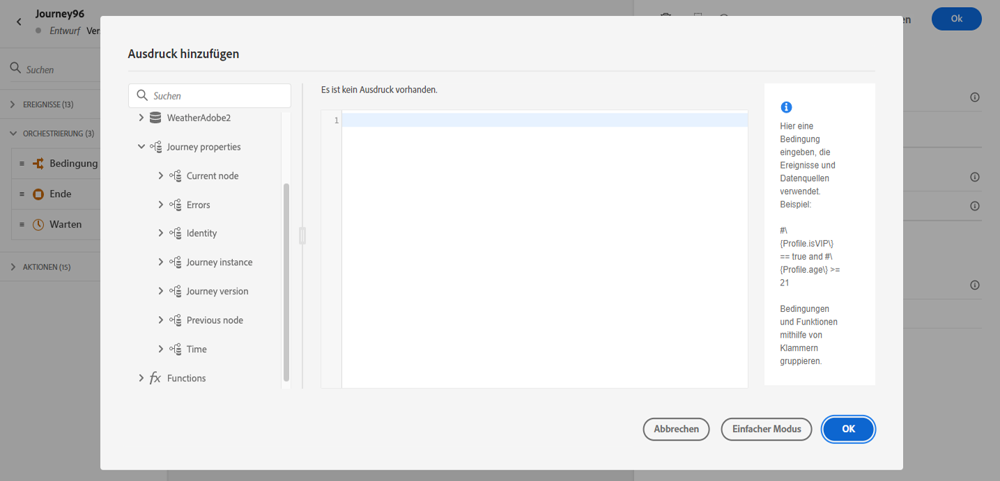

# Attribute der Journey-Eigenschaften {#journey-properties}

Im erweiterten Ausdruckseditor finden Sie die **Journey-Eigenschaften** -Kategorie unter den Ereignis- und Datenquellenkategorien. Diese Kategorie enthält technische Felder, die sich auf die Journey für ein bestimmtes Profil beziehen. Dies sind die Informationen, die das System von Live-Journeys abruft, wie z. B. die Journey-ID oder die spezifischen aufgetretenen Fehler.

>[!NOTE]
>
>Attribute der Journey-Eigenschaften sind auch im einfachen Ausdruckseditor verfügbar. Siehe dies [Abschnitt](../condition-activity.md#about_condition)

Hier finden Sie beispielsweise Informationen zu folgenden Themen:

* Journey-Version: Journey-UID, Journey-Version-UID, Instanz-UID usw.
* errors: Datenabruf, Aktionsausführung usw.
* aktueller Schritt, letzter aktueller Schritt usw.
* verworfene Profile

Sie können diese Felder zum Erstellen von Ausdrücken verwenden. Während der Ausführung der Journey werden die Werte direkt aus der Journey abgerufen.

Im Folgenden finden Sie einige Anwendungsbeispiele:

* **Verworfene Profile protokollieren**: Sie können alle Profile, die von einer Nachricht ausgeschlossen sind, mithilfe einer Begrenzungsregel zu Protokollierungszwecken an ein Drittanbietersystem senden. Dazu richten Sie bei Zeitüberschreitung und Fehler einen Pfad ein und fügen eine Bedingung hinzu, um nach einem bestimmten Fehlertyp zu filtern, z. B.: &quot;Menschen durch Begrenzungsregel verwerfen&quot;. Anschließend können Sie die verworfenen Profile über eine benutzerdefinierte Aktion an ein Drittanbietersystem senden.

* **Warnhinweise bei Fehlern senden**: Sie können eine Benachrichtigung an ein Drittanbietersystem senden, sobald ein Fehler in einer Nachricht auftritt. Dazu richten Sie einen Pfad im Fehlerfall ein, fügen eine Bedingung und eine benutzerdefinierte Aktion hinzu. Sie können beispielsweise eine Benachrichtigung über einen Slack-Kanal mit der Fehlerbeschreibung versenden.

* **Fehler in Berichten optimieren** : Anstatt nur einen Pfad für fehlerhafte Nachrichten zu haben, können Sie eine Bedingung pro Fehlertyp definieren. Auf diese Weise können Sie die Berichterstellung verfeinern und alle Daten zu Fehlertypen anzeigen.

## Feldliste {#journey-properties-fields}

| Kategorie | Feldname | Titel | Beschreibung |
|---|---|---|------------|
| Journey-Version | journeyUID | Journey-Kennung |  |
|  | journeyVersionUID | Versionskennung der Journey |  |
|  | journeyVersionName | Name der Journey-Version |  |
|  | journeyVersionDescription | Beschreibung der Journey-Version |  |
|  | journeyVersion | Journey-Version |  |
| Journey-Instanz | instanceUID | Kennung der Journey-Instanz | ID der Instanz |
|  | externalKey | Externer Schlüssel | Individuelle Kennung, die die Journey auslöst |
|  | organizationId | Organisationskennung | Markenorganisation |
|  | sandboxName | Sandbox-Name | Name der Sandbox |
| Identität | profileId | Kennung der Profilkennung | Kennung des Profils in der Journey |
|  | namespace | Profil-Identitäts-Namespace | Namespace des Profils in der Journey (Beispiel: ECID) |
| Aktueller Knoten | currentNodeId | Kennung des aktuellen Knotens | Kennung der aktuellen Aktivität (Knoten) |
|  | currentNodeName | Name des aktuellen Knotens | Name der aktuellen Aktivität (Knoten) |
| Vorheriger Knoten | previousNodeId | Kennung des vorherigen Knotens | Kennung der vorherigen Aktivität (Knoten) |
|  | previousNodeName | Name des vorherigen Knotens | Name der vorherigen Aktivität (Knoten) |
| Fehler | lastNodeUIDInError | Kennung des letzten Knotens im Fehler | Kennung der aktuellen fehlerhaften Aktivität (Knoten) |
|  | lastNodeNameInError | Name des letzten Knotens im Fehler | Name der aktuellen fehlerhaften Aktivität (Knoten) |
|  | lastNodeTypeInError | Letzter Knotentyp im Fehler | Fehlertyp der aktuellen fehlerhaften Aktivität (Knoten). Mögliche Typen:<ul><li>Ereignisse: Ereignisse, Reaktionen, SQ (Beispiel: Segmentqualifikation)</li><li>Flusssteuerung: Ende, Bedingung, Warten</li><li>Aktionen: ACS-Aktionen, Sprung, benutzerdefinierte Aktion</li></ul> |
|  | lastErrorCode | Letzter Fehler-Code | Fehler-Code der aktuellen fehlerhaften Aktivität (Knoten). Mögliche Fehler: <ul><li>HTTP-Fehlercodes</li><li>capped</li><li>timedOut</li><li>error (Beispiel: Standard im Falle eines unerwarteten Fehlers. Sollte nicht/extrem selten vorkommen)</li></ul> |
|  | lastExecutedActionErrorCode | Fehler-Code der letzten ausgeführten Aktion | Fehler-Code der letzten fehlerhaften Aktion |
|  | lastDataFetchErrorCode | Fehler-Code beim letzten Datenabruf | Fehlercode des neuesten Datenabrufs aus Datenquellen |
| Zeit | lastActionExecutionElapsedTime | Verstrichene Zeit der letzten Aktionsausführung | Zeitaufwand für die Ausführung der aktuellen Aktion |
|  | lastDataFetchElapsedTime | Verstrichene Zeit des letzten Datenabrufs | Zeit für die Ausführung des neuesten Datenabrufs aus Datenquellen |
