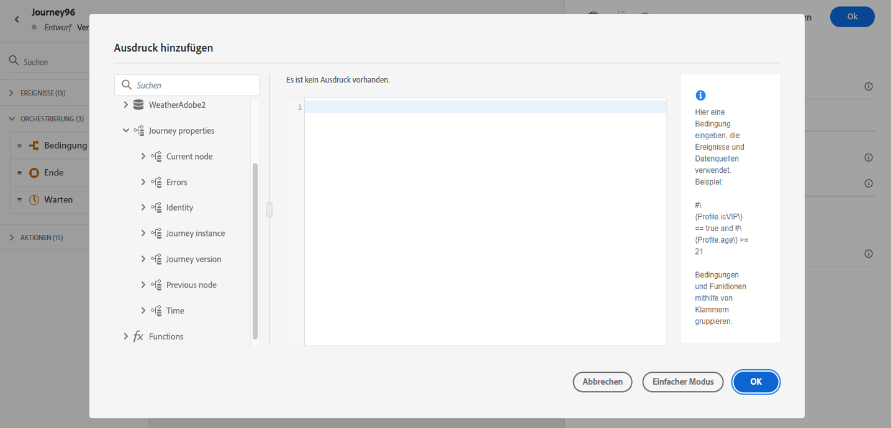

# Attribute der Journey-Eigenschaften {#journey-properties}

Im [einfachen Ausdruckseditor](../conditions.md#about_condition)und im [erweiterten Ausdruckseditor](../expression/expressionadvanced.md) können Sie unterhalb der Kategorien **Ereignis** und **Datenquelle** auf die Kategorie **Journey-Eigenschaften** zugreifen. Diese Kategorie enthält technische Felder, die sich auf die Journey eines bestimmten Profils beziehen. Dies sind die Informationen, die das System von Live-Journeys abruft, wie z. B. die Journey-ID oder die spezifischen aufgetretenen Fehler.

Sie enthält beispielsweise Informationen zu:

* Journey-Version: Journey-UID, Journey-Versions-UID, Instanz-UID usw.
* Fehler: Datenabruf, Aktionsausführung usw.
* aktueller Schritt, letzter aktueller Schritt usw.
* verworfene Profile

  Die Liste der Felder ist [in diesem Abschnitt](#journey-properties-fields) verfügbar.

Sie können diese Felder zum Erstellen von Ausdrücken verwenden. Während der Ausführung einer Journey werden die Werte direkt von der Journey abgerufen.

Im Folgenden finden Sie einige Beispiele für Anwendungsfälle:

* **Verworfene Profile protokollieren**: Sie können alle Profile, die von einer Nachricht ausgeschlossen sind, mit einer Begrenzungsregel zu Protokollierungszwecken an ein Drittanbietersystem senden. Dazu richten Sie bei Zeitüberschreitung und Fehler einen Pfad ein und fügen eine Bedingung zum Filtern nach einem bestimmten Fehlertyp hinzu, z. B.: „Personen nach Begrenzungsregel verwerfen“. Anschließend können Sie die verworfenen Profile über eine benutzerdefinierte Aktion an ein Drittanbietersystem senden.

* **Warnhinweise bei Fehlern senden**: Sie können eine Benachrichtigung an ein Drittanbietersystem senden, sobald ein Fehler in einer Nachricht auftritt. Dazu richten Sie einen Pfad für den Fehlerfall ein, fügen eine Bedingung und eine benutzerdefinierte Aktion hinzu. Sie können beispielsweise eine Benachrichtigung an einen Slack-Kanal mit der Fehlerbeschreibung senden.

* **Fehler in Berichten optimieren**: Statt nur einen Pfad für fehlerhafte Nachrichten zu haben, können Sie eine Bedingung pro Fehlertyp definieren. Auf diese Weise können Sie die Berichte optimieren und alle Daten zu den Fehlertypen anzeigen.

## Liste der Felder {#journey-properties-fields}

| Kategorie | Feldname | Label | Beschreibung |
|---|---|---|------------|
| Journey-Version | journeyUID | Journey-Kennung | |
| | journeyVersionUID | Versionskennung der Journey | |
| | journeyVersionName | Name der Journey-Version | |
| | journeyVersionDescription | Beschreibung der Journey-Version | |
| | journeyVersion | Journey-Version | |
| Journey-Instanz | instanceUID | Kennung der Journey-Instanz | ID der Instanz |
| | externalKey | Externer Schlüssel | Individuelle Kennung, die die Journey auslöst |
| | organizationId | Organisationskennung | Markenorganisation |
| | sandboxName | Sandbox-Name | Name der Sandbox |
| Identität | profileId | Identitätskennung des Profils | Kennung des Profils in der Journey |
| | namespace | Identity-Namespace des Profils | Namespace des Profils in der Journey (Beispiel: ECID) |
| Aktueller Knoten | currentNodeId | Kennung des aktuellen Knotens | Kennung der aktuellen Aktivität (Knoten) |
| | currentNodeName | Name des aktuellen Knotens | Name der aktuellen Aktivität (Knoten) |
| Vorheriger Knoten | previousNodeId | Kennung des vorherigen Knotens | Kennung der vorherigen Aktivität (Knoten) |
| | previousNodeName | Name des vorherigern Knotens | Name der vorherigen Aktivität (Knoten) |
| Fehler | lastNodeUIDInError | Kennung des letzten Knotens im Fehler | Kennung der aktuellen fehlerhaften Aktivität (Knoten) |
| | lastNodeNameInError | Name des letzten Knotens im Fehler | Name der aktuellen fehlerhaften Aktivität (Knoten) |
| | lastNodeTypeInError | Letzter Knotentyp im Fehler | Fehlertyp der aktuellen fehlerhaften Aktivität (Knoten). Mögliche Typen:<ul><li>Ereignisse: Ereignisse, Reaktionen, SQ (Beispiel: Zielgruppen-Qualifizierung)</li><li>Flusssteuerung: Ende, Bedingung, Warten</li><li>Aktionen: ACS-Aktionen, Sprung, benutzerdefinierte Aktion</li></ul> |
| | lastErrorCode | Letzter Fehler-Code | Fehler-Code der aktuellen fehlerhaften Aktivität (Knoten). Mögliche Fehler: <ul><li>HTTP-Fehler-Codes</li><li>capped</li><li>timedOut</li><li>Fehler (Beispiel: Standard bei unerwartetem Fehler. Sollte nicht / äußerst selten vorkommen.)</li></ul> |
| | lastExecutedActionErrorCode | Fehler-Code der letzten ausgeführten Aktion | Fehler-Code der aktuellen Aktion im Fehler |
| | lastDataFetchErrorCode | Fehler-Code beim letzten Datenabruf | Fehler-Code beim aktuellen Datenabruf aus Datenquellen |
| Zeit | lastActionExecutionElapsedTime | Verstrichene Zeit der letzten Aktionsausführung | Zeitaufwand für die Ausführung der aktuellen Aktion |
| | lastDataFetchElapsedTime | Verstrichene Zeit des letzten Datenabrufs | Zeitaufwand für die Ausführung des aktuellen Datenabrufs aus Datenquellen |

+++ KI-Wissensreferenz

Dieser Abschnitt enthält strukturiertes Wissen zur Unterstützung von Interpretation, Abrufen und Antworten auf Fragen zu diesem Thema.

Zum vollständigen Verständnis sollten diese Informationen mit der Dokumentation auf dieser Seite kombiniert werden. Keine der beiden Quellen ist für Einzelpersonen gedacht. Die Seite beschreibt die Funktion, während dieser Abschnitt zusätzlichen Kontext bietet, der dabei hilft, Begriffe, Absichten, Anwendbarkeit und Begrenzungen zu unterscheiden.

* **TL;DR:** Auf dieser Seite wird die Kategorie &quot;Journey-Eigenschaften“ im Ausdruckseditor beschrieben - eine Reihe technischer Felder zur Live-Journey-Instanz (IDs, Fehler, aktuelle/vorherige Knoten, verstrichene Zeiten), mit denen Ausdrücke für die Protokollierung, Warnhinweise und fehlerspezifische Berichte erstellt werden können.

**intents:**

* Zugreifen auf Journey-Eigenschaftsfelder im einfachen oder erweiterten Ausdruckseditor zum Referenzieren von Live-Journey-Metadaten
* Erstellen einer Bedingung, die verworfene Profile nach Fehlertyp filtert, um sie an ein Protokollierungssystem eines Drittanbieters weiterzuleiten
* Senden Sie Fehlermeldungen an einen externen Kanal (z. B. Slack), indem Sie in einer benutzerdefinierten Aktion auf den letzten Fehlercode und Knotennamen verweisen
* Verfeinern Sie die Journey-Fehlerberichterstattung, indem Sie mit `lastNodeTypeInError` und `lastErrorCode` separate Bedingungspfade pro Fehlertyp erstellen
* Referenz-Journey-Versionskennungen, Instanzkennungen und Sandbox-Namen in Ausdrücken für Tracking und Auditing

**Glossar:**

* **Journey-Eigenschaften**: Eine Kategorie im Ausdruckseditor, die technische Metadatenfelder für die aktuelle Journey-Ausführungsinstanz enthält *(produktspezifisch)*
* **instanceUID**: Die eindeutige Kennung der Journey-Instanz für eine bestimmte Profilausführungsinstanz *produktspezifisch)*
* **lastErrorCode**: Der Fehlercode aus der letzten fehlgeschlagenen Aktivität auf der Journey. Mögliche Werte sind HTTP-Codes, `capped`, `timedOut` und `error` *(produktspezifisch)*
* **lastNodeTypeInError**: Der Typ der letzten Aktivität, bei der ein Fehler aufgetreten ist. Dies können Ereignisse, Flusssteuerung oder Aktionen *produktspezifisch) sein*
* **externalKey**: Die individuelle Kennung (z. B. Profilkennung), die die Journey-Instanz ausgelöst hat *(produktspezifisch)*

**Leitplanken:**

* Journey-Eigenschaften-Feldwerte werden zur Ausführungszeit direkt von der Live-Journey abgerufen - sie stehen nicht für die Validierung vor der Ausführung zur Verfügung
* Das Feld `lastErrorCode` verwendet vordefinierte Werte: HTTP-Fehler-Codes, `capped`, `timedOut` und `error`
* Journey-Eigenschaften sind sowohl im einfachen als auch im erweiterten Ausdruckseditor unter der Kategorie Journey-Eigenschaften verfügbar

**Terminologie:**

* Kanonischer Name: Journey Properties — Akronym: none — Varianten: Journey technische Felder, Journey Metadatenfelder
* Synonyme: &quot;Journey Properties“ = „Technische Journey-Felder“; „instanceUID“ = &quot;Journey-Instanzkennung“
* Nicht verwechseln: journeyUID (identifiziert die Journey-Definition) ≠ instanceUID (identifiziert die Ausführung der Journey durch ein bestimmtes Profil)

**FAQ:**

* **F: Wo finde ich Journey-Eigenschaftenfelder im Ausdruckseditor?** — Sie werden sowohl im einfachen als auch im erweiterten Ausdruckseditor unter der Kategorie Journey-Eigenschaften unterhalb von Ereignisse und Datenquellen angezeigt.
* **F: Wie kann ich Profile protokollieren, die durch eine Begrenzungsregel verworfen wurden?** - Fügen Sie eine Fehlerpfad-Bedingungsfilterung für `lastErrorCode == "capped"` hinzu und übertragen Sie diese Profile über eine benutzerdefinierte Aktion auf ein Drittanbietersystem.
* **F: Was ist der Unterschied zwischen `journeyUID` und `instanceUID`?** — `journeyUID` identifiziert die Journey-Definition; `instanceUID` identifiziert eine bestimmte Ausführungsinstanz für ein bestimmtes Profil.
* **F: Welcher Fehlercode wird bei einem unerwarteten Systemfehler zurückgegeben?** — Der `error`-Code, der als Standard für unerwartete Fehler verwendet wird und nur selten auftreten sollte.
* **F: Kann ich Felder für Journey-Eigenschaften verwenden, um Slack-Warnungen bei Aktionsfehlern zu senden?** — Ja. Referenzieren Sie `lastNodeNameInError` und `lastErrorCode` in einer benutzerdefinierten Aktion, um Fehlerdetails in eine Slack-Benachrichtigung aufzunehmen.

+++
