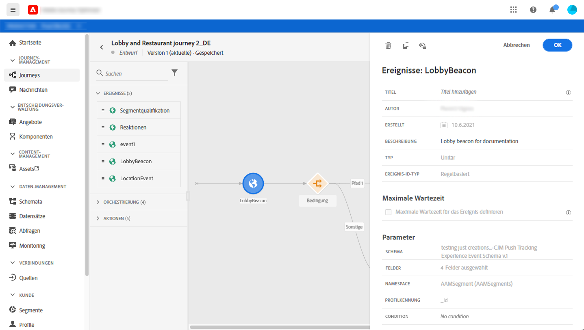
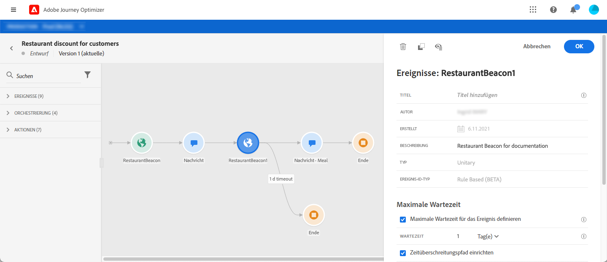
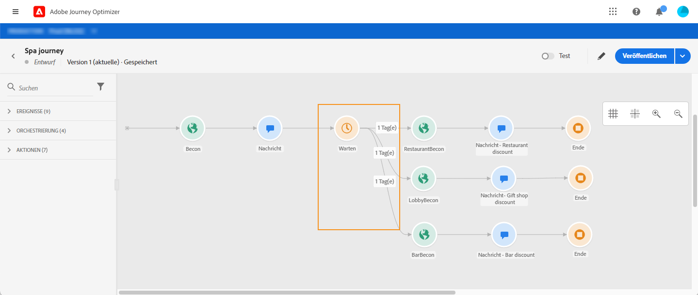

# Allgemeine Ereignisse {#section_ofg_jss_dgb}

Für diesen Ereignistyp können Sie nur einen Titel und eine Beschreibung hinzufügen. Der Rest der Konfiguration kann nicht bearbeitet werden. Dies wurde vom technischen Anwender durchgeführt. Weitere Informationen finden Sie auf [dieser Seite](../event/about-events.md).

Wenn Sie ein geschäftliches Ereignis ablegen, wird automatisch eine Aktivität **Read segment** hinzugefügt. Weitere Informationen zu geschäftlichen Ereignissen finden Sie in [diesem Abschnitt](../event/about-events.md)

## Überwachen von Ereignissen während eines bestimmten Zeitraums {#events-specific-time}

Eine in der Journey positionierte Ereignisaktivität überwacht Ereignisse auf unbestimmte Zeit. Damit ein Ereignis nur während einer bestimmten Zeit überwacht wird, müssen Sie für das Ereignis eine maximale Wartezeit konfigurieren.

Die Journey überwacht dann das Ereignis während der in der maximalen Wartezeit angegebenen Zeit. Wenn ein Ereignis während dieses Zeitraums empfangen wird, wird die Person in den Ereignispfad geleitet. Ist dies nicht der Fall, wird der Kunde entweder in einen Zeitüberschreitungspfad geleitet oder seine Journey wird beendet.

Gehen Sie wie folgt vor, um für ein Ereignis eine maximale Wartezeit zu konfigurieren:

1. Aktivieren Sie die Option **[!UICONTROL Zeitüberschreitung für das Ereignis definieren]** in den Eigenschaften des Ereignisses.

1. Legen Sie fest, wie lange die Journey auf das Ereignis warten soll.

1. Wenn Sie die Kontakte in einen Zeitüberschreitungspfad senden möchten, wenn innerhalb der angegebenen maximalen Wartezeit kein Ereignis empfangen wird, aktivieren Sie die Option **[!UICONTROL Pfad der Zeitüberschreitung festlegen]**. Wenn diese Option nicht aktiviert ist, wird die Journey für den betreffenden Kontakt beendet, sobald die maximale Wartezeit erreicht wird.

   

In diesem Beispiel sendet die Journey einen ersten Willkommens-Push an einen Kunden. Es wird nur dann ein Essensrabatt-Push gesendet, wenn der Kunde das Restaurant innerhalb des nächsten Tages betritt. Deshalb wurde das Restaurantereignis mit einer maximalen Wartezeit von 1 Tag konfiguriert:

* Wenn das Restaurant-Ereignis weniger als 1 Tag nach dem Begrüßungs-Push erhalten wird, wird die Push-Nachricht mit dem Mahl-Rabatt gesendet.
* Wenn innerhalb des nächsten Tags kein Restaurantereignis eingeht, wird die Person durch den Zeitüberschreitungspfad geleitet.

Wenn Sie eine maximale Wartezeit für mehrere Ereignisse konfigurieren möchten, die sich nach einer **[!UICONTROL Warteaktivität]** befinden, müssen Sie die maximale Wartezeit nur für eines dieser Ereignisse konfigurieren.

Die maximale Wartezeit gilt für alle Ereignisse, die nach der **[!UICONTROL Warteaktivität]** positioniert wurden. Wenn nach der spezifizierten maximalen Wartezeit kein Ereignis empfangen wird, werden die Kontakte in einen einzigen Zeitüberschreitungspfad geleitet oder ihre Journey wird beendet.

