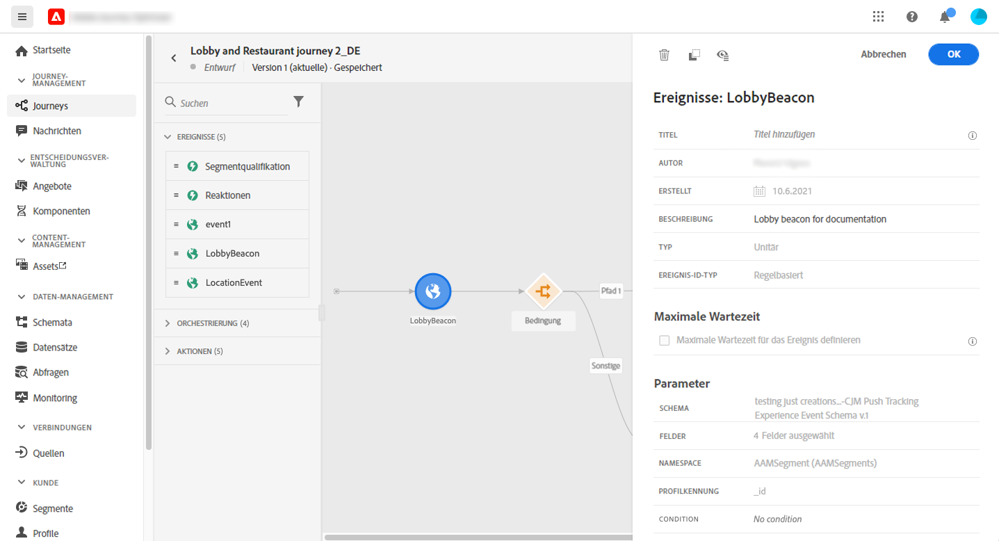
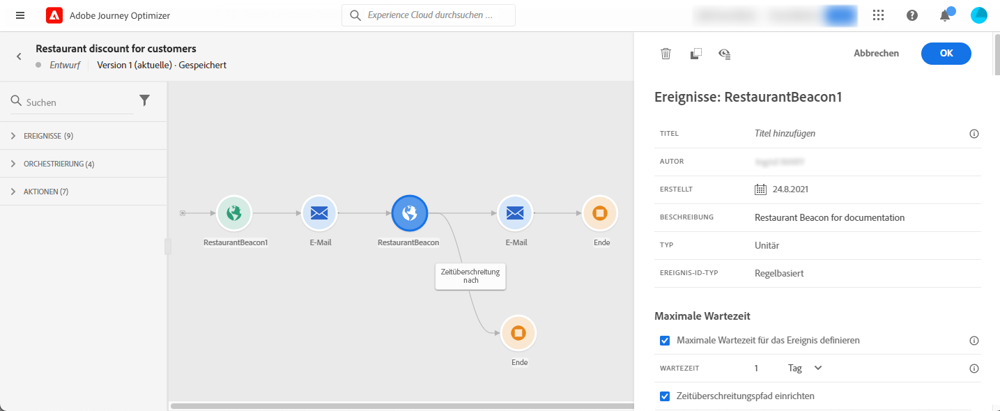
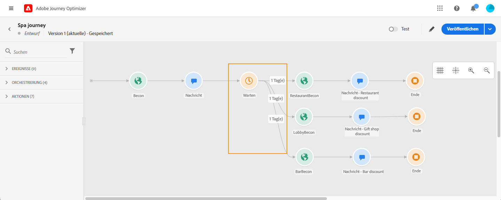

# Allgemeine Ereignisse {#general-events}

>[!CONTEXTUALHELP]
>id="ajo_journey_event_custom"
>title="Unitäre Ereignisse"
>abstract="Mit Hilfe von Ereignissen können Sie Ihre Journeys einheitlich auslösen, um Nachrichten in Echtzeit an die Kontakte zu senden, die in die Journey eintreten. Für diesen Ereignistyp können Sie nur ein Label und eine Beschreibung hinzufügen. Die Ereigniskonfiguration wird von einem Datentechniker vorgenommen und kann nicht bearbeitet werden."

>[!CONTEXTUALHELP]
>id="ajo_journey_event_business_canvas"
>title="Geschäftsereignisse"
>abstract="Mit diesen Ereignissen können Sie eine Journey mit einem nicht profilbezogenen Ereignis starten. Wenn dieses Ereignis ausgelöst wird, können Sie Nachrichten an eine Zielgruppe von Profilen senden. Für diesen Ereignistyp können Sie nur ein Label und eine Beschreibung hinzufügen. Die Ereigniskonfiguration wird von technischen Benutzenden vorgenommen und kann nicht bearbeitet werden."

Mit Hilfe von Ereignissen können Sie Ihre Journeys einheitlich auslösen, um Nachrichten in Echtzeit an die Kontakte zu senden, die in die Journey eintreten.

Für diesen Ereignistyp können Sie nur ein Label und eine Beschreibung hinzufügen. Der Rest der Konfiguration kann nicht bearbeitet werden. Dies wurde vom technischen Anwender durchgeführt. Weitere Informationen finden Sie auf [dieser Seite](../event/about-events.md).

Weitere Informationen zu Ereignisdurchsatz und Journey-Verarbeitungsraten finden Sie [in diesem Abschnitt](entry-management.md#journey-processing-rate).

Wenn Sie ein Geschäftsereignis einfügen, wird automatisch eine Aktivität **Zielgruppe lesen** hinzugefügt. Weiterführende Informationen zu Geschäftsereignissen finden Sie in [diesem Abschnitt](../event/about-events.md).

## Überwachen von Ereignissen während eines bestimmten Zeitraums {#events-specific-time}

Eine in der Journey positionierte Ereignisaktivität überwacht Ereignisse auf unbestimmte Zeit. Damit ein Ereignis nur während einer bestimmten Zeit überwacht wird, müssen Sie für das Ereignis einen Timeout konfigurieren.

Die Journey überwacht dann das Ereignis während der im Timeout angegebenen Zeit. Wenn ein Ereignis während dieses Zeitraums empfangen wird, wird die Person in den Ereignispfad geleitet. Andernfalls gelangt der Kunde bzw. die Kundin in den Pfad für den Timeout, sofern er definiert ist, oder setzt die Journey fort.

Wenn kein Pfad für den Timeout definiert ist, fungiert die Einstellung für den Timeout als Warteaktivität. Dadurch wartet das Profil für einen Zeitraum, der gestoppt werden kann, wenn ein Ereignis vor dem Ende dieser Wartezeit eintritt. Wenn Sie möchten, dass Profile nach einem Timeout von dieser Journey ausgeschlossen werden, müssen Sie einen Pfad für den Timeout festlegen.

Gehen Sie wie folgt vor, um für ein Ereignis einen Timeout zu konfigurieren:

1. Aktivieren Sie die Option **[!UICONTROL Timeout für das Ereignis definieren]** in den Eigenschaften des Ereignisses.

1. Legen Sie fest, wie lange die Journey auf das Ereignis warten soll. Die maximale Wartezeit beträgt **90 Tage**.

1. Wenn innerhalb des angegebenen Timeouts kein Ereignis empfangen wird, empfiehlt es sich, die Kontakte in einen Timeout-Pfad zu senden. Aktivieren Sie dazu die Option **[!UICONTROL Zeitüberschreitungspfad einrichten]**. In diesem Fall wird die Journey für den Kontakt fortgesetzt, sobald das Timeout erreicht ist. Wir empfehlen Ihnen, immer die Option **[!UICONTROL Zeitüberschreitungspfad einrichten]** zu aktivieren.

   

In diesem Beispiel sendet die Journey erst dann eine Begrüßungs-E-Mail an eine Kundin oder einen Kunden, nachdem sie bzw. er die Lobby betreten hat. Es wird danach nur dann eine Essensrabatt-E-Mail gesendet, wenn die Kundin oder der Kunde das Restaurant innerhalb des nächsten Tages betritt. Deshalb wurde das Restaurantereignis mit einem Timeout von 1 Tag konfiguriert:

* Wenn das Restaurantereignis in weniger als 1 Tag nach der Begrüßungs-E-Mail eingeht, wird die E-Mail für den Essensrabatt gesendet.
* Wenn innerhalb des nächsten Tages kein Restaurantereignis eingeht, wird die Person durch den Zeitüberschreitungspfad geleitet.

Wenn Sie einen Timeout für mehrere Ereignisse konfigurieren möchten, die sich hinter einer **[!UICONTROL Warteaktivität]** befinden, müssen Sie den Timeout nur für eines dieser Ereignisse konfigurieren.

Der festgelegte Timeout gilt für alle Ereignisse, die hinter der **[!UICONTROL Warteaktivität]** positioniert wurden.

* Wird ein Ereignis innerhalb der Dauer des Timeouts empfangen, gelangt der Kontakt in den Pfad des empfangenen Ereignisses.
* Wenn innerhalb des Timeouts kein Ereignis empfangen wird, gelangt der Kontakt in die Verzweigung für den Timeout desjenigen Ereignisses, bei dem der Timeout definiert wurde.

