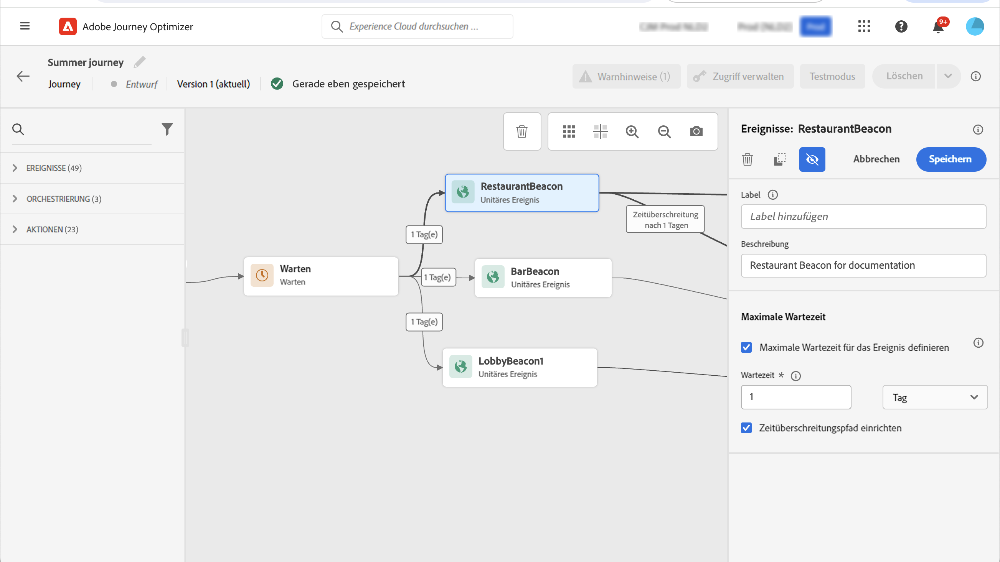

# Allgemeine Ereignisse {#general-events}

>[!CONTEXTUALHELP]
>id="ajo_journey_event_custom"
>title="Allgemeine Ereignisse"
>abstract="Ereignisse ermöglichen es Ihnen, Ihre Journeys unregelmäßig auszulösen, um in Echtzeit Nachrichten an den Kontakt zu senden, der in die Journey gelangt. Für diesen Ereignistyp können Sie nur einen Titel und eine Beschreibung hinzufügen. Die Ereigniskonfiguration wird von einem Data Engineer vorgenommen und kann nicht bearbeitet werden."

Ereignisse ermöglichen es Ihnen, Ihre Journeys unregelmäßig auszulösen, um in Echtzeit Nachrichten an den Kontakt zu senden, der in die Journey gelangt.

Für diesen Ereignistyp können Sie nur einen Titel und eine Beschreibung hinzufügen. Der Rest der Konfiguration kann nicht bearbeitet werden. Sie wurde vom technischen Anwender durchgeführt. Siehe [diese Seite](../event/about-events.md).

Wenn Sie ein Geschäftsereignis ablegen, wird automatisch ein **Segment lesen** Aktivität. Weitere Informationen zu Geschäftsereignissen finden Sie unter [diesem Abschnitt](../event/about-events.md)

## Überwachen von Ereignissen während eines bestimmten Zeitraums {#events-specific-time}

Eine in der Journey positionierte Ereignisaktivität überwacht Ereignisse auf unbestimmte Zeit. Um ein Ereignis nur während einer bestimmten Zeit zu überwachen, müssen Sie eine Zeitüberschreitung für das Ereignis konfigurieren.

Die Journey überwacht dann das Ereignis während der in der Zeitüberschreitung festgelegten Zeit. Wenn ein Ereignis während dieses Zeitraums empfangen wird, wird die Person im Ereignispfad geleitet. Andernfalls gelangt der Kunde entweder in einen Timeout-Pfad oder beendet seine Journey.

Gehen Sie wie folgt vor, um eine Zeitüberschreitung für ein Ereignis zu konfigurieren:

1. Aktivieren Sie die **[!UICONTROL Define the event timeout]** -Option in den Ereigniseigenschaften aus.

1. Geben Sie an, wie lange die Journey auf das Ereignis warten soll.

1. Wenn Sie die Kontakte in einen Timeout-Pfad senden möchten, wenn innerhalb der angegebenen Zeitüberschreitung kein Ereignis empfangen wird, aktivieren Sie die **[!UICONTROL Set a timeout path]** -Option. Wenn diese Option nicht aktiviert ist, endet die Journey für den Kontakt, sobald die Zeitüberschreitung erreicht wurde.

   

In diesem Beispiel sendet die Journey einen ersten Willkommens-Push an einen Kunden. Es wird dann nur dann ein Push mit einem Rabatt gesendet, wenn der Kunde innerhalb des nächsten Tages das Restaurant betritt. Deshalb haben wir das Restaurantereignis mit einer 1-tägigen Zeitüberschreitung konfiguriert:

* Wenn das Restaurantereignis weniger als 1 Tag nach der Begrüßungs-Push-Benachrichtigung empfangen wird, wird die Push-Aktivität für den Rabatt gesendet.
* Wenn innerhalb des nächsten Tages kein Restaurantereignis empfangen wird, durchläuft die Person den Zeitüberschreitungspfad.

Beachten Sie Folgendes: Wenn Sie eine Zeitüberschreitung für mehrere Ereignisse konfigurieren möchten, die nach einer **[!UICONTROL Wait]** -Aktivität, müssen Sie die Zeitüberschreitung nur für eines dieser Ereignisse konfigurieren.

Die Zeitüberschreitung gilt für alle Ereignisse, die nach der **[!UICONTROL Wait]** Aktivität. Wenn vor der angegebenen Zeitüberschreitung kein Ereignis empfangen wird, gelangen die Kontakte in einen einzigen Zeitüberschreitungspfad oder beenden ihre Journey.

