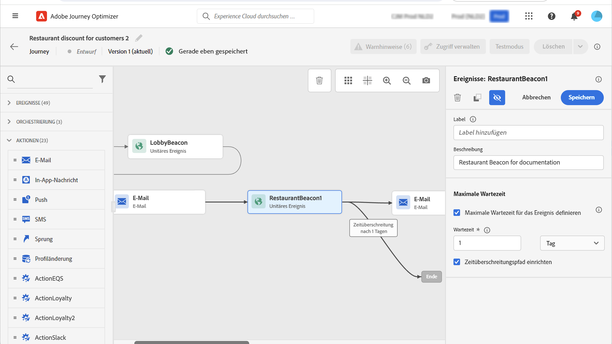

# Allgemeine Ereignisse {#general-events}

>[!CONTEXTUALHELP]
>id="ajo_journey_event_custom"
>title="Unitäre Ereignisse"
>abstract="Mit Hilfe von Ereignissen können Sie Ihre Journeys einheitlich auslösen, um Nachrichten in Echtzeit an die Kontakte zu senden, die in die Journey eintreten. Für diesen Ereignistyp können Sie nur einen Titel und eine Beschreibung hinzufügen. Die Ereigniskonfiguration wird von einem Datentechniker vorgenommen und kann nicht bearbeitet werden."

Mit Hilfe von Ereignissen können Sie Ihre Journeys einheitlich auslösen, um Nachrichten in Echtzeit an die Kontakte zu senden, die in die Journey eintreten.

Für diesen Ereignistyp können Sie nur einen Titel und eine Beschreibung hinzufügen. Der Rest der Konfiguration kann nicht bearbeitet werden. Dies wurde vom technischen Anwender durchgeführt. Weitere Informationen finden Sie auf [dieser Seite](../event/about-events.md).

Wenn Sie ein Geschäftsereignis einfügen, wird automatisch eine Aktivität **Zielgruppe lesen** hinzugefügt. Weiterführende Informationen zu Geschäftsereignissen finden Sie in [diesem Abschnitt](../event/about-events.md).

## Überwachen von Ereignissen während eines bestimmten Zeitraums {#events-specific-time}

Eine in der Journey positionierte Ereignisaktivität überwacht Ereignisse auf unbestimmte Zeit. Damit ein Ereignis nur während einer bestimmten Zeit überwacht wird, müssen Sie für das Ereignis eine maximale Wartezeit konfigurieren.

Die Journey überwacht dann das Ereignis während der in der maximalen Wartezeit angegebenen Zeit. Wenn ein Ereignis während dieses Zeitraums empfangen wird, wird die Person in den Ereignispfad geleitet. Andernfalls gelangt die Person in den Pfad für die maximale Wartezeit, sofern er definiert ist, oder setzt die Journey fort.

Wenn kein Pfad für die maximale Wartezeit definiert ist, fungiert die Einstellung für die maximale Wartezeit als Warteaktivität. Dadurch wartet das Profil für einen Zeitraum, der beendet werden kann, wenn ein Ereignis vor dem Ende dieser Wartezeit eintritt. Wenn Sie möchten, dass Profile nach einer maximalen Wartezeit von dieser Journey ausgeschlossen werden, müssen Sie einen Pfad für die maximale Wartezeit festlegen.

Gehen Sie wie folgt vor, um für ein Ereignis eine maximale Wartezeit zu konfigurieren:

1. Aktivieren Sie die Option **[!UICONTROL Maximale Wartezeit für das Ereignis definieren]** in den Eigenschaften des Ereignisses.

1. Legen Sie fest, wie lange die Journey auf das Ereignis warten soll. Die maximale Wartezeit beträgt 29 Tage.

1. Wenn Sie die Kontakte in einen Zeitüberschreitungspfad senden möchten, falls innerhalb der angegebenen maximalen Wartezeit kein Ereignis empfangen wird, aktivieren Sie die Option **[!UICONTROL Zeitüberschreitungspfad einrichten]**. Wenn diese Option nicht aktiviert ist, wird die Journey für den betreffenden Kontakt fortgesetzt, sobald die maximale Wartezeit erreicht wird.

   

In diesem Beispiel sendet die Journey einen ersten Willkommens-Push an einen Kunden. Es wird nur dann ein Essensrabatt-Push gesendet, wenn der Kunde das Restaurant innerhalb des nächsten Tages betritt. Deshalb wurde das Restaurantereignis mit einer maximalen Wartezeit von 1 Tag konfiguriert:

* Wenn das Restaurantereignis in weniger als 1 Tag nach der Begrüßungs-Push-Benachrichtigung eingeht, wird die Push-Aktivität für den Rabatt gesendet.
* Wenn innerhalb des nächsten Tages kein Restaurantereignis eingeht, wird die Person durch den Zeitüberschreitungspfad geleitet.

Wenn Sie eine maximale Wartezeit für mehrere Ereignisse konfigurieren möchten, die sich hinter einer **[!UICONTROL Warteaktivität]** befinden, müssen Sie die maximale Wartezeit nur für eines dieser Ereignisse konfigurieren.

Die maximale Wartezeit gilt für alle Ereignisse, die hinter der **[!UICONTROL Warteaktivität]** positioniert wurden. Wenn vor der angegebenen maximalen Wartezeit kein Ereignis empfangen wird, gelangen die Personen in einen einzigen Pfad für die maximale Wartezeit oder fahren mit der Journey über die Verzweigung fort, die die Aktivität verlässt, in der diese Einstellungen für die maximale Wartezeit definiert wurden.

