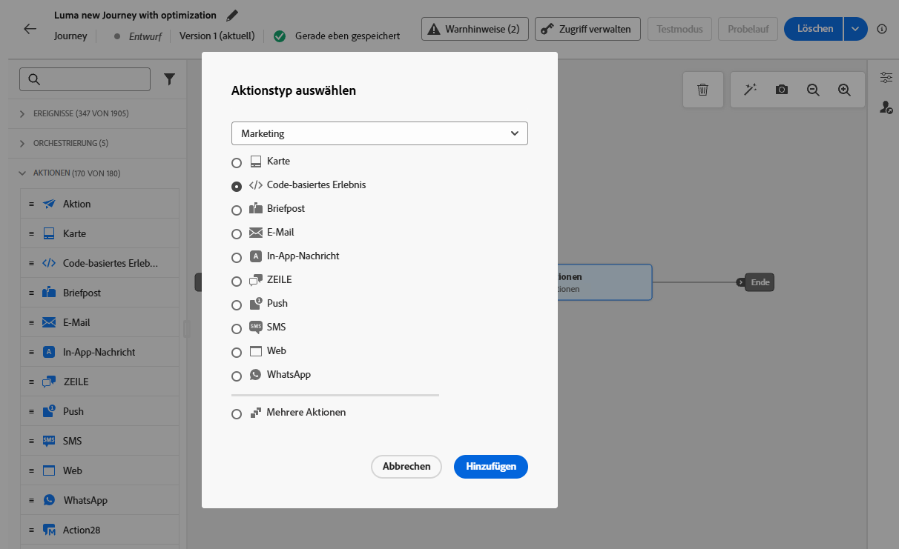
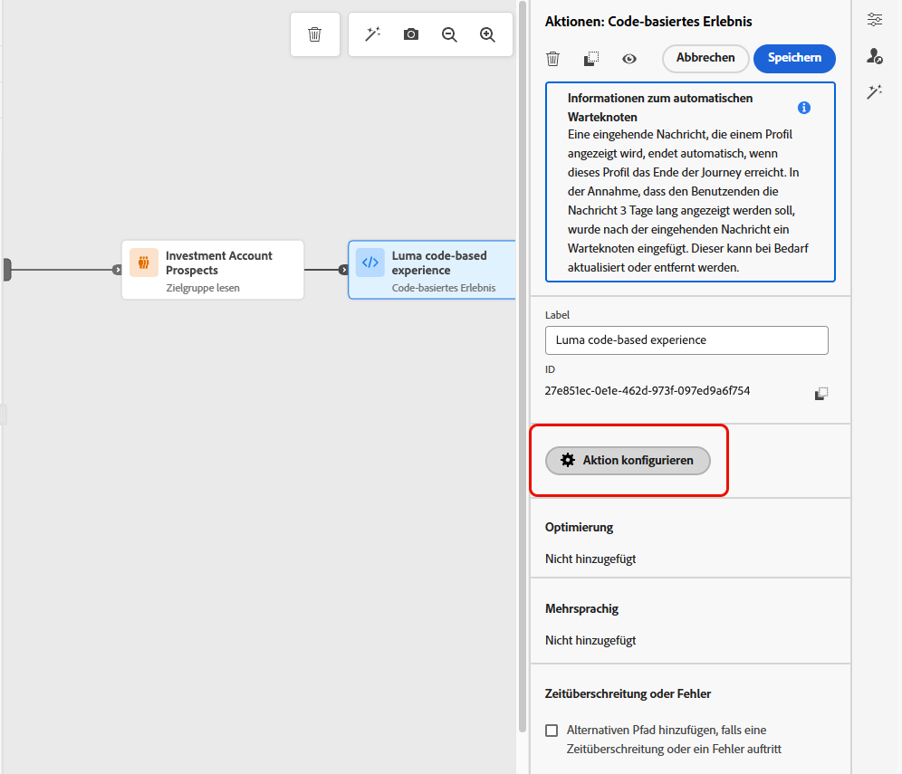
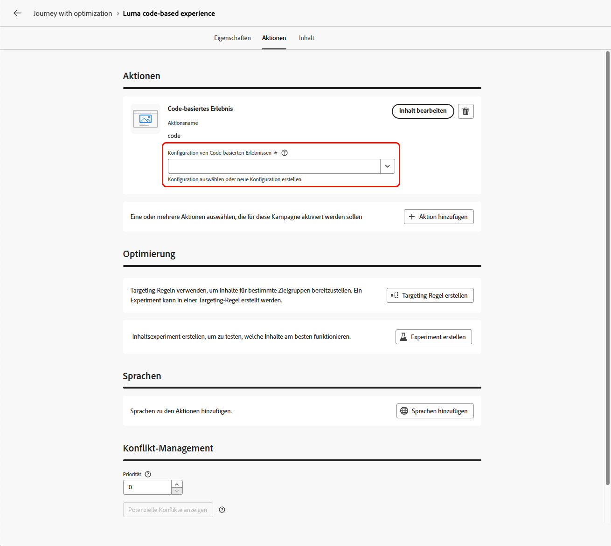
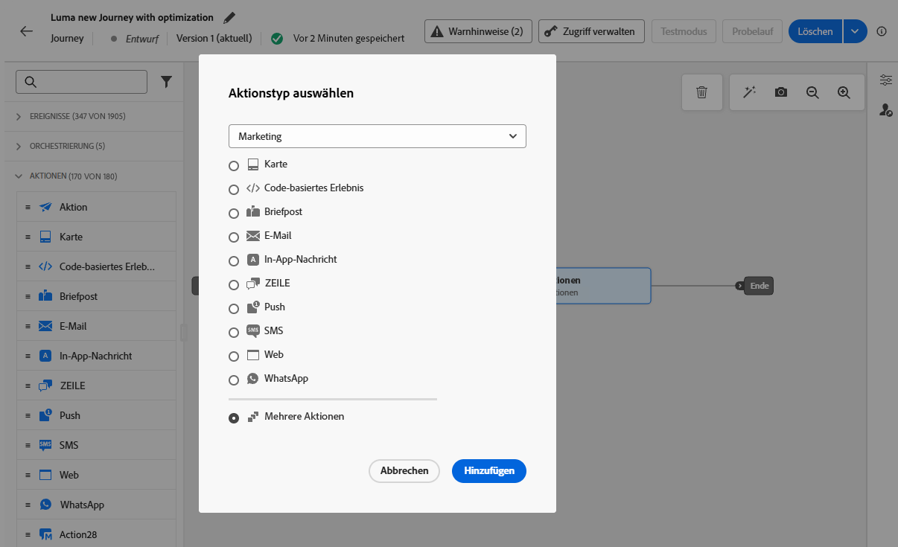
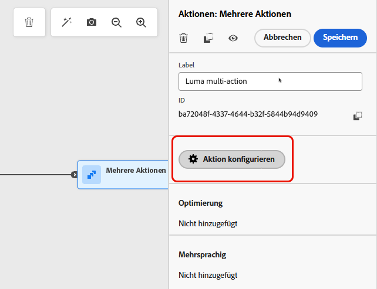
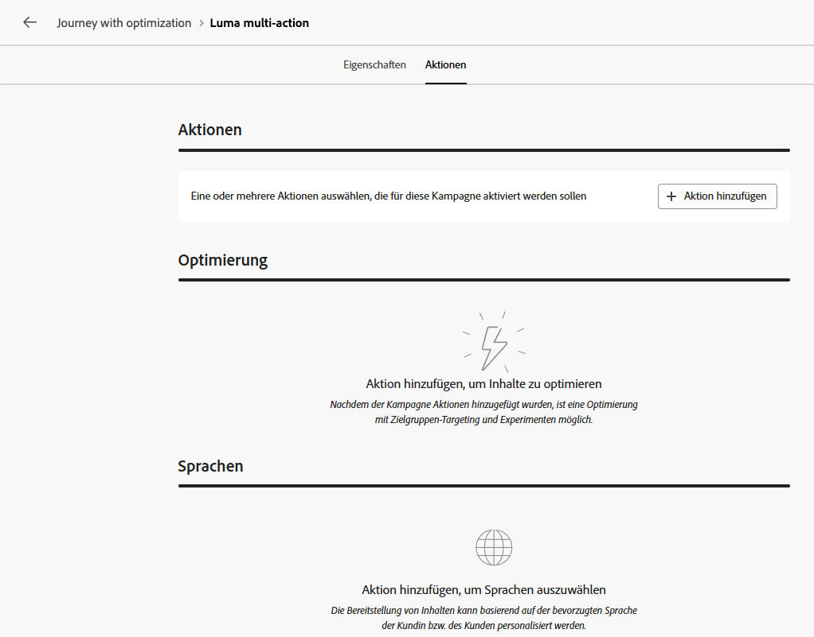
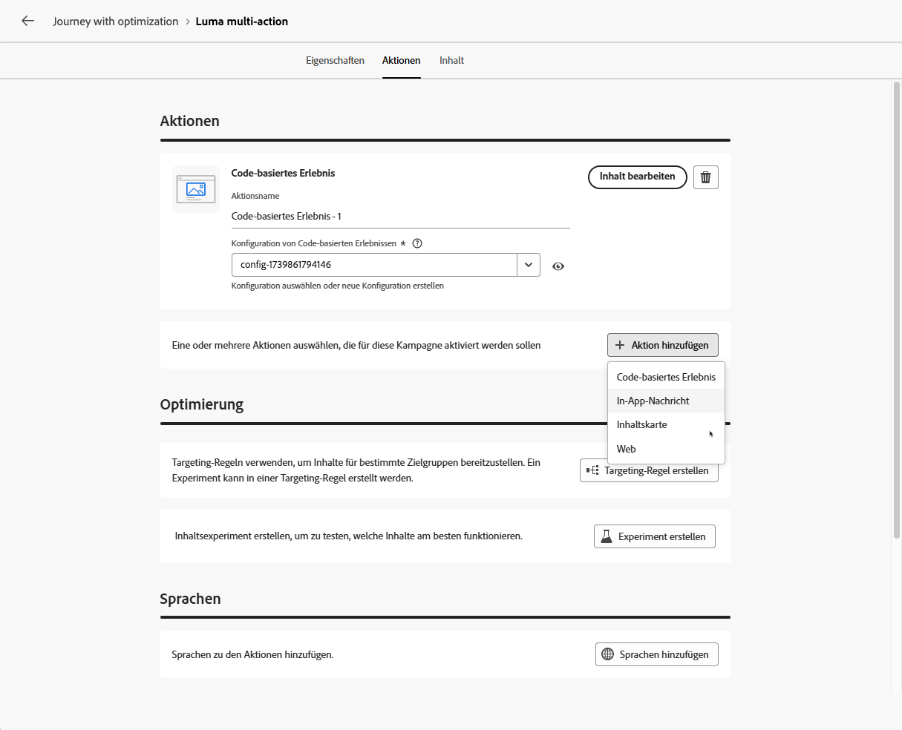
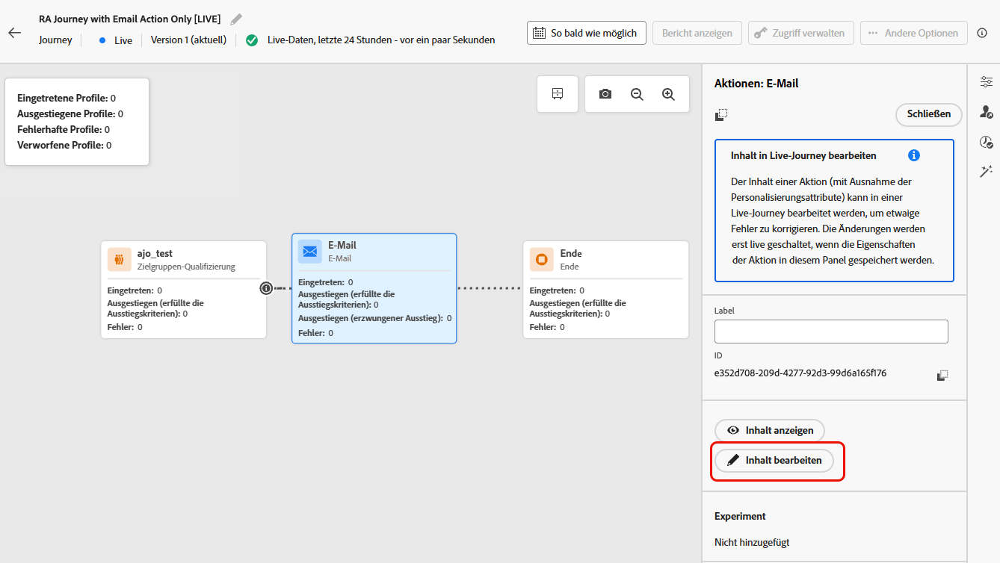

# Verwenden der Aktivität „Aktion“ {#add-a-message-in-a-journey}

>[!CONTEXTUALHELP]
>id="ajo_action_activity"
>title="Aktivität „Aktion“"
>abstract="Die Aktivität **Aktion** ermöglicht die Konfiguration einer einzelnen nativen Kanalaktion und mehrerer eingehender Aktivitäten mit der Möglichkeit, jeder integrierten Kanalaktion eine Optimierung hinzuzufügen."

Die **Action**-Aktivität ist der zentrale Einstiegspunkt für die Bereitstellung von Inhalten für Ihre Kunden von der Journey-Arbeitsfläche aus. Anstatt für jeden Kanal aus einer separaten Aktivität auszuwählen, ziehen Sie eine einzelne **[!UICONTROL Aktion]**-Aktivität auf die Arbeitsfläche und wählen Sie den zu verwendenden Kanal aus.

Alle älteren nativen Kanäle - E-Mail, Push, SMS, In-App, Web, Code-basierte Erlebnisse und Inhaltskarten - werden in einem einheitlichen Aktivitätstyp zusammengefasst, der die zuvor verwendeten individuellen Kanalaktivitäten ersetzt.

Verwenden Sie die Aktivität **Aktion** für Folgendes:

* Konfigurieren Sie jede integrierte Kanalaktion über eine zentrale, optimierte Benutzeroberfläche.
* Mehrere eingehende Erlebnisse in einer ([&#x200B; Aktionsgruppe) &#x200B;](#multi-action).
* Wenden Sie [Optimierung](../content-management/gs-message-optimization.md), [mehrsprachige Inhalte](../content-management/multilingual-gs.md) und kanalspezifische Einstellungen auf jede Aktion an.

>[!NOTE]
>
>Sie können in [!DNL Journey Optimizer] auch benutzerdefinierte Aktionen zum Senden von Nachrichten einrichten. [Weitere Informationen](#recommendation)

## Über alte Kanalaktivitäten

Ältere native Kanalaktivitäten (E-Mail, Push, SMS, In-App, Web, Code-basiertes Erlebnis und Inhaltskarte) werden **seit der Version vom März 2026 nicht mehr**.

Vorhandene Journey, die diese Aktivitäten verwenden, funktionieren weiterhin unverändert - es ist keine Migration erforderlich.

Alte native Kanalaktivitäten werden auch in diesen Fällen beibehalten:

* **Duplizieren einer Journey** - Die duplizierte Journey verwendet weiterhin Legacy-Aktivitäten. Sie können sie unverändert bearbeiten und veröffentlichen. Es ist keine Migration erforderlich.
* **Neue Journey-Version erstellen** - Die neue Version verwendet weiterhin Legacy-Aktivitäten. Sie können sie unverändert bearbeiten und veröffentlichen. Es ist keine Migration erforderlich.
* **Kopieren und Einfügen von Legacy-Aktivitäten auf einer Journey** — Eingefügte Aktivitäten bleiben Legacy-Aktivitäten. Sie können sie unverändert bearbeiten und veröffentlichen. Es ist keine Migration erforderlich.

## Hinzufügen einer integrierten Kanalaktion zu einer Journey  {#add-action}

>[!CONTEXTUALHELP]
>id="ajo_journey_action_auto_wait"
>title="Automatischer Warteknoten"
>abstract="Bei eingehenden Kanalaktionen (In-App-Nachricht, Web, Inhaltskarte und Code-basiertes Erlebnis) wird nach der Aktion automatisch ein **Warten**-Knoten eingefügt (standardmäßig 3 Tage). Dadurch haben die Profile Zeit, das eingehende Erlebnis anzuzeigen, bevor die Journey mit dem nächsten Schritt fortfährt."
>additional-url="https://experienceleague.adobe.com/de/docs/journey-optimizer/using/orchestrate-journeys/about-journey-building/journey-action#add-action" text="Erste Schritte mit Kanalaktionen"

>[!CONTEXTUALHELP]
>id="ajo_journey_action_optimization"
>title="Optimierung"
>abstract="Im **Optimierung** werden einer Kanalaktion Inhaltsexperimente, Zielgruppenbestimmungsregeln oder beides hinzugefügt. Sie ermöglicht es Ihnen, Varianten zu testen und den effektivsten Inhalt für jedes Mitglied der Zielgruppe bereitzustellen."
>additional-url="https://experienceleague.adobe.com/de/docs/journey-optimizer/using/orchestrate-journeys/about-journey-building/optimize-activity/optimize" text="Verwenden der Aktivität Optimieren"

>[!CONTEXTUALHELP]
>id="ajo_journey_action_multilingual"
>title="Mehrsprachig"
>abstract="Der **Multilingual**-Abschnitt liefert die Kanalaktionsinhalte in mehreren Sprachen auf einer einzigen Journey. Eine Spracheinstellungskonfiguration definiert die unterstützten Gebietsschemata und die Standardsprache für diese Aktion."
>additional-url="https://experienceleague.adobe.com/de/docs/journey-optimizer/using/content-management/content-multilingual/multilingual-gs" text="Erste Schritte mit mehrsprachigen Inhalten"

Gehen Sie wie folgt vor, um Ihrer Journey mithilfe der Aktivität **[!UICONTROL Aktion]** eine integrierte Kanalaktion hinzuzufügen.

>[!NOTE]
>
>Weitere Informationen zu den in Journeys verfügbaren Kanälen finden Sie in der Tabelle in diesem Abschnitt: [Kanäle in Journeys und Kampagnen](../channels/gs-channels.md#channels).

1. Beginnen Sie Ihre Journey mit einem [Ereignis](general-events.md) oder einer Aktivität vom Typ [Zielgruppe lesen](read-audience.md).

1. Ziehen Sie aus dem Abschnitt **[!UICONTROL Aktionen]** der Palette eine Aktivität des Typs **[!UICONTROL Aktion]** per Drag-and-Drop auf die Arbeitsfläche.

1. Wählen Sie die integrierte Kanalaktivität aus, die Sie in Ihrer Journey nutzen möchten.

   

1. Fügen Sie Ihrer Aktion ein Label hinzu und wählen Sie **[!UICONTROL Aktion konfigurieren]** aus.

   {width="80%"}

1. Sie werden zur Registerkarte **[!UICONTROL Aktionen]** des Bildschirms zur Journey-Aktionskonfiguration weitergeleitet.

   Wählen Sie die Konfiguration aus, die für den ausgewählten Kanal verwendet werden soll.

   

1. Wenn Sie einen eingehenden Kanal ausgewählt haben, können Sie mehrere Aktionen hinzufügen. [Weitere Informationen](#multi-action)

1. Konfigurieren Sie Ihre Aktivität entsprechend dem ausgewählten Kanal. Ausführliche Konfigurationsrichtlinien finden Sie unter den folgenden Links.

   * Erfahren Sie im Detail, wie Sie eine ausgehende Aktion erstellen:

     <table style="table-layout:fixed">
      <tr style="border: 0;">
      <td>
      
      
<a href="../email/create-email.md"><strong>Erstellen von E-Mails</strong>
      

      

      </td>
      <td>
      
      

      <a href="../push/create-push.md"><strong>Push-Benachrichtigungen erstellen<strong></a>
      

      

      </td>
      <td>
      
      

      <a href="../mobile/create-mobile-message.md"><strong>Erstellen von Mobile-Nachrichten (SMS/RCS/MMS)</strong></a>
      

      

      </td>
      </tr>
      </table>

   * Erfahren Sie im Detail, wie Sie Ihre eingehende Aktion erstellen:

     <table style="table-layout:fixed">
      <tr style="border: 0;">
      <td>
      
      
<a href="../in-app/create-in-app.md"><strong>Erstellen von In-App-Nachrichten</strong>
      

      

      </td>
      <td>
      
      
<a href="../web/create-web.md"><strong>Erstellen von Web-Erlebnissen</strong>
      

      

      </td>
      <td>
      
      
<a href="../content-card/create-content-card.md"><strong>Erstellen von Inhaltskarten</strong>
      

      

      </td>
      <td>
      
      

      <a href="../code-based/create-code-based.md"><strong>Erstellen von Code-basierten Erlebnissen<strong></a>
      

      

      </td>
      </tr>
      </table>

   >[!NOTE]
   >
   >* Jede eingehende Erlebnisaktion umfasst eine 3-tägige **Warten**-Aktivität. [Weitere Informationen](wait-activity.md#auto-wait-node)
   >
   >* Für E-Mails und Push-Benachrichtigungen können Sie die Versandzeitoptimierung aktivieren. [Weitere Informationen](send-time-optimization.md)

1. Je nach Aktivität können Sie erweiterte Parameter für den ausgewählten Kanal anzeigen und einige Standardwerte wie Ausführungsadressen überschreiben. [Weitere Informationen](about-journey-activities.md#advanced-parameters)

   >[!NOTE]
   >
   >Wenn die erweiterten Parameter ausgeblendet sind, klicken Sie oben im rechten Bereich auf die Schaltfläche **[!UICONTROL Schreibgeschützte Felder anzeigen]**.

1. Verwenden Sie den Abschnitt **[!UICONTROL Optimierung]**, um Inhaltsexperimente durchzuführen, Targeting-Regeln zu nutzen oder erweiterte Kombinationen aus Experimenten und Targeting zu verwenden.

   Diese verschiedenen Optionen und die erforderlichen Schritte werden in [diesem Abschnitt](../content-management/gs-message-optimization.md) ausführlich beschrieben.

1. Verwenden Sie den Abschnitt **[!UICONTROL Sprachen]**, um innerhalb Ihrer Journey-Aktion Inhalte in mehreren Sprachen zu erstellen. Klicken Sie dazu auf die Schaltfläche **[!UICONTROL Sprachen hinzufügen]** und wählen Sie die gewünschten **[!UICONTROL Spracheinstellungen]** aus.

   Detaillierte Informationen zum Einrichten und Verwenden mehrsprachiger Funktionen finden Sie in [diesem Abschnitt](../content-management/multilingual-gs.md).

Je nach ausgewähltem Kommunikationskanal stehen zusätzliche Einstellungen zur Verfügung. Erweitern Sie die folgenden Abschnitte, um weitere Informationen zu erhalten.

+++**Anwenden von Begrenzungsregeln** (E-Mail, Push, SMS)

Wählen Sie in der Dropdown-Liste **[!UICONTROL Geschäftsregeln]** einen Regelsatz aus, um Begrenzungsregeln auf Ihre Journey-Aktion anzuwenden.

Mithilfe von Kanalregelsätzen können Sie die Frequenzbegrenzung nach Kommunikationstyp festlegen, um zu verhindern, dass Kundinnen und Kunden zu viele ähnliche Nachrichten erhalten.

[Erfahren Sie, wie Sie mit Regelsätzen arbeiten](../conflict-prioritization/rule-sets.md)

+++

+++**Verfolgen von Interaktionen** (E-Mail, SMS).

Verwenden Sie den Abschnitt **[!UICONTROL Aktions-Tracking]**, um zu verfolgen, wie Ihre Empfängerinnen und Empfänger auf Ihre E-Mail- oder SMS-Sendungen reagieren.

Die Tracking-Ergebnisse sind nach Ausführung der Journey im Journey-Bericht verfügbar.

[Erfahren Sie mehr über Journey-Berichte](../reports/journey-global-report-cja.md)

+++

+++**Aktivieren des Schnellversandmodus** (Push).

Der Schnellversand-Modus ist ein Add-on für [!DNL Journey Optimizer], das den sehr schnellen Versand von Push-Nachrichten in großen Mengen im Rahmen von Kampagnen ermöglicht.

Der Schnellversand wird verwendet, wenn eine Verzögerung beim Nachrichtenversand geschäftskritisch wäre oder wenn Sie eine dringende Push-Benachrichtigung an Mobiltelefone senden möchten, z. B. eine Eilmeldung an Benutzende, die Ihre Nachrichten-App installiert haben.

[Auf dieser Seite](../push/create-push.md#rapid-delivery) erfahren Sie, wie Sie den Schnellversandmodus für Push-Benachrichtigungen aktivieren.

Weitere Informationen zur Leistung bei Verwendung des Schnellversand-Modus finden Sie unter [[!DNL Adobe Journey Optimizer] Produktbeschreibung](https://helpx.adobe.com/de/legal/product-descriptions/adobe-journey-optimizer.html){target="_blank"}.

+++

+++**Zuweisen von Prioritätswerten** (Web, In-App, Code-basiert)

Im Bereich **[!UICONTROL Konflikt-Management]** können Sie der Journey-Aktion einen Prioritätswert zuweisen, sodass Sie eine eingehende Aktion priorisieren können, wenn mehrere Journey-Aktionen oder Kampagnen mit derselben Kanalkonfiguration vorhanden sind.

Standardmäßig wird der Prioritätswert für die Aktion vom Gesamtprioritätswert für die Journey übernommen.

[Erfahren Sie, wie Sie Kanalaktionen Prioritätswerte zuweisen](../conflict-prioritization/priority-scores.md#priority-action)

+++

+++**Festlegen zusätzlicher Versandregeln** (Inhaltskarten)

Für Inhaltskarten-Journeys können Sie zusätzliche Versandregeln aktivieren, um die Ereignisse und Kriterien auszuwählen, die die Nachricht auslösen sollen.

[Informationen zum Erstellen von Inhaltskarten](../content-card/create-content-card.md)

+++

+++**Definieren von Triggern** (In-App)

Für In-App-Nachrichten können Sie über die Schaltfläche **[!UICONTROL Trigger bearbeiten]** die Ereignisse und Kriterien auswählen, die die Nachricht auslösen sollen.

[Informationen zum Erstellen einer In-App-Nachricht](../in-app/create-in-app.md)

+++

## Hinzufügen von mehreren eingehenden Aktionen {#multi-action}

>[!CONTEXTUALHELP]
>id="ajo_multi_action_journey"
>title="Hinzufügen von mehreren eingehenden Aktionen"
>abstract="Eine einzelne Journey kann mehrere eingehende Aktionen enthalten. Mit dieser Funktion können Sie mehrere Code-basierte Erlebnisse, In-App-Nachrichten, Inhaltskarten oder Web-Aktionen gleichzeitig an verschiedenen Orten bereitstellen, wobei jede Aktion einen bestimmten Inhalt enthält."

Um die Journey-Orchestrierung zu vereinfachen, können Sie in einer einzigen Journey-Aktion mehrere eingehende Aktionen definieren.

>[!NOTE]
>
>Diese Funktion ist nur für eingehende Kanäle verfügbar. Derzeit werden Outbound-Kanäle wie E-Mail nicht unterstützt.

Mit dieser Funktion können Sie mehrere Code-basierte Erlebnisse, In-App-Nachrichten, Inhaltskarten oder Web-Aktionen gleichzeitig an verschiedenen Orten bereitstellen, ohne mehrere Journey-Aktionen erstellen zu müssen. Dies erleichtert die Bereitstellung Ihrer Journey und ermöglicht ein reibungsloseres Reporting, indem alle Daten in einer einzigen Kampagne zusammengefasst werden.

Sie können beispielsweise ein Code-basiertes Erlebnis mit geringfügig unterschiedlichen Inhalten an mehrere Endpunkte senden. Erstellen Sie dazu verschiedene Code-basierte Aktionen innerhalb derselben Journey-Aktion mit jeweils einer anderen Endpunktkonfiguration.

Gehen Sie wie folgt vor, um mehrere eingehende Aktionen in einem einzigen Journey-Aktionsknoten zu definieren.

1. Beginnen Sie Ihre Journey mit einem [Ereignis](general-events.md) oder einer Aktivität vom Typ [Zielgruppe lesen](read-audience.md).

1. Ziehen Sie aus dem Abschnitt **[!UICONTROL Aktionen]** der Palette eine Aktivität des Typs **[!UICONTROL Aktion]** per Drag-and-Drop auf die Arbeitsfläche.

1. Wählen Sie als Aktionstyp **[!UICONTROL Mehrere Aktionen]** aus.

   

1. Fügen Sie bei Bedarf ein Label hinzu und wählen Sie **[!UICONTROL Aktion konfigurieren]**.

   {width="60%"}

1. Sie werden zur Registerkarte **[!UICONTROL Aktionen]** am Bildschirm zur Konfiguration von Journey-Aktionen weitergeleitet.

   {width="70%"}

1. Wählen Sie im Abschnitt **[!UICONTROL Aktionen]** eine eingehende Aktion (**Code-basiertes Erlebnis**, **In-App-Nachricht**, **Inhaltskarte** oder **Web**) aus.

1. Wählen Sie die Kanalkonfiguration aus und definieren Sie einen bestimmten Inhalt für diese Aktion.

1. Verwenden Sie die Schaltfläche **[!UICONTROL Aktion hinzufügen]**, um eine weitere eingehende Aktion aus der Dropdown-Liste auszuwählen.

   {width="80%"}

1. Gehen Sie ähnlich vor, um weitere Aktionen hinzuzufügen. Sie können bis zu 10 eingehende Aktionen in einer Journey-Aktionsgruppe hinzufügen.

Sobald die Journey [live](publish-journey.md) ist, werden alle Aktionen gleichzeitig aktiviert.

## Aktualisieren von Live Content {#update-live-content}

Sie können den Inhalt einer integrierten Kanalaktion in einer Live-Journey aktualisieren.

Änderungen am Inhalt werden erst dann auf der Journey angezeigt, wenn Sie die Eigenschaften der Aktion speichern. [Weitere Informationen](about-journey-activities.md#advanced-parameters)

Öffnen Sie dazu Ihre Live-Journey, wählen Sie die Aktivität „Kanal“ aus und klicken Sie auf **Inhalt bearbeiten**.

Sie können jedoch nicht die Attribute ändern, die bei der Personalisierung verwendet wurden, egal, ob es sich um Profilattribute oder kontextuelle Daten (aus Ereignis- oder Journey-Eigenschaften) handelt.

* Wenn Sie Kontextdaten geändert haben, wird die folgende Fehlermeldung angezeigt: `ERR_AUTHORING_JOURNEYVERSION_201`

* Wenn Sie Profilattribute geändert haben, wird die folgende Fehlermeldung angezeigt: `ERR_AUTHORING_JOURNEYVERSION_202`

Beachten Sie, dass für die In-App-Aktivität alle Änderungen am Inhalt vorgenommen werden können, während die Journey live ist. In-App-Trigger können jedoch nicht geändert werden.

## Senden mit benutzerdefinierten Aktionen {#recommendation}

Statt der integrierten Nachrichtenfunktionen können Sie benutzerdefinierte Aktionen verwenden, um die Verbindung eines Drittanbietersystems zum Senden von Nachrichten oder API-Aufrufen zu konfigurieren.

* Wenn Sie zum Senden Ihrer Nachrichten ein Drittanbietersystem verwenden, können Sie eine benutzerdefinierte Aktion erstellen. [Weitere Informationen](../action/action.md)

* Wenn Sie mit Adobe Campaign arbeiten, sollten Sie diese Abschnitte lesen:

   * [[!DNL Journey Optimizer] und Campaign v7/v8](../action/acc-action.md)
   * [[!DNL Journey Optimizer] und Campaign Standard](../action/acs-action.md)
