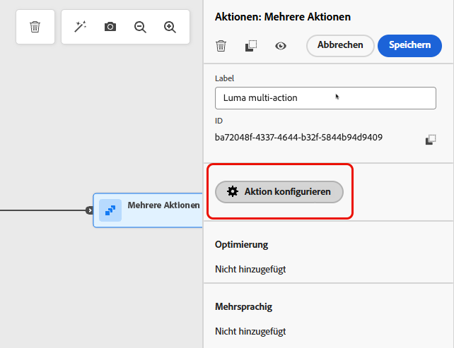

# Verwenden der Aktivität „Aktion“ {#add-a-message-in-a-journey}

>[!CONTEXTUALHELP]
>id="ajo_action_activity"
>title="Aktivität „Aktion“"
>abstract="Mit der generischen Aktivität **Aktion** können Sie eine einzelne native Kanalaktion und mehrere eingehende Aktivitäten konfigurieren, wobei Sie jede integrierte Kanalaktion optimieren können."

>[!AVAILABILITY]
>
>Diese Funktion ist nur eingeschränkt verfügbar. Wenden Sie sich an den Adobe-Support, um Zugriff zu erhalten.

[!DNL Journey Optimizer] verfügt über eine neue generische Aktivität **Aktion**, mit der eine einzelne integrierte Kanalaktion und auch mehrere eingehende Aktivitäten konfiguriert werden können.

Dies ermöglicht Folgendes:

* Eine vereinfachte, native Aktionskonfiguration innerhalb der Journey-Arbeitsfläche
* Die Möglichkeit, eingehende Aktionsgruppen mit mehreren Aktionen zu erstellen
* Die Möglichkeit, jeder integrierten Kanalaktion eine Optimierung hinzuzufügen

>[!NOTE]
>
>Sie können in [!DNL Journey Optimizer] auch benutzerdefinierte Aktionen zum Senden von Nachrichten einrichten. [Weitere Informationen](#recommendation)

## Hinzufügen einer Aktion zu einer Journey  {#add-action}

Gehen Sie wie folgt vor, um eine integrierte Kanalaktion zu einer Journey hinzuzufügen.

1. Beginnen Sie Ihre Journey mit einem [Ereignis](general-events.md) oder einer Aktivität vom Typ [Zielgruppe lesen](read-audience.md).

1. Ziehen Sie aus dem Abschnitt **[!UICONTROL Aktionen]** der Palette eine Aktivität des Typs **[!UICONTROL Aktion]** per Drag-and-Drop auf die Arbeitsfläche.

1. Wählen Sie die integrierte Kanalaktivität aus, die Sie in Ihrer Journey nutzen möchten.

   

1. Fügen Sie Ihrer Aktion ein Label hinzu und wählen Sie **[!UICONTROL Aktion konfigurieren]** aus.

   {width="80%"}

1. Sie werden zur Registerkarte **[!UICONTROL Aktionen]** des Bildschirms zur Journey-Aktionskonfiguration weitergeleitet.

   Wählen Sie die Konfiguration aus, die für den ausgewählten Kanal verwendet werden soll.

   

1. Wenn Sie einen eingehenden Kanal ausgewählt haben, können Sie mehrere Aktionen hinzufügen. [Weitere Informationen](#multi-action)

1. Konfigurieren Sie Ihre Aktivität entsprechend dem ausgewählten Kanal. In [diesem Abschnitt](journeys-message.md) erfahren Sie, wie Sie integrierte Kanalaktionen konfigurieren.

1. Verwenden Sie den Abschnitt **[!UICONTROL Optimierung]**, um Inhaltsexperimente auszuführen, Targeting-Regeln zu nutzen oder erweiterte Kombinationen aus Experimenten und Targeting zu verwenden. 

   Diese verschiedenen Optionen und die erforderlichen Schritte werden in [diesem Abschnitt](../campaigns/gs-message-optimization.md) ausführlich beschrieben.

1. Verwenden Sie den Abschnitt **[!UICONTROL Sprachen]**, um innerhalb Ihrer Journey-Aktion Inhalte in mehreren Sprachen zu erstellen. Klicken Sie dazu auf die Schaltfläche **[!UICONTROL Sprachen hinzufügen]** und wählen Sie die gewünschten **[!UICONTROL Spracheinstellungen]** aus. 

   Detaillierte Informationen zum Einrichten und Verwenden mehrsprachiger Funktionen finden Sie in [diesem Abschnitt](../content-management/multilingual-gs.md).

Je nach ausgewähltem Kommunikationskanal stehen zusätzliche Einstellungen zur Verfügung. Erweitern Sie die folgenden Abschnitte, um weitere Informationen zu erhalten.

+++**Anwenden von Begrenzungsregeln** (E-Mail, Direkt-Mail, Push, SMS)

Wählen Sie in der Dropdown-Liste **[!UICONTROL Geschäftsregeln]** einen Regelsatz aus, um Begrenzungsregeln auf Ihre Journey-Aktion anzuwenden. 

Mithilfe von Kanalregelsätzen können Sie die Frequenzbegrenzung nach Kommunikationstyp festlegen, um zu verhindern, dass Kundinnen und Kunden zu viele ähnliche Nachrichten erhalten. 

[Erfahren Sie, wie Sie mit Regelsätzen arbeiten](../conflict-prioritization/rule-sets.md)

+++

+++**Verfolgen von Interaktionen** (E-Mail, SMS).

Verwenden Sie den Abschnitt **[!UICONTROL Aktions-Tracking]**, um zu verfolgen, wie Empfängerinnen und Empfänger auf Ihre E-Mail- oder SMS-Sendungen reagieren. 

Die Tracking-Ergebnisse sind nach Ausführung der Journey im Journey-Bericht verfügbar. 

[Erfahren Sie mehr über Journey-Berichte](../reports/journey-global-report-cja.md)

+++

+++**Aktivieren des Schnellversandmodus** (Push).

Der Schnellversand-Modus ist ein Add-on für [!DNL Journey Optimizer], das den sehr schnellen Versand von Push-Nachrichten in großen Mengen im Rahmen von Kampagnen ermöglicht.

Der Schnellversand wird verwendet, wenn eine Verzögerung beim Nachrichtenversand geschäftskritisch wäre oder wenn Sie eine dringende Push-Benachrichtigung an Mobiltelefone senden möchten, z. B. eine Eilmeldung an Benutzende, die Ihre Nachrichten-App installiert haben.

[Auf dieser Seite](../push/create-push.md#rapid-delivery) erfahren Sie, wie Sie den Schnellversandmodus für Push-Benachrichtigungen aktivieren.

Weitere Informationen zur Leistung bei Verwendung des Schnellversandmodus finden Sie unter [Produktbeschreibung für Adobe Journey Optimizer](https://helpx.adobe.com/de/legal/product-descriptions/adobe-journey-optimizer.html){target="_blank"}.

+++

+++**Zuweisen von Prioritätswerten** (Web, In-App, Code-basiert)

Im Bereich **[!UICONTROL Konflikt-Management]** können Sie der Journey-Aktion einen Prioritätswert zuweisen, sodass Sie eine eingehende Aktion priorisieren können, wenn mehrere Journey-Aktionen oder Kampagnen mit derselben Kanalkonfiguration vorhanden sind. 

Standardmäßig wird der Prioritätswert für die Aktion vom Gesamtprioritätswert für die Journey übernommen.

[Erfahren Sie, wie Sie Kanalaktionen Prioritätswerte zuweisen](../conflict-prioritization/priority-scores.md#priority-action)

+++

+++**Festlegen zusätzlicher Versandregeln** (Inhaltskarten)

Für Inhaltskarten-Journeys können Sie zusätzliche Versandregeln aktivieren, um die Ereignisse und Kriterien auszuwählen, die die Nachricht auslösen sollen. 

[Informationen zum Erstellen von Inhaltskarten](../content-card/create-content-card.md)

+++

+++**Definieren von Triggern** (In-App)

Für In-App-Nachrichten können Sie über die Schaltfläche **[!UICONTROL Trigger bearbeiten]** die Ereignisse und Kriterien auswählen, die die Nachricht auslösen sollen. 

[Informationen zum Erstellen einer In-App-Nachricht](../in-app/create-in-app.md)

+++

## Hinzufügen von mehreren eingehenden Aktionen {#multi-action}

>[!CONTEXTUALHELP]
>id="ajo_multi_action_journey"
>title="Hinzufügen von mehreren eingehenden Aktionen"
>abstract="Innerhalb einer Journey können mehrere eingehende Aktionen ausgewählt werden. Mit dieser Funktion können Sie mehrere Code-basierte Erlebnisse, In-App-Nachrichten, Inhaltskarten oder Web-Aktionen gleichzeitig an verschiedenen Orten bereitstellen, wobei jede Aktion einen bestimmten Inhalt enthält."

Um die Journey-Orchestrierung zu vereinfachen, können Sie in einer einzigen Journey-Aktion mehrere eingehende Aktionen definieren.

>[!NOTE]
>
>Diese Funktion ist nur für eingehende Kanäle verfügbar. Derzeit werden Outbound-Kanäle wie E-Mail nicht unterstützt.

Mit dieser Funktion können Sie mehrere Code-basierte Erlebnisse, In-App-Nachrichten, Inhaltskarten oder Web-Aktionen gleichzeitig an verschiedenen Orten bereitstellen, ohne mehrere Journey-Aktionen erstellen zu müssen. Dies erleichtert die Bereitstellung Ihrer Journey und ermöglicht ein reibungsloseres Reporting, indem alle Daten in einer einzigen Kampagne zusammengefasst werden.

Sie können beispielsweise ein Code-basiertes Erlebnis mit geringfügig unterschiedlichen Inhalten an mehrere Endpunkte senden. Erstellen Sie dazu verschiedene Code-basierte Aktionen innerhalb derselben Journey-Aktion mit jeweils einer anderen Endpunktkonfiguration.

Gehen Sie wie folgt vor, um mehrere eingehende Aktionen in einem einzigen Journey-Aktionsknoten zu definieren.

1. Beginnen Sie Ihre Journey mit einem [Ereignis](general-events.md) oder einer Aktivität vom Typ [Zielgruppe lesen](read-audience.md).

1. Ziehen Sie aus dem Abschnitt **[!UICONTROL Aktionen]** der Palette eine Aktivität des Typs **[!UICONTROL Aktion]** per Drag-and-Drop auf die Arbeitsfläche.

1. Wählen Sie als Aktionstyp **[!UICONTROL Mehrere Aktionen]** aus.

   

1. Fügen Sie bei Bedarf ein Label hinzu und wählen Sie **[!UICONTROL Aktion konfigurieren]**.

   {width="60%"}

1. Sie werden zur Registerkarte **[!UICONTROL Aktionen]** am Bildschirm zur Konfiguration von Journey-Aktionen weitergeleitet.

   {width="70%"}

1. Wählen Sie im Abschnitt **[!UICONTROL Aktionen]** eine eingehende Aktion (**Code-basiertes Erlebnis**, **In-App-Nachricht**, **Inhaltskarte** oder **Web**) aus.

1. Wählen Sie die Kanalkonfiguration aus und definieren Sie einen bestimmten Inhalt für diese Aktion.

1. Verwenden Sie die Schaltfläche **[!UICONTROL Aktion hinzufügen]**, um eine weitere eingehende Aktion aus der Dropdown-Liste auszuwählen.

   {width="80%"}

1. Gehen Sie ähnlich vor, um weitere Aktionen hinzuzufügen. Sie können bis zu 10 eingehende Aktionen in einer Journey-Aktionsgruppe hinzufügen.

Sobald die Journey [live](publish-journey.md) ist, werden alle Aktionen gleichzeitig aktiviert.
<!--
## Next steps {#next}

Once your action is configured, you can design its content. [Learn more]-->
