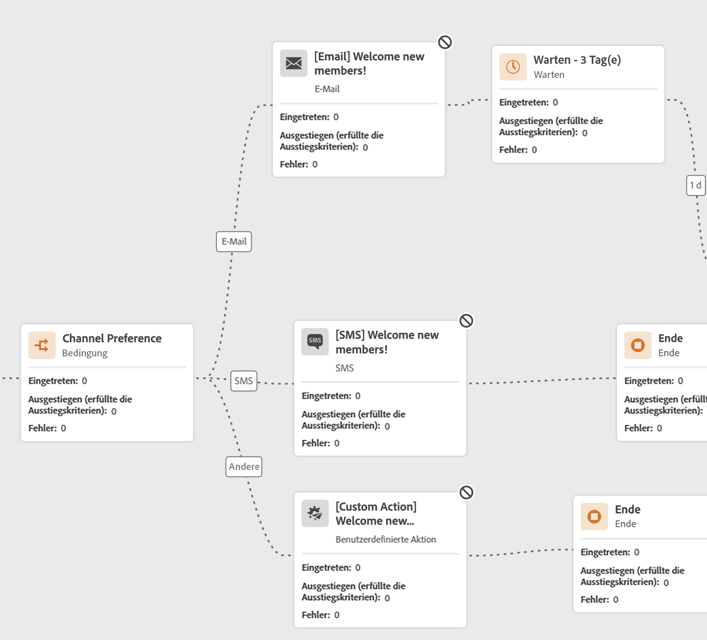
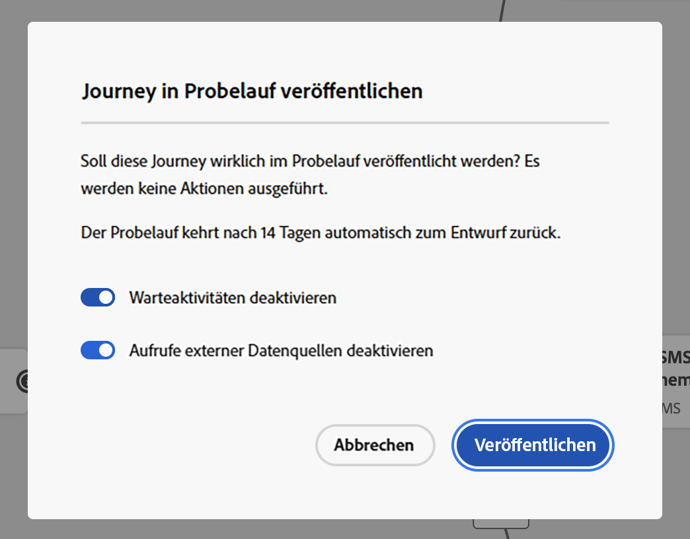
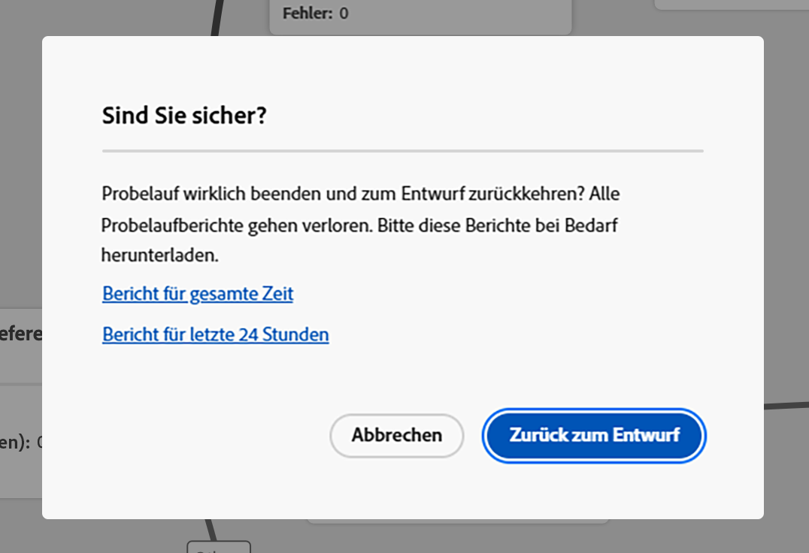
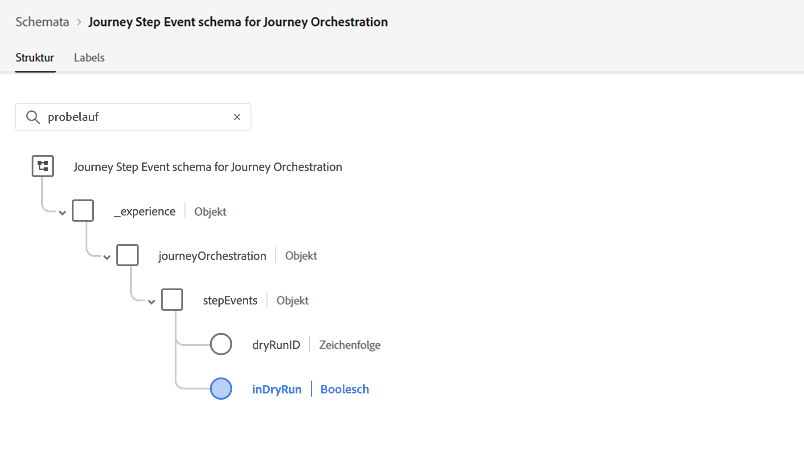

# Journey-Probelauf {#journey-dry-run}

>[!CONTEXTUALHELP]
>id="ajo_journey_dry_run"
>title="Probelauf-Modus"
>abstract="Diese Journey befindet sich im Probelauf. Der Journey-Probelauf ist ein spezieller Journey-Veröffentlichungsmodus in Adobe Journey Optimizer, der es Journey-Anwendenden ermöglicht, eine Journey mit echten Produktionsdaten zu testen, ohne echte Kundinnen und Kunden zu kontaktieren oder Profilinformationen zu aktualisieren.  Mit dieser Funktion können Journey-Anwendende Vertrauen in ihr Journey-Design und die Zielgruppenbestimmung gewinnen, bevor sie die Journey live veröffentlichen."

>[!CONTEXTUALHELP]
>id="ajo_journey_dry_run_start"
>title="Veröffentlichen einer Journey im Probelauf-Modus"
>abstract="Der Journey-Probelauf ist ein spezieller Journey-Veröffentlichungsmodus in Adobe Journey Optimizer, der es Journey-Anwendenden ermöglicht, eine Journey mit echten Produktionsdaten zu testen. Nachdem Sie Ihre Journey entworfen haben, führen Sie einen Probelauf aus, um deren Funktionalität zu bestätigen und sicherzustellen, dass die Schritte korrekt sind. In diesem Veröffentlichungsmodus können Sie eine Journey testen, ohne Mitteilungen an ein Profil zu senden."

Der Journey-Probelauf ist ein spezieller Journey-Veröffentlichungsmodus in Adobe Journey Optimizer, der es Journey-Anwendenden ermöglicht, eine Journey mit echten Produktionsdaten zu testen, ohne echte Kundinnen und Kunden zu kontaktieren oder Profilinformationen zu aktualisieren.  Mit dieser Funktion können Journey-Anwendende Vertrauen in ihr Journey-Design und die Zielgruppenbestimmung gewinnen, bevor sie die Journey live veröffentlichen.

## Wichtigste Vorteile {#journey-dry-run-benefits}

Ein Journey-Probelauf steigert das Vertrauen der Anwendenden und den Journey-Erfolg, indem er sicheres, datengesteuertes Testen von Kunden-Journeys mit echten Produktionsdaten ermöglicht – ohne das Risiko, Kundinnen und Kunden zu kontaktieren oder Profilinformationen zu ändern. Mit dieser Funktion können Journey-Anwendende die Reichweite ihrer Zielgruppe und die Verzweigungslogik vor der Live-Schaltung überprüfen und so sicherstellen, dass die Journeys ihren beabsichtigten Geschäftszielen entsprechen.

Mit dem Journey-Probelauf können Sie Probleme frühzeitig identifizieren, Zielgruppenbestimmungsstrategien optimieren und das Journey-Design basierend auf tatsächlichen Daten – und nicht auf Annahmen – verbessern. Der Probelauf ist direkt in die Journey-Arbeitsfläche integriert und bietet intuitives Reporting und Sichtbarkeit wichtiger Key Performance Indicators, sodass Teams sicher iterieren und Genehmigungs-Workflows optimieren können. Dies erhöht die betriebliche Effizienz, verringert das Launch-Risiko und steigert die Kundeninteraktion.

Letztendlich verbessert diese Funktion Time-to-Value und reduziert Journey-Fehler.

Der Journey-Probelauf bietet:

1. **Sichere Testumgebung**: Profile im Probelaufmodus werden nicht kontaktiert, sodass kein Risiko besteht, dass Nachrichten gesendet werden oder Live-Daten beeinträchtigt werden.
1. **Zielgruppeneinblicke**: Journey-Anwender können die Erreichbarkeit der Zielgruppe auf verschiedenen Journey-Knoten vorhersagen, einschließlich Opt-outs und Ausschlüssen auf der Grundlage von Journey-Bedingungen.
1. **Echtzeit-Feedback**: Metriken werden direkt auf der Journey-Arbeitsfläche angezeigt, ähnlich wie bei Live-Reporting, sodass Journey-Anwendende ihr Journey-Design optimieren können.

## Dry-Run-Ausführungslogik {#journey-dry-run-exec}

Während des Probelaufs wird das Journey im Simulationsmodus ausgeführt. Dabei werden die folgenden spezifischen Verhaltensweisen auf jede Journey-Aktivität angewendet, ohne dass echte Aktionen ausgelöst werden:

* **Kanalaktion**-Knoten wie E-Mail, SMS oder Push-Benachrichtigungen werden nicht ausgeführt.
* **Benutzerdefinierte Aktionen** sind während des Probelaufs deaktiviert und ihre Antworten sind auf null festgelegt.

  Zur besseren Lesbarkeit werden benutzerdefinierte Aktionen und Kanalaktivitäten während der Ausführung eines Probelaufs ausgegraut angezeigt.

  {width="80%" align="left"}

* **Datenquellen** einschließlich externer Datenquellen, und **Warten**-Aktivitäten sind während des Probelaufs standardmäßig deaktiviert. Sie können dieses Verhalten jedoch ändern [beim Aktivieren des Dry Run-Modus](#journey-dry-run-start).

* **Reaktion** Knoten werden nicht ausgeführt: Alle Profile, die darauf zugreifen, werden erfolgreich beendet. Es gelten jedoch die folgenden Prioritätsregeln:
   * Wenn ein **Reaktion**-Knoten mit einem oder mehreren **unitären Ereignis**-Knoten parallel verwendet wird, durchlaufen Profile immer das Reaktionsereignis.
   * Wenn ein **Reaktion**-Knoten mit einem oder mehreren **Reaktionsereignis**-Knoten parallel verwendet wird, durchlaufen Profile immer den ersten Knoten auf der Arbeitsfläche (den oben).

>[!CAUTION]
>
>* Die Berechtigungen zum Starten eines Probelaufs sind auf Benutzer mit der Berechtigung **[!DNL Publish journeys]** hoher Ebene beschränkt. Die Berechtigungen zum Stoppen eines Probelaufs sind auf Benutzer mit der Berechtigung **[!DNL Manage journeys]** hoher Ebene beschränkt. Weitere Informationen zur Verwaltung der Zugriffsrechte für [!DNL Journey Optimizer]-Benutzende finden Sie in [diesem Abschnitt](../administration/permissions-overview.md).
>
>* Bevor Sie mit der Verwendung der Probelauffunktion beginnen, [lesen Sie die Informationen zu Leitlinien und Einschränkungen](#journey-dry-run-limitations).

## Starten eines Probelaufs {#journey-dry-run-start}

Die Probelauffunktion kann in jeder fehlerfreien Entwurfs-Journey verwendet werden.

Gehen Sie wie folgt vor, um einen Probelauf zu aktivieren:

1. Öffnen Sie die Journey, die getestet werden soll.
1. Wählen Sie die Schaltfläche **Probelauf** aus.

   

1. Wählen Sie die aus, wenn Sie **Warten**-Aktivitäten und **Externe Datenquellen**-Aufrufe aktivieren oder deaktivieren möchten, und bestätigen Sie die Probelauf-Veröffentlichung.

   {width="50%" align="left"}

   Während des Übergangs wird die Statusmeldung **Probelauf wird aktiviert** angezeigt.

1. Nach der Aktivierung wechselt die Journey in den Modus **Probelauf**.

## Überwachen eines Probelaufs {#journey-dry-monitor}

Sobald die Veröffentlichung im Probelaufmodus gestartet wurde, können die Journey-Ausführung und der Fortschritt der Profile in den Journey-Verzweigungen und -Knoten visualisiert werden.

Metriken werden direkt auf der Journey-Arbeitsfläche angezeigt. Weitere Informationen zu Journey-Live-Berichten und -Metriken finden Sie unter [Live-Bericht in der Journey-Arbeitsfläche](report-journey.md).

Für den Probelauf kann auch auf die Berichte der **letzten 24 Stunden** und der **gesamten Zeit** zugegriffen werden. Um auf diese Berichte zuzugreifen, klicken Sie auf die Schaltfläche **Bericht anzeigen** oben rechts auf der Journey-Arbeitsfläche.

>[!CAUTION]
>
> Reporting-Daten sind nur verfügbar, wenn der Probelauf **aktiv** ist.  Nach dem Stoppen sind die Reporting-Daten nicht mehr zugänglich. Verwenden Sie die Schaltfläche **Exportieren** oberhalb der Berichte, um sie bei Bedarf herunterzuladen.

## Stoppen eines Probelaufs {#journey-dry-run-stop}

Nach 14 Tagen wechseln die Probelauf-Journey automatisch in den Status **Entwurf**.

Dry Run-Journey können auch manuell angehalten werden. Gehen Sie wie folgt vor, um den Dry Run-Modus zu deaktivieren:

1. Öffnen Sie die Probelauf-Journey, die Sie stoppen möchten.
1. Klicken Sie auf **Schließen**, um den Test zu beenden.
Links zu den letzten 24 Stunden und allen Zeitberichten sind im Bestätigungsbildschirm verfügbar.

   {width="50%" align="left"}

1. Klicken Sie **Bestätigung auf „Zurück** Entwurf“.

## Schutzmechanismen und Einschränkungen {#journey-dry-run-limitations}

* Profile im Probelaufmodus werden als ansprechbare Profile gezählt.
* Journeys im Probelaufmodus werden auf das Live-Journey-Kontingent angerechnet.
* Probelauf-Journeys wirken sich nicht auf Geschäftsregeln aus.
  <!--* When creating a new journey version, if a previous journey version is **Live**, then the Dry run activation is not allowed on the new version.-->
* **Sprung**-Aktionen sind in Probelauf nicht aktiviert.
Wenn eine Quell-Journey ein **Jump**-Ereignis an eine Zielversion Trigger, wäre dieses Sprungereignis nicht auf eine Dry-Run-Journey-Version anwendbar. Wenn sich beispielsweise die neueste Journey-Version in Probelauf befindet und die vorherige Version **Live**, ignoriert das Sprungereignis die Probelauf-Version und gilt nur für die **Live**-Version.

## Journey-Schrittereignisse und Probelauf {#journey-step-events}

Journey Dry Run generiert **stepEvents**. Diese stepEvents haben ein bestimmtes Flag und eine Probelauf-ID: `inDryRun` und `dryRunID`.

* `_experience.journeyOrchestration.stepEvents.inDryRun` gibt `true` zurück, wenn der Probelauf aktiviert ist und andernfalls `false`
* `_experience.journeyOrchestration.stepEvents.dryRunID` gibt die ID einer Probelaufinstanz zurück

Wenn Sie stepEvent-Daten in **externe Systeme** exportieren, können Sie Dry Run-Ausführungen mit dem `inDryRun`-Flag filtern.

Bei der Analyse von **Journey** Berichtsmetriken mithilfe des Abfrage-Service von Adobe Experience Platform müssen von Probelauf generierte Schrittereignisse ausgeschlossen werden. Legen Sie dazu das `inDryRun`-Flag auf `false` fest.

