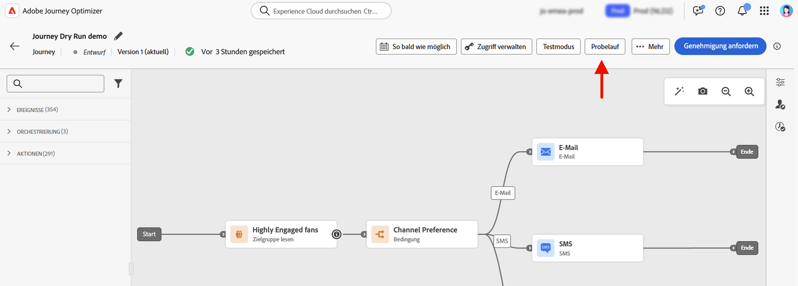
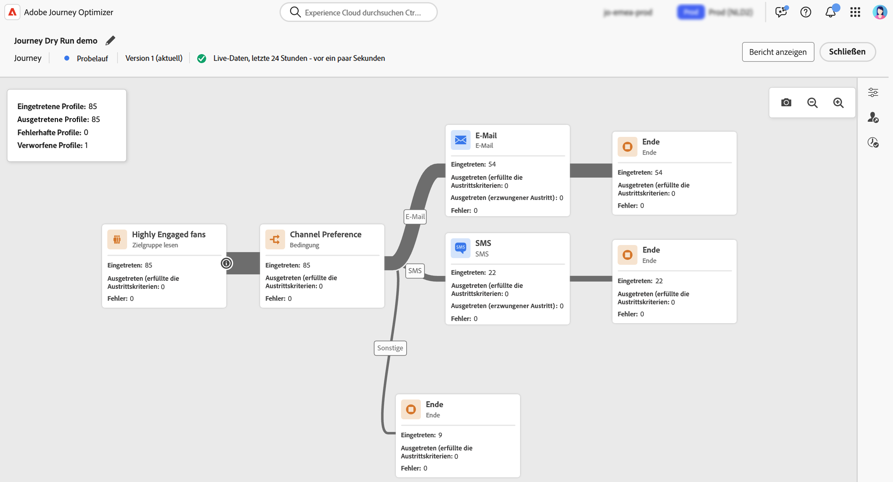
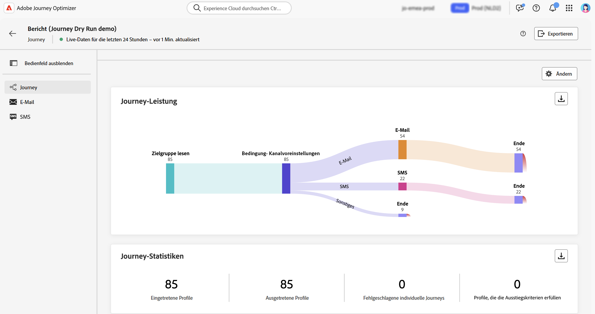

# Journey-Probelauf {#journey-dry-run}

>[!CONTEXTUALHELP]
>id="ajo_journey_dry_run"
>title="Probelauf-Modus"
>abstract="Diese Journey befindet sich im Probelauf. Der Journey-Probelauf ist ein spezieller Journey-Veröffentlichungsmodus in Adobe Journey Optimizer, der es Journey-Anwendenden ermöglicht, eine Journey mit echten Produktionsdaten zu testen, ohne echte Kundinnen und Kunden zu kontaktieren oder Profilinformationen zu aktualisieren.  Mit dieser Funktion können Journey-Anwendende Vertrauen in ihr Journey-Design und die Zielgruppenbestimmung gewinnen, bevor sie die Journey live veröffentlichen."

>[!CONTEXTUALHELP]
>id="ajo_journey_dry_run_start"
>title="Veröffentlichen einer Journey im Probelauf-Modus"
>abstract="Der Journey-Probelauf ist ein spezieller Journey-Veröffentlichungsmodus in Adobe Journey Optimizer, der es Journey-Anwendenden ermöglicht, eine Journey mit echten Produktionsdaten zu testen. Nachdem Sie Ihre Journey entworfen haben, führen Sie einen Probelauf aus, um deren Funktionalität zu bestätigen und sicherzustellen, dass die Schritte korrekt sind. In diesem Veröffentlichungsmodus können Sie eine Journey testen, ohne Mitteilungen an ein Profil zu senden."

Der Journey-Probelauf ist ein spezieller Journey-Veröffentlichungsmodus in Adobe Journey Optimizer, der es Journey-Anwendenden ermöglicht, eine Journey mit echten Produktionsdaten zu testen, ohne echte Kundinnen und Kunden zu kontaktieren oder Profilinformationen zu aktualisieren.  Mit dieser Funktion können Journey-Anwendende Vertrauen in ihr Journey-Design und die Zielgruppenbestimmung gewinnen, bevor sie die Journey live veröffentlichen.

>[!AVAILABILITY]
>
>Diese Funktion ist nur für ausgewählte Organisationen verfügbar (eingeschränkte Verfügbarkeit) und wird in einer zukünftigen Version global eingeführt.

## Wichtigste Vorteile {#journey-dry-run-benefits}

Ein Journey-Probelauf steigert das Vertrauen der Anwendenden und den Journey-Erfolg, indem er sicheres, datengesteuertes Testen von Kunden-Journeys mit echten Produktionsdaten ermöglicht – ohne das Risiko, Kundinnen und Kunden zu kontaktieren oder Profilinformationen zu ändern. Mit dieser Funktion können Journey-Anwendende die Reichweite ihrer Zielgruppe und die Verzweigungslogik vor der Live-Schaltung überprüfen und so sicherstellen, dass die Journeys ihren beabsichtigten Geschäftszielen entsprechen.

Mit dem Journey-Probelauf können Sie Probleme frühzeitig identifizieren, Zielgruppenbestimmungsstrategien optimieren und das Journey-Design basierend auf tatsächlichen Daten – und nicht auf Annahmen – verbessern. Der Probelauf ist direkt in die Journey-Arbeitsfläche integriert und bietet intuitives Reporting und Sichtbarkeit wichtiger Key Performance Indicators, sodass Teams sicher iterieren und Genehmigungs-Workflows optimieren können. Dies erhöht die betriebliche Effizienz, verringert das Launch-Risiko und steigert die Kundeninteraktion.

Letztendlich verbessert diese Funktion Time-to-Value und reduziert Journey-Fehler.

Der Journey-Probelauf bietet:

1. **Sichere Testumgebung**: Profile im Probelaufmodus werden nicht kontaktiert, sodass kein Risiko besteht, dass Nachrichten gesendet werden oder Live-Daten beeinträchtigt werden.
1. **Zielgruppenerkenntnisse**: Journey-Anwendende können die Erreichbarkeit der Zielgruppe an verschiedenen Journey-Knoten vorhersagen, einschließlich Opt-outs, Ausschlüssen und anderer Bedingungen.
1. **Echtzeit-Feedback**: Metriken werden direkt auf der Journey-Arbeitsfläche angezeigt, ähnlich wie bei Live-Reporting, sodass Journey-Anwendende ihr Journey-Design optimieren können.

Während des Probelaufs wird die Journey mit den folgenden Besonderheiten ausgeführt:

* **Kanalaktion** Knoten wie E-Mail, SMS oder Push-Benachrichtigungen werden nicht ausgeführt
* **Benutzerdefinierte Aktionen** werden während des Probelaufs deaktiviert und ihre Antworten sind auf null festgelegt
* **Warteknoten** werden während des Probelaufs umgangen.
  <!--You can override the wait block timeouts, then if you have wait blocks duration longer than allowed dry run journey duration, then that branch will not execute completely.-->
* **Datenquellen** einschließlich externer Datenquellen, werden standardmäßig ausgeführt

>[!CAUTION]
>
>* Die Berechtigungen zum Starten des Probelaufs sind auf Benutzende mit der Berechtigung **[!DNL Publish journeys]** auf hoher Ebene beschränkt. Die Berechtigungen zum Stoppen des Probelaufs sind auf Benutzende mit der Berechtigung **[!DNL Manage journeys]** auf hoher Ebene beschränkt. Weitere Informationen zur Verwaltung der Zugriffsrechte für [!DNL Journey Optimizer]-Benutzende finden Sie in [diesem Abschnitt](../administration/permissions-overview.md).
>
>* Bevor Sie mit der Verwendung der Probelauffunktion beginnen, [lesen Sie die Informationen zu Leitlinien und Einschränkungen](#journey-dry-run-limitations).

## Starten eines Probelaufs {#journey-dry-run-start}

Die Probelauffunktion kann in jeder fehlerfreien Entwurfs-Journey verwendet werden.

Gehen Sie wie folgt vor, um einen Probelauf zu aktivieren:

1. Öffnen Sie die Journey, die getestet werden soll.
1. Klicken Sie auf **Schaltfläche „Probelauf**.

   

1. Bestätigen Sie die Veröffentlichung.

   Während des Übergangs wird die Statusmeldung **Probelauf wird aktiviert** angezeigt.

1. Nach der Aktivierung wechselt die Journey in den Modus **Probelauf**.

## Überwachen eines Probelaufs {#journey-dry-monitor}

Sobald die Veröffentlichung im Probelaufmodus gestartet wurde, können die Journey-Ausführung und der Fortschritt der Profile in den Journey-Verzweigungen und -Knoten visualisiert werden.

Metriken werden direkt auf der Journey-Arbeitsfläche angezeigt.

Für jede Aktivität können Sie in deren Aktivitätsfeld Folgendes aktivieren:

* **[!UICONTROL Eingetreten]**: Gesamtzahl der Personen, die an dieser Aktivität teilgenommen haben. Bei **Action**-Aktivitäten gibt diese Metrik an, dass Profile durchlaufen, da sie nicht im Trockenlaufmodus ausgeführt werden.
* **[!UICONTROL Ausgestiegen (erfüllte die Ausstiegskriterien)]**: Gesamtzahl der Kontakte, die aufgrund eines Ausstiegskriteriums die Journey aus dieser Aktivität verlassen haben.
* **[!UICONTROL Ausgestiegen (erzwungener Ausstieg)]**: Gesamtzahl der Kontakte, die die Journey verlassen haben, während sie aufgrund einer Konfiguration durch Anwendende pausiert war. Diese Metrik ist für Journeys im Probelaufmodus immer gleich null.
* **[!UICONTROL Fehler]**: Gesamtzahl der Kontakte, bei denen während dieser Aktivität ein Fehler aufgetreten ist.

Auf der Journey-Ebene im linken oberen Bereich der Arbeitsfläche können Sie Folgendes überprüfen:

* Die Gesamtzahl der **eingetretenen Profile**
* Die Gesamtzahl der **ausgestiegenen Profile**
* Die Gesamtzahl der **fehlerhaften Profile**
* Die Gesamtzahl der **verworfenen Profile** in der Journey

Für den Probelauf kann auch auf die Berichte der **letzten 24 Stunden** und der **gesamten Zeit** zugegriffen werden. Um auf diese Berichte zuzugreifen, klicken Sie auf die Schaltfläche **Bericht anzeigen** oben rechts auf der Journey-Arbeitsfläche.

>[!CAUTION]
>
> Reporting-Daten sind nur verfügbar, wenn der Probelauf **aktiv** ist.  Nach dem Stoppen sind die Reporting-Daten nicht mehr zugänglich. Verwenden Sie die Schaltfläche **Exportieren** oberhalb der Berichte, um sie bei Bedarf herunterzuladen.

## Stoppen eines Probelaufs {#journey-dry-run-stop}

Probelauf-Journeys **müssen** manuell gestoppt werden.

Klicken Sie auf die Schaltfläche **Schließen**, um den Test zu beenden, und dann zur Bestätigung auf **Zurück zum Entwurf**.

<!-- After 14 days, Dry run journeys automatically transition to the **Draft** status.-->

## Leitlinien und Einschränkungen {#journey-dry-run-limitations}

* Der Dry Run-Modus ist nicht für Journey verfügbar, die Reaktionsereignisse enthalten
* Profile im Dry-Run-Modus werden als kontaktierbare Profile gezählt
* Journey im Dry Run-Modus werden auf das Live Journey-Kontingent angerechnet
* Probelauf-Journey wirken sich nicht auf Geschäftsregeln aus
* Wenn beim Erstellen einer neuen Journey-Version eine vorherige Journey-Version **live** ist, ist die Probelauf-Aktivierung in der neuen Version nicht zulässig.
* Der Journey-Probelauf generiert stepEvents. Diese stepEvents haben eine bestimmte Markierung und eine Probelauf-ID:
   * `_experience.journeyOrchestration.stepEvents.inDryRun` gibt `true` zurück, wenn der Probelauf aktiviert ist und andernfalls `false`
   * `_experience.journeyOrchestration.stepEvents.dryRunID` gibt die ID einer Probelaufinstanz zurück

* Bei der Analyse von Journey-Reporting-Metriken mit dem Adobe Experience Platform-Abfrage-Service müssen Dry-Run-generierte Schrittereignisse ausgeschlossen werden. Setzen Sie dazu das `inDryRun`-Flag auf `false`.