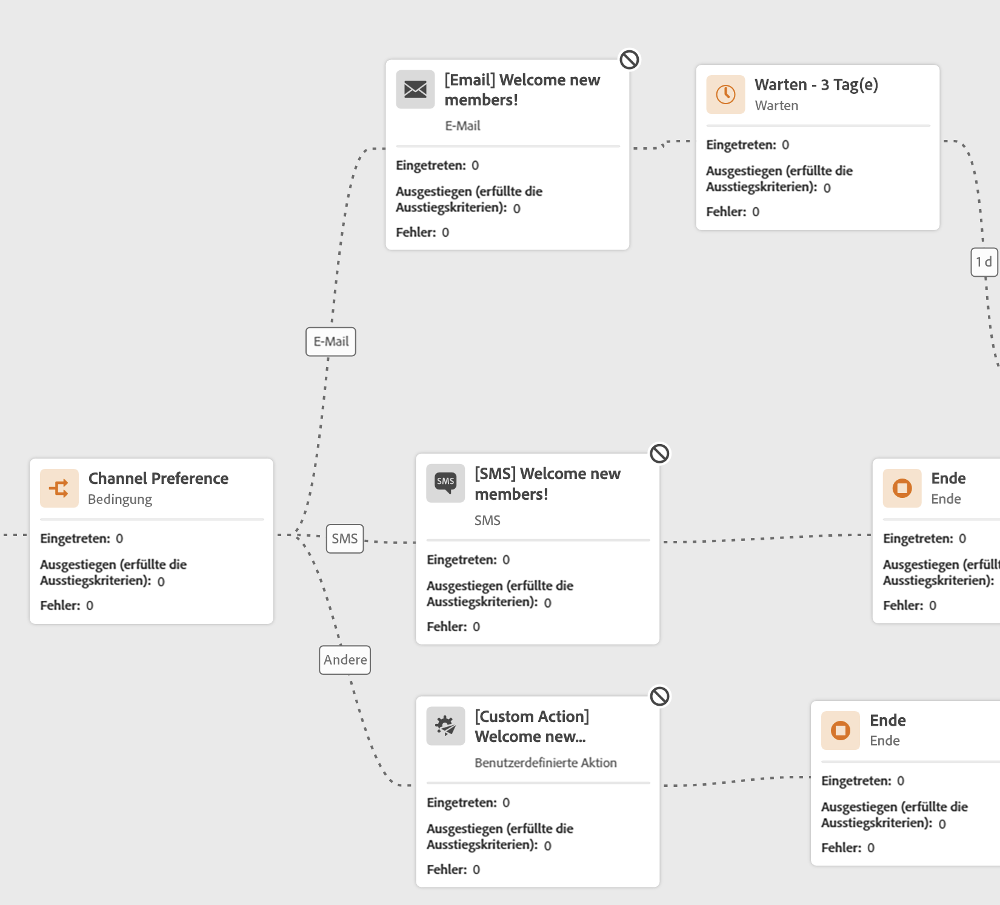
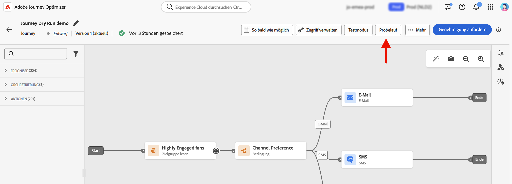
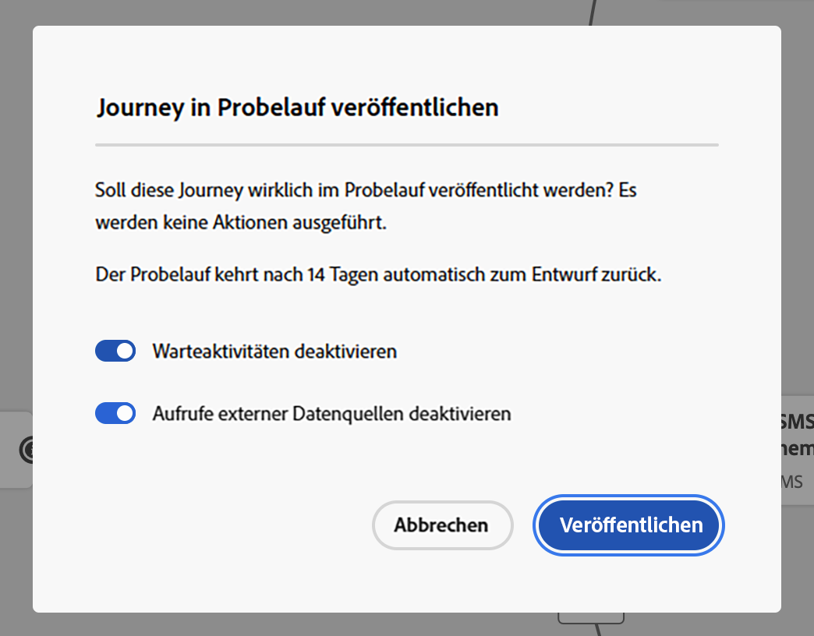
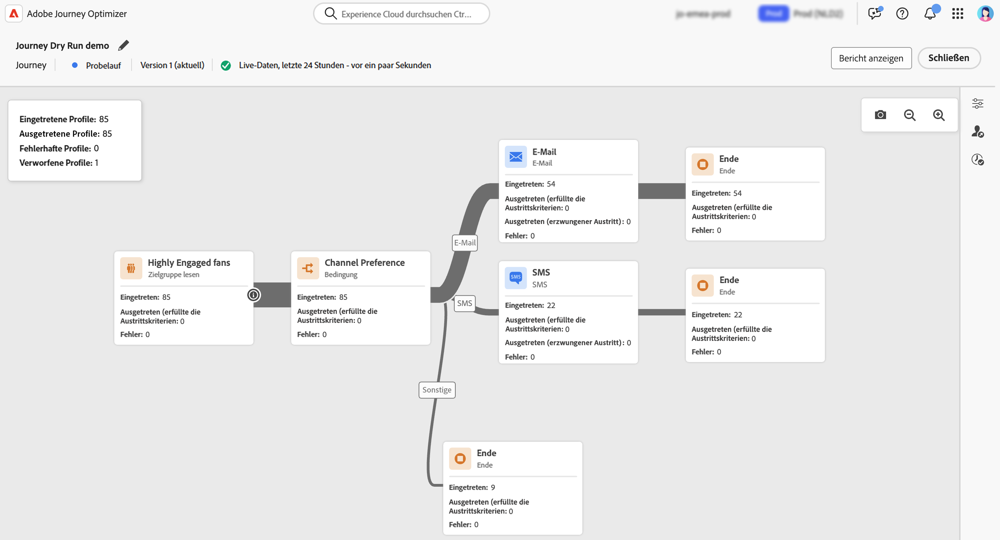
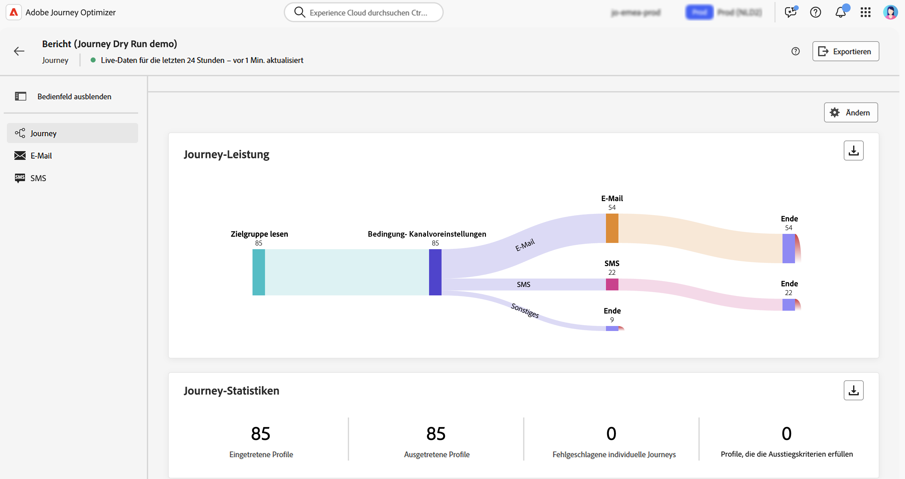
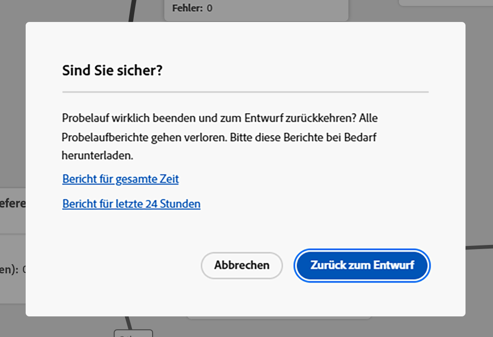
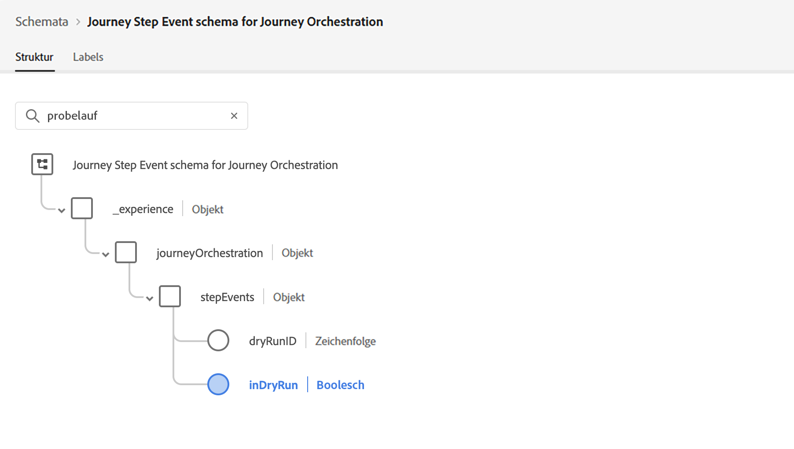

# Journey-Probelauf {#journey-dry-run}

>[!CONTEXTUALHELP]
>id="ajo_journey_dry_run"
>title="Probelauf-Modus"
>abstract="Diese Journey befindet sich im Probelauf. Der Journey-Probelauf ist ein spezieller Journey-Veröffentlichungsmodus in [!DNL Adobe Journey Optimizer], der es Journey-Nutzenden ermöglicht, eine Journey mit echten Produktionsdaten zu testen, ohne dabei echte Kundschaft zu kontaktieren oder Profilinformationen zu aktualisieren.  Mit dieser Funktion können Journey-Nutzende Vertrauen in ihr Journey-Design und das Zielgruppen-Targeting gewinnen, bevor sie Journeys live schalten."

>[!CONTEXTUALHELP]
>id="ajo_journey_dry_run_start"
>title="Veröffentlichen einer Journey im Probelauf-Modus"
>abstract="Der Journey-Probelauf ist ein spezieller Journey-Veröffentlichungsmodus in [!DNL Adobe Journey Optimizer], der es Journey-Nutzenden ermöglicht, eine Journey mit echten Produktionsdaten zu testen. Sobald eine Journey entworfen wurde, bestätigt ein Probelauf, dass sie funktioniert, und stellt sicher, dass die Schritte korrekt sind. In diesem Veröffentlichungsmodus kann eine Journey getestet werden, ohne Mitteilungen an ein Profil zu senden."

Der Journey-Probelauf ist ein spezieller Journey-Veröffentlichungsmodus in [!DNL Adobe Journey Optimizer], der es Journey-Nutzenden ermöglicht, eine Journey mit echten Produktionsdaten zu testen, ohne dabei echte Kundschaft zu kontaktieren oder Profilinformationen zu aktualisieren.  Mit dieser Funktion können Journey-Nutzende Vertrauen in ihr Journey-Design und das Zielgruppen-Targeting gewinnen, bevor sie Journeys live schalten.

➡️ [Weitere Informationen zum Probelauf für Journeys finden Sie in diesem Video](#dry-run-video)

## Wichtigste Vorteile {#journey-dry-run-benefits}

Ein Journey-Probelauf steigert das Vertrauen der Anwendenden und den Journey-Erfolg, indem er sicheres, datengesteuertes Testen von Kunden-Journeys mit echten Produktionsdaten ermöglicht – ohne das Risiko, Kundinnen und Kunden zu kontaktieren oder Profilinformationen zu ändern. Mit dieser Funktion können Journey-Anwendende die Reichweite ihrer Zielgruppe und die Verzweigungslogik vor der Live-Schaltung überprüfen und so sicherstellen, dass die Journeys ihren beabsichtigten Geschäftszielen entsprechen.

Mit dem Journey-Probelauf können Sie Probleme frühzeitig identifizieren, Zielgruppenbestimmungsstrategien optimieren und das Journey-Design basierend auf tatsächlichen Daten – und nicht auf Annahmen – verbessern. Der Probelauf ist direkt in die Journey-Arbeitsfläche integriert und bietet intuitives Reporting und Sichtbarkeit wichtiger Key Performance Indicators, sodass Teams sicher iterieren und Genehmigungs-Workflows optimieren können. Dies erhöht die betriebliche Effizienz, verringert das Launch-Risiko und steigert die Kundeninteraktion.

Letztendlich verbessert diese Funktion Time-to-Value und reduziert Journey-Fehler.

Der Journey-Probelauf bietet:

1. **Sichere Testumgebung**: Profile im Probelaufmodus werden nicht kontaktiert, sodass kein Risiko besteht, dass Nachrichten gesendet werden oder Live-Daten beeinträchtigt werden.
1. **Zielgruppenerkenntnisse**: Journey-Anwendende können die Erreichbarkeit der Zielgruppe an verschiedenen Journey-Knoten vorhersagen, einschließlich Opt-outs und Ausschlüssen, die auf den Journey-Bedingungen basieren.
1. **Echtzeit-Feedback**: Metriken werden direkt auf der Journey-Arbeitsfläche angezeigt, ähnlich wie bei Live-Reporting, sodass Journey-Anwendende ihr Journey-Design optimieren können.

## Ausführungslogik eines Probelaufs {#journey-dry-run-exec}

Während des Probelaufs wird die Journey im Simulationsmodus ausgeführt. Dabei werden die folgenden spezifischen Verhaltensweisen auf jede Journey-Aktivität angewendet, ohne dass echte Aktionen ausgelöst werden:

* **Kanalaktion**-Knoten wie E-Mail, SMS oder Push-Benachrichtigungen werden nicht ausgeführt.
* **Benutzerdefinierte Aktionen** sind während des Probelaufs deaktiviert und ihre Antworten sind auf null festgelegt.

  Zur besseren Lesbarkeit werden benutzerdefinierte Aktionen und Kanalaktivitäten während der Ausführung eines Probelaufs ausgegraut angezeigt.

  {width="80%"}

* **Datenquellen**, einschließlich externer Datenquellen, und Aktivitäten des Typs **Warten** sind während des Probelaufs standardmäßig deaktiviert. Sie können dieses Verhalten jedoch [bei der Aktivierung des Probelaufmodus](#journey-dry-run-start) ändern.

* **Reaktions**-Knoten werden nicht ausgeführt: Alle Profile, die diese erreichen, steigen erfolgreich aus. Es gelten jedoch die folgenden Prioritätsregeln:

   * Wenn ein **Reaktions**-Knoten mit einem oder mehreren Knoten vom Typ **unitäres Ereignis** parallel verwendet wird, durchlaufen die Profile immer das Reaktionsereignis.
   * Wenn ein **Reaktions**-Knoten parallel mit einem oder mehreren **Reaktionsereignis**-Knoten verwendet wird, durchlaufen die Profile immer den ersten (den obersten) Knoten auf der Arbeitsfläche.

>[!CAUTION]
>
>* Die Berechtigungen zum Starten eines Probelaufs sind auf Benutzende mit der Berechtigung **[!DNL Publish journeys]** auf hoher Ebene beschränkt. Die Berechtigungen zum Stoppen des Probelaufs sind auf Benutzende mit der Berechtigung **[!DNL Manage journeys]** auf hoher Ebene beschränkt. Weitere Informationen zur Verwaltung der Zugriffsrechte für [!DNL Journey Optimizer]-Benutzende finden Sie in [diesem Abschnitt](../administration/permissions-overview.md).
>
>* Bevor Sie mit der Verwendung der Probelauffunktion beginnen, [lesen Sie die Informationen zu Leitlinien und Einschränkungen](#journey-dry-run-limitations).

## Starten eines Probelaufs {#journey-dry-run-start}

Die Probelauffunktion kann in jeder fehlerfreien Entwurfs-Journey verwendet werden.

Gehen Sie wie folgt vor, um einen Probelauf zu aktivieren:

1. Öffnen Sie die Journey, die getestet werden soll.
1. Wählen Sie die Schaltfläche **[!UICONTROL Probelauf]** aus.

   

1. Wählen Sie dies aus, wenn Sie Aktivitäten des Typs **Warten** und Aufrufe von **externen Datenquellen** aktivieren oder deaktivieren möchten, und bestätigen Sie die Veröffentlichung des Probelaufs.

   {width="50%"}

   Während des Übergangs wird die Statusmeldung **[!UICONTROL Probelauf wird aktiviert]** angezeigt.

1. Nach der Aktivierung wechselt die Journey in den Modus **[!UICONTROL Probelauf]**.

## Überwachen eines Probelaufs {#journey-dry-monitor}

Sobald die Veröffentlichung im Probelaufmodus gestartet wurde, können die Journey-Ausführung und der Fortschritt der Profile in den Journey-Verzweigungen und -Knoten visualisiert werden.

Metriken werden direkt auf der Journey-Arbeitsfläche angezeigt. Weitere Informationen zu Journey-Live-Berichten und -Metriken finden Sie unter [Live-Bericht in der Journey-Arbeitsfläche](report-journey.md).

Für den Probelauf kann auch auf die Berichte der **letzten 24 Stunden** und der **gesamten Zeit** zugegriffen werden. Um auf diese Berichte zuzugreifen, klicken Sie auf die Schaltfläche **Bericht anzeigen** oben rechts auf der Journey-Arbeitsfläche.

>[!CAUTION]
>
> Reporting-Daten sind nur verfügbar, wenn der Probelauf **aktiv** ist.  Nach dem Stoppen sind die Reporting-Daten nicht mehr zugänglich. Verwenden Sie die Schaltfläche **Exportieren** oberhalb der Berichte, um sie bei Bedarf herunterzuladen.

## Stoppen eines Probelaufs {#journey-dry-run-stop}

Nach 14 Tagen wechseln Probelauf-Journeys automatisch in den Status **[!UICONTROL Entwurf]**.

Probelauf-Journeys können auch manuell gestoppt werden. Gehen Sie wie folgt vor, um den Probelaufmodus zu deaktivieren:

1. Öffnen Sie die Probelauf-Journey, die Sie stoppen möchten.
1. Klicken Sie auf **[!UICONTROL Schließen]**, um den Test zu beenden.
Links zu den letzten 24 Stunden und allen Zeitberichten sind im Bestätigungsbildschirm verfügbar.

   {width="50%"}

1. Klicken Sie zur Bestätigung auf **[!UICONTROL Zurück zum Entwurf]**.

## Leitlinien und Einschränkungen {#journey-dry-run-limitations}

* Profile im Dry-Run-Modus werden in Richtung [Engagierbare Profile“ &#x200B;](../audience/license-usage.md)
* Journeys im Probelaufmodus werden auf das Live-Journey-Kontingent angerechnet.
* Probelauf-Journeys wirken sich nicht auf Geschäftsregeln aus.
  <!--* When creating a new journey version, if a previous journey version is **Live**, then the Dry run activation is not allowed on the new version.-->
* **Sprung**-Aktionen sind in Probelauf nicht aktiviert.
Wenn eine Quell-Journey ein **Jump**-Ereignis an eine Zielversion Trigger, wäre dieses Sprungereignis nicht auf eine Dry-Run-Journey-Version anwendbar. Wenn sich beispielsweise die neueste Journey-Version in Probelauf befindet und die vorherige Version **Live**, ignoriert das Sprungereignis die Probelauf-Version und gilt nur für die **Live**-Version.

## Journey-Schrittereignisse und Probelauf {#journey-step-events}

Ein Journey-Probelauf generiert **stepEvents**. Diese stepEvents haben eine bestimmte Markierung und eine Probelauf-ID: `inDryRun` und `dryRunID`.

* `_experience.journeyOrchestration.stepEvents.inDryRun` gibt `true` zurück, wenn sich die Journey im Probelauf-Modus befindet, und `null` für Test- oder Live-Journey (Nicht-Probelauf).
* `_experience.journeyOrchestration.stepEvents.dryRunID` gibt die ID der Probelauf-Instanz zurück, wenn sie sich im Probelauf-Modus befindet. Für Test- oder Live-Journey ist sie `null`.

Wenn Sie stepEvent-Daten in **externe Systeme** exportieren, können Sie Ausführungen von Probeläufen mit der Markierung `inDryRun` filtern.

Bei der Analyse von **Journey** Berichtsmetriken mithilfe [!DNL Adobe Experience Platform] Abfrage-Service müssen von Probelauf generierte Schrittereignisse ausgeschlossen werden. Schließen Sie dazu Schrittereignisse aus, bei denen `inDryRun` `true` ist (d. h. schließen Sie nur Ereignisse ein, bei denen `inDryRun` `null` oder `false` ist).

## Anleitungsvideo {#dry-run-video}

In diesem Video erfahren Sie, wie Sie einen Probelauf für Ihre Journeys ausführen.

>[!VIDEO](https://video.tv.adobe.com/v/3464691/?captions=ger&learn=on&enablevpops)
