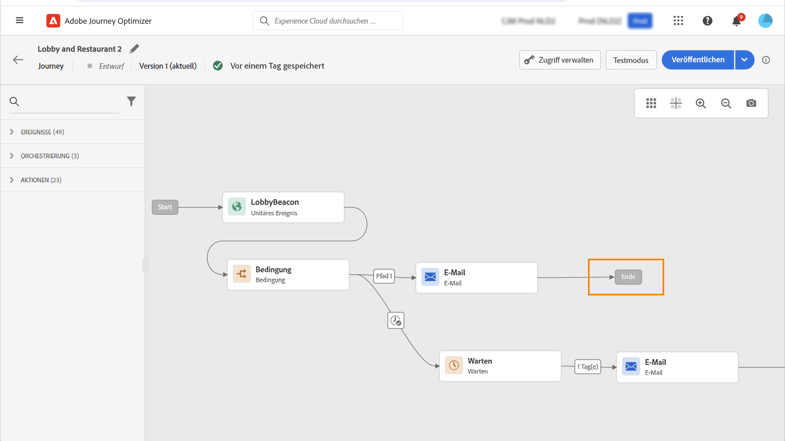

# Lebenszyklus einer Journey{#journey-lifecyle}

## Profile in Journey{#profile-journey}

In einer einheitlichen Journey:

* Wenn der erneute Eintritt aktiviert ist, kann ein Profil mehrmals eine Journey eingeben, dies aber erst tun, wenn er die vorherige Instanz der Journey vollständig verlassen hat.

* Wenn der erneute Eintritt deaktiviert ist, kann ein Profil nicht mehrmals dieselbe Journey eingeben

Weiterführende Informationen zum Wiedereintritt von Profilen finden Sie in diesem Abschnitt [Abschnitt](../building-journeys/journey-gs.md#change-properties).

In einer Journey zum Lesen von Segmenten:

* Für nicht wiederkehrende Journey: das Profil wird nur einmal und nur einmal durch die Journey aufgerufen.
* für wiederkehrende Journey: das Profil gibt bei jeder Wiederholung die Journey ein, wenn es sich im Segment-/Erwartungsstatus befindet. Wenn er noch von einer vorherigen Wiederholung auf der Journey war, wird er sie von Anfang an neu starten.

Bei Geschäftsereignissen beginnen Journey mit einem Lesesegment :

Da diese Journey auf dem Empfang eines Geschäftsereignisses basiert, wird, wenn das Profil im erwarteten Segment qualifiziert ist, für jedes empfangene Geschäftsereignis die Journey angegeben. Dies bedeutet, dass dieses Profil mehrere Male in derselben Journey, aber gleichzeitig im Kontext verschiedener Geschäftsereignisse sein kann.

## Journey end{#journey-ending}

Eine Journey kann für eine Person auf zwei Weisen enden:

* Die Person kommt bei der letzten Aktivität eines Pfades an.
* Die Person kommt bei einer **Bedingungs**-Aktivität (oder einer **Warte**-Aktivität mit einer Bedingung) an und erfüllt keine der Bedingungen.

Die Person kann dann wieder in die Journey eintreten, wenn der erneute Zutritt erlaubt ist. Weitere Informationen finden Sie auf [dieser Seite](../building-journeys/journey-gs.md#change-properties)

Um eine Live-Journey zu beenden, empfehlen wir, sie zu schließen. Der Eintritt neuer Kunden in die Journey wird dann blockiert. Kunden, die bereits in die Journey eingetreten sind, können es bis zum Ende erleben. Weiterführende Informationen finden Sie in diesem [Abschnitt](../building-journeys/journey-end.md#close-journey)

Sie können eine Journey nur stoppen, wenn ein Notfall aufgetreten ist und die gesamte Verarbeitung sofort auf einer Journey beendet werden muss. Personen, die bereits an einer Journey teilgenommen haben, sind alle in ihrem Fortschritt angehalten. Weiterführende Informationen finden Sie in diesem [Abschnitt](../building-journeys/journey-end.md#stop-journey)

>[!NOTE]
>
>Beachten Sie, dass Sie eine geschlossene oder gestoppte Journey nicht fortsetzen können.

### Journey-End-Tag{#end-tag}

Beim Erstellen einer Journey wird am Ende jedes Pfads ein &quot;end-Tag&quot;angezeigt. Dieser Knoten kann nicht von einem Benutzer hinzugefügt werden, kann nicht entfernt werden und nur die Bezeichnung kann geändert werden. Es markiert das Ende jedes Pfads der Journey. Wenn die Journey mehrere Pfade hat, empfehlen wir, jedem Ende einen Titel hinzuzufügen, damit Berichte leichter lesbar sind. Weitere Informationen finden Sie auf [dieser Seite](../reports/live-report.md).

<!--

### End activity{#journey-end-activity}

The **[!UICONTROL End]** activity allows you to mark the end of each path of the journey. It is not mandatory but recommended for visual clarity. See [this page](../building-journeys/end-activity.md)

-->

### Schließen einer Journey{#close-journey}

Eine Journey kann aus den folgenden Gründen geschlossen werden:

* Die Journey wird manuell über die Schaltfläche **[!UICONTROL Für neue Eintritte schließen]** geschlossen.
* Eine segmentbasierte Journey zur einmaligen Ausführung wurde abgeschlossen.
* Nach dem letzten Vorkommen einer wiederkehrenden segmentbasierten Journey.

Durch manuelles Schließen einer Journey wird sichergestellt, dass bereits eingegebene Kunden ihren Pfad beenden können, neue Benutzer jedoch nicht in der Lage sind, in die Journey einzutreten. Wenn eine Journey geschlossen wird (aus einem der oben genannten Gründe), weist sie den Status **[!UICONTROL Geschlossen]** auf. Die Journey stoppt den Eintritt neuer Personen. Personen, die sich bereits in der Journey befinden, können die Journey wie gewohnt beenden. Nach der standardmäßigen globalen maximalen Wartezeit von 30 Tagen wechselt die Journey zum Status **Beendet**. Weitere Informationen finden Sie in diesem [Abschnitt](../building-journeys/journey-gs.md#global_timeout).

Eine geschlossene Journey-Version kann weder neu gestartet noch gelöscht werden. Stattdessen können Sie eine neue Version davon erstellen oder sie duplizieren. Nur abgeschlossene Journeys können gelöscht werden.

Um eine Journey in der Liste der Journeys zu schließen, klicken Sie auf den Button mit den **[!UICONTROL Auslassungszeichen]** rechts neben dem Journey-Namen und wählen Sie **[!UICONTROL Für neue Eintritte schließen]** aus.

Alternativ können Sie auch folgendermaßen vorgehen:

1. Wählen Sie in der Liste **[!UICONTROL Journeys]** die Journey aus, die Sie schließen möchten.
1. Klicken Sie oben rechts auf den Abwärtspfeil.

   

1. Klicken Sie auf **[!UICONTROL Für neue Eintritte schließen]** und bestätigen Sie diese Auswahl im Dialogfeld.

### Stoppen einer Journey{#stop-journey}

Falls Sie den Fortschritt aller Personen in der Journey stoppen müssen, können Sie das tun. In diesem Fall entsteht für alle Personen in der Journey eine Zeitüberschreitung. Das Stoppen einer Journey bedeutet jedoch, dass alle Personen, die bereits an einer Journey teilgenommen haben, in ihrem Verlauf angehalten werden. Die Journey wird praktisch deaktiviert. Wenn Sie ein Journey beenden möchten, empfehlen wir Ihnen, es zu schließen.

Eine gestoppte Journey-Version kann nicht nochmals gestartet werden.

Beim Stoppen wird der Journey-Status auf **[!UICONTROL Gestoppt]** gesetzt.

Sie können beispielsweise eine Journey stoppen, wenn ein Marketer erkennt, dass die Journey die falsche Zielgruppe anspricht, oder wenn eine benutzerdefinierte Aktion, mit der Nachrichten gesendet werden sollen, nicht ordnungsgemäß funktioniert. Um eine Journey aus der Liste der Journeys zu entfernen, klicken Sie auf den Button mit den **[!UICONTROL Auslassungszeichen]** rechts neben dem Journey-Namen und wählen Sie **[!UICONTROL Stoppen]** aus.

Alternativ können Sie auch folgendermaßen vorgehen:

1. Wählen Sie in der Liste **[!UICONTROL Journeys]** die Journey aus, die Sie stoppen möchten.
1. Klicken Sie oben rechts auf den Abwärtspfeil.
   
1. Klicken Sie auf **[!UICONTROL Stoppen]** und bestätigen Sie diese Auswahl im Dialogfeld.
