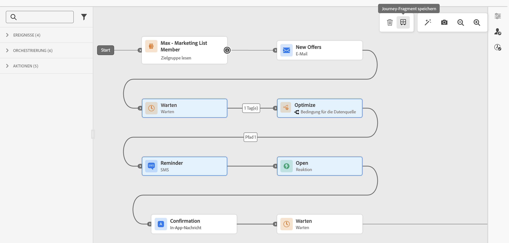
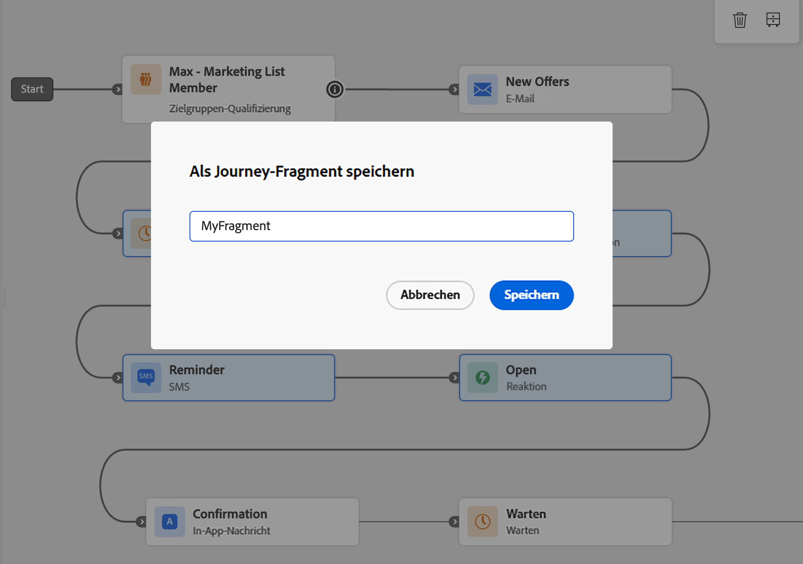
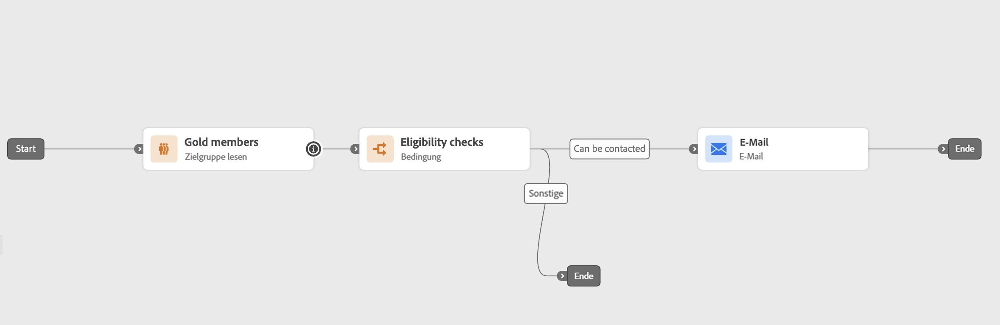
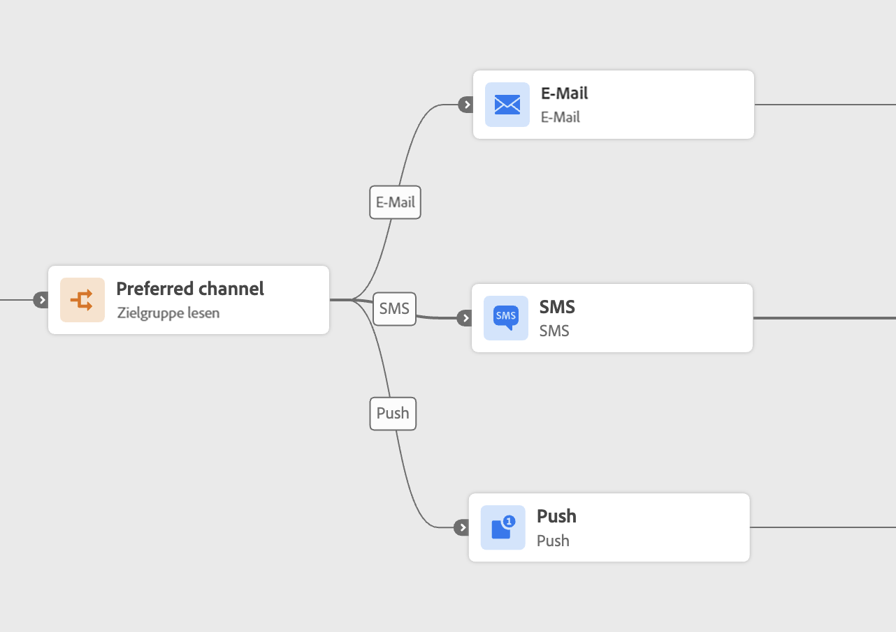
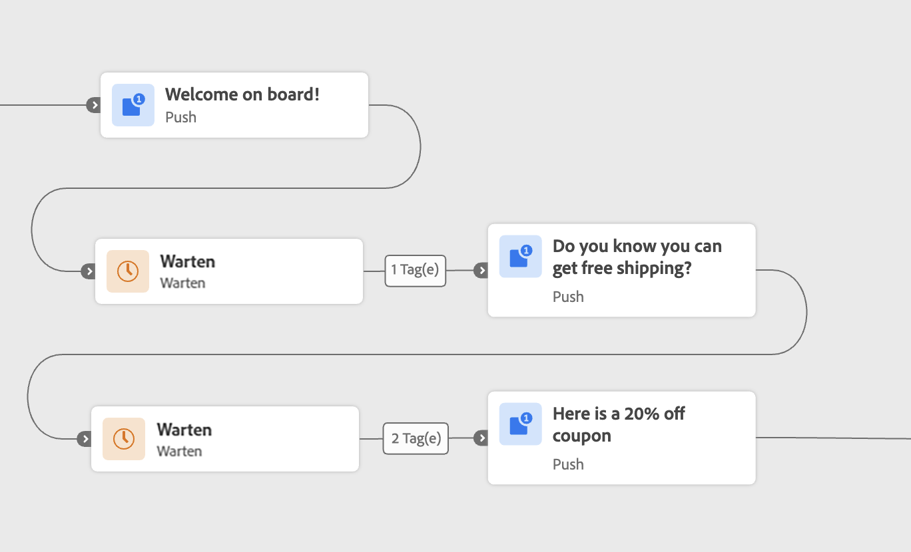
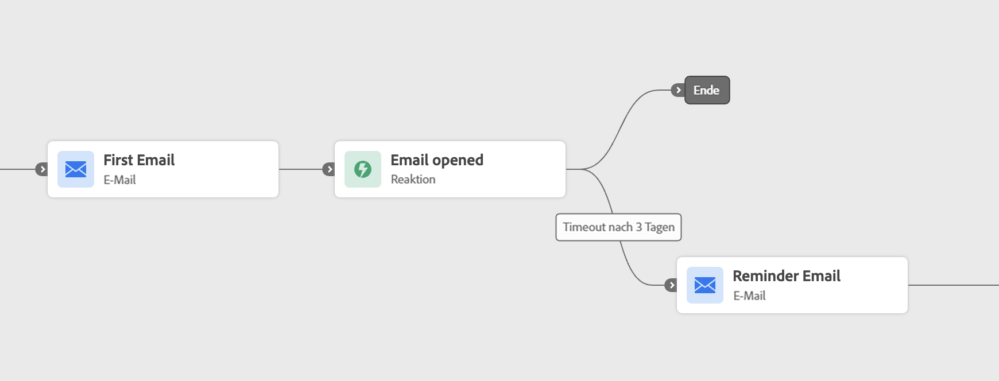

# Journey Fragments {#journey-fragments}

Journey-Fragmente sind wiederverwendbare Sets von Journey-Knoten, die Sie einmal erstellen und in einer beliebigen Journey in Ihrer Sandbox ablegen können. Unabhängig davon, ob es sich um eine Eignungsprüfung, eine bevorzugte Kanal-Routing-Logik oder eine Begrüßungssequenz handelt, helfen Fragmente Teams dabei, schneller und konsistent zu arbeiten - ohne jedes Mal dieselbe Logik von Grund auf neu zu erstellen. [Siehe Beispiele für Anwendungsfälle.](#examples)

Nach der Erstellung werden Fragmente in einem dedizierten **[!UICONTROL Fragmentinventar)]** können mithilfe der Aktivität **[!UICONTROL Journey-Fragmente&rbrace; in]** Journey eingefügt werden.

>[!NOTE]
>Journey-Fragmente verwenden ein **Kopierverhalten**: Durch Einfügen eines Fragments in einen Journey wird eine statische Kopie der Originalknoten erstellt. Alle am Originalfragment vorgenommenen Aktualisierungen werden nicht in den Journey übernommen, die es bereits verwendet haben.

## Berechtigungen {#journey-fragments-permissions}

Um mit Journey-Fragmenten zu arbeiten, benötigen Sie die folgenden [Berechtigungen](../administration/permissions.md):

* **Journey verwalten** - zum Erstellen, Bearbeiten und Löschen von Fragmenten erforderlich.
* **Journey** veröffentlichen - zum Aktivieren eines Fragments erforderlich.

## Zugriff auf das Fragmentinventar {#journey-fragments-inventory}

Journey-Fragmente sind über den Abschnitt **[!UICONTROL Journey]** zugänglich. Öffnen Sie die **[!UICONTROL Fragmente]**, um alle verfügbaren Fragmente in Ihrer Sandbox zu durchsuchen.

Sie können die Liste nach Fragmentname, Status, Erstellungsdatum, Ersteller, Datum der letzten Änderung oder Tag filtern.

## Erstellen eines Journey-Fragments {#create-journey-fragment}

>[!CONTEXTUALHELP]
>id="ajo_journey_fragment_create_canvas"
>title="Speichern als Journey-Fragment"
>abstract="Vor dem Speichern wird ein eindeutiger Fragmentname eingegeben. Die ausgewählten Knoten werden als wiederverwendbares Fragment gespeichert, das im Fragmentinventar verfügbar ist."

Sie können ein Journey-Fragment auf zwei Arten erstellen: direkt über die Journey-Arbeitsfläche (empfohlen) oder über das Fragmentinventar.

>[!BEGINTABS]

>[!TAB Von der Journey-Arbeitsfläche]

So speichern Sie Journey-Knoten direkt auf der Journey-Arbeitsfläche als Fragment:

1. Öffnen Sie eine Journey und wählen Sie einen oder mehrere verbundene Knoten auf der Arbeitsfläche aus.
1. Klicken Sie auf **[!UICONTROL Symbolleiste auf]** Als Fragment speichern“.

   

1. Geben Sie einen eindeutigen Namen für das Fragment in Ihrer Sandbox ein.

   

1. Klicken Sie auf **[!UICONTROL Speichern]**. Das Fragment wird als Entwurf gespeichert.

>[!TIP]
>
>Wenn Sie ein Fragment von einer Journey erstellen, testen [&#x200B; (testen oder simulieren](testing-the-journey.md) **Sie** Fragment, um sicherzustellen, dass sich die ausgewählten Knoten wie erwartet verhalten.

>[!TAB Aus dem Fragmentinventar]

So erstellen Sie ein Fragment direkt aus dem Inventar:

1. Navigieren Sie zur Registerkarte **[!UICONTROL Journey]** > **[!UICONTROL Journey-Fragmente]**.
1. Klicken Sie **[!UICONTROL Journey-Fragment erstellen]**.
1. Fügen Sie auf der Arbeitsfläche für die Fragmentbearbeitung Journey-Aktivitäten hinzu und konfigurieren Sie diese.
1. Klicken Sie abschließend auf **[!UICONTROL Speichern]**, um das Fragment als Entwurf zu speichern.

>[!CAUTION]
>
>Testmodus und Simulation sind im Fragment-Editor nicht verfügbar. Das bedeutet, dass Sie das Verhalten der konfigurierten Aktivitäten nicht überprüfen können, bevor das Fragment aktiviert und in eine Journey eingefügt wurde. Bei Fragmenten, bei denen die Logikgenauigkeit entscheidend ist, sollten Sie [Erstellen und Testen oder Simulieren der Knoten auf einer vollständigen Journey](testing-the-journey.md) zuerst und dann über die Registerkarte „Arbeitsfläche“ oben als Fragment speichern.

>[!ENDTABS]

## Bearbeiten eines Fragments {#edit-journey-fragment}

>[!CONTEXTUALHELP]
>id="ajo_journey_fragment_properties"
>title="Journey-Fragmenteigenschaften"
>abstract="Wenn Sie ein Fragment aus dem Inventar öffnen, können dessen Knoten, Eigenschaften, Tags oder Beschriftungen geändert werden. Aktive Fragmente müssen deaktiviert werden, bevor sie bearbeitet werden können."

Um ein Fragment zu bearbeiten, öffnen Sie es über das **[!UICONTROL Fragmentinventar]** indem Sie auf seinen Namen klicken. In der Benutzeroberfläche zum Erstellen von Fragmenten haben Sie folgende Möglichkeiten:

* Aktivitäten hinzufügen, entfernen oder ändern.
* Festlegen oder Aktualisieren von Fragmenteigenschaften: Name, Tags und Beschriftungen.

>[!NOTE]
>
>* Nur **[!UICONTROL Entwurf]**-Fragmente können bearbeitet werden. Um ein **[!UICONTROL Aktives]** Fragment zu ändern, deaktivieren Sie es zunächst.
>
>* Testmodus und Simulation sind im Fragment-Editor nicht verfügbar. Testen oder simulieren Sie eine beliebige Logik auf Journey-Ebene auf der vollständigen Journey, bevor Sie Knoten als Fragment speichern.
>
>* [Sprung](jump.md)-Aktivitäten sind innerhalb eines Fragments nicht zulässig.

## Fragmente verwalten {#manage-journey-fragments}

### Fragmentstatus {#fragment-statuses}

Das Journey von Fragmenten folgt einem Lebenszyklus mit folgenden Status:

| Status | Beschreibung |
|---|---|
| **[!UICONTROL Entwurf]** | Das Fragment wird gerade erstellt und ist noch nicht für die Verwendung in Journey verfügbar. |
| **[!UICONTROL aktiv]** | Das Fragment kann nun in Journey verwendet werden. |
| **[!UICONTROL Archiviert]** | Das Fragment wurde archiviert und ist nicht mehr für die Verwendung in Journey verfügbar. |

Die folgenden Regeln gelten für Fragmentstatusübergänge:

* Nur **[!UICONTROL Entwurf]**-Fragmente können aktiviert werden. Öffnen Sie ein Entwurfsfragment und verwenden Sie das Symbol **[!UICONTROL Aktivieren]** .
* Nur **[!UICONTROL Aktive]** Fragmente können deaktiviert oder archiviert werden.
* Nur **[!UICONTROL archivierte]** Fragmente können archiviert werden. Wenn Sie die Archivierung eines Fragments aufheben, wird es wieder in **[!UICONTROL Status „Entwurf]** versetzt.
* Nur **[!UICONTROL Entwurf]**-Fragmente können gelöscht werden.

>[!NOTE]
>Beim Aktivieren eines Fragments werden die meisten der Validierungsprüfungen angewendet, die beim Journey der Veröffentlichung ausgeführt werden. Allerdings werden **kontextuelle Attribute nicht validiert** und **Governance-Richtlinien werden** Aktivierungszeitpunkt nicht erzwungen). Beide werden ausgewertet, wenn das Fragment eingefügt und auf einer Journey verwendet wird.

### Fragmentaktionen {#fragment-actions}

Aus dem Fragmentinventar können Sie die folgenden Aktionen für ein Fragment ausführen:

* **[!UICONTROL Öffnen]**: Bearbeiten Sie das Fragment, indem Sie auf seinen Namen klicken.
* **[!UICONTROL Duplizieren]**: Erstellen Sie eine Kopie des Fragments über **[!UICONTROL Mehr Aktionen]** (…) Symbol.
* **[!UICONTROL Archivieren]**: Archivieren Sie ein Fragment (nur für **[!UICONTROL Aktive]** Fragmente verfügbar) über die **[!UICONTROL Mehr Aktionen]** (…) Symbol. Archivierte Fragmente sind nicht mehr in der Fragmentauswahl verfügbar.
* **[!UICONTROL Archivierung aufheben]**: Wiederherstellen eines archivierten Fragments (nur für **[!UICONTROL archivierte]** Fragmente verfügbar) über die **[!UICONTROL Mehr Aktionen]** (…) Symbol. Das Fragment kehrt zum Status **[!UICONTROL Entwurf]** zurück.
* **[!UICONTROL Löschen]**: Fragment dauerhaft aus der **[!UICONTROL Mehr Aktionen]** (…) löschen (nur für **[!UICONTROL Entwurf]** Fragmente) Symbol.
* **[!UICONTROL Tags bearbeiten]**: Hinzufügen oder Entfernen von Tags eines Fragments über **[!UICONTROL Weitere Aktionen]** (…) Symbol.

## Verwenden eines Fragments in einer Journey {#use-journey-fragment}

>[!CONTEXTUALHELP]
>id="ajo_journey_fragment_add"
>title="Hinzufügen eines Journey-Fragments"
>abstract="Nur **[!UICONTROL aktive]** Fragmente sind in der Auswahl verfügbar. Durch Einfügen eines Fragments wird eine **statische Kopie** seiner Knoten erstellt – Aktualisierungen des Originalfragments werden in der Journey nicht widergespiegelt."

So fügen Sie ein Fragment in eine Journey ein:

1. Öffnen Sie Ihren Journey und ziehen Sie die Aktivität **[!UICONTROL Journey-]** aus der linken Leiste.
1. Ablegen in einer bestehenden Verzweigung oder auf einer leeren Arbeitsfläche. Eine Fragmentauswahl wird angezeigt.
1. Suchen Sie nach dem Fragment, das Sie verwenden möchten. Sie können ein Fragment in der Vorschau anzeigen oder es auf einer anderen Registerkarte öffnen, bevor Sie es einfügen.
1. Wählen Sie das Fragment aus. Seine Knoten werden am Ablagepunkt in die Arbeitsfläche kopiert.

>[!NOTE]
>Nur **[!UICONTROL aktive]** Fragmente sind in der Auswahl verfügbar. Durch Einfügen eines Fragments wird eine **statische Kopie** seiner Knoten erstellt – nachfolgende Aktualisierungen des Originalfragments werden in der Journey nicht widergespiegelt.
>
>Wenn Sie ein Fragment auf eine leere Arbeitsfläche ablegen, muss das Fragment mit einem **[!UICONTROL Zielgruppe lesen]**, **[!UICONTROL Zielgruppen-Qualifizierung]** oder **[!UICONTROL Ereignis]**-Knoten beginnen (dieselbe Regel wie beim Starten einer Journey).

## Leitlinien und Einschränkungen {#guardrails}

Die folgenden Leitplanken gelten für Journey-Fragmente:

**Fragmenterstellung**

* Fragmentnamen müssen **pro Sandbox eindeutig** sein.
* Ein Fragment kann nur **einen Einstiegspfad** haben. Auswahlen mit mehr als einem Einstiegspunkt können nicht als Fragment gespeichert werden.
* Nur **verbundene Knoten** können zusammen als Fragment gespeichert werden.
* Ein Fragment **darf keine &quot;[&quot;-](jump.md) enthalten**.
* Ein Fragment kann (**20 Knoten)**.
* Eine Sandbox kann **(maximal 200 aktive Fragmente)**.

**Verwendung von Fragmenten**

* Nur **[!UICONTROL Active]**-Fragmente können in eine Journey eingefügt werden.
* Durch Einfügen eines Fragments wird eine **statische Kopie** seiner Knoten erstellt. Aktualisierungen des Originalfragments werden nicht an Journey weitergegeben, wo es verwendet wurde.
* Ein Fragment kann in einem vorhandenen Zweig oder auf einer leeren Arbeitsfläche abgelegt werden. Wenn das Fragment auf einer leeren Arbeitsfläche abgelegt wird, muss es mit einem Knoten **[!UICONTROL Zielgruppe lesen]**, **[!UICONTROL Zielgruppen-]** oder **[!UICONTROL Ereignis]** beginnen.

**Allgemein**

* Fragmente finden Sie in der Leiste [Einheitliche Suche](../start/search-filter-categorize.md) unter der Kategorie **[!UICONTROL Journey-Fragmente]**.
* [Tags](tags.md) und **Labels** werden für Fragmente unterstützt.
* [Audit-](../privacy/audit-logs.md)) werden unterstützt.
* Journey, die auf dem alten Stack (unter Verwendung von Inline-Kampagnen) ausgeführt werden, unterstützen keine Journey-Fragmente. Duplizieren Sie eine solche Journey, um sie auf den neuen Stapel zu verschieben, bevor Sie diese Funktion verwenden.
* Journey-Fragmente unterstützen [Sandbox-](../configuration/copy-objects-to-sandbox.md). Fragmente können gepackt und in eine andere Sandbox exportiert werden.

## Beispiele für Anwendungsfälle {#examples}

Die folgenden Beispiele veranschaulichen gängige Journey-Muster, die als Journey-Fragmente gespeichert und wiederverwendet werden können.

**Eignungsprüfungen**

Ein standardmäßiges Eintragsmuster, z. B. ein Knoten [Zielgruppe lesen](read-audience.md) gefolgt von Eignungsfiltern, kann in ein Fragment eingekapselt werden. Auf diese Weise können Teams die Konsistenz bei der Eingabe von Profilen in Journey gewährleisten und gleichzeitig die Einrichtungszeit verkürzen. Das Fragment kann nur die Aktivität [Optimieren](optimize.md) oder die Aktivität „Zielgruppe lesen“ und „Optimieren“ zusammen sein.

**Bevorzugter Kanal**

Ein Fragment kann den bevorzugten Kommunikationskanal eines Profils - E-Mail, Push oder SMS - auswerten und das Profil entsprechend weiterleiten. Diese Logik kann auf jeder Journey wiederverwendet werden, die ausgehende Nachrichten beinhaltet, wodurch eine konsistente Verwaltung der Kanalpräferenzen gewährleistet ist. Das Fragment kann die Aktivität [Optimieren](optimize.md) und alle drei Kanalzweige enthalten.

**Onboarding-Begrüßungssequenz**

Eine zeitgesteuerte Willkommenssequenz - z. B. eine Reihe von drei Nachrichten, mit denen ein Produkt oder ein Service vorgestellt wird - kann als Fragment gespeichert werden. Dies ist nützlich für das Onboarding neuer Benutzer über verschiedene Zielgruppensegmente oder Produktlinien hinweg. Das Fragment kann die Aktivitäten [Warten](wait-activity.md) und die Nachrichtenknoten enthalten.

**Reaktionsbasierte Wartezeit und Erinnerung**

Ein Fragment kann eine E-Mail -Aktivität gefolgt von einer [Reaktion](reaction-events.md) einkapseln, darauf warten, dass das Profil die E-Mail innerhalb einer bestimmten Anzahl von Tagen öffnet, und eine Erinnerung senden, wenn dies nicht der Fall war. Diese Logik wird häufig in der Pflege von Journey und im Versuch der Konversionsflüsse wiederverwendet. Das Fragment kann die E-Mail- und Reaktionsaktivitäten enthalten.

## Häufig gestellte Fragen {#faq}

**Wie unterscheidet sich ein Journey-Fragment von einem Fragment (Inhaltsfragment)?**

**Journey-Fragmente** sind wiederverwendbare Sets von Journey-Knoten - wie z. B. Eignungsprüfungen oder Kanalrouting-Logik -, die Sie mit der Aktivität **[!UICONTROL Journey-Fragmente]** in eine Journey einfügen. **[Fragmente](../content-management/fragments.md)** sind wiederverwendbare Inhaltskomponenten (z. B. Kopf- oder Fußzeilen), die in E-Mails in Kampagnen und Journey verwendet werden. Kurz gesagt: Journey-Fragmente sind wiederverwendbar ** Logik), während Inhaltsfragmente wiederverwendbare *Inhalte* sind.

**Wie unterscheidet sich ein Journey-Fragment von einem AEM-Inhaltsfragment?**

**[AEM-Inhaltsfragmente](../integrations/aem-fragments.md)** sind Inhalte, die in Adobe Experience Manager verfasst und in [!DNL Journey Optimizer] wiederverwendet werden. Sie sind keine Journey-Logik. Journey-Fragmente dagegen werden in [!DNL Journey Optimizer] erstellt und gespeichert und stellen Sets von verbundenen Journey-Knoten dar.

**Wenn ich ein Journey-Fragment aktualisiere, werden auch bestehende Journey aktualisiert?**

Nein. Journey-Fragmente verwenden ein **Kopierverhalten**: Durch Einfügen eines Fragments wird eine statische Kopie seiner Knoten erstellt. Alle am Originalfragment vorgenommenen Aktualisierungen werden nicht in den Journey übernommen, die es bereits verwendet haben.
