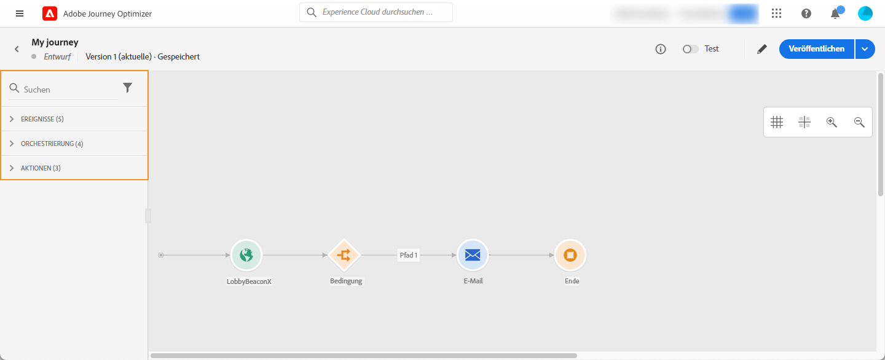
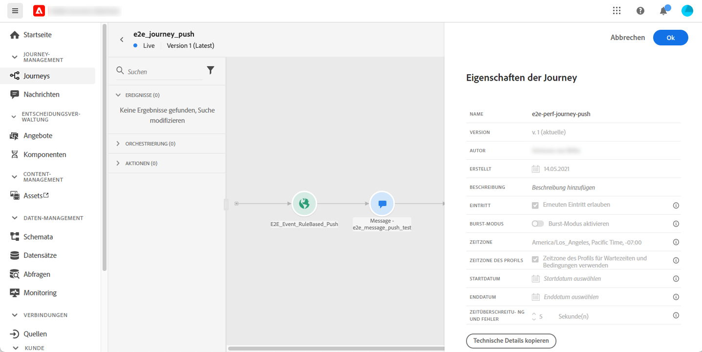
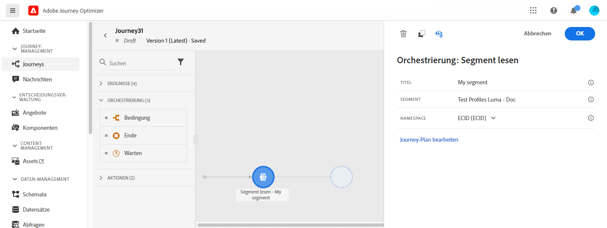
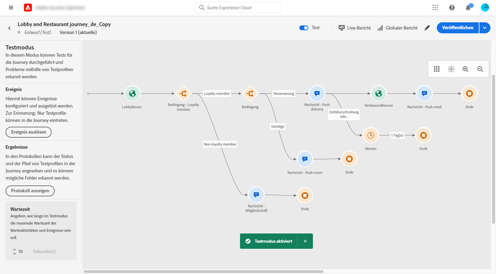
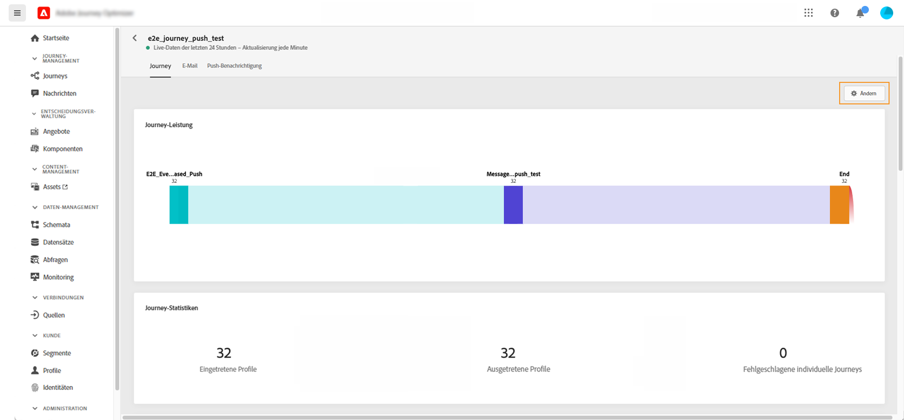

# Erstellen Ihrer ersten Journey {#jo-quick-start}

>[!CONTEXTUALHELP]
>id="ajo_homepage_card2"
>title="Erstellen von Journeys"
>abstract="Bitte **[!DNL Adobe Journey Optimizer]** verwenden, um Anwendungsfälle für die Echtzeit-Orchestrierung mithilfe von kontextuellen Daten aus Ereignissen oder Datenquellen zu erstellen."

>[!CONTEXTUALHELP]
>id="ajo_journey_create"
>title="Journeys"
>abstract="Entwerfen Sie Customer Journeys, um Ihren Kundinnen und Kunden personalisierte, kontextuelle Erlebnisse zu bieten. Mit Journey Optimizer können Sie Echtzeit-Orchestrierungsfälle anhand von in Ereignissen oder Datenquellen gespeicherten kontextbezogenen Daten erstellen. In der Registerkarte **Übersicht** wird ein Dashboard mit Schlüsselmetriken zu Ihren Journeys angezeigt. Auf der Registerkarte **Durchsuchen** wird eine Liste der vorhandenen Journeys angezeigt."

[!DNL Adobe Journey Optimizer] enthält eine Arbeitsfläche für die Omni-Channel-Orchestrierung, mit der Marketing-Experten Marketing-Maßnahmen mit Eins-zu-eins-Kundeninteraktionen aufeinander abstimmen können. Die Benutzeroberfläche ermöglicht es, Aktivitäten einfach von der Palette in die Arbeitsfläche zu ziehen, um eine Journey zu erstellen. Die Journey-Benutzeroberfläche wird auf [dieser Seite](journey-ui.md) beschrieben.

Die wichtigsten Schritte zum Erstellen einer Journey werden auf dieser Seite beschrieben. Sie wurden wie folgt optimiert:

In diesem Handbuch werden Sie:

* Definieren eines Journey-Einstiegspunkts - ein Zielgruppensegment oder ein Echtzeit-Ereignis
* Hinzufügen von Nachrichtenaktionen über verschiedene Kanäle hinweg - E-Mail, Push, SMS, In-App, Web, Code-basiertes Erlebnis, Inhaltskarte und mehr. [Siehe unterstützte Kanäle](journey-action.md)
* Testen des Journey mit Testprofilen vor der Aktivierung
* Veröffentlichen des Journey und Überwachen seiner Leistung

Erstellen Sie mehrstufige Customer Journeys, um eine Abfolge von kanalübergreifenden Interaktionen, Angeboten und Nachrichten in Echtzeit zu initiieren. Dieser Ansatz stellt sicher, dass Kunden zu optimalen Zeitpunkten auf der Grundlage ihrer Aktionen und relevanten Geschäftssignale eingebunden werden.

<!--
>[!TIP]
>
>Not sure whether to use a journey or a campaign? [Learn how to choose the right approach](../start/journeys-vs-campaigns.md).
-->

## Bevor Sie beginnen {#prerequisites}

Was Sie vor dem Erstellen konfigurieren müssen, hängt davon ab, wie Ihr Journey ausgelöst wird. Die meisten Journey beginnen an einem dieser beiden Einstiegspunkte:

* **Zielgruppenbasierter Eintrag** - Die Journey wird für eine definierte Gruppe von Profilen zum geplanten Zeitpunkt ausgeführt. [Erstellen einer Zielgruppe](../audience/about-audiences.md) in Adobe Experience Platform vor dem Erstellen des Journey. Dies ist der empfohlene Ausgangspunkt, wenn Sie neu bei Journey Optimizer sind.

* **Ereignisbasierter Eintrag** - Der Journey wird in Echtzeit ausgelöst, wenn ein Kontakt eine Aktion ausführt, z. B. einen Kauf oder eine Anmeldung. [Ereignis konfigurieren](../event/about-events.md) um den Trigger und die darin enthaltenen Daten zu definieren.

Die folgenden Elemente sind optional, können jedoch je nach Anwendungsfall erforderlich sein:

* **Datenquelle** - Richten Sie eine (Datenquelle[ ein, um Journey-Bedingungen oder Personalisierungen mit Daten aus einem externen System ](../datasource/about-data-sources.md).

* **Benutzerdefinierte Aktion** - Wenn Sie Nachrichten über ein Drittanbietersystem und nicht über die integrierten Kanäle senden, konfigurieren Sie eine [benutzerdefinierte Aktion](../action/action.md).

>[!NOTE]
>
>* Wenn Sie als Datentechniker für die technische Einrichtung (Ereignisse, Datenquellen und Aktionen) verantwortlich sind, lesen Sie [diesen Abschnitt](../configuration/about-data-sources-events-actions.md).
>
>* Journey-Leitplanken und -Einschränkungen werden auf [ Seite ](../start/guardrails.md).

## Erstellen einer Journey {#jo-build}

Gehen Sie wie folgt vor, um eine mehrstufige Journey zu erstellen:

1. Klicken Sie im Menüabschnitt „JOURNEY-MANAGEMENT“ auf **[!UICONTROL Journeys]**.

1. Klicken Sie auf die Schaltfläche **[!UICONTROL Journey erstellen]**, um eine neue Journey zu erstellen.

1. Bearbeiten Sie den Konfigurationsbereich der Journey, um den Namen der Journey zu definieren und ihre Eigenschaften festzulegen. Informationen zum Festlegen der Eigenschaften Ihrer Journey finden Sie auf [dieser Seite](journey-properties.md).

   >[!TIP]
   >
   >**Welchen Journey-Typ sollte ich wählen?** Wenn Sie mit Journey Optimizer noch nicht vertraut sind, beginnen Sie mit einer zielgruppenbasierten Journey mit einer **[!UICONTROL Zielgruppe lesen]**-Aktivität. Dafür ist keine vorherige Ereigniskonfiguration erforderlich und der einfachste Weg, sich mit der Arbeitsfläche vertraut zu machen. Für ereignisgesteuerte Erlebnisse in Echtzeit (z. B. Reaktion auf einen Kauf oder eine Formularübermittlung) konfigurieren Sie zuerst ein Ereignis und verwenden Sie einen ereignisbasierten Eintrag. Bereit, tiefer zu gehen? [Entdecken Sie alle Journey-Typen und ihre Eingaberegeln](entry-management.md#types-of-journeys).

   

Anschließend können Sie mit der Gestaltung Ihrer Journey beginnen.

## Entwerfen der Journey {#jo-design}

Mit dem Journey-Designer können Sie mehrstufige Journey mit einer intuitiven Drag-and-Drop-Oberfläche erstellen. Aktivitäten in der linken Palette sind in drei Kategorien unterteilt: **Ereignisse**, **** und **Aktionen**. Eine vollständige Übersicht der Arbeitsfläche und ihrer Steuerelemente finden Sie auf [dieser Seite](using-the-journey-designer.md).

Führen Sie die folgenden Schritte aus, um Ihren Journey zu entwerfen:

1. **Einstiegspunkt hinzufügen** - Ziehen Sie ein Ereignis oder eine Aktivität **[!UICONTROL Zielgruppe lesen]** aus der Palette auf die Arbeitsfläche. Dadurch wird definiert, wie Profile auf die Journey zugreifen: einzeln in Echtzeit (ereignisbasiert) oder gleichzeitig über eine definierte Zielgruppe (zielgruppenbasiert).

   

1. **Nachrichtenaktionen hinzufügen** - Ziehen Sie aus dem Abschnitt **[!UICONTROL Aktionen]** der Palette eine Kanalaktion auf die Arbeitsfläche, um Nachrichten an Profile zu senden, die den Journey durchlaufen. Aktionen sind für E-Mail, Push-Benachrichtigungen, SMS und mehr verfügbar.

1. **Orchestrierungsaktivitäten hinzufügen** - Verwenden Sie eine Aktivität vom Typ **[!UICONTROL Bedingung]**, um den Journey basierend auf Profilattributen oder Verhalten in mehrere Pfade zu verzweigen. Verwenden **[!UICONTROL Aktivität &quot;]**&quot;, um eine Zeitverzögerung zwischen den Schritten einzuführen.

>[!TIP]
>
>Für Journey mit mehreren Phasen oder vielen Touchpoints sollten Sie den End-to-End-Fluss in kleinere Sub-Journey unterteilen, die mit der Aktivität **[!UICONTROL Springen]** verbunden sind. Dies reduziert die Komplexität und erleichtert das unabhängige Testen jedes Sub-Journey. Weitere Informationen finden [ unter „Design-Strategie: Beißgroße Unter-Journey ](jump.md#jump-strategy).

## Testen der Journey {#jo-test}

Nachdem Sie Ihre Journey erstellt haben, testen Sie sie vor dem Veröffentlichen. Journey Optimizer bietet einen **Testmodus** als Möglichkeit, Testprofile anzuzeigen, die die Journey durchlaufen, um so potenzielle Fehler vor der Aktivierung zu erkennen. Das Ausführen von Schnelltests stellt sicher, dass die Journeys ordnungsgemäß funktionieren, sodass Sie sie zuversichtlich veröffentlichen können. [In diesem Abschnitt](testing-the-journey.md) erfahren Sie, wie Sie Journeys testen.

Sie können Ihre Journey auch im **Probelauf** ausführen. Der Journey-Probelauf ist ein spezieller Journey-Veröffentlichungsmodus in Adobe Journey Optimizer, der es Journey-Anwendenden ermöglicht, eine Journey mit echten Produktionsdaten zu testen, ohne echte Kundinnen und Kunden zu kontaktieren oder Profilinformationen zu aktualisieren. Mit dieser Funktion können Journey-Nutzende Vertrauen in ihr Journey-Design und das Zielgruppen-Targeting gewinnen, bevor sie Journeys live schalten. [In diesem Abschnitt](journey-dry-run.md) erfahren Sie, wie Sie eine Journey im Probelaufmodus veröffentlichen.

## Veröffentlichen der Journey {#jo-pub}

Sie müssen eine Journey veröffentlichen, um sie zu aktivieren und für neue Profile verfügbar zu machen, damit diese in sie eintreten können. Stellen Sie vor der Veröffentlichung Ihrer Journey sicher, dass sie gültig ist und keine Fehler vorliegen. Es ist nicht möglich, eine fehlerhafte Journey zu veröffentlichen. Weitere Informationen zur Veröffentlichung von Journeys finden Sie in diesem [Abschnitt](publish-journey.md).

Nach der Veröffentlichung können Sie Ihre Journey mit den dedizierten Reporting-Tools überwachen, um ihre Effektivität zu messen.

Weitere Informationen zu Journey-Berichten finden Sie in diesem [Abschnitt](../reports/live-report.md).

## Häufige Anwendungsfälle {#use-cases}

Nicht sicher, wo man anfangen soll? Im Folgenden finden Sie drei typische Szenarien, in denen Journey den größten Nutzen bieten:

<table style="table-layout:fixed">
  <tr style="border: 0;">
    <td>
      
      
<strong>Begrüßungsreihe</strong> Automatisches Onboarding neuer Benutzer mit einer Abfolge von Nachrichten nach der Anmeldung, um sie durch Ihr Produkt oder Ihren Service zu führen.

    </td>
    <td>
      
      
<strong>Warenkorbabbruch</strong>  Erneut mit Kunden interagieren, die den Warenkorb verlassen haben, ohne einen Kauf abzuschließen, indem sie rechtzeitig eine Erinnerung mit personalisierten Inhalten senden.

    </td>
    <td>
      
      
<strong>Re-Engagement</strong> Gewinnen Sie inaktive Benutzende mit zielgerichteten Angeboten oder Aktualisierungen basierend auf ihrem letzten bekannten Verhalten zurück.

    </td>
  </tr>
  <tr style="border: 0;">
    <td align="center"></td>
    <td align="center"></td>
    <td align="center"></td>
  </tr>
</table>

## Weitere Ressourcen

* **[Journey-Typen und Profileintrag](entry-management.md)** - Verstehen Sie alle Journey-Typen (unitäres Ereignis, Geschäftsereignis, Zielgruppe lesen, Zielgruppen-Qualifizierung) und wie Profile in Journey eintreten, erneut eintreten und durch sie fließen.
* **[Journey-Designer – Überblick](using-the-journey-designer.md)**: Lernen Sie die Journey-Arbeitsfläche zum Entwerfen und Orchestrieren von Customer Journeys kennen.
* **[Journey-Aktivitäten](about-journey-activities.md)**: Entdecken Sie alle verfügbaren Aktivitäten, einschließlich Ereignisse, Aktionen und Orchestrierungskomponenten.
* **[Testen von Journeys](testing-the-journey.md)**: Erfahren Sie, wie Sie Ihre Journeys vor der Veröffentlichung in der Produktionsumgebung im Testmodus testen.
* **[Veröffentlichen von Journeys](publish-journey.md)**: Machen Sie sich mit dem Veröffentlichungsprozess von Journeys und der Verwaltung von Live-Journeys vertraut.
* **[Journey-Reporting](report-journey.md)**: Verfolgen und analysieren Sie die Journey-Leistung mit detaillierten Metriken und Erkenntnissen.
* **[Fehlerbehebung bei Journeys](troubleshooting.md)**: Hier finden Sie Lösungen für häufige Journey-Probleme und Best Practices für das Debugging.
* **[Journey-Tutorials](https://experienceleague.adobe.com/de/docs/journey-optimizer-learn/tutorials/journeys/introduction-to-building-a-journey){target="_blank"}**: Sehen Sie sich detaillierte Anleitungsvideos zum Erstellen von Journeys und Best Practices an.

