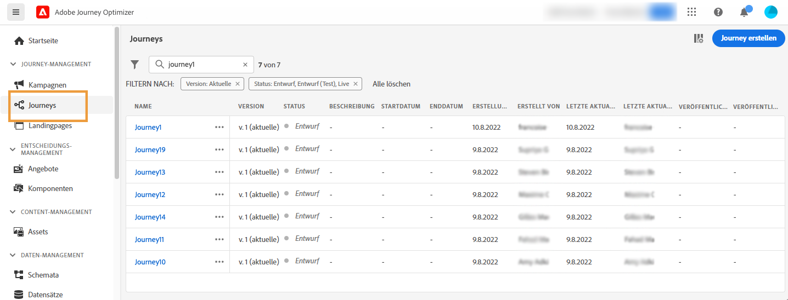

# Erste Schritte mit Journeys{#jo-quick-start}

## Voraussetzungen{#start-prerequisites}

Um Nachrichten mit Journeys zu senden, sind folgende Konfigurationen notwendig:

1. **Ereignis konfigurieren**: Wenn Sie Ihre Journeys beim Empfang eines Ereignisses unitär triggern möchten, müssen Sie zunächst ein Ereignis konfigurieren. Sie definieren die erwarteten Informationen sowie deren Verarbeitungsmethode. Dieser Schritt wird von einem **technischen Anwender** ausgeführt. [Mehr dazu](../event/about-events.md).

   

1. **Segment erstellen**: Ihre Journey kann auch Adobe Experience Platform-Segmente überwachen, um Nachrichten als Batch an einen bestimmten Satz von Profilen zu senden. Dazu müssen Sie Segmente erstellen. [Mehr dazu](../segment/about-segments.md).

   

1. **Datenquelle konfigurieren**: Sie können eine Verbindung zu einem System definieren, um zusätzliche Informationen zur Verwendung bei Ihren Journeys abzurufen (z. B. in Ihren Bedingungen). Außerdem wird zur Bereitstellungszeit eine integrierte Adobe Experience Platform-Datenquelle konfiguriert. Dieser Schritt ist nicht erforderlich, wenn Sie ausschließlich Daten aus den Ereignissen Ihrer Journey nutzen. Dieser Schritt wird von einem **technischen Anwender** ausgeführt. [Mehr dazu](../datasource/about-data-sources.md)

   

1. **Aktion konfigurieren**: Die Journey Optimizer-Nachrichtenfunktionen sind integriert. Sie müssen lediglich Ihren Inhalt entwerfen und Ihre Nachricht veröffentlichen. Weitere Informationen finden Sie in [diesem Abschnitt](../messages/get-started-content.md). Wenn Sie für den Versand Ihrer Nachrichten ein Drittanbietersystem verwenden, können Sie eine benutzerdefinierte Aktion erstellen. Weitere Informationen finden Sie in diesem [Abschnitt](../action/action.md). Dieser Schritt wird von einem **technischen Anwender** ausgeführt.

   

## Erstellen Ihrer Journey{#jo-build}

>[!CONTEXTUALHELP]
>id="ajo_journey_create"
>title="Erstellen Ihrer Journey"
>abstract="Auf diesem Bildschirm wird die Liste der vorhandenen Journey angezeigt. Öffnen Sie eine Journey oder klicken Sie auf „Journey erstellen“ und kombinieren Sie die verschiedenen Ereignis-, Orchestrierungs- und Aktionsaktivitäten, um mehrstufige kanalübergreifende Szenarien zu erstellen."

Dieser Schritt wird vom **Business-Anwender** ausgeführt. Hier erstellen Sie Ihre Journeys. Kombinieren Sie die verschiedenen Ereignis-, Orchestrierungs- und Aktionsaktivitäten, um Ihre mehrstufigen kanalübergreifenden Szenarien zu erstellen.

Hier finden Sie die wichtigsten Schritte zum Senden von Nachrichten über Journeys:

1. Klicken Sie im Menü JOURNEY-MANAGEMENT auf **[!UICONTROL Journeys]**. Die Liste der Journeys wird angezeigt.

   

1. Klicken Sie auf **[!UICONTROL Journey erstellen]**, um eine neue Journey zu erstellen.

1. Bearbeiten Sie im Konfigurationsbereich auf der rechten Seite die Eigenschaften der Journey. Weiterführende Informationen finden Sie in diesem [Abschnitt](journey-gs.md#change-properties).

   

1. Ziehen Sie zuerst ein Ereignis oder die Aktivität **Segment lesen** per Drag-and-Drop aus der Palette in die Arbeitsfläche. Weitere Informationen zum Entwerfen von Journeys finden Sie in [diesem Abschnitt](using-the-journey-designer.md).

   

1. Ziehen Sie die nächsten Schritte, die der Kontakt ausführen soll, per Drag-and-Drop. Sie können beispielsweise eine Bedingung und anschließend eine Nachricht hinzufügen. Weitere Informationen zu Aktivitäten finden Sie in [diesem Abschnitt](using-the-journey-designer.md).

1. Testen Sie Ihre Journey mit Testprofilen. Weitere Informationen finden Sie in diesem [Abschnitt](testing-the-journey.md)

1. Veröffentlichen Sie Ihre Journey, um sie zu aktivieren. Weitere Informationen finden Sie in diesem [Abschnitt](publishing-the-journey.md).

   

1. Überwachen Sie Ihre Journey mithilfe der dedizierten Reporting-Tools, um die Effektivität Ihrer Journey zu messen. Weitere Informationen finden Sie in diesem [Abschnitt](../reports/live-report.md).

   

## Definieren der Journey-Eigenschaften {#change-properties}

>[!CONTEXTUALHELP]
>id="ajo_journey_properties"
>title="Journey-Eigenschaften"
>abstract="In diesem Abschnitt werden die Journey-Eigenschaften angezeigt. Standardmäßig sind schreibgeschützte Parameter ausgeblendet. Die verfügbaren Einstellungen hängen vom Status der Journey, von Ihren Berechtigungen und der Produktkonfiguration ab."

Klicken Sie auf das Bleistiftsymbol oben rechts, um auf die Eigenschaften der Journey zuzugreifen. 

Sie können den Namen der Journey ändern, eine Beschreibung hinzufügen, den erneuten Eintritt erlauben, Start- und Enddatum auswählen und, wenn Sie ein Administrator sind, eine Dauer für **[!UICONTROL Zeitüberschreitung und Fehler]** festlegen. Sie können auch [Burst-Messaging](#burst) aktivieren, sofern diese Option für Ihre Organisation aktiviert wurde.

Für Live-Journeys werden in diesem Bildschirm das Veröffentlichungsdatum und der Name des Benutzers angezeigt, der die Journey veröffentlicht hat.

Mit der Schaltfläche **Technische Details kopieren** lassen sich jederzeit technische Informationen zur Journey kopieren, die dem Support-Team bei der Problembehebung helfen. Dabei werden die folgenden Informationen kopiert: JourneyVersion UID, OrgID, orgName, sandboxName, lastDeployedBy, lastDeployedAt.

### Eintritt{#entrance}

Standardmäßig ist bei neuen Journeys der erneute Eintritt erlaubt. Sie können die Option für „einmalige“ Journeys deaktivieren, z. B. wenn Sie ein einmaliges Geschenk anbieten möchten, wenn eine Person einen Shop betritt. In diesem Fall möchten Sie nicht, dass der Kunde die Journey erneut betreten und das Angebot erneut wahrnehmen kann.

Wenn eine Journey „endet“, weist sie den Status **[!UICONTROL Geschlossen]** auf. Die Journey erlaubt den Eintritt neuer Kontakte nicht mehr. Personen, die sich bereits in der Journey befinden, beenden die Journey wie gewohnt.

Nach der standardmäßigen globalen maximalen Wartezeit von 30 Tagen wechselt die Journey zum Status **Beendet**. Weitere Informationen finden Sie in diesem [Abschnitt](../building-journeys/journey-gs.md#global_timeout).

### Zeitüberschreitung und Fehler bei Journey-Aktivitäten {#timeout_and_error}

Beim Bearbeiten einer Aktions- oder Bedingungsaktivität können Sie im Falle eines Fehlers oder einer Zeitüberschreitung einen alternativen Pfad definieren. Wenn die Verarbeitung der Aktivität, die ein Drittanbietersystem abfragt, die in den Eigenschaften der Journey festgelegte Dauer der maximalen Wartezeit überschreitet (Feld **[!UICONTROL Zeitüberschreitung und Fehler]**), wird der zweite Pfad ausgewählt, um eine potenzielle Ausweichaktion durchzuführen.

Die zulässigen Werte liegen zwischen 1 und 30 Sekunden.

Es wird empfohlen, unter **[!UICONTROL Zeitüberschreitung und Fehler]** einen sehr kurzen Wert festzulegen, wenn Ihre Journey zeitkritisch ist (z. B. Reaktion auf den Echtzeit-Standort einer Person), da Sie Ihre Aktion nicht länger als einige Sekunden verzögern können. Wenn Ihre Journey weniger zeitkritisch ist, können Sie einen längeren Wert verwenden, um dem aufgerufenen System mehr Zeit zum Senden einer gültigen Antwort zu geben.

Bei Journeys wird auch eine maximale globale Wartezeit verwendet. Siehe [nächster Abschnitt](#global_timeout).

### Maximale globale Wartezeit der Journey {#global_timeout}

Zusätzlich zu der in den Journey-Aktivitäten verwendeten [maximalen Wartezeit](#timeout_and_error) gibt es auch eine maximale globale Journey-Wartezeit, die nicht auf der Benutzeroberfläche angezeigt wird und nicht geändert werden kann. Diese maximale Wartezeit stoppt den Fortschritt von Kontakten in der Journey 30 Tage nach ihrem Eintritt. Das bedeutet, dass die Journey eines Kontakts nicht länger als 30 Tage dauern kann. Nach Ablauf der maximalen Wartezeit von 30 Tagen werden die Daten des Kontakts gelöscht. Kontakte, die sich nach der maximalen Wartezeit noch in der Journey befinden, werden gestoppt und beim Reporting als Fehler gewertet.

>[!NOTE]
>
>Journeys reagieren nicht direkt auf Datenschutz-Opt-out-, Zugriffs- oder Löschanfragen. Die maximale globale Wartezeit stellt jedoch sicher, dass Kontakte auf keinen Fall länger als 30 Tage in der Journey bleiben.

Aufgrund der maximalen Journey-Wartezeit von 30 Tagen können wir, wenn der erneute Eintritt nicht erlaubt ist, nicht sicherstellen, dass die Sperrung des erneuten Eintritts nach mehr als 30 Tagen erhalten bleibt. Da wir alle Informationen über Personen, die an der Journey teilgenommen haben, 30 Tage nach deren Eintritt entfernen, können wir nicht wissen, dass die Person vor mehr als 30 Tagen bereits Eintritt hatte.

### Zeitzone und Zeitzone des Profils {#timezone}

Die Zeitzone wird auf Journey-Ebene definiert.

Sie können eine feste Zeitzone eingeben oder Adobe Experience Platform-Profile verwenden, um die Zeitzone der Journey festzulegen.

Wenn eine Zeitzone im Adobe Experience Platform-Profil definiert ist, kann sie in der Journey abgerufen werden.

Weitere Informationen zum Zeitzonen-Management finden Sie auf [dieser Seite](../building-journeys/timezone-management.md).

### Burst-Modus {#burst}

Der Burst-Modus ist in Journey Optimizer ein kostenpflichtiges Add-on, das den sehr schnellen Versand großer Mengen von Push-Benachrichtigungen ermöglicht. Er wird für einfache Journeys verwendet, die die Aktivität **Segment lesen** und eine einfache Push-Benachrichtigung enthalten. Der Burst-Modus wird verwendet, wenn eine Verzögerung beim Nachrichtenversand geschäftskritisch wäre oder wenn Sie eine dringende Push-Benachrichtigung auf Mobiltelefone senden möchten, z. B. eine Eilmeldung an Benutzer, die Ihre Nachrichten-App installiert haben.

Für Burst-Messaging gelten folgende Anforderungen:

* Die Journey muss mit der Aktivität **Segment lesen** beginnen. Ereignisse sind nicht erlaubt.
* Der nächste Schritt muss eine Push-Benachrichtigung sein. Es sind kein anderer Kanal, keine andere Aktivität und kein anderer Schritt zulässig (mit Ausnahme der optionalen Aktivität **Ende**).
* In der Push-Benachrichtigung ist keine Personalisierung zulässig.
* Die Nachricht muss klein sein (&lt; 2 KB).

>[!CAUTION]
>
>Wenn eine der Anforderungen nicht erfüllt ist, ist der Burst-Modus in der Journey nicht verfügbar.

Um den **Burst-Modus** zu aktivieren, öffnen Sie Ihre Journey und klicken Sie oben rechts auf das Stiftsymbol, um auf die Eigenschaften der Journey zuzugreifen. Aktivieren Sie dann den Umschalter **Burst-Modus aktivieren**.

Der Burst-Modus wird automatisch deaktiviert, wenn Sie eine Burst-Journey ändern und eine Aktivität hinzufügen, die nicht mit Burst-Messaging kompatibel ist, wie eine E-Mail, andere Aktionen, ein Ereignis usw.

Testen und veröffentlichen Sie dann Ihre Journey wie üblich. Beachten Sie, dass im Testmodus Nachrichten nicht über den Burst-Modus gesendet werden.

In diesem Video erfahren Sie, welche Anwendungsfälle für Burst-Messaging in Frage kommen und wie Sie eine Journey für Burst-Nachrichten konfigurieren:

>[!VIDEO](https://video.tv.adobe.com/v/334523?quality=12)

## Beenden, Stoppen oder Schließen einer Journey{#end-journey}

Eine Journey kann für eine Person auf zwei Weisen enden:

* Die Person kommt bei der letzten Aktivität eines Pfades an. Diese letzte Aktivität kann eine **Ende**-Aktivität oder eine andere Aktivität sein. Das Verwenden einer **Ende**-Aktivität ist nicht obligatorisch. Weitere Informationen finden Sie auf [dieser Seite](../building-journeys/end-activity.md).
* Die Person kommt bei einer **Bedingungs**-Aktivität (oder einer **Warte**-Aktivität mit einer Bedingung) an und erfüllt keine der Bedingungen.

Die Person kann dann wieder in die Journey eintreten, wenn der erneute Zutritt erlaubt ist. Weitere Informationen finden Sie auf [dieser Seite](../building-journeys/journey-gs.md#change-properties)

Eine Journey kann aus den folgenden Gründen geschlossen werden:

* Die Journey wird manuell über die Schaltfläche **[!UICONTROL Für neue Eintritte schließen]** geschlossen.
* Eine segmentbasierte Journey zur einmaligen Ausführung wurde abgeschlossen.
* Nach dem letzten Vorkommen einer wiederkehrenden segmentbasierten Journey.

Wenn eine Journey geschlossen wird (aus einem der oben genannten Gründe), weist sie den Status **[!UICONTROL Geschlossen]** auf. Die Journey stoppt den Eintritt neuer Personen. Personen, die sich bereits in der Journey befinden, können die Journey wie gewohnt beenden. Nach der standardmäßigen globalen maximalen Wartezeit von 30 Tagen wechselt die Journey zum Status **Beendet**. Weitere Informationen finden Sie in diesem [Abschnitt](../building-journeys/journey-gs.md#global_timeout).

Falls Sie den Fortschritt aller Personen in der Journey stoppen müssen, können Sie das tun. In diesem Fall entsteht für alle Personen in der Journey eine Zeitüberschreitung.

So kann eine Journey manuell geschlossen oder gestoppt werden:

Mit den Optionen **[!UICONTROL Stoppen]** und **[!UICONTROL Für neue Eintritte schließen]** können Sie **Live**-Journeys beenden. Wenn Sie eine Journey schließen, wird **der Eintritt neuer Kunden in die Journey blockiert** und die bereits in der Journey befindlichen Kunden können diese bis zum Ende durchlaufen. Dies ist die empfohlene Art, eine Journey zu beenden, da sie für die Kunden das beste Erlebnis bietet. Wenn Sie hingegen eine Journey stoppen, wird die Reise der bereits in der Journey befindlichen Personen abgebrochen. Die Journey wird praktisch deaktiviert.

>[!NOTE]
>
>Beachten Sie, dass Sie eine geschlossene oder gestoppte Journey nicht fortsetzen können.

### Schließen einer Journey

Sie können eine Journey manuell schließen. In diesem Fall können Kunden, die sich bereits in der Journey befinden, ihren Pfad bis zum Ende verfolgen, neue Anwender können jedoch nicht in die Journey eintreten.

Wenn eine Journey geschlossen ist, weist sie den Status **[!UICONTROL Geschlossen]** auf. Nach der standardmäßigen globalen maximalen Wartezeit von 30 Tagen wechselt die Journey zum Status **Beendet**. Weitere Informationen finden Sie in diesem [Abschnitt](../building-journeys/journey-gs.md#global_timeout).

Eine geschlossene Journey-Version kann weder neu gestartet noch gelöscht werden. Stattdessen können Sie eine neue Version davon erstellen oder sie duplizieren. Nur abgeschlossene Journeys können gelöscht werden.

Um eine Journey in der Liste der Journeys zu schließen, klicken Sie auf den Button mit den **[!UICONTROL Auslassungszeichen]** rechts neben dem Journey-Namen und wählen Sie **[!UICONTROL Für neue Eintritte schließen]** aus.

Alternativ können Sie auch folgendermaßen vorgehen:

1. Wählen Sie in der Liste **[!UICONTROL Journeys]** die Journey aus, die Sie schließen möchten.
1. Klicken Sie oben rechts auf den Abwärtspfeil.

   

1. Klicken Sie auf **[!UICONTROL Für neue Eintritte schließen]** und bestätigen Sie diese Auswahl im Dialogfeld.

### Stoppen einer Journey

Sie können eine Journey stoppen, wenn ein unerwartetes Ereignis eintritt und die gesamte Verarbeitung der Journey unverzüglich abgebrochen werden muss.

Eine gestoppte Journey-Version kann nicht nochmals gestartet werden.

Beim Stoppen wird der Journey-Status auf **[!UICONTROL Gestoppt]** gesetzt.

Sie können beispielsweise eine Journey stoppen, wenn ein Marketer erkennt, dass die Journey die falsche Zielgruppe anspricht, oder wenn eine benutzerdefinierte Aktion, mit der Nachrichten gesendet werden sollen, nicht ordnungsgemäß funktioniert. Um eine Journey aus der Liste der Journeys zu entfernen, klicken Sie auf den Button mit den **[!UICONTROL Auslassungszeichen]** rechts neben dem Journey-Namen und wählen Sie **[!UICONTROL Stoppen]** aus.

Alternativ können Sie auch folgendermaßen vorgehen:

1. Wählen Sie in der Liste **[!UICONTROL Journeys]** die Journey aus, die Sie stoppen möchten.
1. Klicken Sie oben rechts auf den Abwärtspfeil.

1. Klicken Sie auf **[!UICONTROL Stoppen]** und bestätigen Sie diese Auswahl im Dialogfeld.
