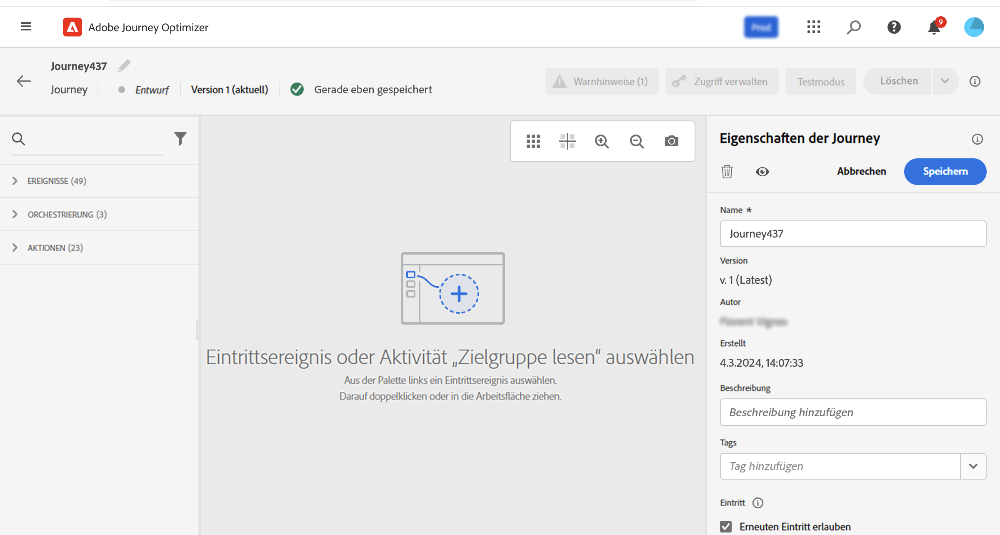
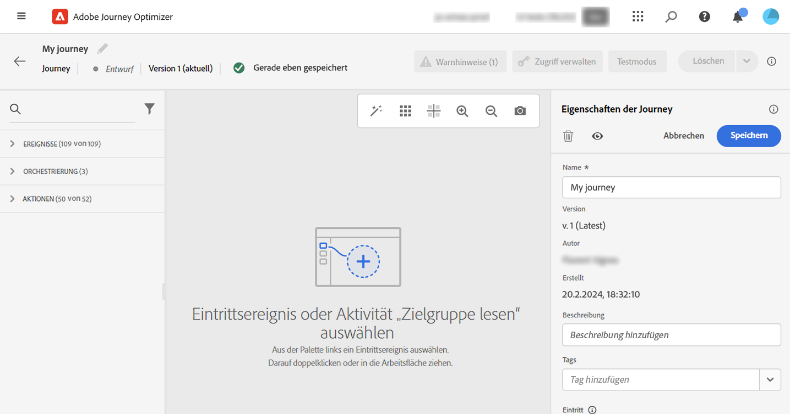

# Erstellen Ihrer ersten Journey{#jo-quick-start}

>[!CONTEXTUALHELP]
>id="ajo_homepage_card2"
>title="Erstellen von Journeys"
>abstract="Erstellen Sie mit **Adobe Journey Optimizer** anhand von in Ereignissen oder Datenquellen gespeicherten kontexbezogenen Daten Echtzeit-Orchestrierungsfälle."

## Voraussetzungen{#start-prerequisites}

Um Nachrichten mit Journeys zu senden, sind folgende Konfigurationen notwendig:

1. **Ereignis konfigurieren**: Wenn Sie Ihre Journeys beim Empfang eines Ereignisses unitär triggern möchten, müssen Sie zunächst ein Ereignis konfigurieren. Sie definieren die erwarteten Informationen sowie deren Verarbeitungsmethode. Dieser Schritt wird von einem **technischen Anwender** ausgeführt. [Mehr dazu](../event/about-events.md).

   

1. **Zielgruppe erstellen**: Ihre Journey kann auch Adobe Experience Platform-Zielgruppen überwachen, um Nachrichten als Batch an einen bestimmten Satz von Profilen zu senden. Dazu müssen Sie Zielgruppen erstellen. [Weitere Informationen](../audience/about-audiences.md).

   

1. **Konfigurieren einer Datenquelle**: Sie können eine Verbindung zu einem System definieren, um zusätzliche Informationen zur Verwendung bei Ihren Journeys abzurufen (z. B. in Ihren Bedingungen). Außerdem wird zur Bereitstellungszeit eine integrierte Adobe Experience Platform-Datenquelle konfiguriert. Dieser Schritt ist nicht erforderlich, wenn Sie ausschließlich Daten aus den Ereignissen Ihrer Journey nutzen. Dieser Schritt wird von einem **technischen Anwender** ausgeführt. [Mehr dazu](../datasource/about-data-sources.md)

   

1. **Konfigurieren einer Aktion**: Wenn Sie für den Versand Ihrer Nachrichten ein Drittanbietersystem verwenden, können Sie eine benutzerdefinierte Aktion erstellen. Weiterführende Informationen finden Sie in diesem [Abschnitt](../action/action.md). Dieser Schritt wird von einem **technischen Anwendenden** ausgeführt. Wenn Sie integrierte Nachrichtenfunktionen von Journey Optimizer verwenden, müssen Sie lediglich eine Kanalaktion zu Ihrer Journey hinzufügen und Inhalte entwerfen.

   

## Zugreifen auf Journeys {#journey-access}

>[!CONTEXTUALHELP]
>id="ajo_journey_create"
>title="Journeys"
>abstract="Entwerfen Sie Customer Journeys, um Ihren Kundinnen und Kunden personalisierte, kontextuelle Erlebnisse zu bieten. Mit Journey Optimizer können Sie anhand von in Ereignissen oder Datenquellen gespeicherten kontextbezogenen Daten Echtzeit-Orchestrierungsfälle erstellen. In der Registerkarte **Übersicht** wird ein Dashboard mit Schlüsselmetriken zu Ihren Journeys angezeigt. Auf der Registerkarte **Durchsuchen** wird eine Liste der vorhandenen Journeys angezeigt."

Klicken Sie im Menü JOURNEY-MANAGEMENT auf **[!UICONTROL Journeys]**. Zwei Registerkarten sind verfügbar:

**Überblick**: Auf dieser Registerkarte wird ein Dashboard mit Schlüsselmetriken für Ihre Journeys angezeigt:

* **Verarbeitete Profile**: Gesamtzahl der in den letzten 24 Stunden verarbeiteten Profile.
* **Live-Journeys**: Gesamtzahl der Live-Journeys mit Traffic in den letzten 24 Stunden. Live-Journeys umfassen **unitäre Journeys** (ereignisbasiert) und **Batch-Journeys** (Zielgruppe lesen).
* **Fehlerrate**: Verhältnis aller fehlerhaften Profile in Bezug auf die Gesamtzahl der in den letzten 24 Stunden eingetretenen Profile.
* **Verwerfungsrate**: Verhältnis aller verworfenen Profile in Bezug auf die Gesamtzahl der in den letzten 24 Stunden eingetretenen Profile. Ein verworfenes Profil stellt eine Person dar, die nicht zum Eintritt in die Journey berechtigt ist, z. B. aufgrund eines falschen Namespace oder aufgrund von Regeln für den erneuten Eintritt.

>[!NOTE]
>
>Dieses Dashboard berücksichtigt die Journeys mit Traffic in den letzten 24 Stunden. Es werden nur die Journeys angezeigt, auf die Sie zugreifen können. Metriken werden alle 30 Minuten aktualisiert, aber nur dann, wenn neue Daten verfügbar sind.

**Durchsuchen**: Auf dieser Registerkarte wird die Liste der vorhandenen Journeys angezeigt. Sie können nach Journeys suchen, Filter verwenden und grundlegende Aktionen für jedes Element ausführen. Sie können Elemente beispielsweise duplizieren oder löschen. Weiterführende Informationen hierzu finden Sie in [diesem Abschnitt](../start/user-interface.md#filter-lists).

In der Liste der Journeys können Sie Journeys mit den **[!UICONTROL Status- und Versionsfiltern]** nach Status, Typ und Version filtern. Die folgenden Typen sind möglich: **[!UICONTROL Unitäres Ereignis]**, **[!UICONTROL Zielgruppen-Qualifizierung]**, **[!UICONTROL Zielgruppe lesen]**, **[!UICONTROL Geschäftsereignis]** oder **[!UICONTROL Burst]**.

Sie können festlegen, dass nur Journeys angezeigt werden sollen, die ein bestimmtes Ereignis, eine bestimmte Feldergruppe oder eine bestimmte Aktion aus den **[!UICONTROL Aktivitätsfiltern]** und **[!UICONTROL Datenfiltern]** verwenden. Mit den **[!UICONTROL Veröffentlichungsfiltern]** können Sie außerdem ein Veröffentlichungsdatum oder Benutzende auswählen. Sie können beispielsweise auswählen, dass die aktuellen Versionen von Live-Journeys, die am Vortag veröffentlicht wurden, angezeigt werden sollen. [Weitere Informationen](../building-journeys/using-the-journey-designer.md).

Verwenden Sie die Spalten **[!UICONTROL Letzte Aktualisierung]** und **[!UICONTROL Letzte Aktualisierung von]**, um zu überprüfen, wann das letzte Update Ihrer Journey erfolgt ist und wer es gespeichert hat.

In den Konfigurationsbereichen für Ereignis, Datenquelle und Aktion zeigt das Feld **[!UICONTROL Verwendet in]** die Zahl der Journeys an, die dieses bestimmte Ereignis, diese Feldergruppe oder diese Aktion verwenden. Sie können auf die Schaltfläche **[!UICONTROL Customer Journeys anzeigen]** klicken, um die Liste der entsprechenden Journeys zu öffnen.

## Erstellen Ihrer Journey{#jo-build}

Dieser Schritt wird vom **Business-Anwender** ausgeführt. Hier erstellen Sie Ihre Journeys. Kombinieren Sie die verschiedenen Ereignis-, Orchestrierungs- und Aktionsaktivitäten, um Ihre mehrstufigen kanalübergreifenden Szenarien zu erstellen.

Hier finden Sie die wichtigsten Schritte zum Senden von Nachrichten über Journeys:

1. Klicken Sie auf der Registerkarte **Durchsuchen** auf **[!UICONTROL Journey erstellen]**, um eine neue Journey zu erstellen.

1. Bearbeiten Sie im Konfigurationsbereich auf der rechten Seite die Eigenschaften der Journey. Weiterführende Informationen finden Sie in diesem [Abschnitt](journey-gs.md#change-properties).

   

1. Ziehen Sie zuerst ein Ereignis oder die Aktivität **Zielgruppe lesen** per Drag-and-Drop aus der Palette in die Arbeitsfläche. Weitere Informationen zum Entwerfen von Journeys finden Sie in [diesem Abschnitt](using-the-journey-designer.md).

   

1. Ziehen Sie die nächsten Schritte, die der Kontakt ausführen soll, per Drag-and-Drop. Sie können beispielsweise eine Bedingung und anschließend eine Kanalaktion hinzufügen. Weitere Informationen zu Aktivitäten finden Sie in [diesem Abschnitt](using-the-journey-designer.md).

1. Testen Sie Ihre Journey mit Testprofilen. Weitere Informationen finden Sie in diesem [Abschnitt](testing-the-journey.md)

1. Veröffentlichen Sie Ihre Journey, um sie zu aktivieren. Weitere Informationen finden Sie in diesem [Abschnitt](publishing-the-journey.md).

   

1. Überwachen Sie Ihre Journey mithilfe der dedizierten Reporting-Tools, um die Effektivität Ihrer Journey zu messen. Weiterführende Informationen finden Sie in diesem [Abschnitt](../reports/live-report.md).

   

## Definieren der Journey-Eigenschaften {#change-properties}

>[!CONTEXTUALHELP]
>id="ajo_journey_properties"
>title="Journey-Eigenschaften"
>abstract="In diesem Abschnitt werden die Journey-Eigenschaften angezeigt. Standardmäßig sind schreibgeschützte Parameter ausgeblendet. Die verfügbaren Einstellungen hängen vom Status der Journey, von Ihren Berechtigungen und der Produktkonfiguration ab."

Klicken Sie auf das Bleistiftsymbol oben rechts, um auf die Eigenschaften der Journey zuzugreifen.

Sie können den Namen der Journey ändern, eine Beschreibung hinzufügen, den erneuten Eintritt erlauben, Start- und Enddatum auswählen und, wenn Sie ein Administrator sind, eine Dauer für **[!UICONTROL Zeitüberschreitung und Fehler]** festlegen. Sie können Ihrer Journey auch einheitliche Adobe Experience Platform-Tags zuweisen. Dies ermöglicht eine einfache Klassifizierung und verbesserte Suche über die Kampagnenliste. [Erfahren Sie, wie Sie mit Tags arbeiten.](../start/search-filter-categorize.md#tags)

Für Live-Journeys werden in diesem Bildschirm das Veröffentlichungsdatum und der Name des Benutzers angezeigt, der die Journey veröffentlicht hat.

Mit der Schaltfläche **Technische Details kopieren** lassen sich jederzeit technische Informationen zur Journey kopieren, die dem Support-Team bei der Problembehebung helfen. Dabei werden die folgenden Informationen kopiert: JourneyVersion UID, OrgID, orgName, sandboxName, lastDeployedBy, lastDeployedAt.

### Eintritt und Wiedereintritt {#entrance}

Standardmäßig ist bei neuen Journeys der erneute Eintritt erlaubt. Sie können die Option **Erneuten Eintritt erlauben** für „einmalige“ Journeys deaktivieren, z. B. wenn Sie ein einmaliges Geschenk anbieten möchten, wenn eine Person einen Shop betritt.

Wenn die Option **Erneuten Eintritt erlauben** aktiviert ist, wird das Feld **Wartezeit bis zum erneuten Eintritt** angezeigt. In diesem Feld kann die Wartezeit definiert werden, bevor es einem Profil erlaubt wird, in unitären Journeys erneut in die Journey einzutreten (beginnend mit einem Ereignis oder einer Zielgruppen-Qualifizierung). Dadurch wird verhindert, dass Journeys fälschlicherweise mehrmals für dasselbe Ereignis ausgelöst werden. Standardmäßig ist das Feld auf 5 Minuten eingestellt. Die maximale Wartezeit beträgt 29 Tage.

In [diesem Abschnitt](entry-management.md) erfahren Sie mehr über die Verwaltung des Eintritts und Wiedereintritts von Profilen.

### Verwalten des Zugriffs {#access}

Um der Journey benutzerdefinierte oder Core-Datennutzungsbezeichnungen zuzuweisen, klicken Sie auf die Schaltfläche **[!UICONTROL Zugriff verwalten]**. [Weitere Informationen zur Zugriffssteuerung auf Objektebene (OLA)](../administration/object-based-access.md)

### Zeitzone und Zeitzone des Profils {#timezone}

Die Zeitzone wird auf Journey-Ebene definiert.

Sie können eine feste Zeitzone eingeben oder Adobe Experience Platform-Profile verwenden, um die Zeitzone der Journey festzulegen.

Wenn eine Zeitzone im Adobe Experience Platform-Profil definiert ist, kann sie in der Journey abgerufen werden.

Weitere Informationen zum Zeitzonen-Management finden Sie auf [dieser Seite](../building-journeys/timezone-management.md).

### Start- und Enddatum {#dates}

Sie können ein **Startdatum** festlegen. Wenn Sie dies nicht festgelegt haben, wird es automatisch zum Zeitpunkt der Veröffentlichung definiert.

Sie können außerdem ein **Enddatum** hinzufügen. Dadurch können Profile beim Erreichen des Datums automatisch die Journey verlassen. Wird kein Enddatum angegeben, können Profile bis zum standardmäßigen Journey-Timeout bleiben (in der Regel 30 Tage, 7 Tage mit Add-on-Angebot für Healthcare Shield). Die einzige Ausnahme sind wiederkehrende „Zielgruppe lesen“-Journeys, bei denen die Option **Erneuten Eintritt bei Wiederholung erzwingen** aktiviert ist und die am Startdatum des nächsten Vorkommens enden.

### Zeitüberschreitung und Fehler bei Journey-Aktivitäten {#timeout_and_error}

Beim Bearbeiten einer Aktions- oder Bedingungsaktivität können Sie im Falle eines Fehlers oder einer Zeitüberschreitung einen alternativen Pfad definieren. Wenn die Verarbeitung der Aktivität, die ein Drittanbietersystem abfragt, die in den Eigenschaften der Journey festgelegte Dauer der maximalen Wartezeit überschreitet (Feld **[!UICONTROL Zeitüberschreitung und Fehler]**), wird der zweite Pfad ausgewählt, um eine potenzielle Ausweichaktion durchzuführen.

Die zulässigen Werte liegen zwischen 1 und 30 Sekunden.

Es wird empfohlen, unter **[!UICONTROL Zeitüberschreitung und Fehler]** einen sehr kurzen Wert festzulegen, wenn Ihre Journey zeitkritisch ist (z. B. Reaktion auf den Echtzeit-Standort einer Person), da Sie Ihre Aktion nicht länger als einige Sekunden verzögern können. Wenn Ihre Journey weniger zeitkritisch ist, können Sie einen längeren Wert verwenden, um dem aufgerufenen System mehr Zeit zum Senden einer gültigen Antwort zu geben.

Bei Journeys wird auch eine maximale globale Wartezeit verwendet. Siehe [nächster Abschnitt](#global_timeout).

### Maximale globale Wartezeit der Journey {#global_timeout}

Zusätzlich zu der in den Journey-Aktivitäten verwendeten [maximalen Wartezeit](#timeout_and_error) gibt es auch eine maximale globale Journey-Wartezeit, die nicht auf der Benutzeroberfläche angezeigt wird und nicht geändert werden kann. Diese maximale Wartezeit stoppt den Fortschritt von Kontakten in der Journey 30 Tage nach ihrem Eintritt. Das bedeutet, dass die Journey eines Kontakts nicht länger als 30 Tage dauern kann. Nach Ablauf der maximalen Wartezeit von 30 Tagen werden die Daten des Kontakts gelöscht. Kontakte, die sich nach der maximalen Wartezeit noch in der Journey befinden, werden gestoppt und beim Reporting nicht berücksichtigt. Sie könnten also mehr Personen sehen, die in die Journey eintreten, als Personen, die sie beenden.

>[!NOTE]
>
>Journeys reagieren nicht direkt auf Datenschutz-Opt-out-, Zugriffs- oder Löschanfragen. Die maximale globale Wartezeit stellt jedoch sicher, dass Kontakte auf keinen Fall länger als 30 Tage in der Journey bleiben.

Aufgrund der maximalen Journey-Wartezeit von 30 Tagen können wir, wenn der erneute Eintritt nicht erlaubt ist, nicht sicherstellen, dass die Sperrung des erneuten Eintritts nach mehr als 30 Tagen erhalten bleibt. Da wir alle Informationen über Personen, die an der Journey teilgenommen haben, 30 Tage nach deren Eintritt entfernen, können wir nicht wissen, dass die Person vor mehr als 30 Tagen bereits Eintritt hatte.

Ein Kontakt kann nur dann eine Warteaktivität annehmen, wenn er oder sie noch genügend Zeit hat, um die Wartezeit vor Ablauf der 30-tägigen maximalen Wartezeit der Journey zu erfüllen. Weitere Informationen finden Sie auf [dieser Seite](../building-journeys/wait-activity.md).

## Duplizieren einer Journey {#duplicate-a-journey}

Sie können eine vorhandene Journey über die Registerkarte **Durchsuchen** duplizieren. Alle Objekte und Einstellungen werden in der Journey-Kopie dupliziert.

Gehen Sie dazu wie folgt vor:

1. Navigieren Sie zu der Journey, die Sie kopieren möchten, und klicken Sie auf das Symbol **Mehr Aktionen** (die drei Punkte neben dem Journey-Namen).
1. Wählen Sie **Duplizieren** aus.

   

1. Geben Sie den Namen der Journey ein und speichern Sie ihn. Sie können den Namen auch im Bildschirm „Journey-Eigenschaften“ ändern. Standardmäßig lautet der Name wie folgt: `[JOURNEY-NAME]_copy`

   

1. Die neue Journey wird erstellt und ist in der Journey-Liste verfügbar.
