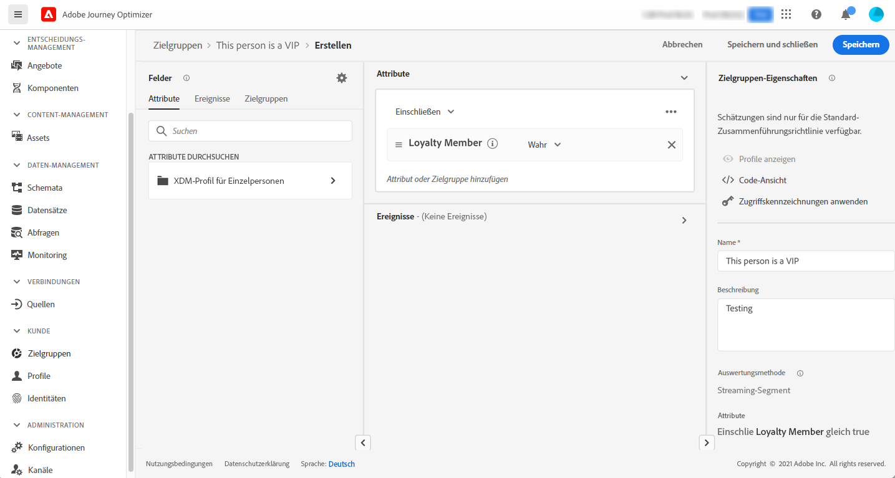
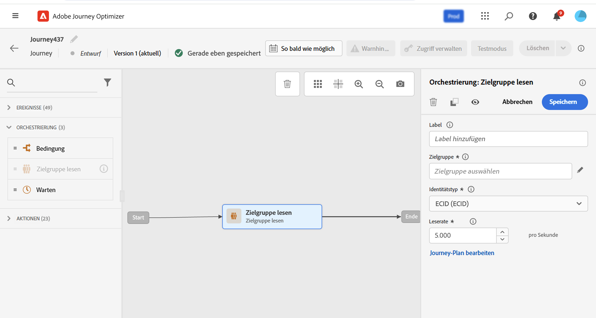

# Erstellen Ihrer ersten Journey {#jo-quick-start}

>[!CONTEXTUALHELP]
>id="ajo_homepage_card2"
>title="Erstellen von Journeys"
>abstract="Erstellen Sie mit **Adobe Journey Optimizer** anhand von in Ereignissen oder Datenquellen gespeicherten kontexbezogenen Daten Echtzeit-Orchestrierungsfälle."

>[!CONTEXTUALHELP]
>id="ajo_journey_create"
>title="Journeys"
>abstract="Entwerfen Sie Customer Journeys, um Ihren Kundinnen und Kunden personalisierte, kontextuelle Erlebnisse zu bieten. Mit Journey Optimizer können Sie anhand von in Ereignissen oder Datenquellen gespeicherten kontextbezogenen Daten Echtzeit-Orchestrierungsfälle erstellen. In der Registerkarte **Übersicht** wird ein Dashboard mit Schlüsselmetriken zu Ihren Journeys angezeigt. Auf der Registerkarte **Durchsuchen** wird eine Liste der vorhandenen Journeys angezeigt."

Adobe Journey Optimizer verfügt über eine Arbeitsfläche für die Omnichannel-Orchestrierung, mit der Marketing-Experten Marketing-Maßnahmen mit Eins-zu-eins-Kundeninteraktionen aufeinander abstimmen können. Die Benutzeroberfläche ermöglicht es, Aktivitäten einfach von der Palette in die Arbeitsfläche zu ziehen, um eine Journey zu erstellen. Die Journey-Benutzeroberfläche wird auf [ Seite beschrieben](journey-ui.md).

Die wichtigsten Schritte zum Erstellen einer Journey werden auf dieser Seite beschrieben. Sie wurden wie folgt optimiert:

Erstellen Sie mehrstufige Customer Journeys, um eine Abfolge von kanalübergreifenden Interaktionen, Angeboten und Nachrichten in Echtzeit zu initiieren. Dieser Ansatz stellt sicher, dass mit Kundinnen und Kunden zu optimalen Zeitpunkten basierend auf ihren Aktionen und relevanten Geschäftssignalen interagiert wird. Zielgruppen können basierend auf Verhalten, kontextuellen Daten und Geschäftsereignissen definiert werden. Die Voraussetzungen hängen von Ihrem Anwendungsfall und dem [Typ der Journey](entry-management.md#types-of-journeys) ab, die Sie erstellen.

Bevor Sie mit dem Erstellen der Journey beginnen, überprüfen Sie, ob die entsprechenden Konfigurationsschritte ausgeführt wurden:

* Wenn Sie Ihre Journeys beim Empfang eines Ereignisses einheitlich auslösen möchten, müssen Sie **ein Ereignis konfigurieren**. Sie definieren die erwarteten Informationen sowie deren Verarbeitungsmethode. [Weitere Informationen](../event/about-events.md).

<!--     -->

* Ihre Journey kann auch Adobe Experience Platform-Zielgruppen überwachen, um Nachrichten als Batch an einen bestimmten Satz von Profilen zu senden. Dazu müssen Sie **Zielgruppen erstellen**. [Weitere Informationen](../audience/about-audiences.md).

<!--     -->

* Sie können eine Verbindung zu einem System definieren, um zusätzliche Informationen abzurufen, die in Ihren Journeys verwendet werden (z. B. in Ihren Bedingungen). Diese Verbindung beruht auf einer **Datenquelle**. [Weitere Informationen](../datasource/about-data-sources.md)

<!--     -->

* Journey Optimizer verfügt über [integrierte Nachrichtenfunktionen](../building-journeys/journeys-message.md). Wenn Sie zum Senden Ihrer Nachrichten ein Drittanbietersystem verwenden, können Sie **eine benutzerdefinierte Aktion erstellen**. Weiterführende Informationen finden Sie in diesem [Abschnitt](../action/action.md).

<!--      -->

Für Data Engineers werden die Schritte zur Konfiguration der Journeys, einschließlich Datenquellen, Ereignissen und Aktionen, in [diesem Abschnitt](../configuration/about-data-sources-events-actions.md) beschrieben.

>[!NOTE]
>
>Journey-Schutzmechanismen und -Einschränkungen werden auf [ Seite beschrieben](../start/guardrails.md)

## Erstellen einer Journey {#jo-build}

Gehen Sie wie folgt vor, um eine mehrstufige Journey zu erstellen:

1. Klicken Sie im Menüabschnitt „JOURNEY-MANAGEMENT“ auf **[!UICONTROL Journeys]**.

1. Klicken Sie auf die Schaltfläche **[!UICONTROL Journey erstellen]**, um eine neue Journey zu erstellen.

1. Bearbeiten Sie den Konfigurationsbereich der Journey, um den Namen der Journey zu definieren und ihre Eigenschaften festzulegen. Erfahren Sie auf dieser Seite , wie Sie die Eigenschaften [ Journey festlegen](journey-properties.md).

   

Anschließend können Sie mit der Gestaltung Ihrer Journey beginnen.

## Entwerfen der Journey {#jo-design}

Der Omnichannel-Journey-Designer hilft Ihnen bei der Erstellung mehrstufiger Journeys – mit entsprechenden Zielgruppen, Aktualisierungen basierend auf Echtzeit-Kunden- bzw. Geschäftsinteraktionen sowie Omnichannel-Nachrichten mithilfe einer intuitiven Drag-and-Drop-Oberfläche.

1. Ziehen Sie zuerst ein Ereignis oder die Aktivität **Zielgruppe lesen** per Drag-and-Drop aus der Palette in die Arbeitsfläche. Weitere Informationen zum Entwerfen von Journeys finden Sie in [diesem Abschnitt](using-the-journey-designer.md).

   

1. Ziehen Sie die nächsten Schritte, die der Kontakt ausführen soll, per Drag-and-Drop. Sie können beispielsweise eine Bedingung und anschließend eine Kanalaktion hinzufügen. Weitere Informationen zu Aktivitäten finden Sie in [diesem Abschnitt](about-journey-activities.md).

## Testen der Journey {#jo-test}

Nachdem Sie Ihre Journey erstellt haben, können Sie sie vor dem Veröffentlichen testen. Journey Optimizer bietet einen „Testmodus“ als Möglichkeit, Testprofile anzuzeigen, die die Journey durchlaufen, um so potenzielle Fehler vor der Aktivierung zu erkennen. Mit Schnelltests können Sie überprüfen, ob die Journeys ordnungsgemäß funktionieren, sodass Sie sie sicher veröffentlichen können.

Weitere Informationen finden Sie in diesem [Abschnitt](testing-the-journey.md)

## Veröffentlichen der Journey {#jo-pub}

Sie müssen eine Journey veröffentlichen, um sie zu aktivieren und für neue Profile verfügbar zu machen, damit diese in sie eintreten können. Stellen Sie vor der Veröffentlichung Ihrer Journey sicher, dass diese gültig ist und keine Fehler vorliegen. Es ist nicht möglich, eine fehlerhafte Journey zu veröffentlichen. Weitere Informationen zur Veröffentlichung von Journeys finden Sie in diesem [Abschnitt](publishing-the-journey.md).

Nach der Veröffentlichung können Sie Ihre Journey mit den dedizierten Reporting-Tools überwachen, um ihre Effektivität zu messen.

Weitere Informationen zu Journey-Berichten finden Sie in diesem [Abschnitt](../reports/live-report.md).

>[!NOTE]
>
>Wenn Sie eine **Live**-Journey ändern müssen, [erstellen Sie eine neue Version](journey-ui.md#journey-versions) Ihrer Journey.
