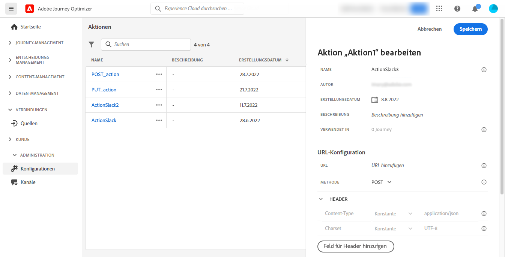

# Erstellen Ihrer ersten Journey {#jo-quick-start}

>[!CONTEXTUALHELP]
>id="ajo_homepage_card2"
>title="Erstellen von Journeys"
>abstract="Erstellen Sie mit **Adobe Journey Optimizer** anhand von in Ereignissen oder Datenquellen gespeicherten kontexbezogenen Daten Echtzeit-Orchestrierungsfälle."

>[!CONTEXTUALHELP]
>id="ajo_journey_create"
>title="Journeys"
>abstract="Entwerfen Sie Customer Journeys, um Ihren Kundinnen und Kunden personalisierte, kontextuelle Erlebnisse zu bieten. Mit Journey Optimizer können Sie Anwendungsfälle für die Echtzeit-Orchestrierung erstellen und dabei kontextuelle Daten nutzen, die in Ereignissen oder Datenquellen gespeichert sind. In der Registerkarte **Übersicht** wird ein Dashboard mit Schlüsselmetriken zu Ihren Journeys angezeigt. Auf der Registerkarte **Durchsuchen** wird eine Liste der vorhandenen Journeys angezeigt."

Adobe Journey Optimizer verfügt über eine Arbeitsfläche für die Omnichannel-Orchestrierung, mit der Marketing-Experten Marketing-Maßnahmen mit Eins-zu-eins-Kundeninteraktionen aufeinander abstimmen können. Die Benutzeroberfläche ermöglicht es, Aktivitäten einfach von der Palette in die Arbeitsfläche zu ziehen, um eine Journey zu erstellen. Die Journey-Benutzeroberfläche wird auf [dieser Seite](journey-ui.md) beschrieben.

Die wichtigsten Schritte zum Erstellen einer Journey werden auf dieser Seite beschrieben. Sie wurden wie folgt optimiert:

Erstellen Sie mehrstufige Journey für Kunden, um eine Abfolge von Interaktionen, Angeboten und Nachrichten kanalübergreifend in Echtzeit zu initiieren. Dieser Ansatz stellt sicher, dass mit Kundinnen und Kunden zu optimalen Zeitpunkten basierend auf ihren Aktionen und relevanten Geschäftssignalen interagiert wird. Zielgruppen werden auf der Grundlage von Verhalten, kontextuellen Daten und Geschäftsereignissen definiert. Die Voraussetzungen hängen von Ihrem Anwendungsfall und dem [Typ von Journey](entry-management.md#types-of-journeys) ab, den Sie erstellen.

Bevor Sie mit der Erstellung Ihres Journey beginnen, stellen Sie sicher, dass die entsprechenden Konfigurationsschritte abgeschlossen sind:

* Wenn Sie Ihre Journey-Trigger beim Empfang eines Ereignisses einzeln testen möchten, **Sie ein Ereignis**. Definieren Sie die erwarteten Informationen und deren Verarbeitung. [Weitere Informationen](../event/about-events.md).

<!--     -->

* Ihr Journey kann auch Adobe Experience Platform-Zielgruppen überwachen, um Nachrichten in Batches an einen bestimmten Profilsatz zu senden. Erstellen Sie dazu **Zielgruppen**. [Weitere Informationen](../audience/about-audiences.md).

<!--     -->

* Definieren Sie eine Verbindung zu einem System, um zusätzliche Informationen abzurufen, die in Ihren Journey verwendet werden (z. B. in Ihren Bedingungen). Diese Verbindung beruht auf einer **Datenquelle**. [Weitere Informationen](../datasource/about-data-sources.md).

<!--     -->

* Journey Optimizer verfügt über [integrierte Nachrichtenfunktionen](../building-journeys/journeys-message.md). Wenn Sie zum Senden Ihrer Nachrichten ein Drittanbietersystem verwenden, können Sie **eine benutzerdefinierte Aktion erstellen**. Weiterführende Informationen finden Sie in diesem [Abschnitt](../action/action.md).

<!--      -->

Für Data Engineers werden die Schritte zur Konfiguration der Journeys, einschließlich Datenquellen, Ereignissen und Aktionen, in [diesem Abschnitt](../configuration/about-data-sources-events-actions.md) beschrieben.

>[!NOTE]
>
>Leitlinien und Einschränkungen für Journeys werden auf [dieser Seite](../start/guardrails.md) beschrieben.

## Erstellen einer Journey {#jo-build}

Gehen Sie wie folgt vor, um eine mehrstufige Journey zu erstellen:

1. Klicken Sie im Menüabschnitt „JOURNEY-MANAGEMENT“ auf **[!UICONTROL Journeys]**.

1. Klicken Sie auf die Schaltfläche **[!UICONTROL Journey erstellen]**, um eine neue Journey zu erstellen.

1. Bearbeiten Sie den Konfigurationsbereich der Journey, um den Namen der Journey zu definieren und ihre Eigenschaften festzulegen. Informationen zum Festlegen der Eigenschaften Ihrer Journey finden Sie auf [dieser Seite](journey-properties.md).

   

Anschließend können Sie mit der Gestaltung Ihrer Journey beginnen.

## Entwerfen der Journey {#jo-design}

Der Omnichannel-Journey-Designer hilft Ihnen bei der Erstellung mehrstufiger Journeys – mit entsprechenden Zielgruppen, Aktualisierungen basierend auf Echtzeit-Kunden- bzw. Geschäftsinteraktionen sowie Omnichannel-Nachrichten mithilfe einer intuitiven Drag-and-Drop-Oberfläche.

1. Ziehen Sie zuerst ein Ereignis oder die Aktivität **Zielgruppe lesen** per Drag-and-Drop aus der Palette in die Arbeitsfläche. Weitere Informationen zum Entwerfen von Journeys finden Sie in [diesem Abschnitt](using-the-journey-designer.md).

   

1. Ziehen Sie zuerst ein Ereignis oder eine Aktivität **Zielgruppe lesen** aus der Palette in die Arbeitsfläche. Weitere Informationen zum Entwerfen von Journeys finden Sie in [diesem Abschnitt](using-the-journey-designer.md).

## Testen der Journey {#jo-test}

Nachdem Sie Ihren Journey erstellt haben, testen Sie ihn vor dem Veröffentlichen. Journey Optimizer bietet einen **Testmodus** als Möglichkeit, Testprofile anzuzeigen, während sie sich auf der Journey bewegen, und potenzielle Fehler zu erkennen, bevor sie aktiviert werden. Durch das Ausführen von Schnelltests wird sichergestellt, dass die Journey ordnungsgemäß funktionieren, sodass Sie sie sicher veröffentlichen können. Erfahren Sie in diesem Abschnitt, wie Sie [ Journey testen](testing-the-journey.md)

Sie können Ihre Journey auch in **Dry Run** ausführen. Der Journey-Probelauf ist ein spezieller Journey-Veröffentlichungsmodus in Adobe Journey Optimizer, der es Journey-Anwendenden ermöglicht, eine Journey mit echten Produktionsdaten zu testen, ohne echte Kundinnen und Kunden zu kontaktieren oder Profilinformationen zu aktualisieren. Mit dieser Funktion können Journey-Anwender Vertrauen in ihr Journey-Design und die Zielgruppenbestimmung gewinnen, bevor sie es live veröffentlichen. Erfahren Sie (in diesem Abschnitt), wie Sie eine Journey im [ veröffentlichen](journey-dry-run.md).

## Veröffentlichen der Journey {#jo-pub}

Sie müssen eine Journey veröffentlichen, um sie zu aktivieren und für neue Profile verfügbar zu machen, damit diese in sie eintreten können. Überprüfen Sie vor dem Veröffentlichen Ihres Journey, ob er gültig ist und keine Fehler vorliegen. Es ist nicht möglich, eine fehlerhafte Journey zu veröffentlichen. Weitere Informationen zum Journey von Veröffentlichungen finden Sie in [Abschnitt](publishing-the-journey.md).

Nach der Veröffentlichung können Sie Ihre Journey mit den dedizierten Reporting-Tools überwachen, um ihre Effektivität zu messen.

Weitere Informationen zu Journey-Berichten finden Sie in diesem [Abschnitt](../reports/live-report.md).

>[!NOTE]
>
>Wenn Sie eine Live **-Journey ändern müssen** [ erstellen Sie eine neue ](journey-ui.md#journey-versions) Ihrer Journey.
