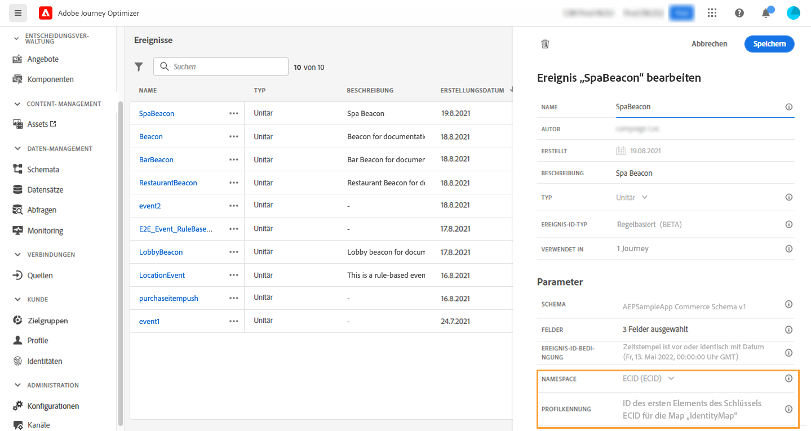

# Erstellen Ihrer ersten Journey {#jo-quick-start}

>[!CONTEXTUALHELP]
>id="ajo_homepage_card2"
>title="Erstellen von Journeys"
>abstract="Erstellen Sie mit **Adobe Journey Optimizer** anhand von in Ereignissen oder Datenquellen gespeicherten kontexbezogenen Daten Echtzeit-Orchestrierungsfälle."

>[!CONTEXTUALHELP]
>id="ajo_journey_create"
>title="Journeys"
>abstract="Entwerfen Sie Customer Journeys, um Ihren Kundinnen und Kunden personalisierte, kontextuelle Erlebnisse zu bieten. Mit Journey Optimizer können Sie Echtzeit-Orchestrierungsfälle anhand von in Ereignissen oder Datenquellen gespeicherten kontextbezogenen Daten erstellen. In der Registerkarte **Übersicht** wird ein Dashboard mit Schlüsselmetriken zu Ihren Journeys angezeigt. Auf der Registerkarte **Durchsuchen** wird eine Liste der vorhandenen Journeys angezeigt."

Adobe Journey Optimizer verfügt über eine Arbeitsfläche für die Omnichannel-Orchestrierung, mit der Marketing-Experten Marketing-Maßnahmen mit Eins-zu-eins-Kundeninteraktionen aufeinander abstimmen können. Die Benutzeroberfläche ermöglicht es, Aktivitäten einfach von der Palette in die Arbeitsfläche zu ziehen, um eine Journey zu erstellen. Die Journey-Benutzeroberfläche wird auf [dieser Seite](journey-ui.md) beschrieben.

Die wichtigsten Schritte zum Erstellen einer Journey werden auf dieser Seite beschrieben. Sie wurden wie folgt optimiert:

Erstellen Sie mehrstufige Customer Journeys, um eine Abfolge von kanalübergreifenden Interaktionen, Angeboten und Nachrichten in Echtzeit zu initiieren. Dieser Ansatz stellt sicher, dass mit Kundinnen und Kunden zu optimalen Zeitpunkten basierend auf ihren Aktionen und relevanten Geschäftssignalen interagiert wird. Zielgruppen werden basierend auf Verhalten, kontextuellen Daten und Geschäftsereignissen definiert. Die Voraussetzungen hängen von Ihrem Anwendungsfall und dem [Typ der Journey](entry-management.md#types-of-journeys) ab, die Sie erstellen.

Weitere Informationen dazu, wie Profile Journeys durchlaufen, und zu Journey-Verarbeitungsraten finden Sie [in diesem Abschnitt](entry-management.md#journey-processing-rate).

Stellen Sie sicher, dass die entsprechenden Konfigurationsschritte ausgeführt wurden, bevor Sie mit dem Erstellen der Journey beginnen:

* Wenn Sie Ihre Journeys beim Empfang eines Ereignisses individuell auslösen möchten, **konfigurieren Sie ein Ereignis**. Definieren Sie die erwarteten Informationen sowie deren Verarbeitungsmethode. [Weitere Informationen](../event/about-events.md).

<!--     -->

* Ihre Journey kann auch Adobe Experience Platform-Zielgruppen überwachen, um Nachrichten in Batches an einen bestimmten Satz von Profilen zu senden. Erstellen Sie dazu **Zielgruppen**. [Weitere Informationen](../audience/about-audiences.md).

<!--     -->

* Definieren Sie eine Verbindung zu einem System, um zusätzliche Informationen abzurufen, die in Ihren Journeys verwendet werden (z. B. in Ihren Bedingungen). Diese Verbindung beruht auf einer **Datenquelle**. [Weitere Informationen](../datasource/about-data-sources.md).

<!--     -->

* Journey Optimizer verfügt über [integrierte Nachrichtenfunktionen](../building-journeys/journeys-message.md). Wenn Sie zum Senden Ihrer Nachrichten ein Drittanbietersystem verwenden, können Sie **eine benutzerdefinierte Aktion erstellen**. Weiterführende Informationen finden Sie in diesem [Abschnitt](../action/action.md).

<!--      -->

Für Data Engineers werden die Schritte zur Konfiguration der Journeys, einschließlich Datenquellen, Ereignissen und Aktionen, in [diesem Abschnitt](../configuration/about-data-sources-events-actions.md) beschrieben.

>[!NOTE]
>
>Leitlinien und Einschränkungen für Journeys werden auf [dieser Seite](../start/guardrails.md) beschrieben.

## Erstellen einer Journey {#jo-build}

Gehen Sie wie folgt vor, um eine mehrstufige Journey zu erstellen:

1. Klicken Sie im Menüabschnitt „JOURNEY-MANAGEMENT“ auf **[!UICONTROL Journeys]**.

1. Klicken Sie auf die Schaltfläche **[!UICONTROL Journey erstellen]**, um eine neue Journey zu erstellen.

1. Bearbeiten Sie den Konfigurationsbereich der Journey, um den Namen der Journey zu definieren und ihre Eigenschaften festzulegen. Informationen zum Festlegen der Eigenschaften Ihrer Journey finden Sie auf [dieser Seite](journey-properties.md).

   

Anschließend können Sie mit der Gestaltung Ihrer Journey beginnen.

## Entwerfen der Journey {#jo-design}

Der Omnichannel-Journey-Designer hilft Ihnen bei der Erstellung mehrstufiger Journeys – mit entsprechenden Zielgruppen, Aktualisierungen basierend auf Echtzeit-Kunden- bzw. Geschäftsinteraktionen sowie Omnichannel-Nachrichten mithilfe einer intuitiven Drag-and-Drop-Oberfläche.

1. Ziehen Sie zuerst ein Ereignis oder die Aktivität **Zielgruppe lesen** per Drag-and-Drop aus der Palette in die Arbeitsfläche. Weitere Informationen zum Entwerfen von Journeys finden Sie in [diesem Abschnitt](using-the-journey-designer.md).

   

1. Ziehen Sie ein Ereignis oder eine Aktivität des Typs **Zielgruppe lesen** per Drag-and-Drop aus der Palette in die Arbeitsfläche. Weitere Informationen zum Entwerfen von Journeys finden Sie in [diesem Abschnitt](using-the-journey-designer.md).

## Testen der Journey {#jo-test}

Nachdem Sie Ihre Journey erstellt haben, testen Sie sie vor dem Veröffentlichen. Journey Optimizer bietet einen **Testmodus** als Möglichkeit, Testprofile anzuzeigen, die die Journey durchlaufen, um so potenzielle Fehler vor der Aktivierung zu erkennen. Das Ausführen von Schnelltests stellt sicher, dass die Journeys ordnungsgemäß funktionieren, sodass Sie sie zuversichtlich veröffentlichen können. [In diesem Abschnitt](testing-the-journey.md) erfahren Sie, wie Sie Journeys testen.

Sie können Ihre Journey auch im **Probelauf** ausführen. Der Journey-Probelauf ist ein spezieller Journey-Veröffentlichungsmodus in Adobe Journey Optimizer, der es Journey-Anwendenden ermöglicht, eine Journey mit echten Produktionsdaten zu testen, ohne echte Kundinnen und Kunden zu kontaktieren oder Profilinformationen zu aktualisieren. Mit dieser Funktion können Journey-Nutzende Vertrauen in ihr Journey-Design und das Zielgruppen-Targeting gewinnen, bevor sie Journeys live schalten. [In diesem Abschnitt](journey-dry-run.md) erfahren Sie, wie Sie eine Journey im Probelaufmodus veröffentlichen.

## Veröffentlichen Sie die Journey. {#jo-pub}

Sie müssen eine Journey veröffentlichen, um sie zu aktivieren und für neue Profile verfügbar zu machen, damit diese in sie eintreten können. Stellen Sie vor der Veröffentlichung Ihrer Journey sicher, dass sie gültig ist und keine Fehler vorliegen. Es ist nicht möglich, eine fehlerhafte Journey zu veröffentlichen. Weitere Informationen zur Veröffentlichung von Journeys finden Sie in diesem [Abschnitt](publish-journey.md).

Nach der Veröffentlichung können Sie Ihre Journey mit den dedizierten Reporting-Tools überwachen, um ihre Effektivität zu messen.

Weitere Informationen zu Journey-Berichten finden Sie in diesem [Abschnitt](../reports/live-report.md).

## Weitere Ressourcen

* **[Journey-Designer – Überblick](using-the-journey-designer.md)**: Lernen Sie die Journey-Arbeitsfläche zum Entwerfen und Orchestrieren von Customer Journeys kennen.
* **[Journey-Aktivitäten](about-journey-activities.md)**: Entdecken Sie alle verfügbaren Aktivitäten, einschließlich Ereignisse, Aktionen und Orchestrierungskomponenten.
* **[Testen von Journeys](testing-the-journey.md)**: Erfahren Sie, wie Sie Ihre Journeys vor der Veröffentlichung in der Produktionsumgebung im Testmodus testen.
* **[Veröffentlichen von Journeys](publish-journey.md)**: Machen Sie sich mit dem Veröffentlichungsprozess von Journeys und der Verwaltung von Live-Journeys vertraut.
* **[Journey-Reporting](report-journey.md)**: Verfolgen und analysieren Sie die Journey-Leistung mit detaillierten Metriken und Erkenntnissen.
* **[Fehlerbehebung bei Journeys](troubleshooting.md)**: Hier finden Sie Lösungen für häufige Journey-Probleme und Best Practices für das Debugging.
* **[Journey-Tutorials](https://experienceleague.adobe.com/de/docs/journey-optimizer-learn/tutorials/journeys/introduction-to-building-a-journey){target="_blank"}**: Sehen Sie sich detaillierte Anleitungsvideos zum Erstellen von Journeys und Best Practices an.

>[!NOTE]
>
>Wenn Sie eine **Live**-Journey ändern müssen, [erstellen Sie eine neue Version](journey-ui.md#journey-filter) der Journey.
