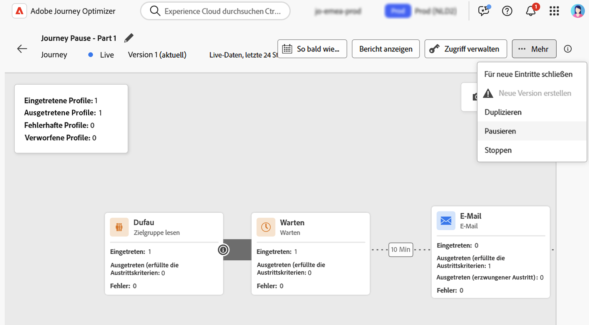
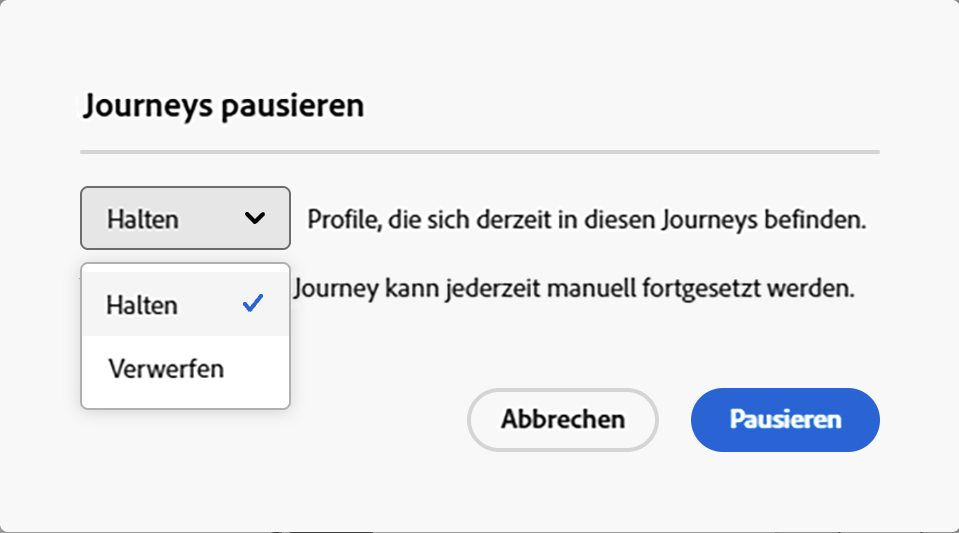
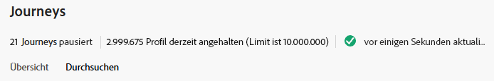
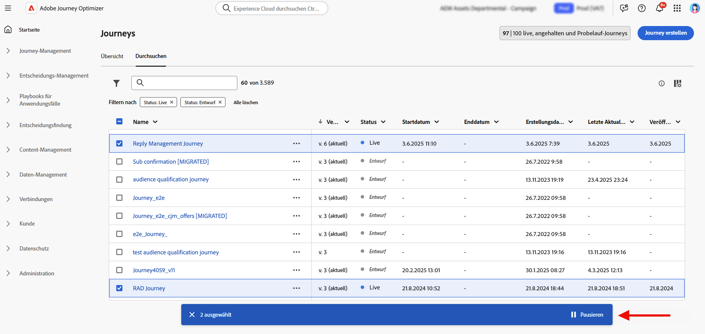
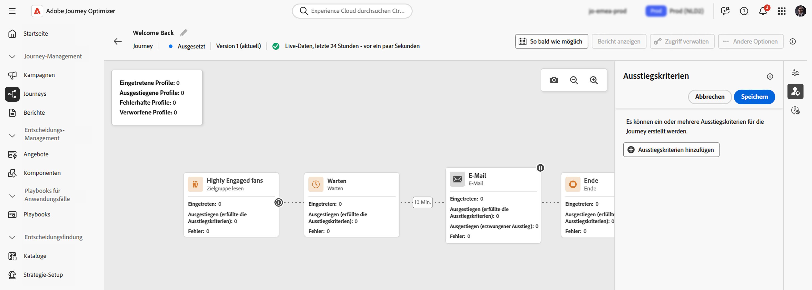
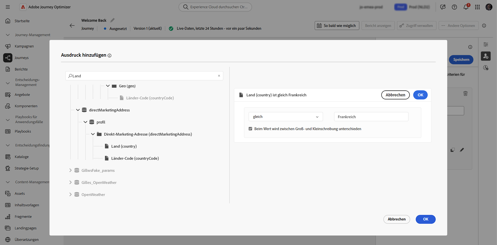
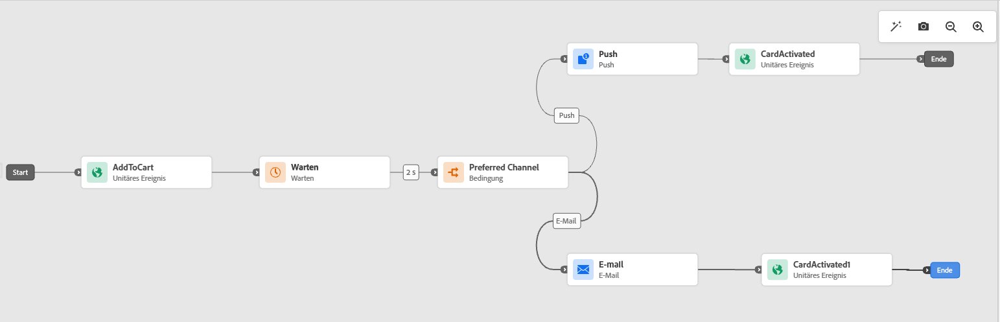

# Pausieren einer Journey {#journey-pause}

>[!CONTEXTUALHELP]
>id="ajo_journey_pause"
>title="Pausieren einer Journey"
>abstract="Das Pausieren einer Live-Journey verhindert den Eintritt neuer Profile. Es besteht die Wahl, ob Profile, die sich derzeit in der Journey befinden, verworfen oder beibehalten werden sollen. Werden sie beibehalten, setzen sie die Ausführung bei der nächsten Aktionsaktivität fort, sobald die Journey neu gestartet wird. Perfekt für Updates oder Notstopps ohne Fortschrittsverlust."

Sie können Ihre Live-Journeys pausieren, um alle erforderlichen Änderungen vorzunehmen, und danach jederzeit wieder fortsetzen.<!--You can choose whether the journey is resumed at the end of the pause period, or whether it stops completely. --> Während der Pause können Sie [Profilattribut-Ausstiegskriterien anwenden](#journey-exit-criteria), um Profile anhand ihrer Attribute auszuschließen. Die Journey wird nach Ablauf des Pausierungszeitraums automatisch fortgesetzt. Sie kann auch [manuell fortgesetzt werden](#journey-resume-steps).

## Wichtigste Vorteile {#journey-pause-benefits}

Das Pausieren und Fortsetzen von Journeys gibt Journey-Anwendenden mehr Kontrolle und Flexibilität, da Live-Journeys vorübergehend ausgesetzt werden können, ohne das Kundenerlebnis zu stören. Während der Pause werden keine Nachrichten gesendet und die Profile verbleiben in einem ausgesetzten Zustand, bis die Journey fortgesetzt wird.

Diese Funktion reduziert das Risiko des Versands unbeabsichtigter Nachrichten bei Fehlern oder Updates (z. B. bei Änderungen des Nachrichteninhalts), unterstützt höhere Sicherheit beim Journey-Management und erhöht das Vertrauen der Anwendenden. Durch die Sichtbarkeit pausierter Journeys und deren Status direkt in der Benutzeroberfläche werden die Transparenz und die betriebliche Agilität weiter erhöht.

>[!CAUTION]
>
>* Die Berechtigungen zum Pausieren und Fortsetzen von Journeys sind auf Benutzende mit der Berechtigung **[!DNL Publish journeys]** auf hoher Ebene beschränkt. Weitere Informationen zur Verwaltung der Zugriffsrechte für [!DNL Journey Optimizer]-Benutzende finden Sie in [diesem Abschnitt](../administration/permissions-overview.md).
>
>* Bevor Sie mit der Verwendung der Funktionen zum Pausieren/Fortsetzen beginnen, [lesen Sie die Informationen zu Leitlinien und Einschränkungen](#journey-pause-guardrails).


## Pausieren einer Journey {#journey-pause-steps}

Jede **Live**-Journey kann pausiert werden.

Gehen Sie wie folgt vor, um Ihre Journey zu pausieren:

1. Öffnen Sie die zu pausierende Journey.
1. Klicken Sie auf die Schaltfläche **… Mehr** im rechten oberen Bereich der Journey-Arbeitsfläche und wählen Sie **Anhalten** aus.

   

1. Wählen Sie aus, wie Profile, die sich derzeit in der Journey befinden, verwaltet werden sollen.

   {width="50%" align="left"}

   Sie haben folgende Möglichkeiten:

   * **Halten** von Profilen – Profile warten am nächsten **Aktionsknoten** bis die Journey fortgesetzt wird
   * **Verwerfen** von Profilen – Profile werden beim nächsten **Aktionsknoten** von der Journey ausgeschlossen

   Wenn Sie eine Journey pausieren, wird davon ausgegangen, dass Sie sie zu einem späteren Zeitpunkt fortsetzen möchten. Eine Journey kann jedoch nicht auf unbestimmte Zeit pausiert werden. Stattdessen können Sie festlegen, wie lange die Journey pausiert werden soll (zwischen 1 und 14 Tagen). Nach der eingestellten Anzahl an Tagen wird die Journey automatisch fortgesetzt.

1. Klicken Sie zur Bestätigung auf die Schaltfläche **Anhalten**.

Die maximale Anzahl von Profilen, die in pausierten Journeys für Ihr Unternehmen enthalten sein können, ist im Journey-Inventar zu sehen. Sie wird nur angezeigt, wenn mindestens eine Journey pausiert wurde. Dieser Indikator zeigt auch die Gesamtzahl der pausierten Journeys an. Er wird alle 30 Minuten aktualisiert. Weitere Informationen finden Sie unter [Leitlinien und Einschränkungen](#guardrails-and-limitations).

{width="50%" align="left"}

In der Liste der Journeys können eine oder mehrere **Live**-Journeys pausiert werden. Wählen Sie zum Pausieren einer Gruppe von Journeys (_Massenpause_) die Journeys in der Liste aus und klicken Sie auf die Schaltfläche **Anhalten** in der blauen Leiste am unteren Bildschirmrand. Die Schaltfläche **Anhalten** ist nur verfügbar, wenn **Live**-Journeys ausgewählt sind.



## Ausführungslogik für pausierte Journeys {#journey-pause-exec}

Wenn eine Journey pausiert wird, werden neue Eintritte unabhängig vom Modus zum Halten/Verwerfen immer verworfen.

Wenn eine Journey pausiert ist, hängen die Profilverwaltung und Aktivitätsausführung von der Aktivität ab. Die einzelnen Verhaltensweisen werden nachfolgend beschrieben. Sehen Sie sich dieses [End-to-End-Beispiel](#journey-pause-sample) an, um ein umfassendes Verständnis zu erlangen.


| Journey-Aktivität | Wenn die Journey pausiert ist |
|-------------------------|--------------------------------------------------|
| [Zielgruppen-Qualifizierung](audience-qualification-events.md) | <ul> <li>Am ersten Knoten auf der Arbeitsfläche: Jede Profilqualifizierung für die Zielgruppe wird verworfen </li><li>In anderen Knoten: Dasselbe Verhalten wie bei einer Live-Journey. Wenn die Zielgruppen-Qualifizierung jedoch nach einer Aktivität vom Typ <strong>Aktion</strong> erfolgt und die bzw. der Benutzende bei dieser Aktion pausiert wird, wird die Zielgruppen-Qualifizierung verworfen. </li></ul> |
| [Unitäres Ereignis](general-events.md) | <ul> <li>Am ersten Knoten auf der Arbeitsfläche: Das Ereignis wird verworfen</li><li>In anderen Knoten: Dasselbe Verhalten wie bei einer Live-Journey, aber das Ereignis wird verworfen, falls das Ereignis nach einer Aktivität vom Typ <strong>Aktion</strong> erfolgt und die bzw. der Benutzende in dieser Aktion pausiert ist. </li></ul> |
| [Zielgruppe lesen](read-audience.md) | Dasselbe Verhalten wie bei einer Live-Journey mit einigen Besonderheiten: <ol> <li> Wenn nach dem Start der Aktivität <strong>Zielgruppe lesen</strong> <strong>Anhalten</strong> gedrückt wurde, werden Profile, die in die Journey eingetreten sind, fortgesetzt (bis zur nächsten Aktivität vom Typ <strong>Aktion</strong>). Wenn noch nicht die gesamte Zielgruppe eingetreten ist, werden die verbleibenden Profile in der Warteschlange verworfen, da die Journey Zielgruppen mit einer bestimmten Geschwindigkeit liest.</li><li> Bei einzelnen Ausführungen: Zum Zeitpunkt der Fortsetzung wird kein Fehler angezeigt, wenn das geplante Datum vor dem Datum der Fortsetzung lag. Dieser Zeitplan würde ignoriert werden.</li><li>Für inkrementelle Journeys: <ul><li>Wenn das Pausieren vor dem ersten Auftreten erfolgt, wird bei Fortsetzung die vollständige Zielgruppe abgespielt. </li><li>Wenn das Pausieren beispielsweise am 4. Tag eines täglichen Intervalls stattfindet und die Journey bis zum 9. Tag pausiert bleibt, werden bei der Fortsetzung alle Profile einbezogen, die vom 4. bis 9. eingetreten sind  </li></ul></ol> |
| [Reaktion](reaction-events.md) | Dasselbe Verhalten wie bei einer Live-Journey, aber das Reaktionsereignis wird verworfen, wenn die Reaktion nach einer Aktivität vom Typ <strong>Aktion</strong> erfolgt und die bzw. der Benutzende in dieser Aktion pausiert ist. |
| [Warten](wait-activity.md) | Dasselbe Verhalten wie bei einer Live-Journey |
| [Bedingung](condition-activity.md) | Dasselbe Verhalten wie bei einer Live-Journey |
| [Inhaltsentscheidung](content-decision.md) | Profile werden basierend auf der Auswahl der Benutzerin bzw. des Benutzers nach dem Pausieren der Journey geparkt oder verworfen |
| [Kanalaktion](journeys-message.md) | Profile werden basierend auf der Auswahl der Benutzerin bzw. des Benutzers nach dem Pausieren der Journey geparkt oder verworfen |
| [Benutzerdefinierte Aktion](../action/action.md) | Profile werden basierend auf der Auswahl der Benutzerin bzw. des Benutzers nach dem Pausieren der Journey geparkt oder verworfen |
| [Profil aktualisieren](update-profiles.md) und [Springen](jump.md) | Profile werden basierend auf der Auswahl der Benutzerin bzw. des Benutzers nach dem Pausieren der Journey geparkt oder verworfen |
| [Externe Datenquelle](../datasource/external-data-sources.md) | Dasselbe Verhalten wie bei einer Live-Journey |
| [Ausstiegskriterien](journey-properties.md#exit-criteria) | Dasselbe Verhalten wie bei einer Live-Journey |


In [diesem Abschnitt](#discards-troubleshoot) erfahren Sie, wie Sie Fehler bei Verwerfungen beheben können.

## Fortsetzen pausierter Journeys {#journey-resume-steps}

>[!CONTEXTUALHELP]
>id="ajo_journey_resume"
>title="Fortsetzen von Journeys"
>abstract="Wenn eine pausierte Journey fortgesetzt wird, können wieder neue Profile eintreten. Wenn Profile während der Pause gewartet haben, setzen sie ihre Journey fort. Ideal zum sicheren Neustart von Journeys nach Updates oder Pausen."

Pausierte Journeys werden nach Ablauf des maximalen Pausierungszeitraums von 14 Tagen automatisch fortgesetzt. Sie können jederzeit manuell fortgesetzt werden. Durch das Fortsetzen einer pausierten Journey können wieder neue Profile eintreten. Wenn Profile während der Pause gewartet haben, setzen sie ihre Journey fort. Ideal zum sicheren Neustart von Journeys nach Updates oder Pausen.

Mit den folgenden Schritten wird eine pausierte Journey fortgesetzt und Journey-Ereignisse werden wieder überwacht:

1. Öffnen Sie die Journey, die fortgesetzt werden soll.
1. Wählen Sie die Schaltfläche **… Mehr** im rechten oberen Bereich der Journey-Arbeitsfläche aus und wählen Sie dann **Fortsetzen** aus.

   Die Journey wechselt in den Status **Wird fortgesetzt**. Wenn die Journey fortgesetzt wird, beginnen innerhalb einer Minute neue Eintritte. Das Fortsetzen von beibehaltenen Profilen kann einige Zeit in Anspruch nehmen – Profile werden mit einer Rate von 5.000 TPS fortgesetzt.  Da alle Profile fortgesetzt werden müssen, damit die Journey wieder **Live** ist, kann der Übergang vom Status **Wird fortgesetzt** zum Status **Live** einige Zeit dauern.

1. Klicken Sie zur Bestätigung auf die Schaltfläche **Fortsetzen**.


Aus der Liste der Journeys können eine oder mehrere **pausierte** Journeys fortgesetzt werden. Um eine Gruppe von Journeys fortzusetzen (_Massenfortsetzung_), wählen Sie diese aus und klicken Sie auf die Schaltfläche **Fortsetzen** in der blauen Leiste am unteren Bildschirmrand. Beachten Sie, dass die Schaltfläche **Fortsetzen** nur verfügbar ist, wenn **pausierte** Journeys ausgewählt sind.


## Anwenden von Ausstiegskriterien in einer pausierten Journey {#journey-exit-criteria}

Wenn eine Journey pausiert ist, kann ein Ausstiegskriterium basierend auf Profilattributen angewendet werden. Dieser Filter ermöglicht den Ausschluss von Profilen, die zum Zeitpunkt der Fortsetzung dem definierten Ausdruck entsprechen. Sobald der auf Profilattributen basierende Filter festgelegt ist, wird er auf Aktionsknoten erzwungen, auch für den Eintritt neuer Profile. Bestehende Profile, die den Kriterien entsprechen, und neue Profile, die in die Journey eintreten, werden **beim nächsten Aktionsknoten**, auf den Sie treffen, von der Journey ausgeschlossen.

Mit diesen Schritten werden z. B. alle französischen Kundinnen und Kunden von einer pausierten Journey ausgeschlossen:

1. Navigieren Sie zur pausierten Journey, die geändert werden soll.

1. Wählen Sie das Symbol **Ausstiegskriterium** aus.

   

1. Klicken Sie in den Einstellungen für **Ausstiegskriterien** auf **Ausstiegskriterien hinzufügen**, um einen Filter basierend auf Profilattributen zu definieren.

1. Legen Sie den Ausdruck zum Ausschluss von Profilen fest, deren Länderattribut gleich Frankreich ist.

   

1. Speichern Sie den Filter und klicken Sie auf die Schaltfläche **Journey aktualisieren**, um die Änderungen anzuwenden.

1. [Setzen Sie die Journey fort](#journey-resume-steps).

   Bei der Fortsetzung werden alle Profile mit dem Länderattribut Frankreich beim nächsten Aktionsknoten automatisch von der Journey ausgeschlossen. Alle neuen Profile mit dem Länderattribut Frankreich, die versuchen, in die Journey einzutreten, werden ebenfalls beim nächsten Aktionsknoten blockiert.

Beachten Sie, dass Profilausschlüsse für Profile, die sich derzeit in der Journey befinden, und für neue Profile nur dann erfolgen, **wenn sie einen Aktionsknoten erreichen**.

>[!CAUTION]
>
>* Pro Journey können Sie nur **ein** auf Profilattributen basierendes Ausstiegskriterium festlegen.
>
>* Sie können ein auf Profilattributen basierendes Ausstiegskriterium nur in **pausierten** Journeys erstellen, aktualisieren oder löschen.
>
>* Weitere Informationen zu den auf Profilattributen basierenden Ausstiegskriterien finden Sie [in diesem Abschnitt](journey-properties.md#profile-exit-criteria).

## Leitlinien und Einschränkungen {#journey-pause-guardrails}

* Eine Journey-Version kann bis zu **14 Tage** lang pausiert werden, wobei in pausierten Journeys in Ihrem Unternehmen insgesamt maximal **10 Millionen Profile** zulässig sind.
Diese Begrenzung zählt die Gesamtzahl der Profile, die in allen pausierten Journey enthalten sind, nicht in den einzelnen Profilen. Wenn beispielsweise dieselben 5M-Profile in zwei pausierten Journey gespeichert werden, ist die 10M-Grenze erreicht.
Dieses Limit wird alle 30 Minuten überprüft. Dies bedeutet, dass Sie den Schwellenwert von 10 Millionen möglicherweise vorübergehend überschreiten. Sobald das System dies jedoch erkennt, werden alle zusätzlichen Profile automatisch verworfen.

  Wenn Sie Journeys fortsetzen, um die Anzahl der zurückgehaltenen Profile wieder unter das Limit zu bringen, wird die jeweilige Journey sofort fortgesetzt. Es kann jedoch bis zu 30 Minuten dauern, bis die Profilanzahl aktualisiert wird. Während dieser Zeit betrachtet das System diese Profile möglicherweise immer noch als pausiert.

* Bei Journeys mit [eingehenden Aktivitäten](../channels/gs-channels.md#inbound-channels) (z. B. In-App, Web usw.) wird durch das Pausieren der Journey die bereits ausgelöste Kommunikation nicht unterbrochen. Wenn sich ein Profil vor dem Pausieren für eine eingehende Aktivität qualifiziert hat, wird die entsprechende Nachricht weiterhin zugestellt. Um alle eingehenden Kommunikationen zu stoppen, müssen Sie die Journey stoppen.
* Pausierte Journeys werden auf das Live-Journey-Kontingent angerechnet.
* In die Journey eingetretene Profile, die während der Pause verworfen wurden, werden weiterhin als ansprechbare Profile gezählt.
* Pausierte Journeys werden genau wie Live-Journeys in allen Geschäftsregeln berücksichtigt.
* Das maximale globale Journey-Timeout gilt weiterhin für pausierte Journeys. Wenn sich ein Profil z. B. 90 Tage lang in einer Journey befand und die Journey pausiert wurde, verlässt dieses Profil die Journey weiterhin am 91. Tag.
* Profile werden in einer pausierten Journey **verworfen**, wenn sie eine Aktionsaktivität erreichen. Wenn sie während des Pausierungszeitraums einer Journey auf einer Warteaktivität bleiben und diese Warteaktivität nach der Fortsetzung der Journey beenden, setzen sie die Journey fort und werden nicht verworfen. [Siehe das End-to-End-Beispiel](#journey-pause-sample)
* Auch nach der Pause, wenn weiterhin Ereignisse verarbeitet werden, werden diese Ereignisse auf das Kontingent der Anzahl der Journey-Ereignisse pro Sekunde angerechnet, danach tritt die Drosselung für ein unitäres Ereignis ein
* Wenn Profile in einer pausierten Journey enthalten sind, werden bei der Fortsetzung Profilattribute aktualisiert
* In pausierten Journeys werden weiterhin Bedingungen ausgeführt, d. h. wenn eine Journey aufgrund von Datenqualitätsproblemen pausiert wurde, kann jede Bedingung vor einem Aktionsknoten mit falschen Daten ausgewertet werden
* Bei einer inkrementellen zielgruppenbasierten Journey des Typs **Zielgruppe lesen** wird die Pausendauer berücksichtigt. Dies ist nicht der Fall für Zielgruppen-Qualifizierungs-Journeys oder ereignisbasierte Journeys (wenn während einer Pause eine Zielgruppen-Qualifizierung oder ein Ereignis empfangen wird, und dies die erste Aktivität in der Journey ist, werden diese Ereignisse verworfen)
* Wenn Profile in einer Journey enthalten sind und diese Journey nach einigen Tagen automatisch fortgesetzt wird, setzen Profile die Journey fort und scheiden nicht aus ihr aus. Wenn Sie möchten, dass sie ausscheiden, müssen Sie die Journey stoppen
* In pausierten Journeys werden Warnhinweise nicht für [Batch-Segmentwarnungen](../reports/alerts.md#alert-read-audiences) ausgelöst
* Es gibt keine Auditprotokolle im System, wenn nach 14 Tagen der Pausenstatus der Journey beendet wird
* Einige verworfene Profile können im Journey-Schrittereignis, aber nicht im Bericht angezeigt werden. Beispiel:
   * Verwerfen von Geschäftsereignissen für **Zielgruppe lesen**
   * Aufträge vom Typ **Zielgruppe lesen** werden aufgrund einer angehaltenen Journey verworfen
   * Verworfene Ereignisse, wenn die Aktivität vom Typ **Ereignis** nach einer Aktion stattfand, bei der das Profil wartete


## End-to-End-Beispiel {#journey-pause-sample}

Nehmen wir die folgende Journey als Beispiel:

{zoomable="yes"}

Beim Pausieren dieser Journey wählen Sie aus, ob Profile **verworfen** oder **gehalten** werden sollen, und Profile werden wie folgt verwaltet:

1. Aktivität vom Typ **AddToCart**: Alle neuen Profileintritte werden blockiert. Wenn ein Profil bereits vor einer Pause in die Journey eingetreten ist, fährt es mit dem nächsten Aktionsknoten fort.
1. Aktivität vom Typ **Warten**: Profile warten weiterhin normal auf dem Knoten und werden ihn verlassen, auch wenn die Journey pausiert wird.
1. **Bedingung**: Profile durchlaufen weiterhin Bedingungen und wechseln je nach dem in der Bedingung definierten Ausdruck zur richtigen Verzweigung.
1. Aktivitäten vom Typ **Push**/**Email**: Während einer pausierten Journey beginnen Profile zu warten oder werden (basierend auf der Auswahl, die die Benutzerin oder der Benutzer zum Zeitpunkt der Pause getroffen hat) am nächsten Aktionsknoten verworfen. Profile warten also ab oder werden dort verworfen.
1. **Ereignisse** nach Knoten vom Typ **Aktion**: Wenn ein Profil auf einen Knoten vom Typ **Aktion** wartet und danach eine Aktivität vom Typ **Ereignis** vorhanden ist, wird das Profil verworfen, wenn dieses Ereignis ausgelöst wird.

Entsprechend diesem Verhalten können Sie sehen, dass die Profilanzahl bei der pausierten Journey steigt, und zwar hauptsächlich in Aktivitäten vor Aktivitäten vom Typ **Aktion**. In diesem Beispiel ist die Aktivität **Warten** weiterhin aktiviert, wodurch die Anzahl der Profile, die die Aktivität **Bedingung** durchlaufen, beim Verlassen dieser Aktivität steigt.

Wenn Sie diese Journey fortsetzen:

1. Neue Journey-Eintritte beginnen innerhalb einer Minute.
1. Profile, die zu dem Zeitpunkt in der Journey auf Aktivitäten vom Typ **Aktion** gewartet haben, werden mit einer Rate von 5.000 TPS fortgesetzt. Sie können dann in die **Aktion** eintreten, auf die sie gewartet haben, und die Journey fortsetzen.

## Fehlerbehebung bei Verwerfungen von Profilen in pausierten Journeys {#discards-troubleshoot}

Sie können den [Abfrage-Service von Adobe Experience Platform](https://experienceleague.adobe.com/docs/experience-platform/query/api/getting-started.html?lang=de){target="_blank"} verwenden, um Schrittereignisse abzufragen, die je nach Zeitpunkt weitere Informationen zu Verwerfungen von Profilen enthalten können.

* Verwenden Sie den folgenden Code für Verwerfungen, die vor dem Eintritt des Profils in die Journey erfolgen:

  ```sql
  SELECT
  TIMESTAMP,
  _experience.journeyOrchestration.profile.ID,
  to_json(_experience.journeyOrchestration)
  FROM
  journey_step_events
  WHERE
  _experience.journeyOrchestration.serviceEvents.dispatcher.eventType = 'PAUSED_JOURNEY_VERSION'
  AND _experience.journeyOrchestration.journey.versionID=<jvId>  
  ```

  Dadurch werden die Verwerfungen aufgelistet, die beim Eintritt in die Journey aufgetreten sind:

   1. Wenn eine Zielgruppen-Journey ausgeführt wird und der erste Knoten noch verarbeitet wird, werden alle nicht verarbeiteten Profile verworfen, falls die Journey pausiert wird.

   1. Wenn ein neues unitäres Ereignis für den Startknoten eintrifft (um einen Eintritt auszulösen), während die Journey pausiert ist, wird das Ereignis verworfen.

* Verwenden Sie den folgenden Code für Verwerfungen, die auftreten, wenn sich das Profil bereits in der Journey befindet:

  ```sql
  SELECT
  TIMESTAMP,
  _experience.journeyOrchestration.profile.ID,
  to_json(_experience.journeyOrchestration)
  FROM
  journey_step_events
  WHERE
  _experience.journeyOrchestration.serviceEvents.stateMachine.eventType = 'JOURNEY_IN_PAUSED_STATE'
  AND _experience.journeyOrchestration.journey.versionID=<jvId> 
  ```

  Dieser Befehl listet Verwerfungen auf, die beim Speichern von Profilen in einer Journey aufgetreten sind:

   1. Wenn die Journey pausiert und die Option „Verwerfen“ aktiviert ist und vor dem Pausieren bereits ein Profil eingegeben wurde, wird dieses Profil beim Erreichen des nächsten Aktionsknotens verworfen.

   1. Wenn die Journey pausiert wurde und die Option „Halten“ ausgewählt war, aber Profile aufgrund eines Überschreitens des 10-Millionen-Kontingents verworfen wurden, werden diese Profile auch dann verworfen, wenn sie den nächsten Aktionsknoten erreichen.


