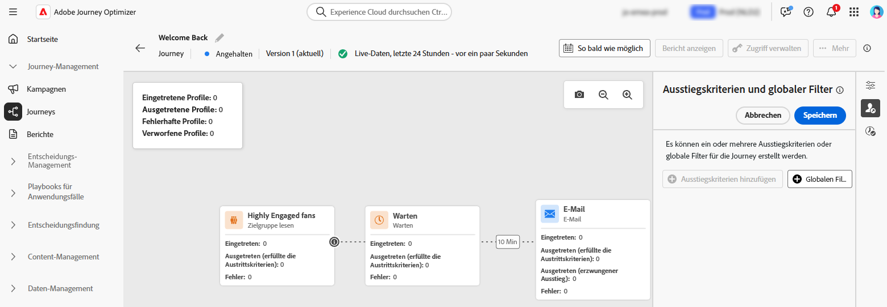

# Journey anhalten {#journey-pause}

>[!CONTEXTUALHELP]
>id="ajo_journey_pause"
>title="Journey anhalten"
>abstract="Live-Journey anhalten, um den Eintritt neuer Profile zu verhindern. Wählen Sie aus, ob die aktuell auf der Journey befindlichen Profile verworfen oder beibehalten werden sollen. Wird sie beibehalten, wird die Ausführung bei der nächsten Aktionsaktivität fortgesetzt, sobald die Journey neu gestartet wird. Perfekt für Updates oder Notstopps, ohne den Fortschritt zu verlieren."

Sie können Ihre Live-Journey anhalten, alle erforderlichen Änderungen vornehmen und sie jederzeit wieder aufnehmen.<!--You can choose whether the journey is resumed at the end of the pause period, or whether it stops completely. --> Während der Pause können Sie [globale Filter anwenden](#journey-global-filters) um Profile basierend auf ihren Attributen auszuschließen. Die Journey wird nach Ablauf der Pausenzeit automatisch fortgesetzt. Sie können sie auch [manuell fortsetzen](#journey-resume-steps).

>[!AVAILABILITY]
>
>Diese Funktion ist nur für eine Reihe von Organisationen verfügbar (eingeschränkte Verfügbarkeit) und wird in einer zukünftigen Version global eingeführt.

## Wichtigste Vorteile {#journey-pause-benefits}

Durch das Anhalten und Fortsetzen von Journey erhalten Journey-Anwender mehr Kontrolle und Flexibilität, da Live-Journey vorübergehend ausgesetzt werden können, ohne das Kundenerlebnis zu stören. Wenn angehalten, werden keine Nachrichten gesendet und die Profile verbleiben in einem ausgesetzten Zustand, bis die Journey fortgesetzt wird.

Diese Funktion reduziert das Risiko des Versands unbeabsichtigter Nachrichten während Fehlern oder Updates (z. B. Änderung des Nachrichteninhalts), unterstützt ein sichereres Journey-Management und erhöht das Vertrauen der Anwender. Die Einblicke in pausierte Journey und deren Status direkt in der Benutzeroberfläche erhöhen die Transparenz und die betriebliche Agilität.

>[!CAUTION]
>
>* Die Berechtigungen zum Anhalten und Fortsetzen von Journey sind auf Benutzende mit der Berechtigung **[!DNL Publish journeys]** auf hoher Ebene beschränkt. Weitere Informationen zur Verwaltung der Zugriffsrechte für [!DNL Journey Optimizer]-Benutzende finden Sie in [diesem Abschnitt](../administration/permissions-overview.md).
>
>* Bevor Sie mit der Pause-/Wiederaufnahmefunktion beginnen, lesen [ die Leitplanken und Einschränkungen ](journey-pause-guardrails).

## Anhalten einer Journey {#journey-pause-steps}

Sie können jede **Live**-Journey anhalten.

Gehen Sie wie folgt vor, um den Journey anzuhalten:

1. Öffnen Sie die Journey, die Sie anhalten möchten.
1. Klicken Sie auf die Schaltfläche **…** oben rechts auf der Journey-Arbeitsfläche und wählen Sie **Pause**.

   {width="80%" align="left"}

1. Wählen Sie die Option Verwalten von Profilen aus, die sich derzeit auf der Journey befinden.

   {width="50%" align="left"}

   Sie haben folgende Möglichkeiten:

   * **Hold** Profile - Profile warten, bis die Journey fortgesetzt wird
   * **Verwerfen** Profile - Profile werden beim nächsten Aktionsknoten von der Journey ausgeschlossen

1. Klicken Sie zur Bestätigung auf **Pause**-Schaltfläche.

In der Liste Ihrer Journey können Sie eine oder mehrere **Live**-Journey anhalten. Um eine Gruppe von Journey anzuhalten (_Bulk Pause_), wählen Sie sie in der Liste aus und klicken Sie auf die Schaltfläche **Pause** in der blauen Leiste am unteren Bildschirmrand. Die **Pause**-Schaltfläche ist nur verfügbar, wenn **Live**-Journey ausgewählt sind.

{width="80%" align="left"}

### Verhalten bei pausierten Journey

Wenn eine Journey angehalten wird, werden neue Eingänge unabhängig vom Halten-/Verwerfen-Modus immer verworfen.

Die Profilverwaltung beim Anhalten einer Journey hängt von der Aktivität ab. Die Verhaltensweisen werden im Folgenden beschrieben. Ein vollständiges Verständnis finden Sie auch in diesem [End-to-End-Beispiel](#journey-pause-sample).

| Journey-Aktivität | Profilverwaltung | Anmerkungen |
|-------------------------|--------------------------------------------------|------------------------|
| [Zielgruppen-Qualifizierung](audience-qualification-events.md) | Im 1. Knoten: Verworfene   In anderen Knoten: Dasselbe Verhalten wie in einer Live-Journey. Wenn die Zielgruppen-Qualifizierung jedoch nach einer Aktionsaktivität erfolgt und der/die Benutzende bei dieser Aktion angehalten wird, wird die Zielgruppen-Qualifizierung verworfen. |          |
| [Geschäftsereignis](general-events.md) | Verworfen |    |
| [Unitäres Ereignis](general-events.md) | Im 1. Knoten: Verworfen  In anderen Knoten: Dasselbe Verhalten wie auf einer Live-Journey. Wenn das Ereignis jedoch nach einer Aktionsaktivität eintritt und der/die Benutzende bei dieser Aktion angehalten wird, wird das Ereignis verworfen. | Erstellen einer Nachricht |
| [Zielgruppe lesen](read-audience.md) | Dasselbe Verhalten wie bei einer Live-Journey mit einigen Besonderheiten:   Wenn die Pause gedrückt wurde, nachdem die Aktivität „Zielgruppe lesen“ gestartet wurde, werden Profile, die auf die Journey zugegriffen haben, fortgesetzt (bis zur nächsten Aktionsaktivität). Wenn Journey Zielgruppen mit einer bestimmten Geschwindigkeit liest und die vollständige Zielgruppe noch nicht eingegeben wurde, werden die verbleibenden Profile in der Warteschlange verworfen. | - Für einzelne Ausführungen: Zum Zeitpunkt der Wiederaufnahme werden keine Fehler angezeigt, wenn das geplante Datum vor dem Wiederaufnahme-Datum lag. Dieser Zeitplan würde ignoriert.  - Für inkrementelle Journey:   Wenn die Pause vor dem ersten Vorkommen eintritt, wird bei der Wiederaufnahme die gesamte Zielgruppe wiedergegeben.  Wenn die Pause beispielsweise am 4. Tag eines täglichen Wiederholungszeitraums stattfindet und das Journey bis zum 9. Tag angehalten bleibt, werden bei der Wiederaufnahme alle Profile einbezogen, die vom 4. bis 9. eingetreten sind |
| [Reaktion](reaction-events.md) | Dasselbe Verhalten wie bei einer Live-Journey. Wenn die Reaktion jedoch nach einer Aktionsaktivität erfolgt und der/die Benutzende bei dieser Aktion angehalten wird, wird das Ereignis verworfen. |
| [Warten](wait-activity.md) | Gleiches Verhalten wie bei einer Live-Journey |           |
| [Bedingung](condition-activity.md) | Gleiches Verhalten wie bei einer Live-Journey |         |
| Inhaltsentscheidung | Profile werden basierend auf der Auswahl der Benutzerin bzw. des Benutzers nach dem Anhalten des Journey geparkt oder verworfen |            |
| [Kanalaktion](journeys-message.md) | Profile werden basierend auf der Auswahl der Benutzerin bzw. des Benutzers nach dem Anhalten des Journey geparkt oder verworfen |          |
| [Benutzerdefinierte Aktion](../action/action.md) | Profile werden basierend auf der Auswahl der Benutzerin bzw. des Benutzers nach dem Anhalten des Journey geparkt oder verworfen |            |
| [Profil aktualisieren](update-profiles.md) und [springen](jump.md) |  |       |
| [Externe Daten - Source](../datasource/external-data-sources.md) | Gleiches Verhalten wie bei einer Live-Journey |           |
| [Ausstiegskriterien](journey-properties.md#exit-criteria) | Gleiches Verhalten wie bei einer Live-Journey |           |

## Fortsetzen pausierter Journey {#journey-resume-steps}

>[!CONTEXTUALHELP]
>id="ajo_journey_resume"
>title="Journey fortsetzen"
>abstract="Setzt eine pausierte Journey fort, damit neue Profile erneut eintreten können. Wenn Profile während der Pause gewartet haben, setzen sie ihren Journey fort. Ideal zum sicheren Neustart von Journey nach Updates oder Pausen."

Anhaltende Journey werden nach Ablauf der maximalen Pausenzeit von 14 Tagen automatisch wieder aufgenommen. Sie können jederzeit manuell fortgesetzt werden. Eine angehaltene Journey fortsetzen, damit neue Profile erneut eintreten können. Wenn Profile während der Pause gewartet haben, setzen sie ihren Journey fort. Ideal zum sicheren Neustart von Journey nach Updates oder Pausen.

Gehen Sie wie folgt vor, um eine pausierte Journey fortzusetzen und wieder Journey-Ereignisse zu überwachen:

1. Öffnen Sie die Journey, die Sie fortsetzen möchten.
1. Klicken Sie auf die Schaltfläche **…** oben rechts auf der Journey-Arbeitsfläche und wählen Sie **Fortsetzen**.

   Die Journey wechselt in den Status **Wiederaufnahme**. Wenn die Journey fortgesetzt wird, beginnen innerhalb einer Minute neue Eintritte. Die Wiederaufnahme von gespeicherten Profilen kann einige Zeit in Anspruch nehmen.  Da alle Profile erneut aufgenommen werden müssen, damit die Journey wieder **Live** ist, kann der Übergang vom **Wiederaufnahme** zum **Live**-Status einige Zeit dauern.

1. Klicken Sie zur Bestätigung auf **Fortsetzen**-Schaltfläche.

Aus der Liste Ihrer Journey Journey können Sie eine oder mehrere (**)** fortsetzen. Um eine Gruppe von Journey fortzusetzen (_Bulk Resume_), wählen Sie sie aus und klicken Sie auf die **Fortsetzen**-Schaltfläche in der blauen Leiste am unteren Bildschirmrand. Beachten Sie, dass die **Fortsetzen**-Schaltfläche nur verfügbar ist, wenn **Paused** Journey ausgewählt sind.

## Anwenden eines globalen Filters auf Profile in einem pausierten Journey  {#journey-global-filters}

Wenn ein Journey angehalten wird, können Sie einen globalen Filter basierend auf Profilattributen anwenden. Dieser Filter ermöglicht den Ausschluss von Profilen, die zum Zeitpunkt der Wiederaufnahme dem definierten Ausdruck entsprechen. Sobald der globale Filter festgelegt ist, gilt er für Aktionsknoten, auch für den Eintritt neuer Profile. Profile, die den Kriterien entsprechen, und neue Profile, die versuchen einzutreten, werden von der Journey ausgeschlossen (**nächsten Aktionsknoten** auf den sie stoßen.

Gehen Sie wie folgt vor, um beispielsweise alle französischen Kunden von einer angehaltenen Journey auszuschließen:

1. Navigieren Sie zu der angehaltenen Journey, die Sie ändern möchten.

1. Klicken Sie auf das Symbol **Ausstiegskriterien und globaler Filter** .

   {width="50%" align="left"}

1. Klicken Sie in den **Ausstiegskriterien und globaler Filter** Einstellungen auf **Globalen Filter hinzufügen** um einen Filter basierend auf Profilattributen zu definieren.

1. Legen Sie den Ausdruck fest, um Profile auszuschließen, bei denen das Länderattribut Frankreich entspricht.

   {width="50%" align="left"}

1. Speichern Sie den Filter und klicken Sie auf **Journey aktualisieren**, um Ihre Änderungen anzuwenden.

1. [Setzen Sie die Journey fort](#journey-resume-steps).

   Bei der Wiederaufnahme werden alle Profile mit dem Länderattribut Frankreich beim nächsten Aktionsknoten automatisch von der Journey ausgeschlossen. Alle neuen Profile mit dem Länderattribut Frankreich, die versuchen, auf die Journey zuzugreifen, werden beim nächsten Aktionsknoten blockiert.

Beachten Sie, dass Profilausschlüsse für Profile, die sich derzeit auf der Journey befinden, und für neue Profile nur auftreten, wenn sie einen Aktionsknoten erreichen.

>[!CAUTION]
>
>* Sie können nur **einen** globalen Filter pro Journey festlegen.
>
>* Sie können einen globalen Filter nur in den Journey **Paused** erstellen, aktualisieren oder löschen.

## Schutzmechanismen und Einschränkungen {#journey-pause-guardrails}

* Eine Journey-Version kann für maximal 14 Tage angehalten werden.
* Anhaltende Journey werden in allen Geschäftsregeln berücksichtigt, genauso wie wenn sie live wären.
* Profile werden in einer pausierten Journey „verworfen“, wenn sie eine Aktionsaktivität erreichen. Wenn sie während der Zeit, in der eine Journey angehalten wird, auf Wartezeit bleiben und diese Wartezeit nach der Wiederaufnahme beenden, setzen sie die Journey fort und werden nicht verworfen.
* Da weiterhin Ereignisse verarbeitet werden, werden diese Ereignisse auch nach der Pause auf die Anzahl der Journey-Ereignisse pro Sekunde angerechnet, nach denen eine Drosselung für unitäres Ereignis eintritt.
* Profile, die auf Journey zugegriffen haben, aber während der Pause verworfen wurden, werden weiterhin als kontaktierbare Profile gezählt.
* Wenn Profile auf einer pausierten Journey gespeichert werden, werden bei der Wiederaufnahme Profilattribute aktualisiert
* In angehaltenen Journey werden weiterhin Bedingungen ausgeführt. Wenn ein Journey aufgrund von Datenqualitätsproblemen angehalten wurde, kann jede Bedingung vor einem Aktionsknoten mit falschen Daten ausgewertet werden.
* Bei einer inkrementellen zielgruppenbasierten Journey mit „Zielgruppe lesen“ wird die Pausendauer berücksichtigt. Beispiel: Bei einem täglichen Journey, wenn es am 2. angehalten und am 5. des Monats fortgesetzt wurde, nimmt die Ausführung am 6. alle Profile auf, die sich vom 1. bis 6. qualifiziert haben. Dies ist nicht der Fall für die Zielgruppen-Qualifizierung oder ereignisbasierte Journey (wenn während einer Pause eine Zielgruppen-Qualifizierung oder ein Ereignis empfangen wird, werden diese Ereignisse verworfen).
* Anhaltende Journey werden auf das Live-Journey-Kontingent angerechnet.
* Das globale Journey-Timeout gilt weiterhin für pausierte Journey. Wenn sich beispielsweise ein Profil 90 Tage lang auf einer Journey befand und die Journey angehalten wurde, verlässt dieses Profil die Journey am 91. Tag weiterhin.
* Wenn Profile auf einer Journey gespeichert werden und diese Journey nach einigen Tagen automatisch wieder aufgenommen wird, setzen Sie die Journey fort und werden nicht gelöscht. Wenn Sie sie fallen lassen wollen, müssen Sie die Journey stoppen.
* In angehaltenen Journey werden Warnhinweise für Batch-Segmentwarnungen nicht ausgelöst.
* Es gibt keine Auditprotokolle im System, wenn nach 14 Tagen der Pausenstatus der Journey beendet wird.
* Einige verworfene Profile können im Journey-Schrittereignis, aber nicht im Bericht angezeigt werden. Beispiel: Geschäftsereignisse für „Zielgruppe lesen“ verwerfen, Aufträge für „Zielgruppe lesen“, die aufgrund eines pausierten Journey verworfen wurden, verworfene Ereignisse, wenn die Ereignisaktivität nach einer Aktion stattfand, bei der das Profil gewartet hat.
  <!--* There is a guardrail (at an org level) on the max number of profiles that can be held in paused journeys. This guardrail is per org, and is visible in the journey inventory on a new bar (only visible when there are paused journeys).-->

## End to End-Beispiel {#journey-pause-sample}

Nehmen wir als Beispiel die folgende Journey:

{width="50%" align="left"}

Wenn Sie diese Journey anhalten, wählen Sie aus, ob **Profile (verworfen** oder **gehalten** und dann die Profilverwaltung wie folgt aussieht:

1. **AddToCart**-Aktivität: Alle neuen Profileintritte sind blockiert. Wenn ein Profil bereits vor einer Pause auf die Journey zugegriffen hat, fährt es mit dem nächsten Aktionsknoten fort.
1. **Warten**-Aktivität: Profile warten weiterhin normal auf dem Knoten und werden ihn beenden, auch wenn die Journey angehalten wird.
1. **Bedingung**: Profile durchlaufen weiterhin Bedingungen und wechseln je nach dem in der Bedingung definierten Ausdruck in den rechten Zweig.
1. **Push**/**Email**-Aktivitäten: Während eines angehaltenen Journey beginnen Profile zu warten oder werden (basierend auf der Auswahl, die der Benutzer zum Zeitpunkt der Pause getroffen hat) auf dem nächsten Aktionsknoten verworfen. Profile warten also ab oder werden dort verworfen.
1. **Ereignisse** nach Aktionsknoten: Wenn ein Profil auf einen Aktionsknoten wartet und danach ein Ereignis vorhanden ist, wird das Profil verworfen, wenn dieses Ereignis ausgelöst wird.

Entsprechend diesem Verhalten können Sie sehen, dass die Profilzahlen beim angehaltenen Journey zunehmen, hauptsächlich in Aktivitäten vor Aktionen. In diesem Beispiel wird zum Beispiel die Wartezeit ignoriert, was die Anzahl der Profile erhöht, die die Aktivität Bedingung durchlaufen.

Wenn Sie diese Journey fortsetzen:

1. Neue Journey-Eintritte beginnen innerhalb einer Minute
1. Profile, die derzeit auf der Journey auf Aktionsaktivitäten warteten, werden mit einer Rate von 5.000 Punkten wieder aufgenommen. Sie treten dann in die Aktion ein, auf die sie gewartet haben, und setzen die Journey fort.
