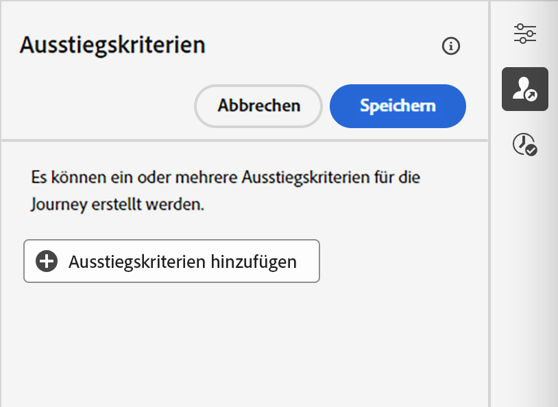

# Festlegen der Journey-Eigenschaften {#jo-properties}

>[!CONTEXTUALHELP]
>id="ajo_journey_properties"
>title="Journey-Eigenschaften"
>abstract="In diesem Abschnitt werden die Journey-Eigenschaften angezeigt. Standardmäßig sind schreibgeschützte Parameter ausgeblendet. Die verfügbaren Einstellungen hängen vom Status der Journey, von Ihren Berechtigungen und der Produktkonfiguration ab."

## Zugreifen auf die Eigenschaften einer Journey {#access-properties}

Die Eigenschaften einer Journey sind in der rechten Leiste zentralisiert. Dieser Abschnitt wird beim Erstellen einer neuen Journey standardmäßig angezeigt.  Klicken Sie für bestehende Journeys auf das Stiftsymbol neben dem Journey-Namen, um sie zu öffnen.

Über diesen Abschnitt haben Sie die Möglichkeit, den Namen der Journey festzulegen, eine Beschreibung hinzuzufügen und:

* den [Eintritt und Wiedereintritt](#entrance) zu verwalten,
* [Start- und Enddatum](#dates) anzugeben,
* den [Zugriff auf Daten](#manage-access) zu verwalten,
* eine [Dauer für die maximale Wartezeit](#timeout) in Journey-Aktivitäten zu definieren (nur für Admins),
* [Zeitzonen](#timezone) für die Journey und das Profil auszuwählen,
* Ihrer Journey Adobe Experience Platform Unified Tags zuzuweisen, um sie einfach zu klassifizieren und die Suche in der Kampagnenliste zu verbessern. [Informationen dazu, wie Sie mit Tags arbeiten](../start/search-filter-categorize.md#tags)
* Sie können Konflikte überwachen und Ihre Journey mithilfe von [Konfliktmanagement-Tools](#conflict) Prioritäten setzen.

>[!NOTE]
>
>Für Live-Journeys werden in diesem Bildschirm nur das Veröffentlichungsdatum und der Name der Person angezeigt, die die Journey veröffentlicht hat.

Mit der Schaltfläche **Technische Details kopieren** lassen sich jederzeit technische Informationen zur Journey kopieren, um dem Support-Team bei der Problembehebung zu helfen. Die folgenden Informationen werden kopiert: `JourneyVersion UID`, `OrgID`, `orgName`, `sandboxName`, `lastDeployedBy`, `lastDeployedAt`.

[Auf dieser Seite](expression/journey-properties.md) erfahren Sie mehr über technische Felder, die mit einer Journey für ein bestimmtes Profil in Verbindung stehen, und wie Sie sie verwenden können.

## Eintritt und Wiedereintritt {#entrance}

Der Eintrittsmodus des Profils wird auf der Journey-Ebene im rechten Konfigurationsbereich definiert. Die Einstellungen werden nachfolgend beschrieben.

Die Verwaltung des Eintritts von Profilen hängt vom Typ der Journeys ab. Mehr über die Verwaltung des Eintritts und Wiedereintritts von Profilen erfahren Sie auf [dieser Seite](entry-management.md).

### Erneuten Eintritt erlauben  {#allow-reentrance}

>[!CONTEXTUALHELP]
>id="ajo_journey_properties_entrance"
>title="Erneuten Eintritt erlauben"
>abstract="Standardmäßig erlauben neue Journeys einen erneuten Eintritt. Die Option **Erneuten Eintritt erlauben** kann deaktiviert werden, z. B. wenn ein einmaliges Geschenk angeboten werden soll, wenn eine Person einen Shop betritt."
>additional-url="https://experienceleague.adobe.com/de/docs/journey-optimizer/using/orchestrate-journeys/manage-journey/entry-management" text="Profileintrittsverwaltung"

Standardmäßig erlauben neue Journeys einen erneuten Eintritt. Sie können die Option **Erneuten Eintritt erlauben** für „einmalige“ Journeys deaktivieren, z. B. wenn Sie ein einmaliges Geschenk anbieten möchten, wenn eine Person einen Shop betritt.

### Wartezeit bis zum erneuten Eintritt  {#reentrance-wait}

>[!CONTEXTUALHELP]
>id="ajo_journey_properties_re-entrance_wait"
>title="Wartezeit bis zum erneuten Eintritt"
>abstract="Legen Sie die Wartezeit fest, bevor Sie einem Profil erlauben, bei unitären Journeys erneut in die Journey einzutreten. Dadurch wird verhindert, dass Benutzende während eines bestimmten Zeitraums erneut in die Journey eintreten. Maximale Dauer: 90 Tage."
>additional-url="https://experienceleague.adobe.com/de/docs/journey-optimizer/using/orchestrate-journeys/manage-journey/entry-management" text="Profileintrittsverwaltung"

Wenn die Option **Erneuten Eintritt erlauben** aktiviert ist, wird das Feld **Wartezeit bis zum erneuten Eintritt** angezeigt. In diesem Feld kann die Wartezeit definiert werden, bevor es einem Profil erlaubt wird, in unitären Journeys erneut in die Journey einzutreten (beginnend mit einem Ereignis oder einer Zielgruppen-Qualifizierung). Dadurch wird verhindert, dass Journeys fälschlicherweise mehrmals für dasselbe Ereignis ausgelöst werden. Standardmäßig ist das Feld auf 5 Minuten eingestellt. Die maximale Wartezeit beträgt 90 Tage.

## Verwalten des Zugriffs {#manage-access}

Um der Journey benutzerdefinierte oder Core-Datennutzungsbezeichnungen zuzuweisen, klicken Sie auf die Schaltfläche **[!UICONTROL Zugriff verwalten]**. [Weitere Informationen zur Zugriffssteuerung auf Objektebene (OLAC)](../administration/object-based-access.md)

## Zeitzonen von Journeys und Profilen {#timezone}

Die Zeitzone wird auf Journey-Ebene definiert. Sie können eine feste Zeitzone eingeben oder Adobe Experience Platform-Profile verwenden, um die Zeitzone der Journey festzulegen. Wenn eine Zeitzone im Adobe Experience Platform-Profil definiert ist, kann sie in der Journey abgerufen werden.

Weitere Informationen zum Zeitzonen-Management finden Sie auf [dieser Seite](../building-journeys/timezone-management.md).

## Start- und Enddatum {#dates}

>[!CONTEXTUALHELP]
>id="ajo_journey_properties_start_date"
>title="Startdatum"
>abstract="Wählen Sie das Datum, an dem der Eintritt in die Journey beginnen kann. Wenn kein Startdatum angegeben wird, wird automatisch der Zeitpunkt der Veröffentlichung festgelegt."

>[!CONTEXTUALHELP]
>id="ajo_journey_properties_end_date"
>title="Enddatum"
>abstract="Wählen Sie das Enddatum der Journey aus. Wenn dieses Datum erreicht wird, treten die Profile in dieser Journey automatisch aus, und es können keine neuen mehr in sie eintreten."

Sie können ein **Startdatum** festlegen. Wenn Sie dies nicht festgelegt haben, wird es automatisch zum Zeitpunkt der Veröffentlichung definiert.

Sie können außerdem ein **Enddatum** hinzufügen. Dadurch können Profile beim Erreichen des Datums automatisch die Journey verlassen. Wenn kein Enddatum angegeben ist, können Profile bis zum Ablauf der [maximalen globalen Wartezeit einer Journey](#global_timeout) verbleiben (in der Regel 91 Tage). Die einzige Ausnahme sind wiederkehrende „Zielgruppe lesen“-Journeys, bei denen die Option **Erneuten Eintritt bei Wiederholung erzwingen** aktiviert ist und die am Startdatum des nächsten Vorkommens enden.

## Maximale Wartezeit {#timeout}

### Zeitüberschreitung oder Fehler bei Journey-Aktivitäten {#timeout_and_error}

>[!CONTEXTUALHELP]
>id="ajo_journey_properties_timeout"
>title="Maximale Wartezeit"
>abstract="Legen Sie fest, wie lange die Journey versuchen soll, eine Aktion auszuführen oder eine Bedingung zu überprüfen, bevor dies als Zeitüberschreitung betrachtet wird."

Beim Bearbeiten einer Aktions- oder Bedingungsaktivität können Sie im Falle eines Fehlers oder einer Überschreitung der maximalen Wartezeit einen alternativen Pfad definieren. Wenn die Verarbeitung der Aktivität, die ein Drittanbietersystem abfragt, die im Feld **[!UICONTROL Zeitüberschreitung oder Fehler]** festgelegte Dauer der maximalen Wartezeit der Journey-Eigenschaften überschreitet, wird der zweite Pfad ausgewählt, um eine potenzielle Ausweichaktion durchzuführen.

Die zulässigen Werte liegen zwischen 1 und 30 Sekunden.

Es wird empfohlen, unter **[!UICONTROL Maximale Wartezeit oder Fehler]** einen sehr kurzen Wert festzulegen, wenn Ihre Journey zeitempfindlich ist (z. B. als Reaktion auf den Echtzeit-Standort einer Person), da Sie Ihre Aktion nicht länger als einige Sekunden verzögern können. Wenn Ihre Journey weniger zeitkritisch ist, können Sie einen längeren Wert verwenden, um dem aufgerufenen System mehr Zeit zum Senden einer gültigen Antwort zu geben.

Bei Journeys wird auch eine maximale globale Wartezeit verwendet, wie unten detailliert beschrieben.

### Maximale globale Wartezeit der Journey {#global_timeout}

Zusätzlich zu der in den Journey-Aktivitäten verwendeten [maximalen Wartezeit](#timeout_and_error) wird eine maximale globale Journey-Wartezeit angewendet. Sie wird nicht auf der Benutzeroberfläche angezeigt und kann nicht geändert werden.

Diese maximale globale Wartezeit stoppt den Fortschritt von Kontakten in der Journey **91 Tage** nach ihrem Eintritt. Das bedeutet, dass die Journey eines Kontakts nicht länger als 91 Tage dauern kann. Nach Ablauf der maximalen Wartezeit werden die Daten des Kontakts gelöscht. Kontakte, die sich nach der maximalen Wartezeit noch in der Journey befinden, werden gestoppt und beim Reporting nicht berücksichtigt. Sie könnten also mehr Personen sehen, die in die Journey eintreten, als Personen, die sie beenden.

Aufgrund der maximalen Journey-Wartezeit von 91 Tagen können wir, wenn der erneute Eintritt in die Journey nicht erlaubt ist, nicht sicherstellen, dass die Sperrung des erneuten Eintritts nach mehr als 91 Tagen erhalten bleibt. Da wir alle Informationen über Personen, die in die Journey eingetreten sind, 91 Tage nach deren Eintritt entfernen, können wir nicht wissen, dass die Person vor mehr als 91 Tagen bereits Eintritt hatte.

Ein Kontakt kann nur dann eine Warteaktivität annehmen, wenn noch genügend Zeit bleibt, um die Wartezeit vor Ablauf der 91-tägigen maximalen Wartezeit der Journey zu beenden. Weitere Informationen finden Sie auf [dieser Seite](../building-journeys/wait-activity.md).

#### Häufig gestellte Fragen zur Time-to-Live (TTL) und zur Aufbewahrung von Daten {#timeout-faq}

Ab Adobe Journey Optimizer-Version vom Juni 2024 wurde die maximale globale Wartezeit für Journeys von 30 auf 91 Tage umgestellt. Die Auswirkungen sind in den folgenden häufig gestellten Fragen aufgeführt:

**Für einheitliche Journeys**
<table style="table-layout:auto">
  <tr style="border: 1;">
    <td>
      
Was passiert mit Journeys, die nach dem Rollout der TTL-Verlängerung veröffentlicht wurden?

    </td>
    <td>
      
Für Profile, die in die neue Journey eintreten, beträgt die TLL automatisch 91 Tage.

    </td>
  </tr>
  <tr style="border: 1;">
    <td>
      
Was passiert mit einem Profil, das in eine Journey eintritt, die vor dem Launch der TTL-Verlängerung veröffentlicht wurde?

    </td>
    <td>
      
Die TTL für das Profil beträgt 30 Tage (7 Tage für HIPAA) ab dem Zeitpunkt, zu dem die Journey ursprünglich veröffentlicht wurde.

    </td>
  </tr>
  <tr style="border: 1;">
    <td>
      
Was passiert mit einem Profil, das beim Launch der TTL-Verlängerung bereits in eine Journey eingetreten ist?

    </td>
    <td>
      
Für das Profil bleibt eine TTL von 30 Tagen (7 Tage für HIPAA) gemäß dem ursprünglichen Veröffentlichungszeitpunkt der Journey bestehen.

    </td>
  </tr>
  <tr style="border: 1;">
    <td>
      
Was passiert mit einem Profil in einer früheren Journey-Version, die nach dem Launch der TTL-Verlängerung erneut veröffentlicht wird?

    </td>
    <td>
      
Für das Profil bleibt eine TTL von 30 Tagen (7 Tage für HIPAA) gemäß bestehen, ausgerichtet auf den ursprünglichen Veröffentlichungszeitpunkt der Journey.

    </td>
  </tr>
  <tr style="border: 1;">
    <td>
      
Was passiert mit einem neuen Profil, das nach dem Launch der TTL-Verlängerung in eine erneut veröffentlichte Journey-Version eintritt?

    </td>
    <td>
      
Die TTL für das Profil beträgt 91 Tage (7 Tage für HIPAA), entsprechend der TTL der erneut veröffentlichten Journey-Version.

    </td>
  </tr>
</table>

**Für Segmentauslöser-Journeys**

<table style="table-layout:auto">
  <tr style="border: 1;">
    <td>
      
Was passiert mit neuen einmaligen Journeys, die nach der TTL-Verlängerung veröffentlicht werden?

    </td>
    <td>
      
Die TTL für Profile, die in die neue Journey eintreten, beträgt automatisch 91 Tage.

    </td>
  </tr>
  <tr style="border: 1;">
    <td>
      
Was passiert mit neuen wiederkehrenden Journeys ohne erzwungenen erneuten Eintritt, die nach der TTL-Verlängerung veröffentlicht werden?

    </td>
    <td>
      
Die TTL für Profile, die in die neue Journey eintreten, beträgt automatisch 91 Tage.

    </td>
  </tr>
  <tr style="border: 1;">
    <td>
      
Was passiert mit neuen wiederkehrenden Journeys mit erzwungenem erneuten Eintritt, die nach der TTL-Verlängerung veröffentlicht werden?

    </td>
    <td>
      
Die TTL für Profile, die in die neue Journey eintreten, entspricht dem Wiederholungsintervall. Wenn die Journey beispielsweise täglich ausgeführt wird, beträgt die TTL 1 Tag.

    </td>
  </tr>
  <tr style="border: 1;">
    <td>
      
Was passiert mit einem Profil, das in eine Journey eintritt, die vor dem Launch der TTL-Verlängerung veröffentlicht wurde?

    </td>
    <td>
      
Die TTL für das Profil beträgt 30 Tage (7 Tage für HIPAA) ab dem ursprünglichen Veröffentlichungszeitpunkt.  Bei wiederkehrenden Journeys mit erzwungenem erneuten Eintritt entspricht die TTL dem Wiederholungsintervall.

    </td>
  </tr>
  <tr style="border: 1;">
    <td>
      
Was passiert mit einem Profil, das beim Launch der TTL-Verlängerung gerade eine Journey durchläuft?

    </td>
    <td>
      
Für das Profil bleibt eine TTL von 30 Tagen (7 Tage für HIPAA) gemäß dem ursprünglichen Veröffentlichungszeitpunkt der Journey bestehen.  Bei wiederkehrenden Journeys mit erzwungenem erneuten Eintritt entspricht die TTL dem Wiederholungsintervall.

    </td>
  </tr>
  <tr style="border: 1;">
    <td>
      
Was passiert mit einem laufenden Profil in einer vorherigen Journey-Version, die nach dem Launch der TTL-Erweiterung erneut veröffentlicht wird?

    </td>
    <td>
      
Für das Profil bleibt eine TTL von 30 Tagen (7 Tage für HIPAA) bestehen, ausgerichtet auf den ursprünglichen Veröffentlichungszeitpunkt der Journey. Bei wiederkehrenden Journeys mit erzwungenem erneuten Eintritt entspricht die TTL dem Wiederholungsintervall.

    </td>
  </tr>
  <tr style="border: 1;">
    <td>
      
Was passiert mit einem neuen Profil, das nach dem Launch der TTL-Verlängerung in eine erneut veröffentlichte Journey-Version eintritt?

    </td>
    <td>
      
Die TTL für das Profil beträgt 91 Tage (7 Tage für HIPAA), entsprechend der TTL der erneut veröffentlichten Journey-Version.  Bei wiederkehrenden Journeys mit erzwungenem erneuten Eintritt entspricht die TTL dem Wiederholungsintervall.

    </td>
  </tr>
</table>

## Zusammenführungsrichtlinien {#merge-policies}

Eine Journey verwendet Zusammenführungsrichtlinien beim Abrufen von Profildaten von Adobe Experience Platform. Je nach Journey-Typ werden unterschiedliche Zusammenführungsrichtlinien verwendet:

* In den Journeys „Zielgruppe lesen“ oder „Zielgruppen-Qualifizierung“ wird die Zusammenführungsrichtlinie aus der Zielgruppe verwendet
* In Journeys für unitäre Ereignisse wird die standardmäßige Zusammenführungsrichtlinie verwendet
* In Journeys für Geschäftsereignisse wird die Zusammenführungsrichtlinie aus der Zielgruppe in der Aktivität „Zielgruppe lesen“ verwendet.

Eine Journey berücksichtigt die auf der gesamten Journey verwendete Zusammenführungsrichtlinie.  Wenn also mehrere Zielgruppen in einer Journey verwendet werden (z. B. in „inAudience“-Funktionen) und Inkonsistenzen mit der von der Journey verwendeten Zusammenführungsrichtlinie entstehen, wird ein Fehler generiert und die Veröffentlichung blockiert. Wenn jedoch bei der Nachrichtenpersonalisierung eine inkonsistente Zielgruppe verwendet wird, wird trotz der Inkonsistenz kein Warnhinweis generiert. Aus diesem Grund wird dringend empfohlen, die mit Ihrer Zielgruppe verknüpfte Zusammenführungsrichtlinie zu überprüfen, wenn diese Zielgruppe bei der Nachrichtenpersonalisierung verwendet wird.

Weitere Informationen zu Zusammenführungsrichtlinien finden Sie in der [Dokumentation zu Adobe Experience Platform](https://experienceleague.adobe.com/de/docs/experience-platform/profile/merge-policies/overview){target="_blank"}.

## Ausstiegskriterien {#exit-criteria}

>[!CONTEXTUALHELP]
>id="ajo_journey_exit_criterias"
>title="Kriterien für den Journey-Austritt"
>abstract="In diesem Abschnitt werden die Optionen für Austrittskriterien angezeigt. Es können ein oder mehrere Austrittskriterien für eine Journey erstellt werden."

### Beschreibung {#exit-criteria-desc}

Durch Hinzufügen von Ausstiegskriterien sorgen Sie dafür, dass Profile die Journey verlassen, sobald ein Ereignis eintritt (z. B. ein Kauf) oder sie sich für eine Zielgruppe qualifizieren. Dadurch wird verhindert, dass Benutzende weitere Nachrichten von der Journey erhalten.

Sie können Profile aus einer Journey entfernen, wenn sie nicht mehr dem Zweck der Journey entsprechen. Dies kann durch **globale Ausstiegskriterien** erreicht werden, die eng mit dem Ziel-Management verbunden sind.

**Beispiel für einen Anwendungsfall**

Eine Marketing-Fachperson hat eine Werbe-Journey, die eine Reihe von Kommunikationsmaßnahmen umfasst. Jede dieser Kommunikationsmaßnahmen zielt darauf ab, die Kundschaft zum Kauf zu bewegen. Sobald der Kauf getätigt wurde, sollte die Kundin bzw. der Kunde die restlichen Nachrichten der Serie nicht mehr erhalten. Durch die Definition von Ausstiegskriterien werden alle Profile, die einen Kauf getätigt haben, aus der Journey entfernt.

### Konfiguration und Verwendung {#exit-criteria-config}

Ausstiegskriterien werden auf Journey-Ebene festgelegt. Eine Journey kann mehrere Ausstiegskriterien haben. Wenn Sie mehrere Ausstiegskriterien festgelegt haben, erfolgt die Auswertung von oben nach unten mit einer `OR`-Logik. Wenn Sie also Ausstiegskriterien A und Ausstiegskriterien B haben, wird es als A **ODER** B ausgewertet. Die Kriterien werden bei jedem Schritt der Journey ausgewertet.

Um ein Ausstiegskriterium zu **erstellen**, gehen Sie folgendermaßen vor:

1. Öffnen Sie Ihre Journey.

1. Klicken Sie oben rechts auf der Journey-Arbeitsfläche auf das Symbol **[!UICONTROL Ausstiegskriterien anzeigen]**.
   {width="40%" align="left"}
1. Klicken Sie auf die Schaltfläche **[!UICONTROL Ausstiegskriterien hinzufügen]**.
   {width="40%" align="left"}
1. Geben Sie einen **Titel** ein und wählen Sie aus, ob Ihr Ausstiegskriterium auf einem **Ereignis** oder einer **Zielgruppe** basiert.

* Bei Ausstiegskriterien, die auf einem Ereignis basieren, wählen Sie nur ein unitäreres Ereignis aus.
* Bei Ausstiegskriterien, die auf einer Zielgruppe basieren, wählen Sie eine Zielgruppe aus. Hinweis: Es kann bis zu 10 Minuten dauern, bis Ausstiegskriterien, die eine Zielgruppe verwenden, wirksam werden.

Sie können mehrere Ausstiegskriterien hinzufügen.

{width="40%" align="left"}

### Schutzmechanismen und Einschränkungen {#exit-criteria-guardrails}

Die folgenden Leitlinien und Einschränkungen gelten für die Ausstiegskriterien der Journey:

* Die Ausstiegskriterien sind nur im Entwurfsstadium definiert
* Kohärenz des Journey-Namespace zwischen Ereignissen und ereignisbasierten Ausstiegskriterien

## Konflikt-Management {#conflict}

Im Abschnitt **[!UICONTROL Konfliktverwaltung]** in den Eigenschaften von Journey können Sie Konflikte überwachen und Ihre Journey priorisieren. Sie haben folgende Möglichkeiten:

* Wenden Sie einen **Regelsatz** an, um diese Journey basierend auf Begrenzungsregeln für einen Teil Ihrer Audience auszuschließen. [Erfahren Sie, wie Sie mit Regelsätzen arbeiten](../configuration/rule-sets.md)

* Weisen Sie dem Journey eine **Prioritätsbewertung** zu, die zwischen 0 und 100 liegt. Eine höhere Zahl bedeutet eine höhere Priorität. Der hier eingegebene Prioritätswert wird von allen eingehenden Aktionen übernommen (beispielsweise In-App-Aktionen), die in dieser Journey enthalten sind. [Erfahren Sie, wie Sie mit Prioritätswerten arbeiten](../conflict-prioritization/priority-scores.md)

  In Fällen, in denen dieselbe eingehende Kanalkonfiguration in anderen Kampagnen oder Journeys verwendet wird, wird der Empfängerin bzw. dem Empfänger die eingehende Aktion mit der höchsten Priorität angezeigt. Wenn mehrere Journeys oder Kampagnen denselben Wert aufweisen, wird das Element ausgewählt, das zuletzt geändert wurde.

* **Konflikte anzeigen** mit anderen Journey, Kampagnen oder Kanalkonfigurationen. Wenn Sie Überschneidungen bei Zielgruppe, Start- und Enddatum, Kanalkonfiguration, Kanal oder Regelsatz ermitteln möchten, können Sie hier potenzielle Konflikte anzeigen. [Erfahren Sie, wie Sie potenzielle Konflikte in Journey](../conflict-prioritization/conflicts.md) identifizieren.
