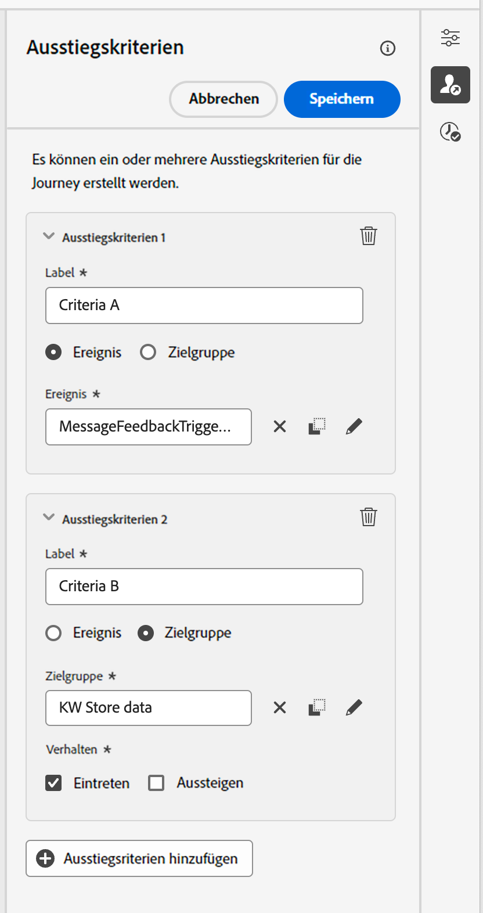

# Festlegen der Journey-Eigenschaften {#jo-properties}

>[!CONTEXTUALHELP]
>id="ajo_journey_properties"
>title="Journey-Eigenschaften"
>abstract="In diesem Abschnitt werden die Journey-Eigenschaften angezeigt. Standardmäßig sind schreibgeschützte Parameter ausgeblendet. Die verfügbaren Einstellungen hängen vom Status der Journey, von Ihren Berechtigungen und der Produktkonfiguration ab."

## Zugreifen auf die Eigenschaften einer Journey {#access-properties}

Die Eigenschaften einer Journey sind in der rechten Leiste zentralisiert. Dieser Abschnitt wird beim Erstellen einer neuen Journey standardmäßig angezeigt.  Klicken Sie zum Öffnen bestehender Journeys auf das Stiftsymbol neben dem Journey-Namen.

Über diesen Abschnitt können Sie den Namen der Journey definieren, eine Beschreibung hinzufügen und globale Journey-Eigenschaften festlegen.

Sie haben folgende Möglichkeiten:

* Zuweisen von einheitlichen Adobe Experience Platform-Tags zu Ihrer Journey, um sie einfach zu klassifizieren und die Suche in der Kampagnenliste zu verbessern. [Informationen dazu, wie Sie mit Tags arbeiten](../start/search-filter-categorize.md#tags)
* Auswählen von Journey-Metriken. [Weitere Informationen zum Konfigurieren und Tracking von Journey-Metriken](success-metrics.md)
* Verwalten Sie [Eintritt und Wiedereintritt](#entrance). Die Verwaltung des Profileintritts hängt vom Typ der Journey ab. Einzelheiten hierzu finden Sie auf [dieser Seite](entry-management.md).
* Verwalten des [Zugriffs auf Daten](#manage-access)
* Auswählen der [Zeitzonen](#timezone) für die Journey und das Profil
* Festlegen benutzerdefinierter [Start- und Enddaten](#dates)
* Definieren einer [Timeout-Dauer](#timeout) in Journey-Aktivitäten (nur für Admins)
* Überwachen von Konflikten und Priorisieren Ihrer Journeys mithilfe von [Konflikt-Management-Tools](#conflict)

{width="80%"}{zoomable="yes"}

>[!NOTE]
>
>Für Live-Journeys werden in diesem Bildschirm nur das Veröffentlichungsdatum und der Name der Person angezeigt, die die Journey veröffentlicht hat.

Mithilfe der Option **Technische Details kopieren** können Sie jederzeit technische Informationen zur Journey kopieren, die dem Support-Team bei der Problembehebung helfen. Die folgenden Informationen werden kopiert: `JourneyVersion UID`, `OrgID`, `orgName`, `sandboxName`, `lastDeployedBy`, `lastDeployedAt`.

Weitere Informationen zu technischen Feldern, die mit einer Journey für ein bestimmtes Profil in Verbindung stehen, und dazu, wie Sie sie verwenden können, finden Sie [auf dieser Seite](expression/journey-properties.md).

## Eintritt und Wiedereintritt {#entrance}

Der Eintrittsmodus des Profils wird auf der Journey-Ebene im rechten Konfigurationsbereich definiert. Die Einstellungen werden nachfolgend beschrieben.

Die Verwaltung des Profileintritts hängt vom Typ der Journey ab. Weitere Informationen zur Verwaltung des Profileintritts und -wiedereintritts finden Sie auf [dieser Seite](entry-management.md). Weitere Informationen zu Journey-Verarbeitungsraten und dazu, wie Profile die Journey durchlaufen, finden Sie [in diesem Abschnitt](entry-management.md#journey-processing-rate).

### Erneuten Eintritt erlauben  {#allow-reentrance}

>[!CONTEXTUALHELP]
>id="ajo_journey_properties_entrance"
>title="Erneuten Eintritt erlauben"
>abstract="Standardmäßig erlauben neue Journeys einen erneuten Eintritt. Die Option **Erneuten Eintritt erlauben** kann deaktiviert werden, z. B. wenn ein einmaliges Geschenk angeboten werden soll, wenn eine Person einen Shop betritt."
>additional-url="https://experienceleague.adobe.com/de/docs/journey-optimizer/using/orchestrate-journeys/manage-journey/entry-management" text="Profileintrittsverwaltung"

Standardmäßig erlauben neue Journeys einen erneuten Eintritt. Sie können die Option **Erneuten Eintritt erlauben** für „einmalige“ Journeys deaktivieren, z. B. wenn Sie ein einmaliges Geschenk anbieten möchten, wenn eine Person einen Shop betritt.

### Wartezeit bis zum erneuten Eintritt  {#reentrance-wait}

>[!CONTEXTUALHELP]
>id="ajo_journey_properties_re-entrance_wait"
>title="Wartezeit bis zum erneuten Eintritt"
>abstract="Legen Sie die Wartezeit fest, bevor Sie in einheitlichen Journeys einem Profil erlauben, erneut in die Journey einzutreten. Dadurch wird verhindert, dass Benutzende während eines bestimmten Zeitraums erneut in die Journey eintreten. Maximale Dauer: 90 Tage."
>additional-url="https://experienceleague.adobe.com/de/docs/journey-optimizer/using/orchestrate-journeys/manage-journey/entry-management" text="Profileintrittsverwaltung"

Wenn die Option **Erneuten Eintritt erlauben** aktiviert ist, wird das Feld **Wartezeit bis zum erneuten Eintritt** angezeigt. In diesem Feld kann die Wartezeit definiert werden, bevor es einem Profil erlaubt wird, in unitären Journeys erneut in die Journey einzutreten (beginnend mit einem Ereignis oder einer Zielgruppen-Qualifizierung). Dadurch wird verhindert, dass Journeys fälschlicherweise mehrmals für dasselbe Ereignis ausgelöst werden. Standardmäßig ist das Feld auf 5 Minuten eingestellt. Die maximale Wartezeit beträgt 90 Tage.

## Verwalten des Zugriffs {#manage-access}

Sie können den Zugriff auf eine Journey basierend auf Zugriffs-Labels einschränken. 

Um der Journey benutzerdefinierte Datennutzungs-Label zuzuweisen, klicken Sie auf das Symbol **[!UICONTROL Verwalten von Zugriffs-Labels]** und wählen Sie ein oder mehrere Labels aus.

[Weitere Informationen zur Zugriffssteuerung auf Objektebene (Object Level Access Control, OLAC)](../administration/object-based-access.md)

## Zeitzonen von Journeys und Profilen {#timezone}

Die Zeitzone wird auf Journey-Ebene definiert. Sie können eine feste Zeitzone eingeben oder Adobe Experience Platform-Profile verwenden, um die Zeitzone der Journey festzulegen. Wenn eine Zeitzone im Adobe Experience Platform-Profil definiert ist, kann sie in der Journey abgerufen werden.

[Weitere Informationen zum Zeitzonen-Management](../building-journeys/timezone-management.md)

## Start- und Enddatum {#dates}

>[!CONTEXTUALHELP]
>id="ajo_journey_properties_start_date"
>title="Startdatum"
>abstract="Wählen Sie das Datum aus, ab dem Profile in die Journey eintreten können. Wenn kein Startdatum festgelegt ist, wird standardmäßig das Veröffentlichungsdatum der Journey verwendet."

>[!CONTEXTUALHELP]
>id="ajo_journey_properties_end_date"
>title="Enddatum"
>abstract="Legen Sie das Datum fest, an dem die Journey endet. An diesem Datum verlassen aktive Profile automatisch die Journey und es wird kein neuer Eintritt mehr zugelassen."

Standardmäßig können Profile in eine Journey sofort nach ihrer Veröffentlichung eintreten und so lange bleiben, bis das [globale Journey-Timeout](#global_timeout) erreicht ist. Die einzige Ausnahme sind wiederkehrende „Zielgruppe lesen“-Journeys, bei denen die Option **Erneuten Eintritt bei Wiederholung erzwingen** aktiviert ist und die am Startdatum des nächsten Vorkommens enden.

Bei Bedarf können Sie ein benutzerdefiniertes **Start**- und **Enddatum** festlegen. Dadurch können Profile an einem bestimmten Datum in Ihre Journey eintreten und diese bei Erreichen des Enddatums wieder automatisch verlassen.

## Timeout {#timeout}

### Timeout bei Journey-Aktivitäten {#timeout_and_error}

>[!CONTEXTUALHELP]
>id="ajo_journey_properties_timeout"
>title="Timeout oder Fehler"
>abstract="Geben Sie an, wie lange die Journey versuchen soll, eine Aktion auszuführen oder eine Bedingung auszuwerten, bevor sie als Timeout behandelt wird. Die empfohlenen Werte liegen zwischen 1 und 30 Sekunden."

Beim Bearbeiten einer Aktions- oder Bedingungsaktivität können Sie im Falle eines Fehlers oder einer Überschreitung des Timeouts einen alternativen Pfad definieren. Wenn die Verarbeitung der Aktivität, die ein Drittanbietersystem abfragt, den im Feld **[!UICONTROL Zeitüberschreitung oder Fehler]** festgelegten Timeout der Journey-Eigenschaften überschreitet, wird der zweite Pfad ausgewählt, um eine potenzielle Ausweichaktion durchzuführen.

Die empfohlenen Werte liegen zwischen 1 und 30 Sekunden.

Es wird empfohlen, unter **[!UICONTROL Timeout oder Fehler]** einen sehr kurzen Wert festzulegen, wenn Ihre Journey zeitempfindlich ist (z. B. als Reaktion auf den Echtzeit-Standort einer Person), da Sie Ihre Aktion nicht länger als einige Sekunden verzögern können. Wenn Ihre Journey weniger zeitkritisch ist, können Sie einen längeren Wert verwenden, um dem aufgerufenen System mehr Zeit zum Senden einer gültigen Antwort zu geben.

Bei Journeys wird auch ein globaler Timeout verwendet, wie unten detailliert beschrieben.

### Globaler Timeout der Journey {#global_timeout}

Zusätzlich zum in den Journey-Aktivitäten verwendeten [Timeout](#timeout_and_error) wird ein globaler Journey-Timeout angewendet. Sie wird nicht auf der Benutzeroberfläche angezeigt und kann nicht geändert werden.

Dieser globale Timeout stoppt den Fortschritt von Kontakten in der Journey **91 Tage** nach ihrem Eintritt. Das bedeutet, dass die Journey eines Kontakts nicht länger als 91 Tage dauern kann. Nach Ablauf des Timeouts werden die Daten des Kontakts gelöscht. Kontakte, die sich nach dem Timeout noch in der Journey befinden, werden gestoppt und beim Reporting nicht berücksichtigt. Sie könnten also mehr Personen sehen, die in die Journey eintreten, als Personen, die sie beenden.

Aufgrund des Journey-Timeouts von 91 Tagen können wir, wenn der erneute Eintritt in die Journey nicht erlaubt ist, nicht sicherstellen, dass die Sperrung des erneuten Eintritts nach mehr als 91 Tagen erhalten bleibt. Da wir alle Informationen über Personen, die in die Journey eingetreten sind, 91 Tage nach deren Eintritt entfernen, können wir nicht wissen, dass die Person vor mehr als 91 Tagen bereits Eintritt hatte.

Ein Kontakt kann nur dann eine Warteaktivität annehmen, wenn er oder sie noch genügend Zeit hat, um die Wartezeit vor Ablauf des 91-tägigen Timeouts der Journey zu erfüllen. Weitere Informationen finden Sie auf [dieser Seite](../building-journeys/wait-activity.md).

#### Häufig gestellte Fragen zur Time-to-Live (TTL) und zur Aufbewahrung von Daten {#timeout-faq}

Ab Adobe Journey Optimizer-Version vom Juni 2024 wurde der globale Timeout für Journeys von 30 auf 91 Tage umgestellt. Die Auswirkungen sind in den folgenden häufig gestellten Fragen aufgeführt:

**Für einheitliche Journeys**

<table style="table-layout:auto">
  <tr style="border: 1;">
    <td>
      
Was passiert mit Journeys, die nach dem Rollout der TTL-Verlängerung veröffentlicht wurden?

    </td>
    <td>
      
Für Profile, die in die neue Journey eintreten, beträgt die TLL automatisch 91 Tage.

    </td>
  </tr>
  <tr style="border: 1;">
    <td>
      
Was passiert mit einem Profil, das in eine Journey eintritt, die vor dem Launch der TTL-Verlängerung veröffentlicht wurde?

    </td>
    <td>
      
Die TTL für das Profil beträgt 30 Tage (7 Tage für HIPAA) ab dem Zeitpunkt, zu dem die Journey ursprünglich veröffentlicht wurde.

    </td>
  </tr>
  <tr style="border: 1;">
    <td>
      
Was passiert mit einem Profil, das beim Launch der TTL-Verlängerung bereits in eine Journey eingetreten ist?

    </td>
    <td>
      
Für das Profil bleibt eine TTL von 30 Tagen (7 Tage für HIPAA) gemäß dem ursprünglichen Veröffentlichungszeitpunkt der Journey bestehen.

    </td>
  </tr>
  <tr style="border: 1;">
    <td>
      
Was passiert mit einem Profil in einer früheren Journey-Version, die nach dem Launch der TTL-Verlängerung erneut veröffentlicht wird?

    </td>
    <td>
      
Für das Profil bleibt eine TTL von 30 Tagen (7 Tage für HIPAA) gemäß bestehen, ausgerichtet auf den ursprünglichen Veröffentlichungszeitpunkt der Journey.

    </td>
  </tr>
  <tr style="border: 1;">
    <td>
      
Was passiert mit einem neuen Profil, das nach dem Launch der TTL-Verlängerung in eine erneut veröffentlichte Journey-Version eintritt?

    </td>
    <td>
      
Die TTL für das Profil beträgt 91 Tage (7 Tage für HIPAA), entsprechend der TTL der erneut veröffentlichten Journey-Version.

    </td>
  </tr>
</table>

**Für Segmentauslöser-Journeys**

<table style="table-layout:auto">
  <tr style="border: 1;">
    <td>
      
Was passiert mit neuen einmaligen Journeys, die nach der TTL-Verlängerung veröffentlicht werden?

    </td>
    <td>
      
Die TTL für Profile, die in die neue Journey eintreten, beträgt automatisch 91 Tage.

    </td>
  </tr>
  <tr style="border: 1;">
    <td>
      
Was passiert mit neuen wiederkehrenden Journeys ohne erzwungenen erneuten Eintritt, die nach der TTL-Verlängerung veröffentlicht werden?

    </td>
    <td>
      
Die TTL für Profile, die in die neue Journey eintreten, beträgt automatisch 91 Tage.

    </td>
  </tr>
  <tr style="border: 1;">
    <td>
      
Was passiert mit neuen wiederkehrenden Journeys mit erzwungenem erneuten Eintritt, die nach der TTL-Verlängerung veröffentlicht werden?

    </td>
    <td>
      
Die TTL für Profile, die in die neue Journey eintreten, entspricht dem Wiederholungsintervall. Wenn die Journey beispielsweise täglich ausgeführt wird, beträgt die TTL 1 Tag.

    </td>
  </tr>
  <tr style="border: 1;">
    <td>
      
Was passiert mit einem Profil, das in eine Journey eintritt, die vor dem Launch der TTL-Verlängerung veröffentlicht wurde?

    </td>
    <td>
      
Die TTL für das Profil beträgt 30 Tage (7 Tage für HIPAA) ab dem ursprünglichen Veröffentlichungszeitpunkt.  Bei wiederkehrenden Journeys mit erzwungenem erneuten Eintritt entspricht die TTL dem Wiederholungsintervall.

    </td>
  </tr>
  <tr style="border: 1;">
    <td>
      
Was passiert mit einem Profil, das beim Launch der TTL-Verlängerung gerade eine Journey durchläuft?

    </td>
    <td>
      
Für das Profil bleibt eine TTL von 30 Tagen (7 Tage für HIPAA) gemäß dem ursprünglichen Veröffentlichungszeitpunkt der Journey bestehen.  Bei wiederkehrenden Journeys mit erzwungenem erneuten Eintritt entspricht die TTL dem Wiederholungsintervall.

    </td>
  </tr>
  <tr style="border: 1;">
    <td>
      
Was passiert mit einem laufenden Profil in einer vorherigen Journey-Version, die nach dem Launch der TTL-Erweiterung erneut veröffentlicht wird?

    </td>
    <td>
      
Für das Profil bleibt eine TTL von 30 Tagen (7 Tage für HIPAA) bestehen, ausgerichtet auf den ursprünglichen Veröffentlichungszeitpunkt der Journey. Bei wiederkehrenden Journeys mit erzwungenem erneuten Eintritt entspricht die TTL dem Wiederholungsintervall.

    </td>
  </tr>
  <tr style="border: 1;">
    <td>
      
Was passiert mit einem neuen Profil, das nach dem Launch der TTL-Verlängerung in eine erneut veröffentlichte Journey-Version eintritt?

    </td>
    <td>
      
Die TTL für das Profil beträgt 91 Tage (7 Tage für HIPAA), entsprechend der TTL der erneut veröffentlichten Journey-Version.  Bei wiederkehrenden Journeys mit erzwungenem erneuten Eintritt entspricht die TTL dem Wiederholungsintervall.

    </td>
  </tr>
</table>

## Zusammenführungsrichtlinien {#merge-policies}

Adobe Journey Optimizer verwendet Zusammenführungsrichtlinien beim Abrufen von Profildaten aus Adobe Experience Platform. Je nach Journey-Typ werden unterschiedliche Zusammenführungsrichtlinien verwendet:

* In Journeys vom Typ „Zielgruppe lesen“ oder „Zielgruppenqualifizierung“ wird die Zusammenführungsrichtlinie aus der Zielgruppe verwendet
* In Journeys für unitäre Ereignisse wird die standardmäßige Zusammenführungsrichtlinie verwendet
* In Journeys für Geschäftsereignisse wird die Zusammenführungsrichtlinie aus der Zielgruppe in der Aktivität „Zielgruppe lesen“ verwendet.

Adobe Journey Optimizer wendet die genutzte Zusammenführungsrichtlinie auf die gesamte Journey an. Wenn also mehrere Zielgruppen in einer Journey verwendet werden (z. B. [`inAudience`-Funktionen](functions/functioninaudience.md)), entstehen Inkonsistenzen mit der von der Journey verwendeten Zusammenführungsrichtlinie, es wird ein Fehler generiert und die Veröffentlichung blockiert. Wenn jedoch bei der Personalisierung von Nachrichten eine inkonsistente Zielgruppe verwendet wird, wird trotz der Inkonsistenz kein Warnhinweis ausgelöst. Daher wird dringend empfohlen, die mit Ihrer Audience verknüpfte Zusammenführungsrichtlinie zu überprüfen, wenn diese Audience bei der Nachrichtenpersonalisierung verwendet wird.

Weitere Informationen zu Zusammenführungsrichtlinien finden Sie in der [Dokumentation zu Adobe Experience Platform](https://experienceleague.adobe.com/de/docs/experience-platform/profile/merge-policies/overview){target="_blank"}.

>[!NOTE]
>
>Wenn eine Zielgruppen-Zusammenführungsrichtlinie aktualisiert wird, müssen alle aktiven Journeys, die auf diese Zielgruppe verweisen, erneut veröffentlicht (oder dupliziert) werden. Wenn Sie die Zusammenführungsrichtlinie ändern, wird tatsächlich eine „neue“ Zielgruppe erstellt, auf die die laufende Journey nicht zugreifen kann. Auf diese Weise wird Datenkonsistenz sichergestellt.

## Ausstiegskriterien {#exit-criteria}

>[!CONTEXTUALHELP]
>id="ajo_journey_exit_criterias"
>title="Ausstiegskriterien"
>abstract="In diesem Abschnitt werden die Optionen für Ausstiegskriterien angezeigt. Sie können für die Ausstiegskriterien Ihrer Journey ein oder mehrere Regeln und Filter erstellen."

### Kriterien für den Journey-Ausstieg {#exit-criteria-desc}

Durch Hinzufügen von Ausstiegskriterien sorgen Sie dafür, dass Profile die Journey verlassen, sobald ein Ereignis eintritt (z. B. ein Kauf) oder sie sich für eine Zielgruppe qualifizieren. Dadurch wird verhindert, dass Benutzende weitere Nachrichten von der Journey erhalten.

Sie können Profile aus einer Journey entfernen, wenn sie nicht mehr dem Zweck der Journey entsprechen. Dies kann durch **globale Ausstiegskriterien** erreicht werden, die eng mit dem Ziel-Management verbunden sind.

>[!TIP]
>
>Auf der Suche nach praktischer Anleitung mit realen Beispielen? Lesen Sie unser [Handbuch zum Journey der Ein- und Ausstiegskriterien](entry-exit-criteria-guide.md), das vollständige Anwendungsfälle mit Ein- und Ausstiegskonfigurationen, Best Practices und Optimierungsstrategien umfasst.

**Beispiel für einen Anwendungsfall**

Eine Marketing-Fachperson hat eine Werbe-Journey, die eine Reihe von Kommunikationsmaßnahmen umfasst. Jede dieser Kommunikationsmaßnahmen zielt darauf ab, die Kundschaft zum Kauf zu bewegen. Sobald der Kauf getätigt wurde, sollte die Kundin bzw. der Kunde die restlichen Nachrichten der Serie nicht mehr erhalten. Durch die Definition von Ausstiegskriterien werden alle Profile, die einen Kauf getätigt haben, aus der Journey entfernt.

#### Konfiguration und Verwendung {#exit-criteria-config}

Ausstiegskriterien werden auf Journey-Ebene festgelegt. Eine Journey kann mehrere Ausstiegskriterien haben. Wenn Sie mehrere Ausstiegskriterien festgelegt haben, erfolgt die Auswertung von oben nach unten mit einer `OR`-Logik. Wenn Sie also Ausstiegskriterien A und Ausstiegskriterien B haben, wird es als A **ODER** B ausgewertet. Die Kriterien werden bei jedem Schritt der Journey ausgewertet.

Um ein Ausstiegskriterium zu **erstellen**, gehen Sie folgendermaßen vor:

1. Öffnen Sie Ihre Journey.

1. Klicken Sie oben rechts auf der Journey-Arbeitsfläche auf das Symbol  **[!UICONTROL Ausstiegskriterien anzeigen]**.

1. Wählen Sie **[!UICONTROL Ausstiegskriterien hinzufügen]** aus.

1. Geben Sie ein **Label** ein und wählen Sie aus, ob Ihr Ausstiegskriterium auf einem **Ereignis** oder einer **Zielgruppe** basiert.

   * Für Ausstiegskriterien, die auf einem Ereignis basieren, wie z. B. das Herunterladen einer App oder das Hinzufügen eines Produkts zu einem Warenkorb, wählen Sie nur ein einziges Ereignis.
   * Für Ausstiegskriterien, die auf einer Zielgruppe basieren, wie z. B. eine Zielgruppe, die überprüft, ob eine Person in den letzten 24 Stunden einen Kauf getätigt hat, wählen Sie eine Zielgruppe. Hinweis: Es kann bis zu 10 Minuten dauern, bis Ausstiegskriterien, die eine Zielgruppe verwenden, wirksam werden.

Sie können mehrere Ausstiegskriterien hinzufügen.

{width="40%" align="left"}

### Auf Profilattributen basierende Ausstiegskriterien {#profile-exit-criteria}

Die auf Profilattributen basierenden Ausstiegskriterien geben Ihnen mehr Kontrolle über pausierte Journeys, indem Sie Regeln definieren können, mit denen bestimmte Profile automatisch entfernt werden, bevor die Journey fortgesetzt wird. Sie können Ausstiegsbedingungen basierend auf Profilattributen festlegen, z. B. Standort, Status oder Voreinstellungen, um sicherzustellen, dass nach der Wiederaufnahme nur relevante Profile in der Journey bleiben.

Sie können beispielsweise [eine Journey anhalten](journey-pause.md), eine Ausstiegsbedingung hinzufügen, um alle in Frankreich befindlichen Profile zu entfernen, und dann die Journey in dem Wissen fortsetzen, dass diese Profile im nächsten Aktionsschritt ausgeschlossen werden. Diese Logik gilt sowohl für Profile, die sich bereits in der Journey befinden, als auch für neue Profile, die sich nach der Wiederaufnahme der Journey qualifizieren.

Diese Funktion arbeitet mit der Funktion „Pausieren/Fortsetzen“ zusammen und hilft Ihnen, Journeys sicherer und flexibler zu verwalten. Sie minimiert manuelle Eingriffe, reduziert das Risiko des Versands irrelevanter oder nicht konformer Nachrichten und hält Ihre Journey-Logik mit den aktuellen Geschäftsanforderungen im Einklang.

In diesem Abschnitt erfahren Sie, wie Sie [Ausstiegskriterien für Profilattribute in pausierten Journeys verwenden](journey-pause.md#journey-pause-sample).

### Leitlinien und Einschränkungen {#exit-criteria-guardrails}

Die folgenden Leitlinien und Einschränkungen gelten für die [Ausstiegskriterien der Journey](#exit-criteria-desc):

* Die Ausstiegskriterien sind nur im Entwurfsstadium definiert
* Kohärenz des Journey-Namespace zwischen Ereignissen und ereignisbasierten Ausstiegskriterien

Bei Verwendung der Funktion [Profilattributbasierte Ausstiegskriterien](#profile-exit-criteria) gelten die folgenden Leitlinien:

* **Ausstiegskriterien gelten auf Aktionsebene**\
  Die Ausstiegskriterien des Typs „Profilattribut“ werden nur in Aktionsschritten ausgewertet. Im Gegensatz zu anderen Ausstiegskriterien gelten diese nicht global für die Journey.\
  Wenn Sie eine Journey fortsetzen und einige Profile die Ausstiegsbedingung erfüllen, werden diese Profile beim nächsten Aktionsknoten ausgeschlossen.\
  Neue Profile, die nach der Wiederaufnahme in die Journey eintreten, werden ebenfalls bei ihrem ersten Aktionsknoten ausgewertet und ausgeschlossen, falls sie die Bedingung erfüllen.

* **Eine profilbasierte Ausstiegsregel pro Journey**\
  Pro Journey kann nur ein Ausstiegskriterium des Typs „Profilattribut“ definiert werden. Diese Einschränkung hilft, die Klarheit zu bewahren und Konflikte in der Journey-Logik zu vermeiden.

* **Nur in pausierten Journeys verfügbar**\
  Sie können nur dann Ausstiegskriterien des Typs „Profilattribut“ hinzufügen oder bearbeiten, wenn die Journey angehalten wurde.

   * In einem **Entwurf einer Journey** ist die Option *Profilattribut* deaktiviert (schreibgeschützt), während die Optionen *Ereignis* und *Zielgruppe* aktiv bleiben.
   * In einer **angehaltenen Journey** wird die Option *Profilattribut* bearbeitbar, während die Optionen *Ereignis* und *Zielgruppe* schreibgeschützt werden.

### Verwandte Themen {#exit-criteria-related}

* [Handbuch mit den Ein- und Ausstiegskriterien für Journey](entry-exit-criteria-guide.md) - Vollständiges Handbuch mit Beispielen und Best Practices aus der Praxis
* [Verwaltung des Profileintritts](entry-management.md) - Konfigurieren, wie Profile in Journey eintreten
* [Wie Journey enden](end-journey.md) - Verstehen Sie die natürliche Journey-Vervollständigung
* [Journey mit Profilattribut-Beendigungskriterien anhalten](journey-pause.md#journey-exit-criteria) - Beim Anhalten von Journey Beendigungskriterien verwenden

## Journey-Zeitplan {#schedule}

Der Abschnitt **[!UICONTROL Zeitplan]** ist nur dann verfügbar, wenn eine Aktivität vom Typ **[!UICONTROL Zielgruppe lesen]** auf der Arbeitsfläche abgelegt wurde. Darin können Sie Datum, Uhrzeit und Häufigkeit für die Ausführung der Journey festlegen. [Informationen zum Planen einer Journey vom Typ „Zielgruppe lesen“](../building-journeys/read-audience.md)

## Konflikt-Management {#conflict}

Im Abschnitt **[!UICONTROL Konflikt-Management]** in den Eigenschaften der Journey können Sie Konflikte überwachen und Ihre Journeys priorisieren. Sie haben folgende Möglichkeiten:

* Wenden Sie einen **Regelsatz** an, um diese Journey basierend auf Begrenzungsregeln für einen Teil der Zielgruppe auszuschließen. [Informationen zum Arbeiten mit Regelsätzen](../conflict-prioritization/rule-sets.md)

* Weisen Sie der Journey einen **Prioritätswert** von 0 bis 100 zu. Eine höhere Zahl bedeutet eine höhere Priorität. Der hier eingegebene Prioritätswert wird von allen eingehenden Aktionen übernommen (beispielsweise In-App-Aktionen), die in dieser Journey enthalten sind. [Informationen zum Arbeiten mit Prioritätswerten](../conflict-prioritization/priority-scores.md)

  In Fällen, in denen dieselbe eingehende Kanalkonfiguration in anderen Kampagnen oder Journeys verwendet wird, wird der Empfängerin bzw. dem Empfänger die eingehende Aktion mit der höchsten Priorität angezeigt. Wenn mehrere Journeys oder Kampagnen denselben Wert aufweisen, wird das Element ausgewählt, das zuletzt geändert wurde.

* **Zeigen Sie Konflikte** mit anderen Journeys, Kampagnen oder Kanalkonfigurationen an. Wenn Sie Überschneidungen bei Zielgruppe, Start- und Enddatum, Kanalkonfiguration oder Kanal oder Regelsatz identifizieren möchten, können Sie hier potenzielle Konflikte anzeigen. [Informationen zum Identifizieren potenzieller Konflikte in Journeys und Kampagnen](../conflict-prioritization/conflicts.md)
