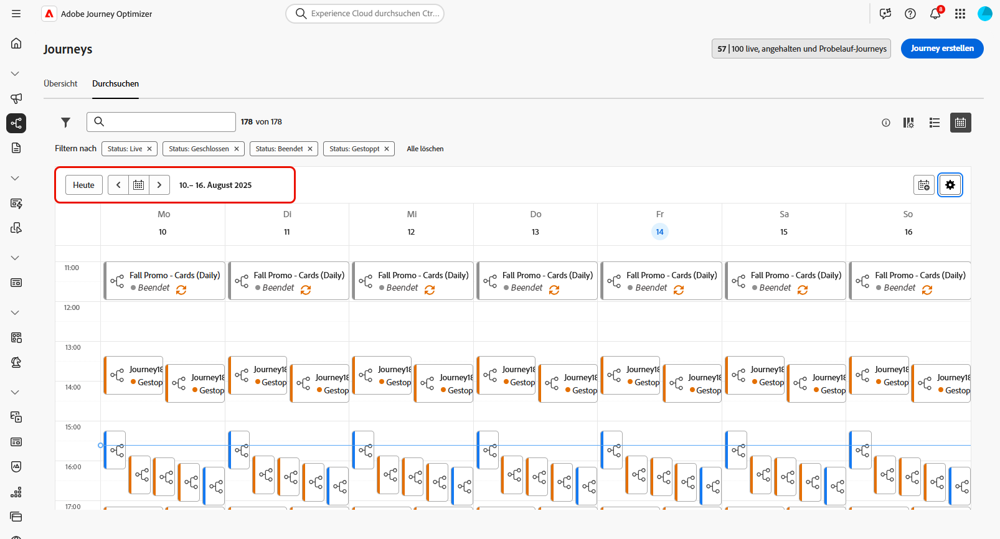
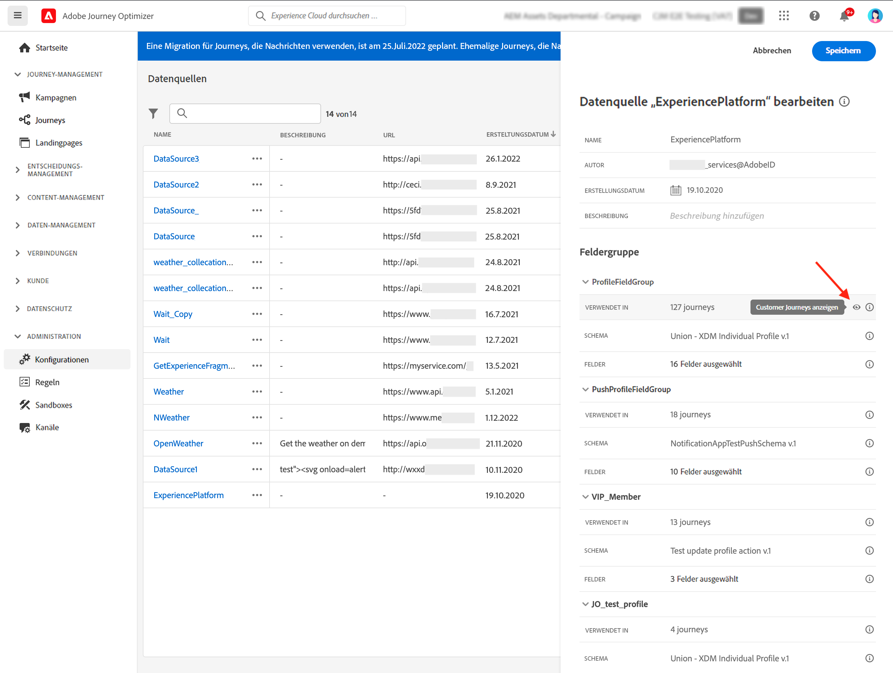

# Durchsuchen und Filtern von Journeys {#browse-journeys}

>[!CONTEXTUALHELP]
>id="ajo_journey_view"
>title="Listen- und Kalenderansicht von Journeys"
>abstract="Zusätzlich zur Journey-Liste bietet [!DNL Journey Optimizer] eine Kalenderansicht Ihrer Journeys mit einer übersichtlichen Darstellung ihrer Zeitpläne. Über diese Schaltflächen können Sie jederzeit zwischen der Listen- und Kalenderansicht wechseln."

## Journey-Dashboard {#dashboard-jo}

Klicken Sie im Menüabschnitt JOURNEY-MANAGEMENT auf **[!UICONTROL Journeys]**. Zwei Registerkarten sind verfügbar: **[!UICONTROL Übersicht]** und **[!UICONTROL Durchsuchen]**.

### Übersicht über die Journey

Auf der Registerkarte **[!UICONTROL Übersicht]** wird ein Dashboard mit Schlüsselmetriken zu Ihren Journeys angezeigt.

* **Verarbeitete Profile**: Gesamtzahl der in den letzten 24 Stunden verarbeiteten Profile.
* **Live-Journeys**: Gesamtzahl der Live-Journeys mit Traffic in den letzten 24 Stunden. Live-Journeys umfassen **unitäre Journeys** (ereignisbasiert) und **Batch-Journeys** (Zielgruppe lesen).
* **Fehlerrate**: Verhältnis aller fehlerhaften Profile in Bezug auf die Gesamtzahl der in den letzten 24 Stunden eingetretenen Profile.
* **Verwerfungsrate**: Verhältnis aller verworfenen Profile in Bezug auf die Gesamtzahl der in den letzten 24 Stunden eingetretenen Profile. Ein verworfenes Profil stellt eine Person dar, die nicht zum Eintritt in die Journey berechtigt ist, z. B. aufgrund eines falschen Namespace oder aufgrund von Regeln für den erneuten Eintritt.

>[!NOTE]
>
>Dieses Dashboard berücksichtigt die Journeys mit Traffic in den letzten 24 Stunden. Es werden nur die Journeys angezeigt, auf die Sie zugreifen können. Metriken werden alle 30 Minuten aktualisiert, aber nur dann, wenn neue Daten verfügbar sind.

### Liste der Journey

Auf der Registerkarte **[!UICONTROL Durchsuchen]** wird eine Liste der vorhandenen Journeys angezeigt. Sie können nach Journeys suchen, Filter verwenden und für jedes Element grundlegende Aktionen ausführen. Sie können ein Element beispielsweise duplizieren oder löschen.

### Journey-Kalender {#calendar}

Zusätzlich zur Journey-Liste bietet [!DNL Journey Optimizer] eine Kalenderansicht Ihrer Journey, die eine übersichtliche Darstellung ihrer Zeitpläne bietet.

>[!AVAILABILITY]
>
>Die Kalenderansicht ist derzeit nur für ausgewählte Organisationen verfügbar (eingeschränkte Verfügbarkeit). Um den Zugriff anzufordern, verwenden Sie [dieses Formular](https://forms.cloud.microsoft/r/FC49afuJVi){target=”_blank”}.
>
>Diese Funktion befindet sich in der aktiven Entwicklung. Wir freuen uns über Ihre Eingaben und Anfragen über die Schaltfläche **[!UICONTROL Beta Feedback]** im oberen Menü.

Um auf die Kalenderansicht zuzugreifen, öffnen Sie die Liste Journey und klicken Sie auf das Symbol .

Der Kalender zeigt alle für die aktuelle Woche geplanten Journey an. Verwenden Sie die Pfeiltasten über dem Kalender, um zwischen den Wochen zu navigieren.

Darstellung der Journey:

* Standardmäßig zeigt das Kalenderraster alle Live- und geplanten Journey für die ausgewählte Woche an. Zusätzliche Filteroptionen können abgeschlossene, gestoppte und abgeschlossene Aktivierungen oder Aktivierungen anzeigen.
* Journey- und Journey-Entwürfe werden im Testmodus nicht angezeigt.
* Journey, die sich über mehrere Tage erstrecken, werden oben im Kalenderraster angezeigt.
* Wenn keine Startzeit angegeben wird, wird die nächstgelegene manuelle Aktivierungszeit verwendet, um sie im Kalender zu positionieren.
* Journey werden als Zeitspannen von einer Stunde angezeigt, dies spiegelt jedoch nicht die tatsächliche Versand- oder Abschlusszeit wider.

Um weitere Informationen zu einer Journey zu erhalten, klicken Sie auf den entsprechenden Bildblock, um sie zu öffnen und die zugehörigen Details zu erkunden.

In der Liste der Journeys werden alle Journey-Versionen mit der Versionsnummer angezeigt. Wenn Sie nach einer Journey suchen, werden beim ersten Öffnen der Anwendung die neuesten Versionen oben in der Liste angezeigt. Anschließend können Sie die gewünschte Sortierung definieren und die Anwendung behält sie als Benutzerpräferenz bei. Die Version der Journey wird auch oben auf der Journey-Bearbeitungsoberfläche über der Arbeitsfläche angezeigt. Erfahren Sie mehr über die [Verwaltung von Journey-Versionen](publishing-the-journey.md#journey-versions-journey-versions).

## Filtern von Journeys {#journey-filter}

Verwenden Sie in der Liste der Journeys verschiedene Filter zum Verfeinern dieser Liste.

Sie können Journeys nach [Status](#journey-statuses), [Typ](#journey-types), [Version](publishing-the-journey.md#journey-versions-journey-versions) und zugewiesenen [Tags](../start/search-filter-categorize.md#tags) aus den **[!UICONTROL Filtern für Status und Version]** filtern.

Verwenden Sie die **[!UICONTROL Erstellungsfilter]**, um die Journeys nach ihrem Erstellungsdatum oder der Person, die sie erstellt hat, zu filtern.

Zeigen Sie etwa nur Journeys an, die ein bestimmtes Ereignis, eine bestimmte Feldergruppe oder eine bestimmte Aktion aus den **[!UICONTROL Aktivitätsfiltern]** und **[!UICONTROL Datenfiltern]** verwenden.

Die **[!UICONTROL Veröffentlichungsfilter]** erlauben die Auswahl eines Veröffentlichungsdatum oder einer Person. Sie können beispielsweise auswählen, dass die aktuellen Versionen von Live-Journeys, die gestern veröffentlicht wurden, angezeigt werden sollen.

Um Journeys nach einem bestimmten Datumsbereich zu filtern, wählen Sie aus der Dropdown-Liste **[!UICONTROL Veröffentlicht]** die Option **[!UICONTROL Benutzerdefiniert]** aus.

In den Konfigurationsbereichen für Ereignis, Datenquelle und Aktion zeigt das Feld **[!UICONTROL Verwendet in]** die Zahl der Journeys an, die das betreffende Ereignis, diese Feldergruppe oder diese Aktion verwenden. Sie können auf die Schaltfläche **[!UICONTROL Customer Journeys anzeigen]** klicken, um die Liste der entsprechenden Journeys zu öffnen.

## Journey-Typen {#journey-types}

Der Typ einer Journey hängt von den in dieser Journey verwendeten Aktivitäten ab. Es kann sich handeln um:

* **[!UICONTROL Unitäres Ereignis]**: Journeys des Typs „Unitäre Ereignisse“ sind mit einem bestimmten Profil verknüpft. Ereignisse beziehen sich auf das Verhalten einer Person oder auf etwas, das mit einer Person in Verbindung steht (z. B. eine Person hat 10.000 Treuepunkte erreicht). [Weitere Informationen](../event/about-events.md).
* **[!UICONTROL Geschäftsereignis]**: Eine Journey des Typs „Geschäftsereignis“ beginnt mit einem nicht profilbezogenen Ereignis. Die Konfiguration des Ereignisses wird von technischen Benutzenden vorgenommen und kann nicht bearbeitet werden. [Weitere Informationen](../event/about-events.md).
* **[!UICONTROL Zielgruppenqualifizierung]**: Journeys vom Typ „Zielgruppenqualifizierung“ überwachen die Ein- und Austritte von Profilen in Adobe Experience Platform-Zielgruppen, damit Personen in eine Journey eintreten oder damit fortfahren. [Weitere Informationen](audience-qualification-events.md).
* **[!UICONTROL Lesen der Zielgruppe]**: In Journeys des Typs „Lesen der Zielgruppe“ treten alle Personen der Zielgruppe in die Journey ein und empfangen die in Ihrer Journey enthaltenen Nachrichten.  [Weitere Informationen](read-audience.md).

Weitere Informationen zu Journey-Typen und der zugehörigen Eintrittsverwaltung finden Sie auf [dieser Seite](entry-management.md).

## Journey-Status {#journey-statuses}

Der Journey-Status hängt von ihrem Lebenszyklus ab. Es kann sich handeln um:

* **Geschlossen**: Die Journey wurde mithilfe der Schaltfläche **Für neue Eintritte schließen** geschlossen. Die Journey stoppt den Eintritt neuer Personen in die Journey.  Personen, die sich bereits in der Journey befinden, können die Journey wie gewohnt beenden.
* **Entwurf**: Die Journey befindet sich in der ersten Phase. Sie wurde noch nicht veröffentlicht.
* **Entwurf (Test)**: Der Testmodus wurde mit der Schaltfläche **Testmodus** aktiviert.
* **Beendet**: Die Journey wechselt nach der [maximalen globalen Wartezeit](journey-properties.md#global_timeout) von 91 Tagen automatisch in diesen Status.  Profile, die sich bereits in der Journey befinden, beenden die Journey wie gewohnt. Neue Profile können nicht mehr in die Journey eintreten. 
* **Live**: Die Journey wurde mithilfe der Schaltfläche **Veröffentlichen** veröffentlicht.
* **Gestoppt**: Die Journey wurde mit der Schaltfläche **Stoppen** gestoppt. Alle Einzelpersonen verlassen die Journey sofort.

>[!NOTE]
>
>* Der Journey-Authoring-Lebenszyklus umfasst auch eine Reihe von Zwischenstatus, die nicht zum Filtern verfügbar sind: „Veröffentlichen“ (zwischen „Entwurf“ und „Live“), „Testmodus aktivieren“ oder „Testmodus deaktivieren“ (zwischen „Entwurf“ und „Entwurf [Test]“) und „Stoppen“ (zwischen „Live“ und „Gestoppt“). Wenn sich eine Journey in einem Zwischenzustand befindet, ist sie schreibgeschützt.
>
>* Wenn Sie eine **Live-Journey** ändern müssen, [erstellen Sie eine neue Version](#journey-versions) Ihrer Journey.

## Duplizieren einer Journey {#duplicate-a-journey}

Sie können eine vorhandene Journey über die Registerkarte **Durchsuchen** duplizieren. Alle Objekte und Einstellungen werden in der Journey-Kopie dupliziert.

Gehen Sie dazu wie folgt vor:

1. Navigieren Sie zu der Journey, die Sie kopieren möchten, und klicken Sie auf das Symbol **Mehr Aktionen** (die drei Punkte neben dem Journey-Namen).
1. Wählen Sie **Duplizieren** aus.

   

1. Geben Sie den Namen der Journey ein und speichern Sie ihn. Sie können den Namen auch im Bildschirm „Journey-Eigenschaften“ ändern. Standardmäßig lautet der Name wie folgt: `[JOURNEY-NAME]_copy`

   

1. Die neue Journey wird erstellt und ist in der Journey-Liste verfügbar.
