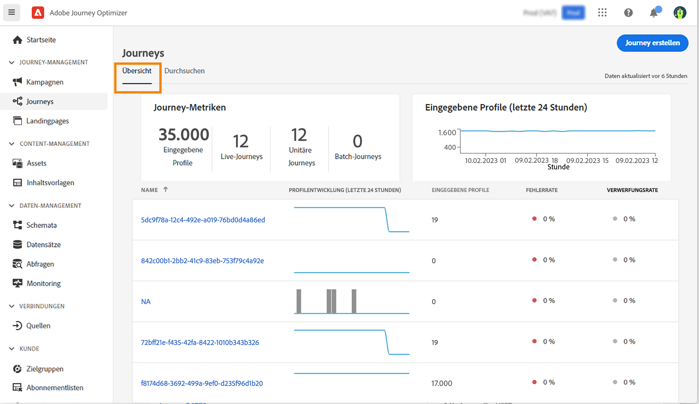

# Durchsuchen und Filtern von Journeys {#browse-journeys}

>[!CONTEXTUALHELP]
>id="ajo_journey_view"
>title="Listen- und Kalenderansicht von Journeys"
>abstract="Zusätzlich zur Journey-Liste bietet [!DNL Journey Optimizer] eine Kalenderansicht Ihrer Journeys mit einer übersichtlichen Darstellung ihrer Zeitpläne. Über diese Schaltflächen können Sie jederzeit zwischen der Listen- und Kalenderansicht wechseln."

## Journey-Dashboard {#dashboard-jo}

Klicken Sie im Menüabschnitt JOURNEY-MANAGEMENT auf **[!UICONTROL Journeys]**. Zwei Registerkarten sind verfügbar: **[!UICONTROL Übersicht]** und **[!UICONTROL Durchsuchen]**.

### Journey-Überblick

Auf der Registerkarte **[!UICONTROL Überblick]** wird ein Dashboard mit Schlüsselmetriken zu Ihren Journeys angezeigt.

* **Verarbeitete Profile**: Gesamtzahl der in den letzten 24 Stunden verarbeiteten Profile.
* **Live-Journeys**: Gesamtzahl der Live-Journeys mit Traffic in den letzten 24 Stunden. Live-Journeys umfassen **unitäre Journeys** (ereignisbasiert) und **Batch-Journeys** (Zielgruppe lesen).
* **Fehlerrate**: Verhältnis aller fehlerhaften Profile in Bezug auf die Gesamtzahl der in den letzten 24 Stunden eingetretenen Profile.
* **Verwerfungsrate**: Verhältnis aller verworfenen Profile in Bezug auf die Gesamtzahl der in den letzten 24 Stunden eingetretenen Profile. Ein verworfenes Profil stellt eine Person dar, die nicht zum Eintritt in die Journey berechtigt ist, z. B. aufgrund eines falschen Namespace oder aufgrund von Regeln für den erneuten Eintritt.

>[!NOTE]
>
>Dieses Dashboard berücksichtigt die Journeys mit Traffic in den letzten 24 Stunden. Es werden nur die Journeys angezeigt, auf die Sie zugreifen können. Metriken werden alle 30 Minuten aktualisiert, aber nur dann, wenn neue Daten verfügbar sind.

### Journey-Liste

Auf der Registerkarte **[!UICONTROL Durchsuchen]** wird eine Liste der vorhandenen Journeys angezeigt. Sie können nach Journeys suchen, Filter verwenden und für jedes Element grundlegende Aktionen ausführen. Sie können ein Element beispielsweise duplizieren oder löschen.

In der Liste der Journeys werden alle Journey-Versionen mit der Versionsnummer angezeigt. Wenn Sie nach einer Journey suchen, werden beim ersten Öffnen der Anwendung die neuesten Versionen oben in der Liste angezeigt. Anschließend können Sie die gewünschte Sortierung definieren und die Anwendung behält sie als Benutzerpräferenz bei. Die Version der Journey wird auch oben auf der Journey-Bearbeitungsoberfläche über der Arbeitsfläche angezeigt. Erfahren Sie mehr über die [Verwaltung von Journey-Versionen](publish-journey.md#journey-versions).

### Journey-Kalender {#calendar}

Zusätzlich zur Journey-Liste bietet [!DNL Journey Optimizer] eine Kalenderansicht Ihrer Journeys mit einer übersichtlichen Darstellung ihrer Zeitpläne. 

Darstellung von Journeys:

* Standardmäßig zeigt das Kalenderraster alle Live- und geplanten Journeys für die ausgewählte Woche an. Zusätzliche Filteroptionen können abgeschlossene, gestoppte und beendete Aktivierungen oder Aktivierungen anzeigen.
* Journey-Entwürfe und Journeys im Testmodus werden nicht angezeigt.
* Journeys, die sich über mehrere Tage erstrecken, werden oben im Kalenderraster angezeigt.
* Wenn keine Startzeit angegeben ist, wird die nächste manuelle Aktivierungszeit zur Positionierung im Kalender verwendet.
* Journeys werden als Zeitspannen von 1 Stunde angezeigt, dies spiegelt jedoch nicht die tatsächliche Versand- oder Abschlusszeit wider.

So navigieren Sie in Ihrem Journey-Kalender:

1. Um auf die Kalenderansicht zuzugreifen, öffnen Sie die Journey-Liste und klicken Sie auf das Symbol .

1. Verwenden Sie die Pfeiltasten oder die Datumsauswahl über dem Kalender, um zwischen Wochen zu wechseln.

   Der Kalender zeigt alle für die aktuelle Woche geplanten Journeys an.

   

1. Klicken Sie auf das Symbol , um die Anzeige von Elementen umzuschalten, die sich über mehrere Tage oder Wochen erstrecken.

   

1. Klicken Sie auf das Symbol , um bis zu drei externe Kalender zu verwalten und hinzuzufügen.

   

1. Verschieben Sie Ihre CSV-Dateien mit den Namen der Veranstaltungen sowie Start- und Enddaten per Drag-and-Drop.

   Hochgeladene Ereignisse werden für alle Benutzenden in Ihrer Organisation angezeigt und erscheinen sowohl im Journey- als auch im Kampagnenkalender.

   +++Das CSV-Format sollte wie folgt aussehen:

   | Spalte1 | Spalte2 | Spalte3 |
   |-|-|-|
   | Ereignisname | Startdatum im Format TT/MM/JJ | Enddatum im Format TT/MM/JJ |

   +++

1. Bei Bedarf können Sie hinzugefügte externe Kalender ausblenden, einblenden oder entfernen.

   

1. Weitere Informationen zu einer Journey erhalten Sie, indem Sie auf ihren visuellen Block klicken, um die entsprechenden Details zu öffnen und zu erkunden.

   

## Filtern von Journeys {#journey-filter}

Verwenden Sie in der Liste der Journeys verschiedene Filter zum Eingrenzen dieser Liste.

Sie können Journeys nach [Status](#journey-statuses), [Typ](#journey-types), [Version](publish-journey.md#journey-versions) und zugewiesenen [Tags](../start/search-filter-categorize.md#tags) aus den **[!UICONTROL Filtern für Status und Version]** filtern.

Verwenden Sie die **[!UICONTROL Erstellungsfilter]**, um die Journeys nach ihrem Erstellungsdatum oder der Person zu filtern, die sie erstellt hat.

Zeigen Sie Journeys an, die ein bestimmtes Ereignis, eine bestimmte Feldergruppe oder eine bestimmte Aktion aus den **[!UICONTROL Aktivitätsfiltern]** und **[!UICONTROL Datenfiltern]** verwenden.

Die **[!UICONTROL Veröffentlichungsfilter]** erlauben die Auswahl eines Veröffentlichungsdatum oder einer Person. Sie können beispielsweise auswählen, dass die aktuellen Versionen von Live-Journeys, die gestern veröffentlicht wurden, angezeigt werden sollen.

Um Journeys nach einem bestimmten Datumsbereich zu filtern, wählen Sie aus der Dropdown-Liste **[!UICONTROL Veröffentlicht]** die Option **[!UICONTROL Benutzerdefiniert]** aus.

In den Konfigurationsbereichen für Ereignis, Datenquelle und Aktion zeigt das Feld **[!UICONTROL Verwendet in]** die Zahl der Journeys an, die das betreffende Ereignis, diese Feldergruppe oder diese Aktion verwenden. Sie können auf die Schaltfläche **[!UICONTROL Customer Journeys anzeigen]** klicken, um die Liste der entsprechenden Journeys zu öffnen.

## Journey-Typen {#journey-types}

Der Typ einer Journey hängt von den in dieser Journey verwendeten Aktivitäten ab. Es kann sich handeln um:

* **[!UICONTROL Unitäres Ereignis]**: Journeys des Typs „Unitäre Ereignisse“ sind mit einem bestimmten Profil verknüpft. Ereignisse beziehen sich auf das Verhalten einer Person oder auf etwas, das mit einer Person in Verbindung steht (z. B. eine Person hat 10.000 Treuepunkte erreicht). [Weitere Informationen](../event/about-events.md).
* **[!UICONTROL Geschäftsereignis]**: Eine Journey des Typs „Geschäftsereignis“ beginnt mit einem nicht profilbezogenen Ereignis. Die Konfiguration des Ereignisses wird von technischen Benutzenden vorgenommen und kann nicht bearbeitet werden. [Weitere Informationen](../event/about-events.md).
* **[!UICONTROL Zielgruppenqualifizierung]**: Journeys vom Typ „Zielgruppenqualifizierung“ überwachen die Ein- und Austritte von Profilen in Adobe Experience Platform-Zielgruppen, damit Personen in eine Journey eintreten oder damit fortfahren. [Weitere Informationen](audience-qualification-events.md).
* **[!UICONTROL Lesen der Zielgruppe]**: In Journeys des Typs „Lesen der Zielgruppe“ treten alle Personen der Zielgruppe in die Journey ein und empfangen die in Ihrer Journey enthaltenen Nachrichten.  [Weitere Informationen](read-audience.md).

Weitere Informationen zu Journey-Typen und der zugehörigen Eintrittsverwaltung finden Sie auf [dieser Seite](entry-management.md).

## Journey-Status {#journey-statuses}

Der Journey-Status hängt von ihrem Lebenszyklus ab. Es kann sich handeln um:

* **Entwurf**: Die Journey befindet sich in der ersten Phase. Sie wurde noch nicht veröffentlicht.
* **Entwurf (Test)**: Der Testmodus wurde mit der Schaltfläche **Testmodus** aktiviert. [Weitere Informationen](../building-journeys/testing-the-journey.md)
* **Beendet**: Die Journey wechselt je nach Journey-Typ und Konfiguration automatisch in diesen Status. Profile, die sich bereits in der Journey befinden, beenden die Journey wie gewohnt. Neue Profile können nicht mehr in die Journey eintreten. [Erfahren Sie, wann Journey als abgeschlossen gelten](end-journey.md#journey-finished-definition).
* **Live**: Die Journey wurde mithilfe der Schaltfläche **Veröffentlichen** veröffentlicht. [Weitere Informationen](../building-journeys/publish-journey.md)
* **Angehalten**: Die Live-Journey wurde mithilfe der Schaltfläche **Anhalten** angehalten. [Weitere Informationen](../building-journeys/journey-pause.md)
* **Gestoppt**: Die Journey wurde mit der Schaltfläche **Stoppen** gestoppt. Alle Kontakte verlassen die Journey sofort. [Weitere Informationen](../building-journeys/end-journey.md#stop-journey)
* **Geschlossen**: Die Journey wurde mithilfe der Schaltfläche **Für neue Eintritte schließen** geschlossen. Die Journey stoppt den Eintritt neuer Personen in die Journey.  Personen, die sich bereits in der Journey befinden, können die Journey wie gewohnt beenden. [Weitere Informationen](../building-journeys/end-journey.md)

>[!NOTE]
>
>* Der Journey-Authoring-Lebenszyklus umfasst auch eine Reihe von Zwischenstatus, die nicht zum Filtern verfügbar sind: **Wird veröffentlicht** (zwischen „Entwurf“ und „Live“), **Testmodus wird aktiviert** oder **Testmodus wird deaktiviert** (zwischen **Entwurf** und **Entwurf (Test)**), **Wird gestoppt** (zwischen **Live** und **Gestoppt**), **Wird fortgesetzt** (zwischen **Angehalten** und **Live**), **Wird ausgesetzt** (zwischen **Live** und **Angehalten**). Befindet sich eine Journey in einem Zwischenstatus, ist sie schreibgeschützt.
>
>* Wenn Sie eine **Live**-Journey ändern müssen, [erstellen Sie eine neue Version](#journey-versions) Ihrer Journey. Sie können Ihre Live-Journeys auch pausieren, um alle erforderlichen Änderungen vorzunehmen, und danach jederzeit wieder fortsetzen. [Weitere Informationen zum Anhalten von Journeys](../building-journeys/journey-pause.md)

## Duplizieren einer Journey {#duplicate-a-journey}

Sie können eine vorhandene Journey über die Registerkarte **Durchsuchen** duplizieren. Alle Objekte und Einstellungen werden in der Journey-Kopie dupliziert.

Gehen Sie dazu wie folgt vor:

1. Navigieren Sie zu der Journey, die Sie kopieren möchten, und klicken Sie auf das Symbol **Mehr Aktionen** (die drei Punkte neben dem Journey-Namen).
1. Wählen Sie **Duplizieren** aus.

   

1. Geben Sie den Namen der Journey ein und speichern Sie ihn. Sie können den Namen auch im Bildschirm „Journey-Eigenschaften“ ändern. Standardmäßig lautet der Name wie folgt: `[JOURNEY-NAME]_copy`

   

1. Die neue Journey wird erstellt und ist in der Journey-Liste verfügbar.

## Massenvorgänge {#bulk-operations}

In der Liste der Journeys können Sie eine oder mehrere **Live-Journeys** pausieren. Wählen Sie zum Pausieren einer Gruppe von Journeys (_Massenpause_) die Journeys in der Liste aus und klicken Sie auf die Schaltfläche **Anhalten** in der blauen Leiste am unteren Bildschirmrand. Die Schaltfläche **Anhalten** ist nur verfügbar, wenn **Live**-Journeys ausgewählt sind.

Sie können auch eine oder mehrere **pausierte** Journeys fortsetzen. Um eine Gruppe von Journeys fortzusetzen (_Massenfortsetzung_), wählen Sie diese aus und klicken Sie auf die Schaltfläche **Fortsetzen** in der blauen Leiste am unteren Bildschirmrand. Beachten Sie, dass die Schaltfläche **Fortsetzen** nur verfügbar ist, wenn **pausierte** Journeys ausgewählt sind.

[Erfahren Sie mehr über das Pausieren/Fortsetzen von Journeys](journey-pause.md).

>[!NOTE]
>
>Sie können bis zu 10 Journeys pro Vorgang pausieren/fortsetzen.

