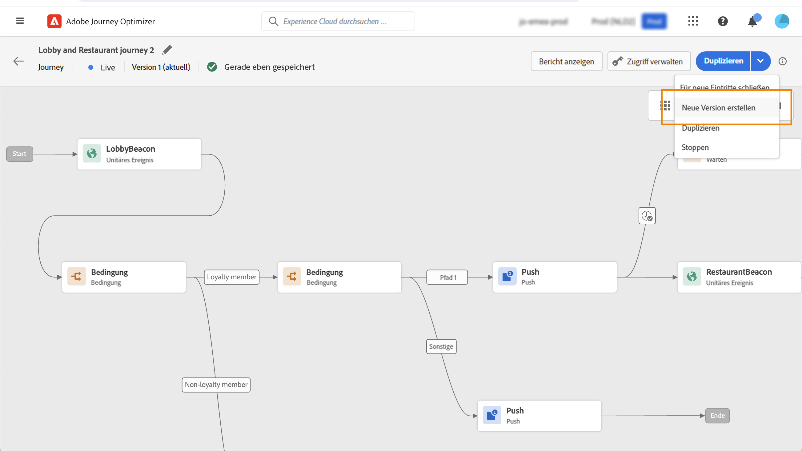

# Allgemeine Funktionsweise{#jo-general-principle}

Verwendung [!DNL Journey Optimizer] zum Erstellen von Anwendungsfällen für die Echtzeit-Orchestrierung der Customer Journey mithilfe von Kontextdaten, die in Ereignissen oder Datenquellen gespeichert sind.

Erstellen Sie mehrstufige fortgeschrittene Szenarien mit folgenden Funktionen:

* Führen Sie einen **unitären Versand** in Echtzeit aus, ausgelöst durch den Empfang eines Ereignisses, oder **im Batch** unter Verwendung von Adobe Experience Platform-Segmenten.

* Nutzen Sie **Kontextdaten** aus Ereignissen, Informationen aus Adobe Experience Platform oder Daten aus API-Services von Drittanbietern.

* Verwenden Sie die **integrierten Aktionen** zum Senden von in [!DNL Journey Optimizer] entworfenen Nachrichten oder erstellen Sie **benutzerspezifische Aktionen**, wenn Sie zum Senden Ihrer Nachrichten ein Drittanbietersystem verwenden.

* Erstellen Sie mit dem **Journey Designer** Ihre mehrstufigen Anwendungsfälle: Ziehen Sie einfach per Drag-and-Drop ein Eintrittsereignis oder eine Aktivität zum Lesen von Segmenten in den Arbeitsbereich, fügen Sie Bedingungen hinzu und senden Sie personalisierte Nachrichten.

## Schritte zum Erstellen einer Journey{#steps-journey}

Verwenden Sie Adobe Journey Optimizer, um personalisierte Journey aus einer einzigen Arbeitsfläche zu entwerfen und zu orchestrieren.

Adobe Journey Optimizer enthält eine Arbeitsfläche für die Omnichannel-Orchestrierung, mit der Marketing-Experten Marketing-Interaktionen mit einer Eins-zu-Eins-Kundeninteraktion harmonisieren können. In der Benutzeroberfläche können Sie Aktivitäten einfach per Drag-and-Drop aus der Palette in die Arbeitsfläche ziehen, um Ihre Journey zu erstellen.

Erfahren Sie, wie Sie Ihre erste Journey in [diese Seite](journey-gs.md).

Der Omnichannel-Journey-Designer hilft Ihnen bei der Erstellung mehrstufiger Journey mit zielgerichteten Zielgruppen, Aktualisierungen basierend auf Echtzeit-Kundeninteraktionen oder Geschäftsinteraktionen sowie Omnichannel-Nachrichten mithilfe einer intuitiven Drag &amp; Drop-Oberfläche.

Mehr dazu in [diesem Abschnitt](using-the-journey-designer.md).

Als Data Engineer werden die Schritte zur Konfiguration Ihrer Journey beschrieben, einschließlich Datenquellen, Ereignissen und Aktionen. Weitere Informationen dazu finden Sie unter [diesem Abschnitt](../configuration/about-data-sources-events-actions.md).

## Anwendungsbeispiele{#uc-journey}

In den folgenden durchgehenden Anwendungsfällen erfahren Sie, wie Sie Journey erstellen.

Anwendungsfälle für Unternehmen:

* [Senden von Multi-Channel-Nachrichten](journeys-uc.md)
* [Senden einer Nachricht mit Campaign v7/v8](campaign-classic-use-case.md)
* [Senden einer Nachricht an Abonnenten](message-to-subscribers-uc.md)

Technische Anwendungsfälle:

* [Dynamisches Übergeben von Sammlungen mithilfe benutzerdefinierter Aktionen](collections.md)
* [Steigern der Versandaktivität](ramp-up-deliveries-uc.md)
* [Begrenzen des Durchsatzes mit externen Datenquellen und benutzerdefinierten Aktionen](limit-throughput.md)

## Journey-Versionen{#journey-versions}

In der Liste der Journeys werden alle Journey-Versionen mit der Versionsnummer angezeigt. Weitere Informationen finden Sie auf [dieser Seite](../building-journeys/using-the-journey-designer.md).

Wenn Sie nach einer Journey suchen, werden beim ersten Öffnen der Anwendung die neuesten Versionen oben in der Liste angezeigt. Anschließend können Sie die gewünschte Sortierung definieren und die Anwendung behält sie als Benutzervoreinstellung bei. Die Version der Journey wird auch oben auf der Benutzeroberfläche zum Bearbeiten der Journey (oberhalb der Arbeitsfläche) angezeigt.

>[!NOTE]
>
>In den meisten Fällen kann ein Profil nicht mehrmals zur gleichen Zeit in derselben Journey vorhanden sein. Wenn der erneute Eintritt aktiviert ist, kann ein Profil erneut in eine Journey eintreten, aber erst dann, wenn es die vorherige Instanz der Journey vollständig verlassen hat. [Weitere Informationen](end-journey.md).

Wenn Sie eine Live-Journey ändern müssen, erstellen Sie eine neue Journey-Version.

1. Öffnen Sie die aktuelle Version Ihrer Live-Journey, klicken Sie auf **[!UICONTROL Neue Version erstellen]** und bestätigen Sie.

   

   >[!NOTE]
   >
   >Sie können nur aus der aktuellen Version einer Journey eine neue Journey erstellen.

1. Nehmen Sie Ihre Änderungen vor, klicken Sie auf **[!UICONTROL Veröffentlichen]** und bestätigen Sie.

   

Ab dem Zeitpunkt der Veröffentlichung der Journey nehmen Kontakte an der neuen Version der Journey teil. Personen, die bereits an einer früheren Version teilnehmen, bleiben in ihr, bis sie die Journey beenden. Wenn sie später wieder in dieselbe Journey eintreten, wechseln sie in die aktuelle Version.

Journey-Versionen können einzeln gestoppt werden. Alle Versionen von Journeys haben denselben Namen.

Wenn Sie eine neue Version einer Journey veröffentlichen, endet die vorherige Version automatisch und wechselt in den Status **Geschlossen**. Es kann kein Eintritt in die Journey erfolgen. Auch wenn Sie die neueste Version stoppen, bleibt die vorherige Version geschlossen.

>[!NOTE]
>
>Weitere Informationen zu den Limits und Einschränkungen von Journey-Versionen finden Sie unter [diese Seite](../start/guardrails.md#journey-versions-limitations)