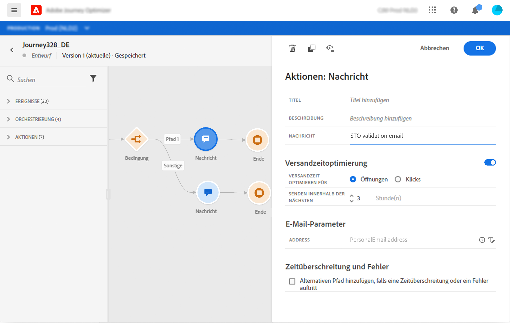

# Hinzufügen einer Nachricht zu einer Journey

[!DNL Journey Optimizer] verfügt über integrierte Nachrichtenfunktionen. Sie müssen nur den Inhalt gestalten und Ihre Nachricht veröffentlichen. Weitere Informationen finden Sie in [diesem Abschnitt](../get-started-content.md). Anschließend fügen Sie einfach eine Push- oder E-Mail-Nachricht in Ihre Journey ein, die mit Journey Optimizer entworfen wurde.

Wenn Sie für den Versand Ihrer Nachrichten ein Drittanbietersystem verwenden, können Sie eine benutzerdefinierte Aktion erstellen. Weitere Informationen finden Sie in diesem [Abschnitt](../action/action.md).

## Hinzufügen einer Nachrichtenaktivität

1. Beginnen Sie Ihre Journey immer mit einem Ereignis oder einer Aktivität vom Typ **Segment lesen**.

   

1. Ziehen Sie aus dem Bereich **Aktionen** der Palette eine **Nachrichtenaktivität** auf die Arbeitsfläche.

   

1. Fügen Sie einen Titel und eine Beschreibung hinzu.

   

1. Klicken Sie in das Feld **Nachricht**. Eine Liste der in Journey Optimizer entworfenen verfügbaren Nachrichten wird angezeigt. Die Elemente dieser Liste können Sie nach ihrem Status filtern.

   

1. Wählen Sie eine Nachricht aus und klicken Sie auf **Auswählen**. Außerdem können Sie eine neue Nachricht direkt über diesen Bildschirm erstellen, indem Sie auf **Nachricht erstellen** klicken.

   

   Wenn Sie Ihre Nachricht überprüfen möchten, können Sie auf das Symbol **Nachricht öffnen** im Feld **Nachricht** klicken. Die Nachricht wird in einer neuen Registerkarte geöffnet.

   

1. Fügen Sie die nächsten Schritte zu Ihrer Journey hinzu.

## E-Mail-Parameter und Push-Parameter

In den Abschnitten **[!UICONTROL E-Mail-Parameter]** und **[!UICONTROL Push-Parameter]** finden Sie schreibgeschützte Felder. Diese Konfiguration wird normalerweise beim Erstellen der Nachricht durchgeführt. Weitere Informationen finden Sie in [diesem Abschnitt](../get-started-content.md).

Um einen bestimmten Wert zu erzwingen, können Sie das Symbol **Parameterüberschreibung aktivieren** rechts neben dem Feld verwenden. Diese Option kann im Rahmen von Tests nützlich sein. Beispielsweise können Sie als E-Mail-Adresse Ihre eigene E-Mail-Adresse hinzufügen. Nachdem Sie die Journey veröffentlicht haben, wird die E-Mail an Sie gesendet.

## Versandzeitpunkt optimieren{#send-time-optimization}

### Über die Optimierung des Versandzeitpunkts{#about-send-time-optimization}

>[!CONTEXTUALHELP]
>id="jo_bestsendtime_disabled"
>title="Über die Optimierung des Versandzeitpunkts"
>abstract="Die Funktion zur Optimierung des Versandzeitpunkts von Adobe Journey Optimizer basiert auf den KI-Services von Adobe und kann die beste Versandzeit für E-Mails oder Push-Benachrichtigungen vorhersagen, um die Interaktion basierend auf historischen Öffnungs- und Klickraten zu maximieren."

Die Funktion zur Optimierung des Versandzeitpunkts von Adobe Journey Optimizer basiert auf den KI-Services von Adobe und kann die beste Versandzeit für E-Mails oder Push-Benachrichtigungen vorhersagen, um die Interaktion basierend auf historischen Öffnungs- und Klickraten zu maximieren. Verwenden Sie unser Modell für maschinelles Lernen, um personalisierte Versandzeitpunkte für jeden Benutzer zu planen, um die Öffnungs- und Klickraten Ihrer Nachrichten zu erhöhen.

Das Modell „Optimierung des Versandzeitpunkts“ nimmt Ihre Adobe Journey Optimizer-Daten auf, betrachtet die Öffnungsraten (für E-Mail und Push-Benachrichtigungen) und Klicks (für E-Mails) auf Benutzerebene, um zu bestimmen, wann Ihre Kunden mit der größten Wahrscheinlichkeit mit Ihrer Nachricht interagieren. Für fundierte Empfehlungen erfordert die Optimierung des Versandzeitpunkts mindestens einen Monat an Tracking-Daten zu Nachrichten. Für jeden Benutzer gibt das Modell die folgenden Prognosedaten aus:

* Die beste Stunde jedes Wochentags zur Maximierung der Interaktion
* Der beste Wochentag zur Maximierung der Interaktion
* Die beste Stunde des besten Wochentags zur Maximierung der Interaktion

Das Modell variiert je nachdem, ob es sich um Scoring oder Training handelt. Das Training wird zu Beginn wöchentlich und später vierteljährlich durchgeführt. Das Scoring erfolgt zu Beginn wöchentlich und später monatlich.

* Training – die Entwicklung des Algorithmus für die Ermittlung des Punktwerts
* Scoring – die Anwendung eines Punktwerts auf einzelne Profile, basierend auf dem trainierten Modell

Diese Informationen werden beim Benutzerprofil gespeichert und bei der Ausführung der Journey referenziert, um Adobe Journey Optimizer mitzuteilen, wann Ihre Nachricht gesendet werden soll.

## Wichtige Hinweise{#send-time-optimization-notes}

* Diese Funktion ist nur für E-Mails und Push-Benachrichtigungen über einen einzelnen Kanal verfügbar, wobei das Tracking aktiviert ist.
* Die Nachricht muss veröffentlicht sein.
* Diese Funktion ist nicht mit dem Burst-Modus kompatibel.

## Optimierung des Versandzeitpunkts aktivieren{#activate-send-time-optimization}

>[!CONTEXTUALHELP]
>id="jo_bestsendtime_email"
>title="Optimierung des Versandzeitpunkts aktivieren"
>abstract="Wählen Sie mithilfe des entsprechenden Radiobuttons aus, ob E-Mail-Öffnungen oder E-Mail-Click-Throughs optimiert werden sollen. Sie können die vom System verwendeten Versandzeitpunkte auch zusammenfassen, indem Sie einen Wert für die Option „Senden innerhalb der nächsten“ eingeben."

>[!CONTEXTUALHELP]
>id="jo_bestsendtime_push"
>title="Optimierung des Versandzeitpunkts aktivieren"
>abstract="Bei Push-Benachrichtigungen wird standardmäßig die Option „Öffnungen“ verwendet, da Klicks für Push-Benachrichtigungen zutreffen. Sie können die vom System verwendeten Versandzeitpunkte auch zusammenfassen, indem Sie einen Wert für die Option „Senden innerhalb der nächsten“ eingeben."

Aktivieren Sie die Optimierung des Versandzeitpunkts für eine E-Mail oder Push-Benachrichtigung, indem Sie den Umschalter **Optimierung des Versandzeitpunkts** aus den Parametern der Nachrichtenaktivität auswählen.

Wählen Sie für E-Mail-Nachrichten durch Auswahl des entsprechenden Radiobuttons aus, ob die E-Mail-Öffnungen oder die E-Mail-Click-Throughs optimiert werden sollen. Bei Push-Benachrichtigungen wird standardmäßig die Option „Öffnungen“ verwendet, da Klicks für Push-Benachrichtigungen zutreffen.

Sie können die vom System verwendeten Versandzeitpunkte auch zusammenfassen, indem Sie einen Wert für die Option **Senden innerhalb der nächsten** eingeben. Wenn Sie als Wert „sechs Stunden“ wählen, prüft Adobe Journey Optimizer jedes Benutzerprofil, ob der optimale Versandzeitpunkt innerhalb von sechs Stunden ab der Journey-Ausführungszeit eintritt, und wählt die für die Optimierung des Versandzeitpunkts festgelegte Zeit aus. Wenn dieser Zeitpunkt nicht innerhalb der nächsten sechs Stunden liegt, sendet Adobe Journey Optimizer die Nachricht standardmäßig zur Journey-Ausführungszeit.
