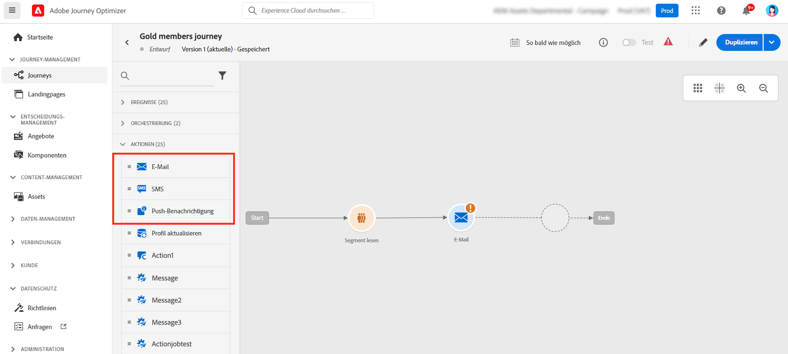

# E-Mail, SMS, Push-Benachrichtigung{#add-a-message-in-a-journey}

[!DNL Journey Optimizer] verfügt über integrierte Nachrichtenfunktionen. Sie können einfach eine Push-, SMS- oder E-Mail-Nachrichtenaktivität zu Ihrer Journey hinzufügen und [Einstellungen und Inhalte definieren](../messages/messages-in-journeys.md). Sie wird dann ausgeführt und innerhalb der Journey gesendet..

Sie können auch bestimmte Aktionen zum Senden von Nachrichten einrichten:

* Wenn Sie zum Senden Ihrer Nachrichten ein Drittanbietersystem verwenden, können Sie eine benutzerdefinierte Aktion erstellen. Weiterführende Informationen finden Sie in diesem [Abschnitt](../action/action.md).

* Wenn Sie mit Campaign und Journey Optimizer arbeiten, lesen Sie diese Abschnitte:

   * [[!DNL Journey Optimizer] und Campaign Classic v7 / Campaign v8](../action/acc-action.md)
   * [[!DNL Journey Optimizer] und Campaign Standard](../action/acs-action.md)

Gehen Sie wie folgt vor, um eine Nachricht zu einer Journey hinzuzufügen:

1. Beginnen Sie Ihre Journey mit einem [Ereignis](general-events.md) oder einer Aktivität vom Typ [Segment lesen](read-segment.md).

1. Ziehen Sie aus dem Abschnitt **Aktionen** der Palette eine **E-Mail**-, **SMS**- oder **Push**-Aktivität auf die Arbeitsfläche und legen Sie sie dort ab.

   

   Alle Schritte zum Konfigurieren der Nachricht und zum Definieren der Inhalte werden in [diesem Abschnitt](../messages/get-started-content.md) beschrieben.

