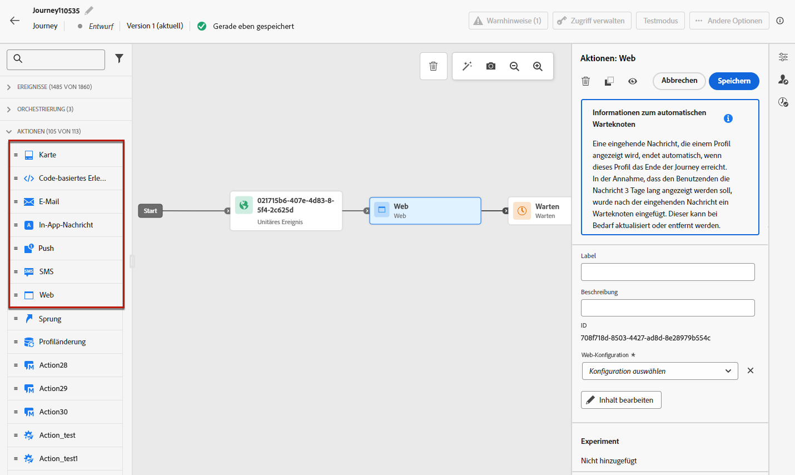

# Verwenden integrierter Kanalaktionen {#add-a-message-in-a-journey}

>[!CONTEXTUALHELP]
>id="ajo_message_activity"
>title="Integrierte Kanalaktion"
>abstract="Journey Optimizer verfügt über integrierte Funktionen für Kanalaktionen. Sie können einfach eine Nachricht (E-Mail, Textnachricht (SMS/MMS), Push, Briefpost) oder ein eingehendes Erlebnis (In-App, Web, Code-basiertes Erlebnis, Inhaltskarte) zu Ihrem Journey hinzufügen und Einstellungen und Inhalte definieren. Sie wird dann im Rahmen der Journey ausgeführt und versendet."

[!DNL Journey Optimizer] verfügt über integrierte Kanalaktionsfunktionen, mit denen Nachrichten gesendet werden: Wenn Profile mit dieser Aktivität beginnen, wird ihnen eine Nachricht gesendet.

Um eine integrierte Kanalaktion zu Ihrer Journey hinzuzufügen, legen Sie eine Kanalaktivität per Drag-and-Drop ab und definieren Sie deren Einstellungen und Inhalte. Sie wird dann im Rahmen der Journey ausgeführt und versendet.

>[!NOTE]
>
>Sie können auch bestimmte Aktionen zum Senden von Nachrichten in [!DNL Journey Optimizer] einrichten. [Weitere Informationen](#recommendation)

## Hinzufügen einer Nachricht zu einer Journey  {#add-msg-in-journey}

Mit integrierten Kanalaktionen können Sie ausgehende oder eingehende Nachrichten konfigurieren. Weitere Informationen zu den in Journeys verfügbaren Kanälen finden Sie in der Tabelle in diesem Abschnitt: [Kanäle in Journeys und Kampagnen](../channels/gs-channels.md#channels).

Gehen Sie wie folgt vor, um eine integrierte Kanalaktion zu einer Journey hinzuzufügen.

1. Beginnen Sie Ihre Journey mit einem [Ereignis](general-events.md) oder einer Aktivität vom Typ [Zielgruppe lesen](read-audience.md).

1. Ziehen Sie aus dem Bereich **Aktionen** der Palette eine Kanalaktivität auf die Arbeitsfläche.

   

1. Sie können auch die Akivität **[!UICONTROL Aktion]** auswählen, mit der Sie mehrere eingehende Aktionen auswählen können. [Weitere Informationen](journey-action.md)

1. Konfigurieren Sie Ihre Aktivität. Ausführliche Konfigurationsrichtlinien finden Sie unter den folgenden Links.

   * Erfahren Sie im Detail, wie Sie eine ausgehende Aktion erstellen:

     <table style="table-layout:fixed">
      <tr style="border: 0;">
      <td>
      
      
<a href="../email/create-email.md"><strong>Erstellen von E-Mails</strong>
      

      

      </td>
      <td>
      
      

      <a href="../push/create-push.md"><strong>Push-Benachrichtigungen erstellen<strong></a>
      

      

      </td>
      <td>
      
      

      <a href="../sms/create-sms.md"><strong>Erstellen von Textnachrichten (SMS/MMS)</strong></a>
      

      

      </td>
      <td>
      
      

      <a href="../direct-mail/create-direct-mail.md"><strong>Erstellen von Direkt-Mail-Nachrichten</strong></a>
      

      

      </td>
      </tr>
      </table>

   * Erfahren Sie im Detail, wie Sie Ihre eingehende Aktion erstellen:

     <table style="table-layout:fixed">
      <tr style="border: 0;">
      <td>
      
      
<a href="../in-app/create-in-app.md"><strong>Erstellen von In-App-Nachrichten</strong>
      

      

      </td>
      <td>
      
      
<a href="../web/create-web.md"><strong>Erstellen von Web-Erlebnissen</strong>
      

      

      </td>
      <td>
      
      
<a href="../content-card/create-content-card.md"><strong>Erstellen von Inhaltskarten</strong>
      

      

      </td>
      <td>
      
      

      <a href="../code-based/create-code-based.md"><strong>Erstellen von Code-basierten Erlebnissen<strong></a>
      

      

      </td>
      </tr>
      </table>

   >[!NOTE]
   >
   >* Jede Aktivität für eingehende Erlebnisse geht mit einer 3-tägigen **Warteaktivität** einher. [Weitere Informationen](wait-activity.md#auto-wait-node)
   >
   >* Für E-Mails und Push-Benachrichtigungen können Sie die Versandzeitoptimierung aktivieren. [Weitere Informationen](send-time-optimization.md)

1. Je nach Aktivität können Sie erweiterte Parameter für den ausgewählten Kanal anzeigen und einige Standardwerte wie Ausführungsadressen überschreiben. [Weitere Informationen](about-journey-activities.md#advanced-parameters)

   >[!NOTE]
   >
   >Wenn die erweiterten Parameter ausgeblendet sind, klicken Sie oben im rechten Bereich auf die Schaltfläche **[!UICONTROL Schreibgeschützte Felder anzeigen]**.

## Aktualisieren von Live Content {#update-live-content}

Sie können den Inhalt einer integrierten Kanalaktion in einer Live-Journey aktualisieren.

Öffnen Sie dazu Ihre Live-Journey, wählen Sie die Aktivität „Kanal“ aus und klicken Sie auf **Inhalt bearbeiten**.

Sie können jedoch nicht die Attribute ändern, die bei der Personalisierung verwendet wurden, egal, ob es sich um Profilattribute oder kontextuelle Daten (aus Ereignis- oder Journey-Eigenschaften) handelt.

Wenn Sie Kontextdaten geändert haben, wird die folgende Fehlermeldung angezeigt: `ERR_AUTHORING_JOURNEYVERSION_201`

Wenn Sie Profilattribute geändert haben, wird die folgende Fehlermeldung angezeigt: `ERR_AUTHORING_JOURNEYVERSION_202`

Beachten Sie, dass für die In-App-Aktivität alle Änderungen am Inhalt vorgenommen werden können, während die Journey live ist. In-App-Trigger können jedoch nicht geändert werden.

## Senden mit benutzerdefinierten Aktionen {#recommendation}

Statt der integrierten Nachrichtenfunktionen können Sie benutzerdefinierte Aktionen verwenden, um die Verbindung eines Drittanbietersystems zum Senden von Nachrichten oder API-Aufrufen zu konfigurieren.

* Wenn Sie zum Senden Ihrer Nachrichten ein Drittanbietersystem verwenden, können Sie eine benutzerdefinierte Aktion erstellen. [Weitere Informationen](../action/action.md)

* Wenn Sie mit [!DNL Adobe Campaign] arbeiten, lesen Sie diese Abschnitte:

   * [[!DNL Journey Optimizer] und Campaign v7/v8](../action/acc-action.md)
   * [[!DNL Journey Optimizer] und Campaign Standard](../action/acs-action.md)