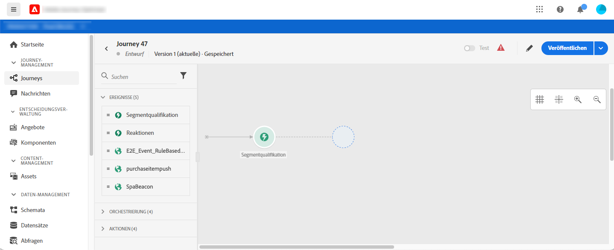
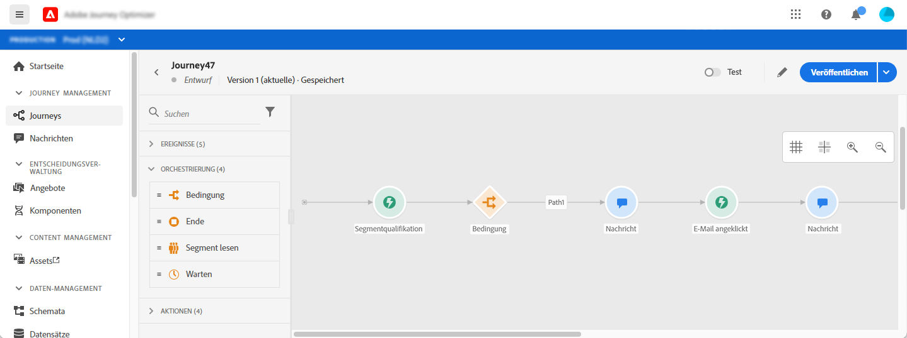
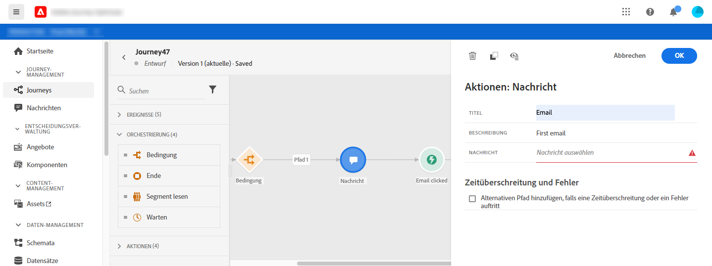
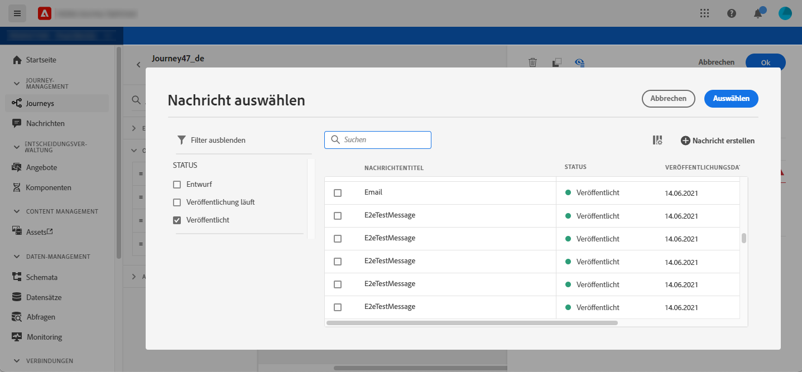
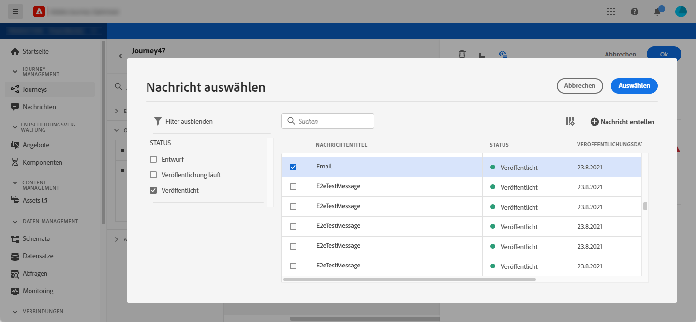
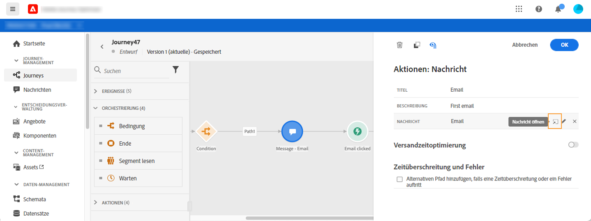
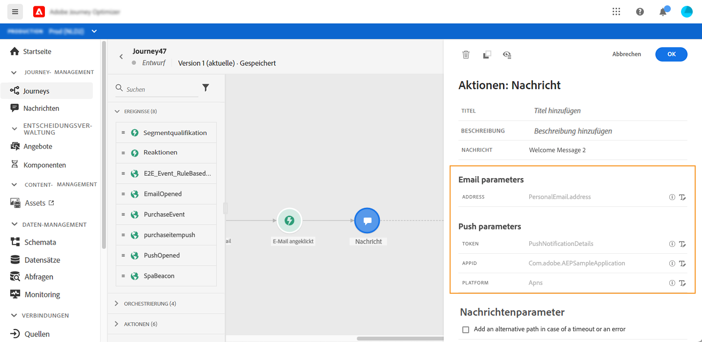

# Hinzufügen einer Nachricht zu einer Journey

[!DNL Journey Optimizer] verfügt über integrierte Nachrichtenfunktionen. Sie müssen nur den Inhalt gestalten und Ihre Nachricht veröffentlichen. Weitere Informationen finden Sie in [diesem Abschnitt](../get-started-content.md). Anschließend fügen Sie einfach eine Push- oder E-Mail-Nachricht in Ihre Journey ein, die mit Journey Optimizer entworfen wurde.

Wenn Sie für den Versand Ihrer Nachrichten ein Drittanbietersystem verwenden, können Sie eine benutzerdefinierte Aktion erstellen. Weitere Informationen finden Sie in diesem [Abschnitt](../action/action.md).

## Aktivität &quot;Nachricht hinzufügen&quot;

1. Beginnen Sie Ihre Journey immer mit einem Ereignis oder einer Aktivität vom Typ **Segment lesen**.

   

1. Ziehen Sie aus dem Bereich **Aktionen** der Palette eine **Nachrichtenaktivität** auf die Arbeitsfläche.

   

1. Fügen Sie einen Titel und eine Beschreibung hinzu.

   

1. Klicken Sie in das Feld **Nachricht**. Eine Liste der in Journey Optimizer entworfenen verfügbaren Nachrichten wird angezeigt. Die Elemente dieser Liste können Sie nach ihrem Status filtern.

   

1. Wählen Sie eine Nachricht aus und klicken Sie auf **Auswählen**. Außerdem können Sie eine neue Nachricht direkt über diesen Bildschirm erstellen, indem Sie auf **Nachricht erstellen** klicken.

   

   Wenn Sie Ihre Nachricht überprüfen möchten, können Sie auf das Symbol **Nachricht öffnen** im Feld **Nachricht** klicken. Die Nachricht wird in einer neuen Registerkarte geöffnet.

   

1. Fügen Sie die nächsten Schritte zu Ihrer Journey hinzu.

## E-Mail-Parameter und Push-Parameter

In den Abschnitten **[!UICONTROL E-Mail-Parameter]** und **[!UICONTROL Push-Parameter]** finden Sie schreibgeschützte Felder. Diese Konfiguration wird normalerweise beim Erstellen der Nachricht durchgeführt. Weitere Informationen dazu finden Sie in [diesem Abschnitt](../get-started-content.md).

Um einen bestimmten Wert zu erzwingen, können Sie das Symbol **Parameterüberschreibung aktivieren** rechts neben dem Feld verwenden. Diese Option kann im Rahmen von Tests nützlich sein. Beispielsweise können Sie als E-Mail-Adresse Ihre eigene E-Mail-Adresse hinzufügen. Nachdem Sie die Journey veröffentlicht haben, wird die E-Mail an Sie gesendet.
