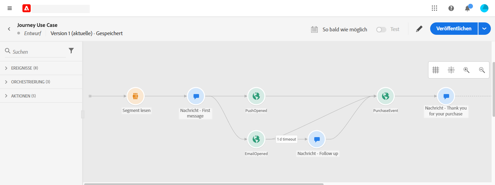
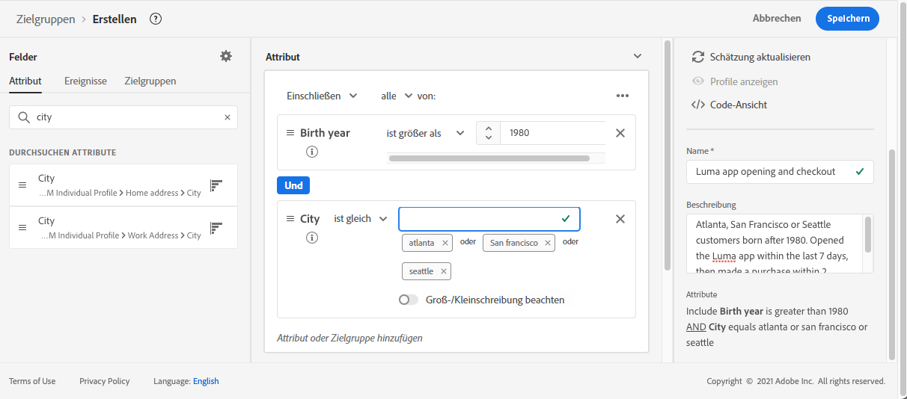
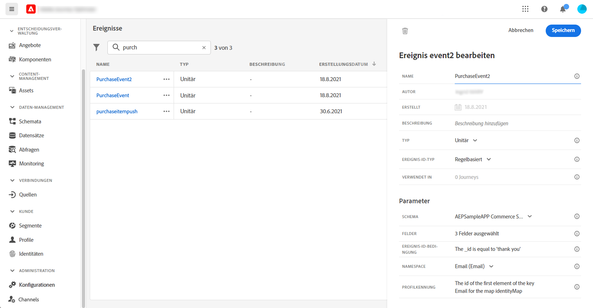
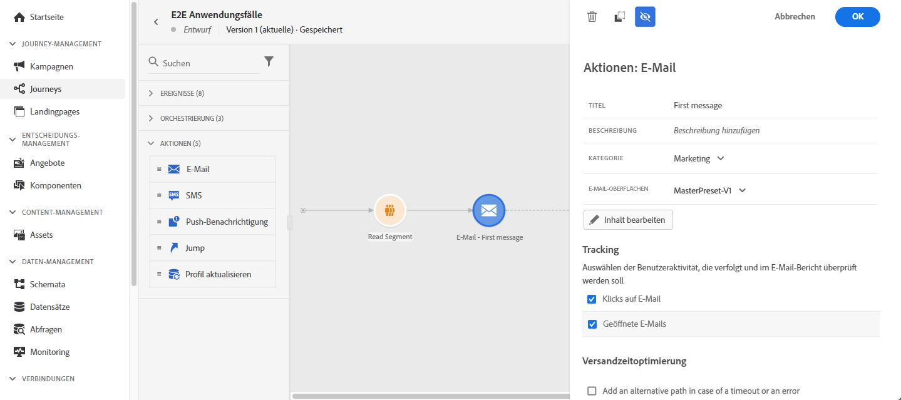

# Anwendungsfall: Senden von kanalübergreifenden Nachrichten{#send-multi-channel-messages}

In diesem Abschnitt wird ein Anwendungsfall vorgestellt, der ein Segment lesen, ein Ereignis, Reaktionsereignisse und E-Mail-/Push-Nachrichten kombiniert.

## Beschreibung des Anwendungsfalls

In diesem Anwendungsfall möchten wir allen Kunden, die zu einem bestimmten Segment gehören, eine erste Nachricht (E-Mail und Push-Benachrichtigung) senden.

Je nach Reaktion auf die erste Nachricht möchten wir bestimmte Nachrichten senden.

Nach der ersten Nachricht warten wir einen Tag, bis Kunden die Push- oder E-Mail-Nachricht öffnen. Wenn keine Reaktion erfolgt, senden wir ihnen eine Follow-up-E-Mail.

Dann warten wir auf einen Kauf und senden eine Push-Nachricht, um dem Kunden zu danken.

## Voraussetzungen

Damit dieser Anwendungsfall funktioniert, müssen Sie Folgendes konfigurieren:

* ein Segment für alle Kunden, die in Atlanta, San Francisco oder Seattle leben und nach 1980 geboren wurden.
* ein Kaufereignis

### Segment erstellen

In unserer Journey möchten wir ein bestimmtes Kundensegment nutzen. Alle Kontakte, die zum Segment gehören, treten in die Journey ein und folgen den verschiedenen Schritten. In unserem Beispiel benötigen wir ein Segment, das alle Kunden auswählt, die in Atlanta, San Francisco oder Seattle leben und nach 1980 geboren wurden.

Weiterführende Informationen zu Segmenten finden Sie in diesem Abschnitt [page](../segment/about-segments.md).

1. Wählen Sie im Menübereich KUNDEN die Option **[!UICONTROL Segments]**.

1. Klicken Sie auf **[!UICONTROL Create segment]** -Schaltfläche oben rechts in der Segmentliste.

1. Im **[!UICONTROL Segment properties]** eingeben, geben Sie einen Namen für das Segment ein.

1. Ziehen Sie die gewünschten Felder aus dem linken Bereich in den mittleren Arbeitsbereich und konfigurieren Sie sie dann entsprechend Ihren Anforderungen. In diesem Beispiel verwenden wir die **Ort** und **Geburtsjahr** Attributfelder.

1. Klicken **[!UICONTROL Save]**.

   

Das Segment wird jetzt erstellt und kann in Ihrer Journey verwendet werden. Verwenden eines **Segment lesen** -Aktivität können Sie alle Kontakte, die zum Segment gehören, in die Journey eintreten lassen.

### Ereignis konfigurieren

Sie müssen ein Ereignis konfigurieren, das an Ihre Journey gesendet wird, wenn ein Kunde einen Kauf tätigt. Wenn die Journey das Ereignis erhält, löst sie die Meldung &quot;Vielen Dank!&quot;aus.

Dazu verwenden wir ein regelbasiertes Ereignis. Weiterführende Informationen zu Ereignissen finden Sie in diesem Abschnitt [page](../event/about-events.md).

1. Wählen Sie im Menü ADMINISTRATION die Option **[!UICONTROL Configurations]** Klicken Sie auf **[!UICONTROL Events]**. Klicken **[!UICONTROL Create event]** , um ein neues Ereignis zu erstellen.

1. Geben Sie den Namen Ihres Ereignisses ein.

1. Im **[!UICONTROL Event ID type]** Feld, wählen Sie **[!UICONTROL Rule Based]**.

1. Definieren Sie die **[!UICONTROL Schema]** und Nutzlast **[!UICONTROL Fields]**. Sie können mehrere Felder verwenden, z. B. das gekaufte Produkt, das Kaufdatum und die Kauf-ID.

1. Im **[!UICONTROL Event ID condition]** -Feld die Bedingung definieren, die vom System verwendet wird, um die Ereignisse zu identifizieren, die Ihre Journey auslösen. Sie können beispielsweise eine `purchaseMessage` und definieren Sie die folgende Regel: `purchaseMessage="thank you"`

1. Definieren Sie die **[!UICONTROL Namespace]** und **[!UICONTROL Profile Identifier]**.

1. Klicken **[!UICONTROL Save]**.

   

Das Ereignis ist jetzt konfiguriert und kann in Ihrer Journey verwendet werden. Mit der entsprechenden Ereignisaktivität können Sie eine Aktion jedes Mal auslösen, wenn ein Kunde einen Kauf tätigt.

## Gestalten der Journey

1. Beginnen Sie die Journey mit einer **Segment lesen** Aktivität. Wählen Sie das zuvor erstellte Segment aus. Alle Kontakte, die zum Segment gehören, treten in die Journey ein.

   

1. Eine **Email** Aktionsaktivität und Definition des Inhalts der &quot;ersten Nachricht&quot;. Diese Nachricht wird an alle Kontakte in der Journey gesendet. Siehe hierzu [Abschnitt](../email/create-email.md) , um zu erfahren, wie Sie eine E-Mail konfigurieren und entwerfen.

   

1. Platzieren Sie den Cursor auf die E-Mail-Aktivität und klicken Sie auf das Symbol &quot;+&quot;, um einen neuen Pfad zu erstellen.

1. Fügen Sie im ersten Pfad eine **Reaktion** Ereignis und wählen Sie **Geöffnetes Pushen**. Das Ereignis wird ausgelöst, wenn eine dem Segment angehörende Person die Push-Version der ersten Nachricht öffnet.

1. Fügen Sie im zweiten Pfad eine **Reaktion** Ereignis und wählen Sie **E-Mail geöffnet**. Das Ereignis wird ausgelöst, wenn der Kontakt die E-Mail öffnet.

1. Überprüfen Sie in einer der Reaktionsaktivitäten die **Definieren des Ereignis-Timeouts** ein, legen Sie eine Dauer fest (in unserem Beispiel einen Tag) und aktivieren Sie die Option **Zeitüberschreitungspfad festlegen**. Dadurch wird ein anderer Pfad für Personen erstellt, die die Push- oder E-Mail-Nachricht nicht öffnen.

   >[!NOTE]
   >
   >Beim Konfigurieren eines Timeouts für mehrere Ereignisse (in diesem Fall die beiden Reaktionen) müssen Sie nur den Timeout für eines dieser Ereignisse konfigurieren.

1. Legen Sie im Pfad der Zeitüberschreitung eine **Email** Aktionsaktivität und Definition des Inhalts der Folgenachricht. Diese Nachricht wird an Personen gesendet, die die E-Mail nicht am nächsten Tag öffnen oder die erste Nachricht per Push versenden. Siehe hierzu [Abschnitt](../email/create-email.md) , um zu erfahren, wie Sie eine E-Mail konfigurieren und entwerfen.

1. Verbinden Sie die drei Pfade mit dem zuvor erstellten Kaufereignis. Das Ereignis wird ausgelöst, wenn eine Person einen Kauf tätigt.

1. Legen Sie nach dem Ereignis eine **Push** Aktionsaktivität und Definition des Inhalts der Dankesnachricht. Siehe hierzu [Abschnitt](../push/create-push.md) , um zu erfahren, wie Sie einen Push-Vorgang konfigurieren und entwerfen.

## Testen und Veröffentlichen der Journey

1. Überprüfen Sie vor dem Testen Ihrer Journey, ob sie gültig ist und kein Fehler vorliegt.

1. Klicken Sie auf **Test** Umschalten, um den Testmodus zu aktivieren, der sich oben rechts befindet. Definieren Sie, wie Testprofile in den Test eintreten sollen: ein einzelnes Profil oder bis zu 100 auf einmal. Siehe hierzu [Abschnitt](testing-the-journey.md) , um zu erfahren, wie Sie den Testmodus verwenden.

1. Wenn die Journey fertig ist, veröffentlichen Sie sie mit dem **Veröffentlichen** -Schaltfläche in der oberen rechten Ecke.
