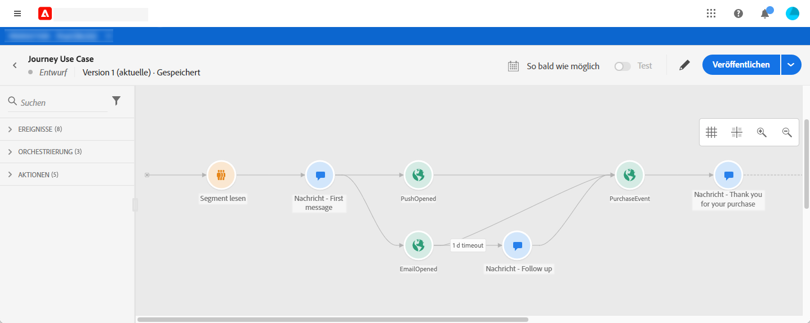
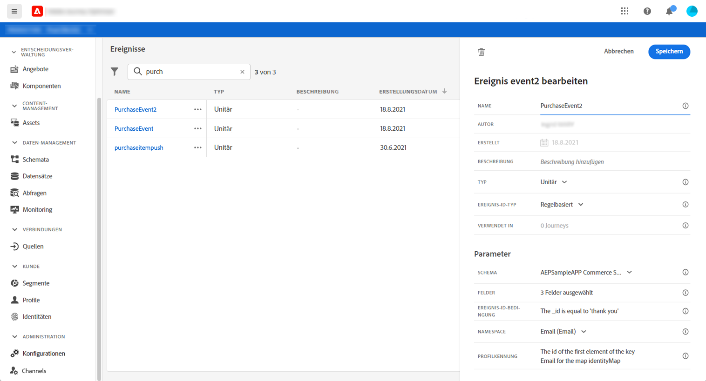
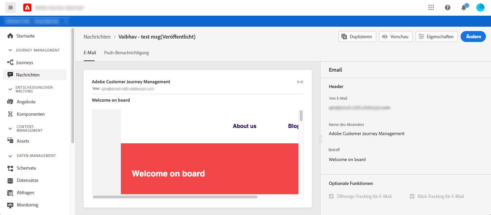
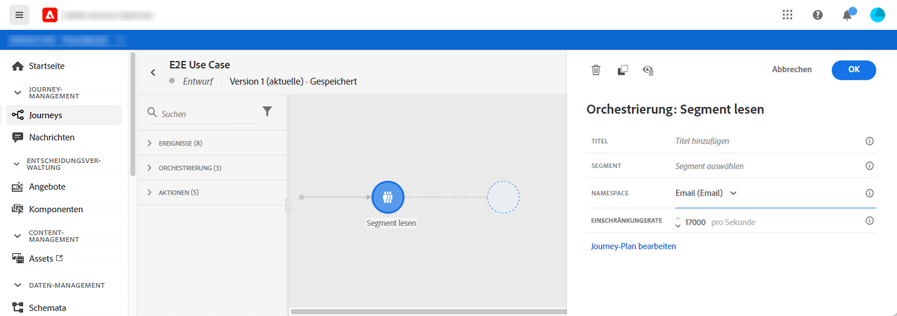
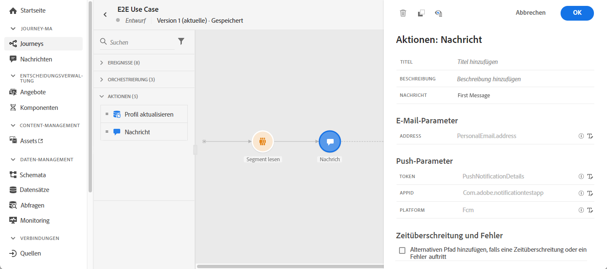

# Anwendungsfall Journey

In diesem Abschnitt wird ein Anwendungsfall vorgestellt, der ein Read-Segment, ein Ereignis, Ereignis zur Reaktion und E-Mail-/Push-Nachrichten kombiniert.

## Beschreibung des Anwendungsfalls

In diesem Fall möchten wir eine erste Nachricht (E-Mail und Push) an alle Kunden senden, die zu einem bestimmten Segment gehören.

Aufgrund ihrer Reaktion auf die erste Nachricht möchten wir bestimmte Nachrichten senden.

Nach der ersten Nachricht warten wir einen Tag, bis Kunden die Push- oder E-Mail-Nachricht öffnen. Wenn keine Reaktion erfolgt, senden wir ihnen eine Follow-up-E-Mail.

Dann warten wir auf einen Kauf und senden eine Push-Nachricht, um dem Kunden zu danken.

## Voraussetzungen 

Damit dieser Anwendungsfall funktioniert, müssen Sie Folgendes konfigurieren:

* ein Segment für alle Kunden, die in Atlanta, San Francisco oder Seattle leben und nach 1980 geboren wurden.
* ein Ereignis
* drei Nachrichten

### Segment erstellen

In unserer Journey möchten wir ein bestimmtes Kundensegment nutzen. Alle dem Segment angehörenden Personen treten in die Journey ein und befolgen die verschiedenen Schritte. In unserem Beispiel brauchen wir ein Segment, das alle Kunden, die in Atlanta, San Francisco oder Seattle leben und nach 1980 geboren wurden, Zielgruppe.

Weitere Informationen zu Segmenten finden Sie auf dieser [Seite](../segment/about-segments.md).

1. Klicken Sie im Menü **[!UICONTROL Segmente]** auf **[!UICONTROL Segment]** erstellen.

1. Geben Sie im Bereich **[!UICONTROL Segmenteigenschaften]** einen Namen für das Segment ein.

1. Ziehen Sie die gewünschten Felder aus dem linken Bereich in den mittleren Arbeitsbereich und konfigurieren Sie sie dann entsprechend Ihren Anforderungen. In diesem Beispiel verwenden wir die Attributfelder **City** und **Geburtsjahr**.

1. Klicken Sie auf **[!UICONTROL Speichern]**.

   

Das Segment wird jetzt erstellt und kann in Ihrer Journey verwendet werden. Mit der Aktivität **Read segment** können Sie alle Segmentpersonen in die Journey einbinden.

### Ereignis konfigurieren

Sie müssen ein Ereignis konfigurieren, das an Ihre Journey gesendet wird, wenn ein Kunde einen Kauf tätigt. Wenn die Journey das Ereignis erhält, wird die Meldung &quot;Vielen Dank&quot; Trigger.

Dafür verwenden wir ein regelbasiertes Ereignis. Weitere Informationen zu Ereignissen finden Sie auf dieser [Seite](../event/about-events.md).

1. Klicken Sie im linken Menü auf das Symbol **[!UICONTROL Admin]** und dann auf **[!UICONTROL Ereignis]**. Klicken Sie auf **[!UICONTROL Hinzufügen]**, um ein neues Ereignis zu erstellen.

1. Geben Sie den Namen Ihres Ereignisses ein.

1. Wählen Sie im Feld **[!UICONTROL Ereignis-ID-Typ]** **[!UICONTROL Regel-basiert]**.

1. Definieren Sie die **[!UICONTROL Schema]**- und **[!UICONTROL Payload]**-Felder. Sie können mehrere Felder verwenden, z. B. das erworbene Produkt, das Kaufdatum und die Kaufkennung.

1. Definieren Sie im Feld **[!UICONTROL Ereignis-ID-Bedingung]** die vom System verwendete Bedingung, um die Ereignis zu identifizieren, die Ihren Journey Trigger haben. Sie können beispielsweise ein `purchaseMessage`-Feld hinzufügen und die folgende Regel definieren: `purchaseMessage="thank you"`

1. Geben Sie den **[!UICONTROL Namespace]** und den **[!UICONTROL Schlüssel]** an.

1. Klicken Sie auf **[!UICONTROL Speichern]**.

   

Das Ereignis ist jetzt konfiguriert und kann in Ihrer Journey verwendet werden. Mit der entsprechenden Ereignis-Aktivität können Sie eine Aktion jedes Mal, wenn ein Kunde einen Einkauf tätigt, Trigger ausführen.

### Nachrichten erstellen

Für diesen Verwendungsfall müssen wir drei Nachrichten erstellen:

* eine erste Push- und E-Mail-Nachricht
* eine Push-Nachricht &quot;Vielen Dank&quot;
* eine E-Mail-Follow-up-Nachricht

In diesem Abschnitt [erfahren Sie, wie Sie diese Meldungen entwerfen und veröffentlichen.](../segment/about-segments.md)

## Entwerfen der Journey

1. Beginn der Journey mit einer Aktivität **Read segment**. Wählen Sie das zuvor erstellte Segment aus. Alle dem Segment angehörenden Personen treten in die Journey ein.

   

1. Legen Sie eine **Message**-Aktivität ab und wählen Sie die erste Push- und E-Mail-Nachricht aus. Diese Nachricht wird an alle Personen in der Journey gesendet.

   

1. Platzieren Sie den Cursor auf der Aktivität und klicken Sie auf das Pluszeichen &quot;+&quot;, um einen neuen Pfad zu erstellen.

1. Fügen Sie im ersten Pfad ein Ereignis **Reaktion** hinzu und wählen Sie **Geöffnetes Push**. Das Ereignis wird ausgelöst, wenn eine zum Segment gehörende Person die Push-Version der ersten Nachricht öffnet.

1. Fügen Sie im zweiten Pfad ein Ereignis **Reaktion** hinzu und wählen Sie **E-Mail geöffnet**. Das Ereignis wird ausgelöst, wenn die Person die E-Mail öffnet.

1. Markieren Sie in einer der Aktivitäten die Option **Definieren des Ereignis-Timeouts**, definieren Sie eine Dauer (1 Tag in unserem Beispiel) und aktivieren Sie **Legen Sie einen Timeout-Pfad** fest. Dadurch wird ein anderer Pfad für Personen erstellt, die die erste Push- oder E-Mail-Nachricht nicht öffnen.

   >[!NOTE]
   >
   >Beim Konfigurieren eines Timeouts für mehrere Ereignis (in diesem Fall die beiden Reaktionen) müssen Sie nur den Timeout für eines dieser Ereignis konfigurieren.

1. Legen Sie im Timeout-Pfad eine **Message**-Aktivität ab und wählen Sie die E-Mail-Folgemeldung aus. Diese Nachricht wird an Personen gesendet, die am nächsten Tag keine E-Mail oder erste Push-Nachricht öffnen.

1. Verbinden Sie die drei Pfade mit dem zuvor erstellten Ereignis. Das Ereignis wird ausgelöst, wenn eine Person einen Kauf tätigt.

1. Legen Sie nach dem Ereignis eine **Nachricht**-Aktivität ab und wählen Sie die E-Mail-Nachricht &quot;Vielen Dank&quot;.

1. Fügen Sie eine Aktivität vom Typ **Ende** hinzu.

## Testen und Veröffentlichen der Journey

1. Bevor Sie Ihre Journey testen, überprüfen Sie, ob sie gültig ist und keine Fehler vorliegen.

1. Klicken Sie auf den Umschalter **Test** in der oberen rechten Ecke, um den Testmodus zu aktivieren. Legen Sie fest, wie die Profil in den Test eintreten sollen: ein einzelnes Profil oder bis zu 100 gleichzeitig. Lesen Sie den Abschnitt [in dem Sie erfahren, wie Sie den Testmodus verwenden.](testing-the-journey.md)

1. Wenn die Journey fertig ist, veröffentlichen Sie sie mit der Schaltfläche **Veröffentlichen**, die sich oben rechts befindet.
