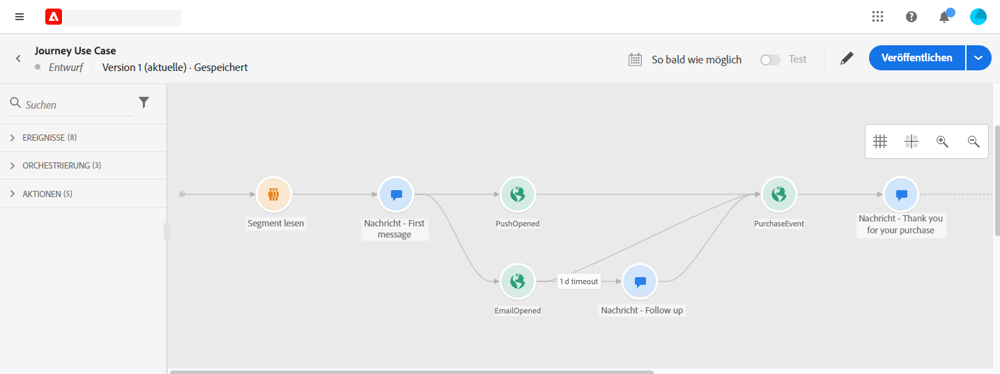
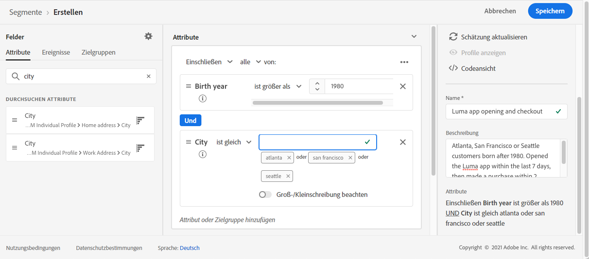
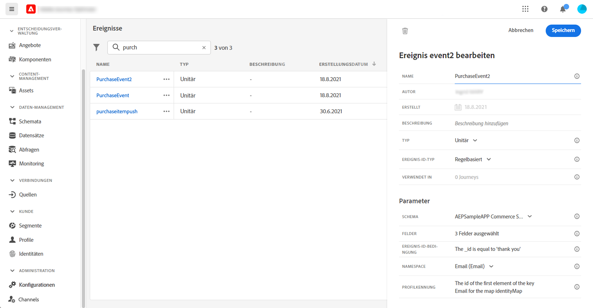
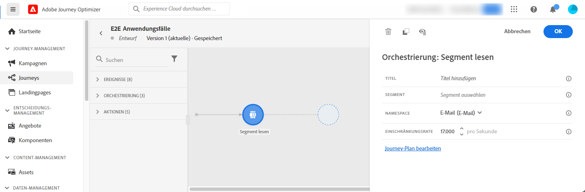
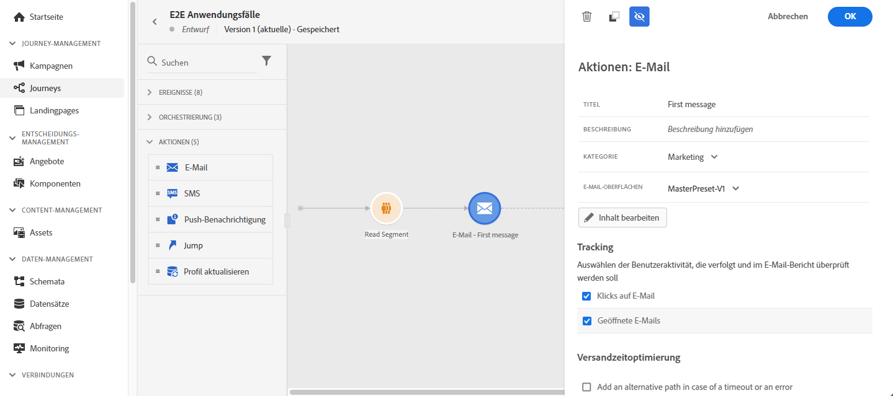

# Senden von Multi-Channel-Nachrichten {#send-multi-channel-messages}

In diesem Abschnitt wird ein Anwendungsfall vorgestellt, der die Aktivität „Zielgruppe lesen“, ein Ereignis, Reaktionsereignisse und E-Mail-/Push-Nachrichten kombiniert.

## Beschreibung des Anwendungsfalls

Das Ziel dieses Anwendungsfalls ist das Senden einer ersten E-Mail-Nachricht an alle Kundinnen und Kunden, die zu einer bestimmten Zielgruppe gehören.

Je nach Reaktion auf die erste Nachricht werden bestimmte Folgenachrichten gesendet.

Wenn die Kundin bzw. der Kunde die E-Mail öffnet, wartet das System auf einen Kauf und sendet eine Push-Nachricht, um der Person zu danken.

Wenn keine Reaktion erfolgt, wird eine Folge-E-Mail gesendet.

## Voraussetzungen

Konfigurieren Sie Folgendes, damit dieser Anwendungsfall funktioniert:

* eine Zielgruppe für alle Kundinnen und Kunden, die in Atlanta, San Francisco oder Seattle leben und nach 1980 geboren wurden
* ein Kaufereignis

### Erstellen der Zielgruppe

In dieser Journey wird eine bestimmte Zielgruppe von Kundinnen und Kunden genutzt. Alle dieser Zielgruppe angehörenden Personen treten in die Journey ein und folgen den verschiedenen Schritten. In diesem Beispiel umfasst die Zielgruppe alle Kundinnen und Kunden an, die in Atlanta, San Francisco oder Seattle leben und nach 1980 geboren wurden.

Weitere Informationen zu Zielgruppen [finden Sie auf dieser Seite](../audience/about-audiences.md).

1. Wählen Sie im Menüabschnitt „KUNDE“ die Option **[!UICONTROL Zielgruppen]** aus.
1. Klicken Sie oben rechts von der Zielgruppenliste auf die Schaltfläche **[!UICONTROL Zielgruppe erstellen]**.
1. Geben Sie im Bereich **[!UICONTROL Zielgruppen-Eigenschaften]** einen Namen für die Zielgruppe ein.
1. Ziehen Sie per Drag-and-Drop die gewünschten Felder aus dem linken Bereich in den Arbeitsbereich in der Mitte und konfigurieren Sie die Felder entsprechend Ihren Anforderungen. Verwenden Sie in diesem Beispiel die Attributfelder **Stadt** und **Geburtsjahr**.
1. Klicken Sie auf **[!UICONTROL Speichern]**.

   

Die Zielgruppe ist jetzt erstellt und kann in der Journey verwendet werden. Mit einer Aktivität vom Typ **Zielgruppe lesen** können alle der Zielgruppe angehörenden Personen in die Journey eintreten.

### Konfigurieren des Ereignisses

Konfigurieren Sie ein Ereignis, das an die Journey gesendet wird, wenn eine Kundin bzw. ein Kunde einen Kauf tätigt. Wenn die Journey das Ereignis erhält, wird die Nachricht „Vielen Dank“ verschickt.

Verwenden Sie dafür ein [regelbasiertes Ereignis](../event/about-events.md).

1. Wählen Sie im Menüabschnitt ADMINISTRATION die Option **[!UICONTROL Konfigurationen]** und klicken Sie dann auf **[!UICONTROL Ereignisse]**. Klicken Sie auf **[!UICONTROL Ereignis erstellen]**, um ein neues Ereignis zu erstellen.

1. Geben Sie den Namen des Ereignisses ein.

1. Wählen Sie im Feld **[!UICONTROL Ereignis-ID-Typ]** die Option **[!UICONTROL Regelbasiert]** aus.

1. Definieren Sie die Felder **[!UICONTROL Schema]** und **[!UICONTROL Payload]**. Verwenden Sie mehrere Felder, beispielsweise das erworbene Produkt, das Kaufdatum und die Kauf-ID.

1. Definieren Sie im Feld **[!UICONTROL Ereignis-ID-Bedingung]** die vom System verwendete Bedingung zur Identifizierung der Ereignisse, die die Journey auslösen. Fügen Sie beispielsweise ein Feld `purchaseMessage` hinzu und definieren Sie die folgende Regel: `purchaseMessage="thank you"`

1. Definieren Sie den **[!UICONTROL Namespace]** und die **[!UICONTROL Profilkennung]**.

1. Klicken Sie auf **[!UICONTROL Speichern]**.

   

Das Ereignis ist jetzt konfiguriert und kann in der Journey verwendet werden. Mit der entsprechenden Ereignisaktivität kann jedes Mal eine Aktion ausgelöst werden, wenn eine Person einen Kauf tätigt.

## Entwerfen der Journey

1. Beginnen Sie die Journey mit einer Aktivität vom Typ **Zielgruppe lesen**. Wählen Sie die zuvor erstellte Zielgruppe aus. Alle der Zielgruppe angehörenden Personen treten in die Journey ein.

   

1. Legen Sie eine Aktionsaktivität vom Typ **E-Mail** ab und definieren Sie den Inhalt der „ersten Nachricht“. Diese Nachricht wird an alle Personen in der Journey gesendet. In diesem [Abschnitt](../email/create-email.md) erfahren Sie, wie Sie eine E-Mail konfigurieren und gestalten können.

   

1. Fügen Sie ein Ereignis vom Typ **Reaktion** hinzu und wählen Sie **E-Mail geöffnet**. Das Ereignis wird ausgelöst, sobald ein zur Zielgruppe gehörender Kontakt die E-Mail öffnet.

1. Aktivieren Sie das Kontrollkästchen **Timeout für das Ereignis definieren**, definieren Sie eine Dauer (in diesem Beispiel 1 Tag) und aktivieren Sie **Zeitüberschreitungspfad einrichten**. Dadurch wird ein weiterer Pfad für Einzelpersonen erstellt, die die erste Push- oder E-Mail-Nachricht nicht öffnen.

1. Legen Sie im Pfad des Timeouts die Aktionsaktivität **E-Mail** ab und definieren sie den Inhalt der Folgenachricht. Diese Nachricht wird an Personen gesendet, die die erste E-Mail- oder Push-Nachricht nicht innerhalb des nächsten Tages öffnen. [Erfahren Sie, wie Sie eine E-Mail konfigurieren und gestalten](../email/create-email.md).

1. Fügen Sie im ersten Pfad das zuvor erstellte Kaufereignis hinzu. Dieses Ereignis wird ausgelöst, wenn ein Kontakt einen Kauf tätigt.

1. Legen Sie nach dem Ereignis die Aktionsaktivität **Push** im Arbeitsbereich ab und definieren Sie den Inhalt der Dankesnachricht. In diesem [Abschnitt](../push/create-push.md) erfahren Sie, wie Sie eine Push-Benachrichtigung konfigurieren und gestalten können.

## Testen und Veröffentlichen der Journey

1. Stellen Sie vor dem Testen der Journey sicher, dass sie gültig ist und kein Fehler vorliegt.

1. Verwenden Sie den Umschalter **Test** in der oberen rechten Ecke, um den Testmodus zu aktivieren. In diesem [Abschnitt](testing-the-journey.md) erfahren Sie, wie Sie den Testmodus verwenden.

1. Wenn die Journey fertig ist, veröffentlichen Sie diese mit der Schaltfläche **Veröffentlichen** rechts oben.

## Mehrphasen-Treue-Journey {#multi-phase-loyalty}

Dieses Beispiel veranschaulicht ein wichtiges Journey-Architekturmuster: Ein komplexes, mehrphasiges Journey wird in kleinere, fokussierte Unter-Journey zerlegt, die mit der Aktivität [**[!UICONTROL Springen]**](jump.md) verbunden sind. Als Szenario dient ein Treueprogramm, aber dieses Muster gilt für alle Journey, die mehrere Meilensteine oder Geschäftsphasen umfassen.

Komplexe mehrphasige Journey generieren schnell eine große Anzahl von Kundenpfaden. Durch die Zerlegung in eine Sub-Journey pro Phase ist jede Journey verwaltbar, testbar und unabhängig wartbar.

### Szenario

Stellen Sie sich ein Treueprogramm vor, das Kundinnen und Kunden mithilfe von zwei Marketing-Kanälen (E[Mail](../email/create-email.md) und [Push](../push/create-push.md)) durch drei Meilensteine führt:

1. **Phase 1 - Mobile App herunterladen:** Erste Mitteilungen ermutigen neue Mitglieder des Treueprogramms, die App herunterzuladen. Eine Folgenachricht wird gesendet, wenn der Kunde nicht innerhalb eines bestimmten Zeitraums gehandelt hat.
1. **Phase 2 - Erste Transaktion durchführen:** Nach dem Herunterladen der App leiten zielgerichtete Nachrichten Kunden zur Durchführung ihrer ersten Treuetransaktion.
1. **Phase 3 - Zweite Transaktion durchführen:** Nach der ersten Transaktion steuert ein endgültiger Satz von Nachrichten eine zweite Transaktion, um die Interaktion mit Treueprogrammen zu vertiefen.

Selbst bei dieser einfachen Strategie zeigt diese Journey mehr als 20 einzigartige Pfade auf, die ein Kunde einschlagen kann. Die Komplexität steigt exponentiell mit jedem zusätzlichen Touchpoint oder Kanal.

### Sub-Journey-Zerlegung

Teilen Sie den End-to-End-Journey in drei kleinere, verbundene Unter-Journey auf:

| Sub-Journey | Einreisebedingung | Unternehmensziel |
|---|---|---|
| Phase 1 — App-Download | Kunde tritt dem Treueprogramm bei | Mobile App-Download fördern |
| Phase 2 — Erste Transaktion | Kunde lädt App herunter | Erste Treuetransaktion fördern |
| Phase 3 — Zweite Transaktion | Kunde schließt erste Transaktion ab | Zweite Treuetransaktion fördern |

Verbinden Sie die Unterprofile mit der Aktivität [**[!UICONTROL Springen]**](jump.md), sodass die Journey nahtlos von einer Phase zur nächsten übergehen. Jede Sub-Journey bleibt einfach, lesbar und unabhängig wartbar.

<!--
>[!NOTE]
>
>If your goal is to build a gamified loyalty program with challenges, tasks, and built-in reward tracking, Journey Optimizer also offers a dedicated **Loyalty Challenges** capability.
-->

