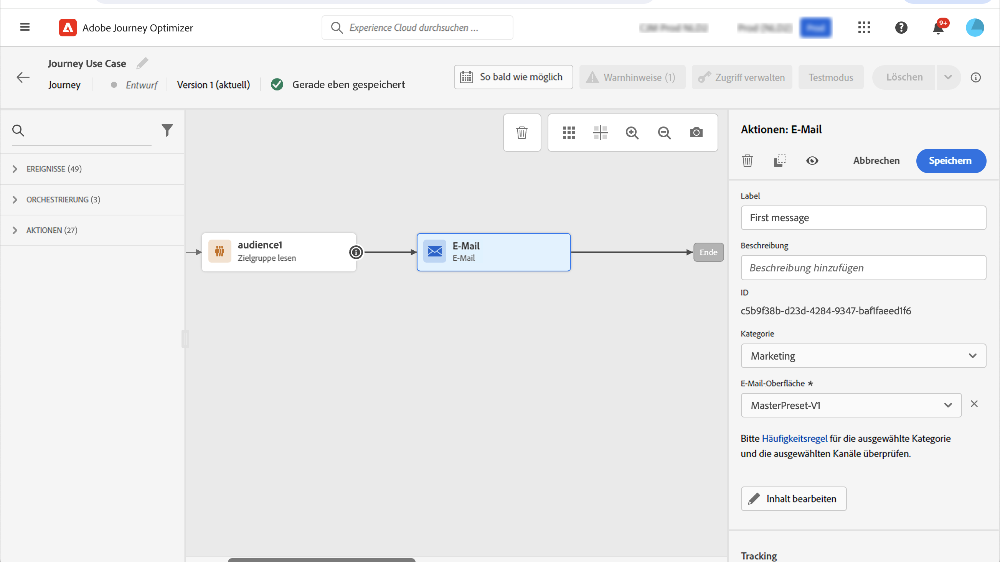

# Anwendungsfall: Senden von Multi-Channel-Nachrichten{#send-multi-channel-messages}

In diesem Abschnitt wird ein Anwendungsfall vorgestellt, der die Aktivität „Zielgruppe lesen“, ein Ereignis, Reaktionsereignisse und E-Mail-/Push-Nachrichten kombiniert.

## Beschreibung des Anwendungsfalls

In diesem Anwendungsfall möchten wir eine erste E-Mail-Nachricht an alle Kunden senden, die zu einer bestimmten Zielgruppe gehören.

Abhängig von ihrer jeweiligen Reaktion auf die erste Nachricht möchten wir spezifische Nachrichten senden.

Wenn der Kunde die E-Mail öffnet, warten wir auf einen Kauf und senden eine Push-Nachricht, um dem Kunden zu danken.

Wenn keine Reaktion erfolgt, senden wir eine Follow-up-E-Mail.

## Voraussetzungen

Damit dieser Anwendungsfall funktioniert, müssen Sie Folgendes konfigurieren:

* eine Zielgruppe für alle Kundinnen und Kunden, die in Atlanta, San Francisco oder Seattle leben und nach 1980 geboren wurden
* ein Kaufereignis

### Erstellen der Zielgruppe

In unserer Journey möchten wir eine bestimmte Kundenzielgruppe verwenden. Alle dieser Zielgruppe angehörenden Personen treten in die Journey ein und folgen den verschiedenen Schritten. In unserem Beispiel benötigen wir eine Zielgruppe, die alle Kundinnen und Kunden umfasst, die in Atlanta, San Francisco oder Seattle leben und nach 1980 geboren wurden.

Weitere Informationen zu Zielgruppen finden Sie auf dieser [Seite](../audience/about-audiences.md).

1. Wählen Sie im Menüabschnitt KUNDE die Option **[!UICONTROL Zielgruppen]** aus.

1. Klicken Sie oben rechts in der Zielgruppenliste auf die Schaltfläche **[!UICONTROL Zielgruppe erstellen]**.

1. Geben Sie im Bereich **[!UICONTROL Zielgruppeneigenschaften]** einen Namen für die Zielgruppe ein.

1. Ziehen Sie die gewünschten Felder aus dem linken Bereich in den mittleren Arbeitsbereich und konfigurieren Sie die Felder dann entsprechend Ihren Anforderungen. In diesem Beispiel verwenden wir die Attributfelder **Stadt** und **Geburtsjahr**.

1. Klicken Sie auf **[!UICONTROL Speichern]**.

   

Die Zielgruppe ist jetzt erstellt und kann in Ihrer Journey verwendet werden. Mit einer Aktivität vom Typ **Zielgruppe lesen** können Sie alle Personen, die der Zielgruppe angehören, in die Journey eintreten lassen.

### Konfigurieren des Ereignisses

Sie müssen ein Ereignis konfigurieren, das an Ihre Journey gesendet wird, wenn ein Kunde einen Kauf tätigt. Wenn die Journey das Ereignis erhält, wird die Nachricht „Vielen Dank“ verschickt.

Für diesen Zweck verwenden wir ein regelbasiertes Ereignis. Weiterführende Informationen zu Ereignissen finden Sie auf dieser [Seite](../event/about-events.md).

1. Wählen Sie im Menüabschnitt ADMINISTRATION die Option **[!UICONTROL Konfigurationen]** und klicken Sie dann auf **[!UICONTROL Ereignisse]**. Klicken Sie auf **[!UICONTROL Ereignis erstellen]**, um ein neues Ereignis zu erstellen.

1. Geben Sie den Namen Ihres Ereignisses ein.

1. Wählen Sie im Feld **[!UICONTROL Ereignis-ID-Typ]** die Option **[!UICONTROL Regelbasiert]** aus.

1. Definieren Sie die Felder **[!UICONTROL Schema]** und **[!UICONTROL Payload]**. Sie können mehrere Felder verwenden, beispielsweise das erworbene Produkt, das Kaufdatum und die Kauf-ID.

1. Definieren Sie im Feld **[!UICONTROL Ereignis-ID-Bedingung]** die vom System verwendete Bedingung, um die Ereignisse zu identifizieren, die einen Trigger an Ihre Journey übermitteln. Sie können beispielsweise ein Feld `purchaseMessage` hinzufügen und die folgende Regel definieren: `purchaseMessage="thank you"`

1. Definieren Sie den **[!UICONTROL Namespace]** und die **[!UICONTROL Profilkennung]**.

1. Klicken Sie auf **[!UICONTROL Speichern]**.

   

Das Ereignis ist jetzt konfiguriert und kann in Ihrer Journey verwendet werden. Mit der entsprechenden Ereignisaktivität können Sie eine Aktion jedes Mal auslösen, wenn ein Kunde einen Einkauf tätigt.

## Entwerfen der Journey

1. Beginnen Sie die Journey mit einer Aktivität vom Typ **Zielgruppe lesen**. Wählen Sie die zuvor erstellte Zielgruppe aus. Alle der Zielgruppe angehörenden Personen treten in die Journey ein.

   

1. Legen Sie die Aktionsaktivität **E-Mail** im Arbeitsbereich ab und definieren Sie den Inhalt der „ersten Nachricht“. Diese Nachricht wird an alle Personen in der Journey gesendet. In diesem [Abschnitt](../email/create-email.md) erfahren Sie, wie Sie eine E-Mail konfigurieren und gestalten können.

   

1. Hinzufügen einer **Reaktion** Ereignis und wählen Sie **E-Mail geöffnet**. Das Ereignis wird ausgelöst, wenn eine der Zielgruppe angehörende Person die E-Mail öffnet.

1. Überprüfen Sie die **Definieren des Ereignis-Timeouts** ein, legen Sie eine Dauer fest (in unserem Beispiel einen Tag) und aktivieren Sie die Option **Zeitüberschreitungspfad festlegen**. Dadurch wird ein weiterer Pfad für Einzelpersonen erstellt, die die erste Push- oder E-Mail-Nachricht nicht öffnen.

1. Legen Sie im Pfad der maximalen Wartezeit die Aktionsaktivität **E-Mail** ab und definieren sie den Inhalt der Folgenachricht. Diese Nachricht wird an Personen gesendet, die am nächsten Tag weder die erste E-Mail noch die erste Push-Benachrichtigung öffnen. In diesem [Abschnitt](../email/create-email.md) erfahren Sie, wie Sie eine E-Mail konfigurieren und gestalten können.

1. Fügen Sie im ersten Pfad das zuvor erstellte Kaufereignis hinzu. Dieses Ereignis wird ausgelöst, wenn ein Kontakt einen Kauf tätigt.

1. Legen Sie nach dem Ereignis die Aktionsaktivität **Push** im Arbeitsbereich ab und definieren Sie den Inhalt der Dankesnachricht. In diesem [Abschnitt](../push/create-push.md) erfahren Sie, wie Sie eine Push-Benachrichtigung konfigurieren und gestalten können.

## Testen und Veröffentlichen der Journey

1. Bevor Sie Ihre Journey testen, überprüfen Sie, ob sie gültig ist und keine Fehler vorliegen.

1. Klicken Sie auf den Umschalter **Test** in der oberen rechten Ecke, um den Testmodus zu aktivieren. In diesem [Abschnitt](testing-the-journey.md) erfahren Sie, wie Sie den Testmodus verwenden.

1. Wenn die Journey fertig ist, veröffentlichen Sie diese mit der Schaltfläche **Veröffentlichen** rechts oben.
