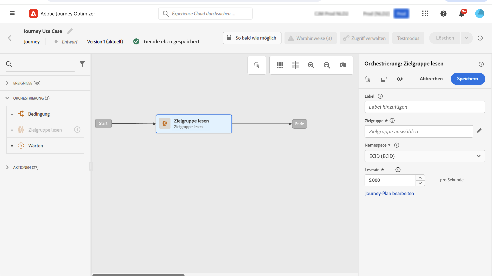

# Anwendungsfall: Senden von Multi-Channel-Nachrichten{#send-multi-channel-messages}

In diesem Abschnitt wird ein Anwendungsfall vorgestellt, der die Aktivität „Zielgruppe lesen“, ein Ereignis, Reaktionsereignisse und E-Mail-/Push-Nachrichten kombiniert.

## Beschreibung des Anwendungsfalls

In diesem Anwendungsfall besteht das Ziel darin, eine erste E-Mail-Nachricht an alle Kunden zu senden, die zu einer bestimmten Zielgruppe gehören.

Je nach Reaktion auf die erste Nachricht werden spezifische Folgenachrichten gesendet.

Wenn der Kunde die E-Mail öffnet, wartet das System auf einen Kauf und sendet eine Push-Nachricht, um dem Kunden zu danken.

Wenn keine Reaktion erfolgt, wird eine Follow-up-E-Mail gesendet.

## Voraussetzungen

Damit dieser Anwendungsfall funktioniert, konfigurieren Sie Folgendes:

* Ein Publikum für alle Kunden, die in Atlanta, San Francisco oder Seattle leben und nach 1980 geboren wurden
* Ein Kaufereignis

### Erstellen der Zielgruppe

In diesem Journey wird eine bestimmte Zielgruppe von Kundinnen und Kunden genutzt. Alle dieser Zielgruppe angehörenden Personen treten in die Journey ein und folgen den verschiedenen Schritten. In diesem Beispiel bezieht sich die Zielgruppe auf alle Kunden, die in Atlanta, San Francisco oder Seattle leben und nach 1980 geboren wurden.

Weitere Informationen zu Zielgruppen finden [ auf dieser Seite ](../audience/about-audiences.md).

1. Wählen Sie im Menüabschnitt KUNDE die Option **[!UICONTROL Zielgruppen]** aus.
1. Klicken Sie auf **[!UICONTROL Zielgruppe erstellen]** oben rechts in der Liste der Zielgruppen.
1. Geben Sie im Bereich **[!UICONTROL Zielgruppeneigenschaften]** einen Namen für die Zielgruppe ein.
1. Ziehen Sie die gewünschten Felder aus dem linken Bereich in den mittleren Arbeitsbereich und konfigurieren Sie sie entsprechend Ihren Anforderungen. Verwenden Sie in diesem Beispiel die Attributfelder **Stadt** und **Geburtsjahr** .
1. Klicken Sie auf **[!UICONTROL Speichern]**.

   

Die Zielgruppe ist jetzt erstellt und kann auf der Journey verwendet werden. Mit der Aktivität **Zielgruppe lesen** können alle Einzelpersonen der Zielgruppe die Journey eingeben.

### Konfigurieren des Ereignisses

Konfigurieren Sie ein Ereignis, das an den Journey gesendet wird, wenn ein Kunde einen Kauf tätigt. Wenn die Journey das Ereignis erhält, wird die Nachricht „Vielen Dank“ verschickt.

Verwenden Sie dazu ein [regelbasiertes Ereignis](../event/about-events.md).

1. Wählen Sie im Menüabschnitt ADMINISTRATION die Option **[!UICONTROL Konfigurationen]** und klicken Sie dann auf **[!UICONTROL Ereignisse]**. Klicken Sie auf **[!UICONTROL Ereignis erstellen]**, um ein neues Ereignis zu erstellen.

1. Geben Sie den Namen des Ereignisses ein.

1. Wählen Sie im Feld **[!UICONTROL Ereignis-ID-Typ]** die Option **[!UICONTROL Regelbasiert]** aus.

1. Definieren Sie die Felder **[!UICONTROL Schema]** und **[!UICONTROL Payload]**. Verwenden Sie mehrere Felder, z. B. das gekaufte Produkt, das Kaufdatum und die Kauf-ID.

1. Definieren Sie im Feld **[!UICONTROL Ereignis-ID]** Bedingung die vom System verwendete Bedingung, um die Ereignisse zu identifizieren, die den Journey-Trigger auslösen. Fügen Sie beispielsweise ein `purchaseMessage` hinzu und definieren Sie die folgende Regel: `purchaseMessage="thank you"`

1. Definieren Sie den **[!UICONTROL Namespace]** und die **[!UICONTROL Profilkennung]**.

1. Klicken Sie auf **[!UICONTROL Speichern]**.

   

Das Ereignis ist jetzt konfiguriert und kann auf der Journey verwendet werden. Mithilfe der entsprechenden Ereignisaktivität kann eine Aktion jedes Mal ausgelöst werden, wenn ein Kunde einen Kauf tätigt.

## Entwerfen der Journey

1. Beginnen Sie die Journey mit einer Aktivität vom Typ **Zielgruppe lesen**. Wählen Sie die zuvor erstellte Zielgruppe aus. Alle der Zielgruppe angehörenden Personen treten in die Journey ein.

   

1. Legen Sie **Aktionsaktivität „E** Mail“ im Arbeitsbereich ab und definieren Sie den Inhalt der „ersten Nachricht“. Diese Nachricht wird an alle Personen in der Journey gesendet. In diesem [Abschnitt](../email/create-email.md) erfahren Sie, wie Sie eine E-Mail konfigurieren und gestalten können.

   

1. Fügen Sie ein Ereignis vom Typ **Reaktion** hinzu und wählen Sie **E-Mail geöffnet**. Das Ereignis wird ausgelöst, sobald ein zur Zielgruppe gehörender Kontakt die E-Mail öffnet.

1. Markieren Sie das **Maximale Wartezeit für das Ereignis definieren**, definieren Sie die Dauer (in diesem Beispiel 1 Tag) und aktivieren Sie **Zeitüberschreitungspfad festlegen**. Dadurch wird ein weiterer Pfad für Einzelpersonen erstellt, die die erste Push- oder E-Mail-Nachricht nicht öffnen.

1. Legen Sie im Pfad der maximalen Wartezeit die Aktionsaktivität **E-Mail** ab und definieren sie den Inhalt der Folgenachricht. Diese Nachricht wird an Personen gesendet, die die erste E-Mail- oder Push-Nachricht nicht innerhalb des nächsten Tages öffnen. [Erfahren Sie, wie Sie eine E-Mail konfigurieren und gestalten](../email/create-email.md).

1. Fügen Sie im ersten Pfad das zuvor erstellte Kaufereignis hinzu. Dieses Ereignis wird ausgelöst, wenn ein Kontakt einen Kauf tätigt.

1. Legen Sie nach dem Ereignis die Aktionsaktivität **Push** im Arbeitsbereich ab und definieren Sie den Inhalt der Dankesnachricht. In diesem [Abschnitt](../push/create-push.md) erfahren Sie, wie Sie eine Push-Benachrichtigung konfigurieren und gestalten können.

## Testen und Veröffentlichen der Journey

1. Stellen Sie vor dem Testen der Journey sicher, dass sie gültig ist und kein Fehler vorliegt.

1. Verwenden Sie den **Test**-Umschalter oben rechts, um den Testmodus zu aktivieren. In diesem [Abschnitt](testing-the-journey.md) erfahren Sie, wie Sie den Testmodus verwenden.

1. Wenn die Journey fertig ist, veröffentlichen Sie diese mit der Schaltfläche **Veröffentlichen** rechts oben.
