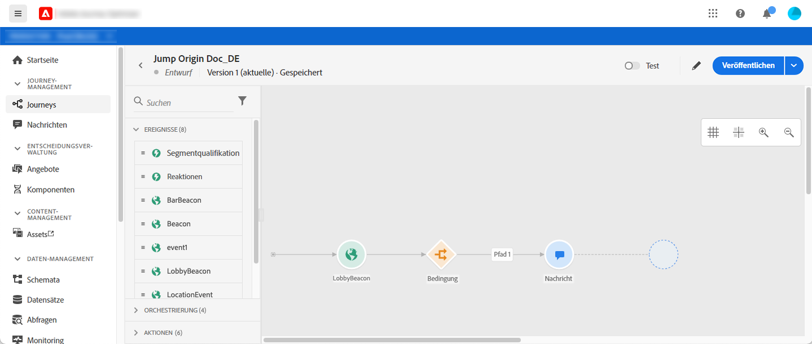
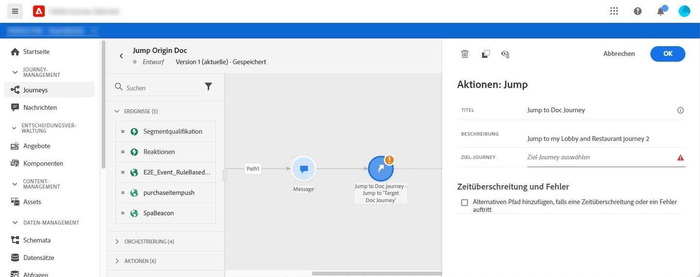
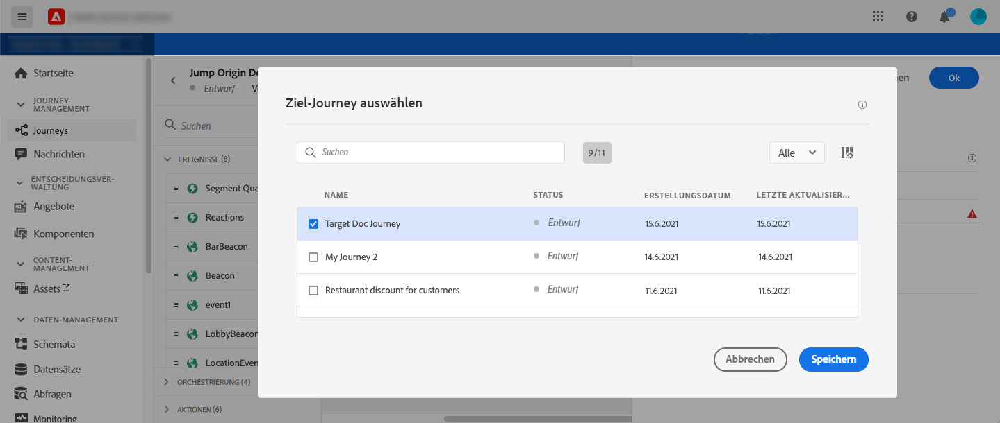
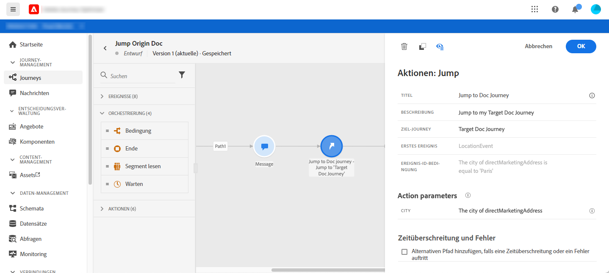
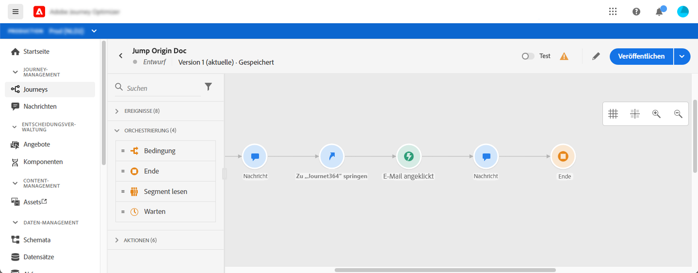
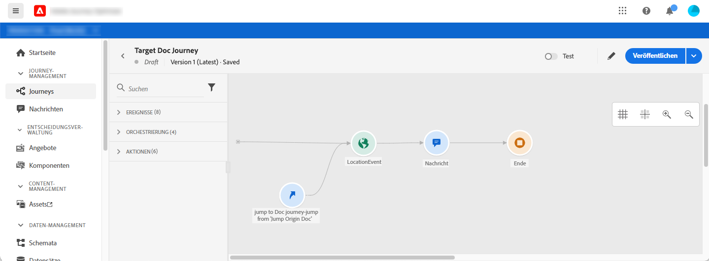
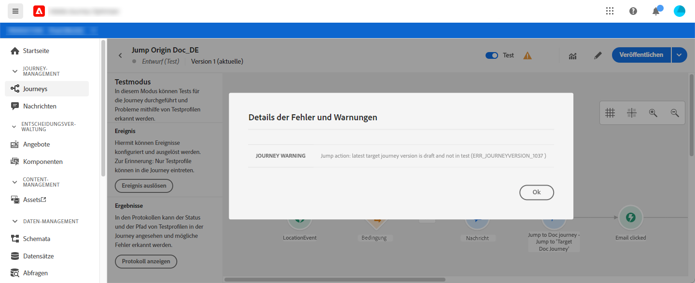

# Aufspringen von einer Journey zu einer anderen {#jump}

Mit der Aktivität **[!UICONTROL Jump]** können Sie Personen von einer Journey in eine andere verschieben. Mit dieser Funktion können Sie:

* die Gestaltung sehr komplexer Journey zu vereinfachen, indem sie in mehrere aufgeteilt werden
* Erstellen von Journey basierend auf gemeinsamen und wiederverwendbaren Journey-Mustern

Fügen Sie im Journey &quot;Herkunft&quot;einfach eine Aktivität **[!UICONTROL Jump]** hinzu und wählen Sie eine Journey der Zielgruppe aus. Wenn die Person den Schritt **[!UICONTROL Jump]** aufruft, wird ein internes Ereignis an das erste Ereignis der Zielgruppe-Journey gesendet. Wenn die Aktion **[!UICONTROL Jump]** erfolgreich ausgeführt wird, wird die Journey fortgesetzt. Das Verhalten ist mit anderen Aktionen vergleichbar.

In der Journey &quot;Zielgruppe&quot;wird das erste intern durch die Aktivität **[!UICONTROL Jump]** ausgelöste Ereignis den individuellen Fluss in der Journey auslösen.

>[!NOTE]
>
>Siehe auch das Lernvideo [hier](https://experienceleague.adobe.com/docs/journey-orchestration-learn/tutorials/building-a-journey/jumping-to-another-journey.html)

## Lebenszyklus

Nehmen wir an, Sie haben eine **[!UICONTROL Jump]**-Aktivität in einer Journey A zu einer Journey B hinzugefügt. Journey A ist die Journey **Herkunft und Journey B, die Journey** Zielgruppe **.**
Im Folgenden sind die verschiedenen Schritte des Ausführungsprozesses aufgeführt:

**Journey** AIS wird von einem externen Ereignis ausgelöst:

1. Journey A erhält ein externes Ereignis, das mit einer Einzelperson verbunden ist.
1. Die Einzelperson erreicht den Schritt **[!UICONTROL Jump]**.
1. Die Einzelperson wird zu Journey B gedrückt und fährt nach dem Schritt **[!UICONTROL Jump]** mit den nächsten Schritten in Journey A fort.

In Journey B wird das erste Ereignis intern über die Aktivität **[!UICONTROL Jump]** von Journey A ausgelöst:

1. Journey B erhielt ein internes Ereignis von Journey A.
1. Die einzelnen Beginn fließen in Journey B.

>[!NOTE]
>
>Journey B kann auch über ein externes Ereignis ausgelöst werden.

## Best Practices und Einschränkungen

### Authoring

* Die Aktivität **[!UICONTROL Jump]** steht nur in Journey zur Verfügung, die einen Namensraum verwenden.
* Sie können nur zu einer Journey springen, die denselben Namensraum wie die Herkunft Journey verwendet.
* Sie können nicht zu einer Journey springen, die Beginn mit einem **Segmentqualifizierung**-Ereignis oder **Read segment** enthält.
* Sie können keine **[!UICONTROL Jump]**-Aktivität und eine **Segmentqualifizierung** oder ein **Read-Ereignis** im selben Journey haben.
* Sie können so viele **[!UICONTROL Jump]**-Aktivitäten einschließen, wie Sie in einer Journey benötigen. Nach einem **[!UICONTROL Jump]** können Sie jede erforderliche Aktivität hinzufügen.
* Sie können so viele Sprungstufen wie nötig haben. Beispielsweise springt Journey A zu Journey B, das zu Journey C springt usw.
* Die Journey der Zielgruppe kann auch so viele **[!UICONTROL Jump]**-Aktivitäten enthalten, wie erforderlich.
* Schleifenmuster werden nicht unterstützt. Es gibt keine Möglichkeit, zwei oder mehr Journey miteinander zu verbinden, was eine unendliche Schleife erzeugen würde. Der Konfigurationsbildschirm **[!UICONTROL Jump]** verhindert, dass Sie dies tun.

### Ausführung

* Wenn die Aktivität **[!UICONTROL Jump]** ausgeführt wird, wird die neueste Version der Zielgruppe-Journey ausgelöst.
* Wie üblich kann eine Einzelperson nur einmal in einer Journey vorhanden sein. Wenn sich das aus der Herkunft gedrängte Individuum bereits in der Zielgruppe Journey befindet, wird das Individuum nicht in die Zielgruppe Journey. Für die Aktivität **[!UICONTROL Jump]** wird kein Fehler gemeldet, da dies ein normales Verhalten ist.

## Konfigurieren der Jump-Aktivität

1. Entwerfen Sie Ihre **Herkunft Journey**.

   

1. Fügen Sie an jeder Stelle der Journey eine Aktivität **[!UICONTROL Jump]** aus der Kategorie **[!UICONTROL ACTIONS]** hinzu. hinzufügen einer Bezeichnung und Beschreibung.

   

1. Klicken Sie in das Feld **Zielgruppe Journey**.
Die Liste zeigt alle Journey-Versionen an, die als Entwurf, live oder im Testmodus vorliegen. Journey, die einen anderen Namensraum oder diesen Beginn mit einem **Segmentqualifizierung**-Ereignis verwenden, sind nicht verfügbar. Zielgruppe-Journey, die ein Schleifenmuster erzeugen würden, werden ebenfalls herausgefiltert.

   

   >[!NOTE]
   >
   >Sie können auf das Symbol **Zielgruppe öffnen Journey** rechts klicken, um die Zielgruppe-Journey in einer neuen Registerkarte zu öffnen.

1. Wählen Sie die Journey der Zielgruppe aus, zu der Sie springen möchten.
Das Feld **Erstes Ereignis** wird mit dem Namen des ersten Ereignisses der Zielgruppe vorausgefüllt. Wenn Ihre Zielgruppe-Journey mehrere Ereignis enthält, ist **[!UICONTROL Jump]** nur für das erste Ereignis zulässig.

   

1. Im Abschnitt **Aktionsparameter** werden alle Felder des Ereignisses &quot;Zielgruppe&quot;angezeigt. Ordnen Sie wie bei anderen Aktionstypen die Felder aus dem Ereignis der Herkunft oder der Datenquelle jedem Feld zu. Diese Informationen werden zur Laufzeit an die Zielgruppe Journey weitergeleitet.
1. hinzufügen die nächsten Aktivitäten, um Ihre Herkunft Journey zu beenden.

   

   >[!NOTE]
   >
   >Die Identität der Person wird automatisch zugeordnet. Diese Informationen sind auf der Benutzeroberfläche nicht sichtbar.

Ihre **[!UICONTROL Jump]**-Aktivität ist konfiguriert. Sobald Ihre Journey live oder im Testmodus ist, werden Personen, die den Schritt **[!UICONTROL Jump]** erreichen, von der Journey der Zielgruppe weitergeleitet.

Wenn eine **[!UICONTROL Jump]**-Aktivität in einer Journey konfiguriert ist, wird automatisch ein **[!UICONTROL Jump]**-Eintragssymbol am Anfang der Zielgruppe-Journey hinzugefügt. Auf diese Weise können Sie erkennen, dass die Journey extern, aber auch intern von einer **[!UICONTROL Jump]**-Aktivität ausgelöst werden kann.

## Fehlerbehebung

Wenn die Journey veröffentlicht wird oder sich im Testmodus befindet, treten Fehler auf, wenn:
* die Zielgruppe Journey nicht mehr vorhanden
* die Zielgruppe Journey wird als Entwurf, geschlossen oder gestoppt
* wenn das erste Ereignis der Zielgruppe-Journey geändert wurde und die Zuordnung beschädigt ist

