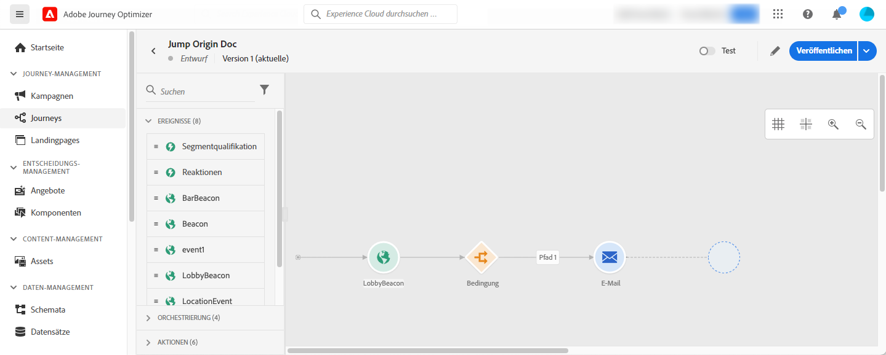
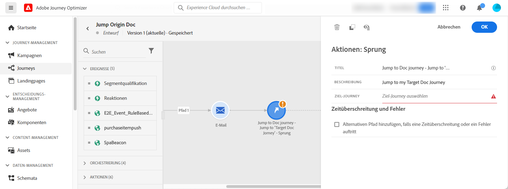
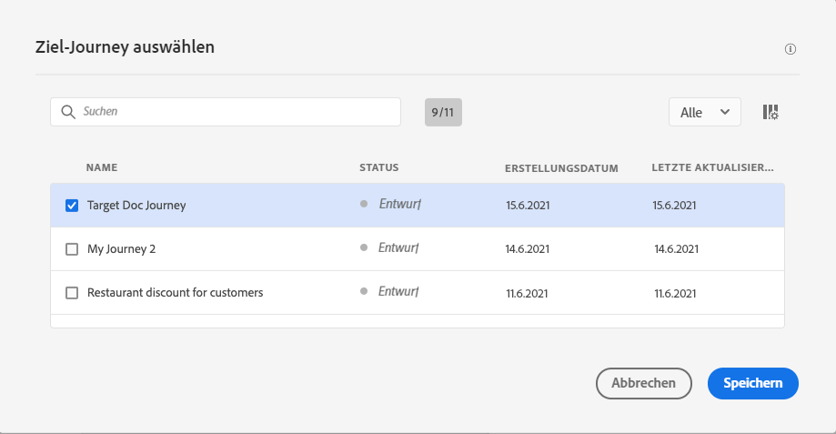
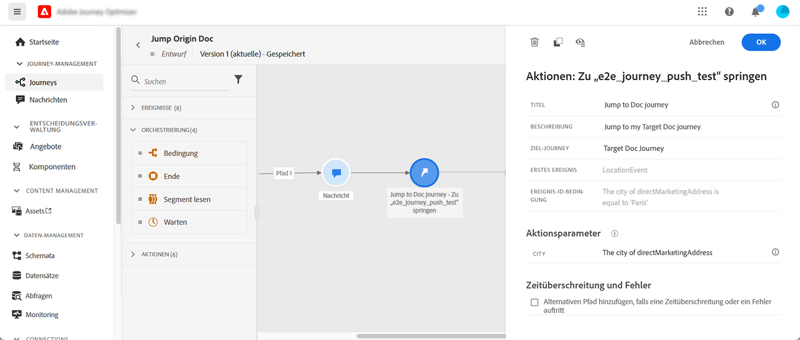
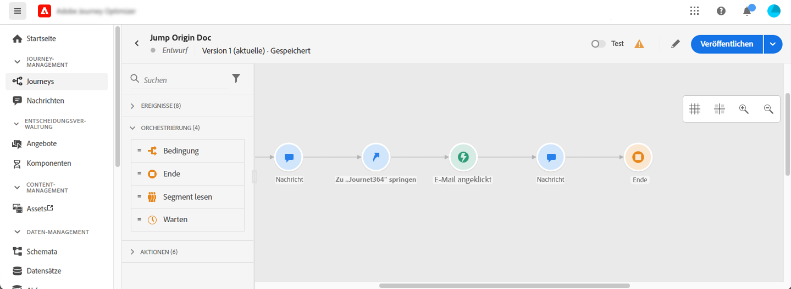
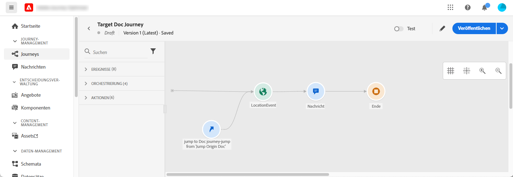
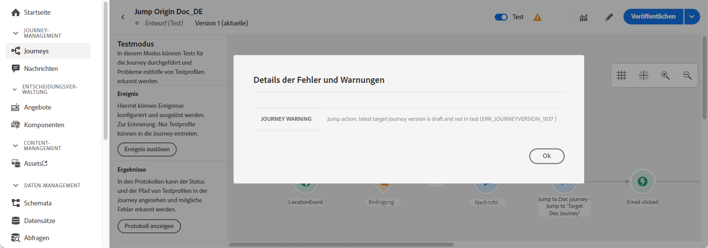

# Springen zwischen Journeys {#jump}

>[!CONTEXTUALHELP]
>id="ajo_journey_jump"
>title="Aktivität „Springen“"
>abstract="Mit der Aktionsaktivität „Sprung“ können Sie Kontakte von einer Journey in eine andere bewegen. Diese Funktion ermöglicht es Ihnen, das Design sehr komplexer Journeys zu vereinfachen und Journeys basierend auf allgemeinen und wiederverwendbaren Journey-Mustern zu erstellen."

Mit der Aktionsaktivität **[!UICONTROL Sprung]** können Sie Kontakte von einer Journey in eine andere bewegen. Diese Funktion unterstützt:

* Vereinfachung der Gestaltung sehr komplexer Journeys durch Aufteilung in mehrere Journeys
* Erstellung von Journeys anhand allgemeiner und wiederverwendbarer Journey-Muster

Fügen Sie in der Ursprungs-Journey eine **[!UICONTROL Sprungaktivität]** hinzu und wählen Sie eine Ziel-Journey aus. Wenn der Kontakt in den **[!UICONTROL Sprungschritt]** eintritt, wird ein internes Ereignis an das erste Ereignis der Ziel-Journey gesendet. Wenn die **[!UICONTROL Sprungaktion]** erfolgreich ist, setzt der Kontakt die Journey fort. Das Verhalten ist mit anderen Aktionen vergleichbar.

In der Ziel-Journey leitet das erste intern durch die **[!UICONTROL Sprungaktivität]** ausgelöste Ereignis den Kontakt in die Journey.

## Lebenszyklus {#jump-lifecycle}

Angenommen Sie haben eine **[!UICONTROL Sprungaktivität]** in Journey A zu Journey B hinzugefügt. Journey A ist die **Ursprungs-Journey** und Journey B die **Ziel-Journey**.

Im Folgenden finden Sie die verschiedenen Schritte des Ausführungsprozesses:

**Journey A** wird von einem externen Ereignis ausgelöst:

1. Journey A empfängt ein externes Ereignis, das mit einem Kontakt in Verbindung steht.
1. Der Kontakt erreicht den **[!UICONTROL Sprungschritt]**.
1. Der Kontakt wird in Journey B geleitet und fährt nach dem **[!UICONTROL Sprungschritt]** mit den nächsten Schritten in Journey A fort.

In Journey B wird das erste Ereignis intern über die **[!UICONTROL Sprungaktivität]** von Journey A ausgelöst:

1. Journey B erhält ein internes Ereignis von Journey A.
1. Der Kontakt wird in Journey B geleitet.

>[!NOTE]
>
>Journey B kann auch über ein externes Ereignis ausgelöst werden.

### Profilverhalten während eines Sprungs {#jump-profile-behavior}

Wenn ein Profil den **[!UICONTROL Sprung]**-Schritt erreicht, schreitet es auf der Ursprungs-Journey (Journey A) weiter voran, während es gleichzeitig auf die Ziel-Journey (Journey B) gelangt. Das Profil ist daher in beiden Journey gleichzeitig aktiv.

Das bedeutet:

* Das Profil führt alle verbleibenden Schritte in Journey A nach der Sprungaktivität aus (z. B. eine Folgewartezeit oder eine schließende Aktion).
* Das Profil beginnt auch unabhängig von Journey A von seinem ersten Ereignis an durch Journey B zu fließen.
* Wenn das Profil **bereits aktiv** in Journey B ist, wenn der Sprung ausgeführt wird, wird **nicht** erneut in Journey B eingegeben. Journey A läuft normal weiter; es wird kein Fehler gemeldet.

>[!NOTE]
>
>Der obige Fall - Profil ist bereits auf Journey B aktiv - führt zu einem **stillen Überspringen**: Es wird kein Fehler ausgelöst und Journey A wird normal fortgesetzt. In anderen Situationen kann der Sprung **fehlschlagen** und Journey A wendet die standardmäßige Aktionsfehlerbehandlung an. Siehe [Laufzeitfehler](#jump-troubleshoot) für die vollständige Liste der Fälle.

## Best Practices und Einschränkungen {#jump-limitations}

Verwenden Sie diese Richtlinien, um das Verhalten von Sprungaktivitäten vorhersehbar und sicher zu halten.

### Authoring {#jump-limitations-authoring}

* Die **[!UICONTROL Sprungaktivität]** ist nur in Journeys verfügbar, die einen Namespace verwenden.
* Sie können nur in eine Journey springen, die denselben Namespace wie die Ursprungs-Journey verwendet.
* Sie können nicht zu einer Journey springen, die mit einem **Zielgruppen-Qualifizierungsereignis** oder einer Aktivität vom Typ **Zielgruppe lesen** beginnt.
* Dieselbe Journey darf nicht gleichzeitig eine **[!UICONTROL Sprungaktivität]** und ein **Zielgruppen-Qualifizierungsereignis** oder eine Aktivität vom Typ **Zielgruppe lesen** enthalten.
* Sie können so viele **[!UICONTROL Sprungaktivitäten]** wie nötig in eine Journey aufnehmen. Nach einem **[!UICONTROL Sprung]** können Sie jede erforderliche Aktivität hinzufügen.
* Sie können beliebig viele Sprungstufen einfügen. Beispielsweise springt Journey A zu Journey B, die zu Journey C springt, usw.
* Auch die Ziel-Journey kann beliebig viele **[!UICONTROL Sprungaktivitäten]** umfassen.
* Schleifenmuster werden nicht unterstützt. Es gibt keine Möglichkeit, zwei oder mehr Journeys miteinander zu verknüpfen. Das würde eine Endlosschleife erzeugen. Der Konfigurationsbildschirm für **[!UICONTROL Sprungaktivitäten]** verhindert dies.

### Ausführung {#jump-limitations-exec}

* Wenn die **[!UICONTROL Sprungaktivität]** ausgeführt wird, wird die aktuelle Version der Ziel-Journey ausgelöst.
* Ein eindeutiger Kontakt kann sich nur einmal in einer Journey befinden. Wenn sich der aus der Ursprungs-Journey geleitete Kontakt bereits in der Ziel-Journey befindet, tritt der Kontakt also nicht noch einmal in die Ziel-Journey ein. Bei der **[!UICONTROL Sprungaktivität]** wird kein Fehler gemeldet, da dies normales Verhalten ist.

## Design-Strategie: Beißgroße Unter-Journey {#jump-strategy}

Komplexe Kundenkanäle und Journey können schnell schwer zu erstellen und zu warten sein, insbesondere wenn zusätzliche Kanäle oder Touchpoints eingeführt werden. Selbst eine Journey mit einer Handvoll Meilensteinen kann 20 oder mehr einzigartige Pfade aufzeigen, die ein Kunde einschlagen kann, und diese Komplexität wächst exponentiell mit jeder Ergänzung.

Ein praktischer Ansatz zur Verwaltung dieses Problems besteht darin, große Journey in kleinere, fokussierte Untergruppen zu unterteilen - eine pro Geschäftsphase oder Meilenstein - und sie mithilfe der Aktivität &quot;**[!UICONTROL &quot;]** verbinden. Dadurch bleibt jede Journey lesbar, testbar und unabhängig wartbar.

**Schritt 1: Visualisieren Sie das End-to-End-Journey**

Ordnen Sie die vollständige Kunden-Journey zu und identifizieren Sie deren allgemeine Phasen. Eine Onboarding-Journey für Treueprogramme kann beispielsweise drei verschiedene Phasen umfassen: Herunterladen der Mobile App, Ausführen einer ersten Transaktion und Durchführen einer zweiten Transaktion.

**Schritt 2: Anmerkungen zu Phasen vornehmen und Unter-Journey definieren**

Markieren Sie die Grenze jeder Phase und definieren Sie deren Geschäftsziel. Jede Phase wird zu einer potenziellen Sub-Journey mit einer eindeutigen Einstiegsbedingung und einem eindeutigen Ziel.

**Schritt 3 - Erstellen und Verbinden von Unter-Journey**

Erstellen Sie jede Phase als separate Journey in Journey Optimizer und verwenden Sie dann **[!UICONTROL Jump]**-Aktivitäten, um Profile von einem Sub-Journey zum nächsten zu übergeben. Das Ergebnis ist eine Reihe einfacherer, wiederverwendbarer Journey, die zusammenarbeiten, um das gesamte End-to-End-Erlebnis zu erzielen - mit geringerem Fehlerrisiko.

>[!TIP]
>
>Ein funktionierendes Beispiel mit einem mehrphasigen Treueprogramm finden Sie unter [Mehrphasen-Treueprogramm-Journey](journeys-uc.md#multi-phase-loyalty).

## Konfigurieren der Sprungaktivität {#jump-configure}

1. Konfigurieren Sie die **Ursprungs-Journey**.

   

1. Fügen Sie einem beliebigen Schritt in der Journey eine **[!UICONTROL Sprungaktivität]** der Kategorie **[!UICONTROL AKTIONEN]** hinzu. Fügen Sie ein Label und eine Beschreibung hinzu.

   

1. Klicken Sie in das Feld **Ziel-Journey**.
Die Liste zeigt alle Journey-Versionen an, die sich im Entwurfs-, Live- oder Testmodus befinden. Journeys, die einen anderen Namespace verwenden oder mit einem **Zielgruppen-Qualifizierungsereignis** beginnen, sind nicht verfügbar. Ziel-Journeys, die ein Schleifenmuster erzeugen würden, werden ebenfalls herausgefiltert.

   

   >[!NOTE]
   >
   >Sie können rechts auf das Symbol **Zielgruppen-Journey öffnen** klicken, um die Ziel-Journey in einem neuen Tab zu öffnen.

1. Wählen Sie die Ziel-Journey aus, zu der Sie springen möchten.
Das Feld **Erstes Ereignis** wird vorab mit dem Namen des ersten Ereignisses der Ziel-Journey gefüllt. Wenn Ihre Ziel-Journey mehrere Ereignisse umfasst, ist der **[!UICONTROL Sprung]** nur zum ersten Ereignis zulässig.

   

1. Im Abschnitt **Aktionsparameter** werden alle Felder des Zielereignisses angezeigt. Ordnen Sie wie bei anderen Aktionstypen jedes Feld Feldern aus dem Ursprungs-Ereignis oder der Ursprungs-Datenquelle zu. Diese Informationen werden zur Laufzeit an die Ziel-Journey weitergegeben.
1. Fügen Sie die nächsten Aktivitäten hinzu, um Ihre Ursprungs-Journey zu beenden.

   

   >[!NOTE]
   >
   >Die Identität des Kontakts wird automatisch zugeordnet. Diese Informationen sind auf der Benutzeroberfläche nicht sichtbar.

Ihre **[!UICONTROL Sprungaktivität]** ist konfiguriert. Sobald Ihre Journey live oder im Testmodus ist, werden Kontakte, die den **[!UICONTROL Sprungschritt]** erreichen, in die Ziel-Journey geleitet.

Wenn in einer Journey eine **[!UICONTROL Sprungaktivität]** konfiguriert ist, wird zu Beginn der Ziel-Journey automatisch ein **[!UICONTROL Sprungeintrittssymbol]** hinzugefügt. Auf diese Weise können Sie erkennen, dass die Journey sowohl extern als auch intern durch eine **[!UICONTROL Sprungaktivität]** ausgelöst werden kann.

## Fehlerbehebung {#jump-troubleshoot}

### Konfigurationsfehler

Die folgenden Probleme verhindern, dass der Sprung ordnungsgemäß funktioniert und auf der Journey-Arbeitsfläche als Fehler angezeigt werden:

* Die Ziel-Journey existiert nicht mehr.
* Die Ziel-Journey ist Entwurf, geschlossen oder gestoppt.
* Das erste Ereignis der Ziel-Journey hat sich geändert und die Zuordnung ist beschädigt.

### Laufzeitfehler

In den folgenden Fällen wird der Sprungschritt in Journey A als **fehlgeschlagene Aktion** behandelt. Journey A wendet die standardmäßige Aktionsfehlerbehandlung an und fährt fort:

* Die bestehende Ziel-Journey-Instanz wurde beendet, und die Ziel-Journey ist nicht wiedereintrittspflichtig.
* Auf der Ziel-Journey wird eine Periode für den erneuten Eintritt konfiguriert. Selbst wenn der erneute Eintritt grundsätzlich zulässig ist, kann das Profil erst wieder eintreten, wenn der Zeitraum abgelaufen ist (der Sprung schlägt mit dem Status „Kein Eintritt für den Zeitraum“ fehl).
* Die Ziel-Journey-Version kann nicht gefunden werden, wurde gelöscht, befindet sich in einem fertigen Zustand oder wurde gestoppt.
