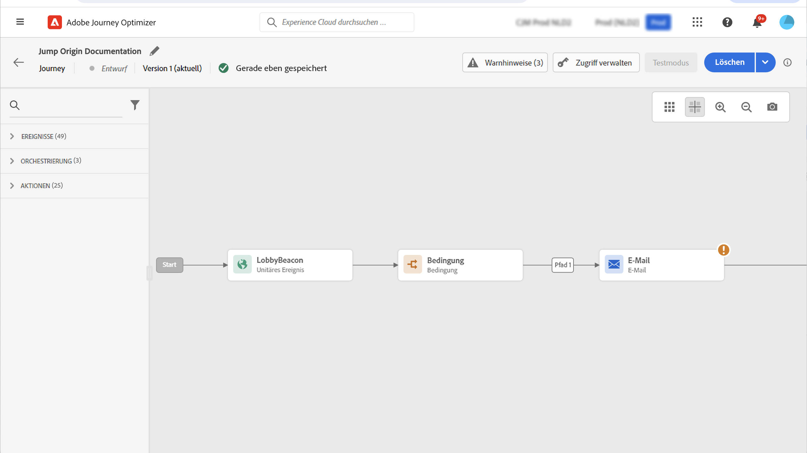
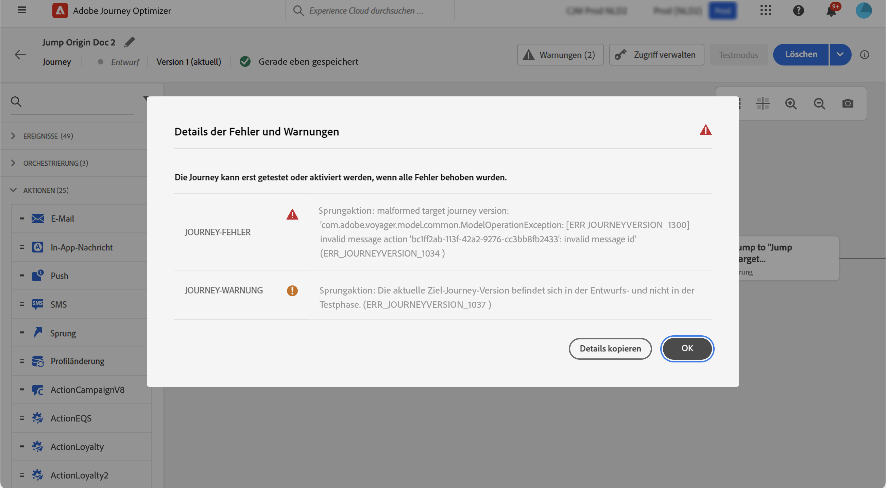

# Springen zwischen Journeys {#jump}

>[!CONTEXTUALHELP]
>id="ajo_journey_jump"
>title="Aktivität „Sprung“"
>abstract="Mit der Aktionsaktivität „Sprung“ können Sie Kontakte von einer Journey in eine andere bewegen. Diese Funktion ermöglicht es Ihnen, das Design sehr komplexer Journeys zu vereinfachen und Journeys basierend auf allgemeinen und wiederverwendbaren Journey-Mustern zu erstellen."

Mit der Aktionsaktivität **[!UICONTROL Sprung]** können Sie Kontakte von einer Journey in eine andere bewegen. Diese Funktion unterstützt:

* Vereinfachung der Gestaltung sehr komplexer Journeys durch Aufteilung in mehrere Journeys
* Erstellung von Journeys anhand allgemeiner und wiederverwendbarer Journey-Muster

Fügen Sie in der Ursprungs-Journey eine **[!UICONTROL Sprungaktivität]** hinzu und wählen Sie eine Ziel-Journey aus. Wenn der Kontakt in den **[!UICONTROL Sprungschritt]** eintritt, wird ein internes Ereignis an das erste Ereignis der Ziel-Journey gesendet. Wenn die **[!UICONTROL Sprungaktion]** erfolgreich ist, setzt der Kontakt die Journey fort. Das Verhalten ist mit anderen Aktionen vergleichbar.

In der Ziel-Journey leitet das erste intern durch die **[!UICONTROL Sprungaktivität]** ausgelöste Ereignis den Kontakt in die Journey.

## Lebenszyklus {#jump-lifecycle}

Angenommen Sie haben eine **[!UICONTROL Sprungaktivität]** in Journey A zu Journey B hinzugefügt. Journey A ist die **Ursprungs-Journey** und Journey B die **Ziel-Journey**.

Im Folgenden finden Sie die verschiedenen Schritte des Ausführungsprozesses:

**Journey A** wird von einem externen Ereignis ausgelöst:

1. Journey A empfängt ein externes Ereignis, das mit einem Kontakt in Verbindung steht.
1. Der Kontakt erreicht den **[!UICONTROL Sprungschritt]**.
1. Der Kontakt wird in Journey B geleitet und fährt nach dem **[!UICONTROL Sprungschritt]** mit den nächsten Schritten in Journey A fort.

In Journey B wird das erste Ereignis intern über die **[!UICONTROL Sprungaktivität]** von Journey A ausgelöst:

1. Journey B erhält ein internes Ereignis von Journey A.
1. Der Kontakt wird in Journey B geleitet.

>[!NOTE]
>
>Journey B kann auch über ein externes Ereignis ausgelöst werden.

## Best Practices und Einschränkungen {#jump-limitations}

### Authoring {#jump-limitations-authoring}

* Die **[!UICONTROL Sprungaktivität]** ist nur in Journeys verfügbar, die einen Namespace verwenden.
* Sie können nur in eine Journey springen, die denselben Namespace wie die Ursprungs-Journey verwendet.
* Sie können nicht zu einer Journey springen, die mit einem **Zielgruppen-Qualifizierungsereignis** oder einer Aktivität vom Typ **Zielgruppe lesen** beginnt.
* Dieselbe Journey darf nicht gleichzeitig eine **[!UICONTROL Sprungaktivität]** und ein **Zielgruppen-Qualifizierungsereignis** oder eine Aktivität vom Typ **Zielgruppe lesen** enthalten.
* Sie können so viele **[!UICONTROL Sprungaktivitäten]** wie nötig in eine Journey aufnehmen. Nach einem **[!UICONTROL Sprung]** können Sie jede erforderliche Aktivität hinzufügen.
* Sie können beliebig viele Sprungstufen einfügen. Beispielsweise springt Journey A zu Journey B, die zu Journey C springt, usw.
* Auch die Ziel-Journey kann beliebig viele **[!UICONTROL Sprungaktivitäten]** umfassen.
* Schleifenmuster werden nicht unterstützt. Es gibt keine Möglichkeit, zwei oder mehr Journeys miteinander zu verknüpfen. Das würde eine Endlosschleife erzeugen. Der Konfigurationsbildschirm für **[!UICONTROL Sprungaktivitäten]** verhindert dies.

### Ausführung {#jump-limitations-exec}

* Wenn die **[!UICONTROL Sprungaktivität]** ausgeführt wird, wird die aktuelle Version der Ziel-Journey ausgelöst.
* Ein eindeutiger Kontakt kann sich nur einmal in einer Journey befinden. Wenn sich der aus der Ursprungs-Journey geleitete Kontakt bereits in der Ziel-Journey befindet, tritt der Kontakt also nicht noch einmal in die Ziel-Journey ein. Bei der **[!UICONTROL Sprungaktivität]** wird kein Fehler gemeldet, da dies normales Verhalten ist.

## Konfigurieren der Sprungaktivität {#jump-configure}

1. Konfigurieren Sie die **Ursprungs-Journey**.

   

1. Fügen Sie einem beliebigen Schritt in der Journey eine **[!UICONTROL Sprungaktivität]** der Kategorie **[!UICONTROL AKTIONEN]** hinzu. Fügen Sie ein Label und eine Beschreibung hinzu.

   

1. Klicken Sie in das Feld **Ziel-Journey**.
Die Liste zeigt alle Journey-Versionen an, die sich im Entwurfs-, Live- oder Testmodus befinden. Journeys, die einen anderen Namespace verwenden oder mit einem **Zielgruppen-Qualifizierungsereignis** beginnen, sind nicht verfügbar. Ziel-Journeys, die ein Schleifenmuster erzeugen würden, werden ebenfalls herausgefiltert.

   

   >[!NOTE]
   >
   >Sie können rechts auf das Symbol **Zielgruppen-Journey öffnen** klicken, um die Ziel-Journey in einem neuen Tab zu öffnen.

1. Wählen Sie die Ziel-Journey aus, zu der Sie springen möchten.
Das Feld **Erstes Ereignis** wird vorab mit dem Namen des ersten Ereignisses der Ziel-Journey gefüllt. Wenn Ihre Ziel-Journey mehrere Ereignisse umfasst, ist der **[!UICONTROL Sprung]** nur zum ersten Ereignis zulässig.

   

1. Im Abschnitt **Aktionsparameter** werden alle Felder des Zielereignisses angezeigt. Ordnen Sie wie bei anderen Aktionstypen jedes Feld Feldern aus dem Ursprungs-Ereignis oder der Ursprungs-Datenquelle zu. Diese Informationen werden zur Laufzeit an die Ziel-Journey weitergegeben.
1. Fügen Sie die nächsten Aktivitäten hinzu, um Ihre Ursprungs-Journey zu beenden.

   

   >[!NOTE]
   >
   >Die Identität des Kontakts wird automatisch zugeordnet. Diese Informationen sind auf der Benutzeroberfläche nicht sichtbar.

Ihre **[!UICONTROL Sprungaktivität]** ist konfiguriert. Sobald Ihre Journey live oder im Testmodus ist, werden Kontakte, die den **[!UICONTROL Sprungschritt]** erreichen, in die Ziel-Journey geleitet.

Wenn in einer Journey eine **[!UICONTROL Sprungaktivität]** konfiguriert ist, wird zu Beginn der Ziel-Journey automatisch ein **[!UICONTROL Sprungeintrittssymbol]** hinzugefügt. Auf diese Weise können Sie erkennen, dass die Journey sowohl extern als auch intern durch eine **[!UICONTROL Sprungaktivität]** ausgelöst werden kann.

## Fehlerbehebung {#jump-troubleshoot}

Fehler treten auf, wenn:

* Die Ziel-Journey nicht mehr existiert
* Der Status der Ziel-Journey „Entwurf“, „Geschlossen“ oder „Gestoppt“ ist
* Das erste Ereignis der Ziel-Journey sich geändert hat und die Zuordnung unterbrochen wird

