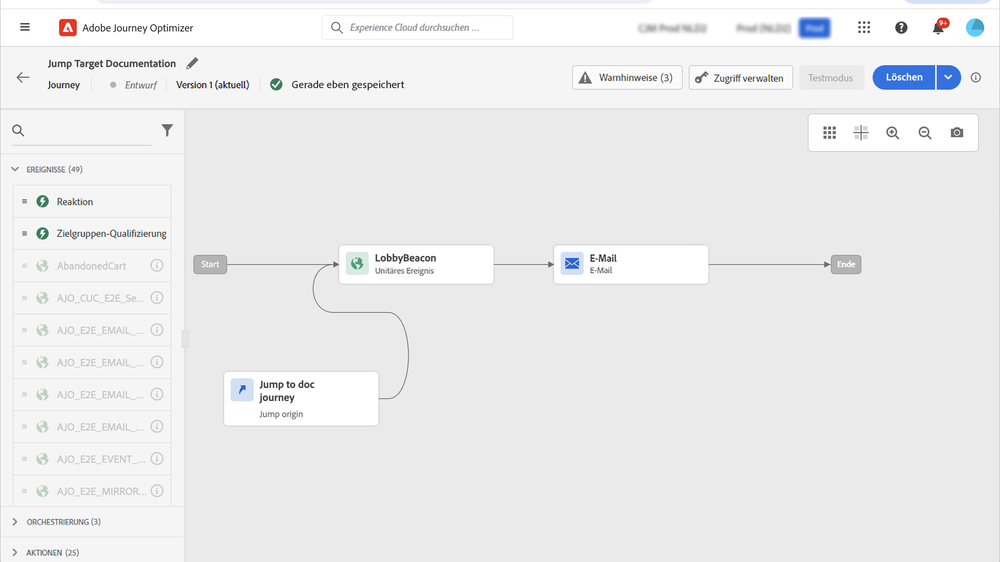

# Sprung von einer Journey in eine andere {#jump}

>[!CONTEXTUALHELP]
>id="ajo_journey_jump"
>title="Sprungaktivität"
>abstract="Mit der Aktionsaktivität Sprung können Sie Kontakte von einer Journey in eine andere bewegen. Mit dieser Funktion können Sie das Design sehr komplexer Journeys vereinfachen und Journeys basierend auf gemeinsamen und wiederverwendbaren Journey-Mustern erstellen."

Die **[!UICONTROL Jump]** Mit der Aktionsaktivität können Sie Kontakte von einer Journey in eine andere bewegen. Mit dieser Funktion können Sie:

* Vereinfachung der Gestaltung sehr komplexer Journeys durch Aufteilung in mehrere Journeys
* Journeys basierend auf allgemeinen und wiederverwendbaren Journey-Mustern erstellen

Fügen Sie in der Ursprungs-Journey einfach eine **[!UICONTROL Jump]** und wählen Sie eine Ziel-Journey aus. Wenn der Kontakt in die **[!UICONTROL Jump]** -Schritt ein internes Ereignis an das erste Ereignis der Ziel-Journey gesendet. Wenn die Variable **[!UICONTROL Jump]** erfolgreich war, schreitet der Kontakt in der Journey fort. Das Verhalten ähnelt anderen Aktionen.

In der Ziel-Journey wird das erste Ereignis intern durch die **[!UICONTROL Jump]** -Aktivität fließt der Kontakt in die Journey.

## Lebenszyklus

Angenommen, Sie haben einen **[!UICONTROL Jump]** Aktivität in einer Journey A in einer Journey B. Journey A ist die **Ursprungs-Journey** und Journey B, der **Ziel-Journey**.
Im Folgenden werden die verschiedenen Schritte des Ausführungsprozesses beschrieben:

**Journey A** wird von einem externen Ereignis ausgelöst:

1. Journey A erhält ein externes Ereignis, das mit einer Person verbunden ist.
1. Der Kontakt erreicht die **[!UICONTROL Jump]** Schritt.
1. Der Kontakt wird in Journey B geleitet und fährt mit den nächsten Schritten in Journey A fort, nach dem **[!UICONTROL Jump]** Schritt.

In Journey B wird das erste Ereignis intern über die **[!UICONTROL Jump]** Aktivität von Journey A:

1. Journey B erhielt ein internes Ereignis von Journey A.
1. Der Kontakt beginnt in Journey B zu fließen.

>[!NOTE]
>
>Journey B kann auch über ein externes Ereignis ausgelöst werden.

## Best Practices und Einschränkungen

### Authoring

* Die **[!UICONTROL Jump]** -Aktivität ist nur in Journeys verfügbar, die einen Namespace verwenden.
* Sie können nur zu einer Journey springen, die denselben Namespace wie die Ursprungs-Journey verwendet.
* Sie können nicht zu einer Journey springen, die mit einer **Segmentqualifikation** Ereignis oder **Segment lesen**.
* Sie können keine **[!UICONTROL Jump]** und eine **Segmentqualifikation** Ereignis oder **Segment lesen** in derselben Journey.
* Sie können beliebig viele **[!UICONTROL Jump]** Aktivitäten, die Sie in einer Journey benötigen. Nach **[!UICONTROL Jump]** können Sie jede erforderliche Aktivität hinzufügen.
* Sie können so viele Sprungstufen wie nötig haben. Beispiel: Journey A springt zu Journey B, die zu Journey C springt, usw.
* Die Ziel-Journey kann auch beliebig viele **[!UICONTROL Jump]** Aktivitäten nach Bedarf.
* Schleifenmuster werden nicht unterstützt. Es gibt keine Möglichkeit, zwei oder mehr Journeys miteinander zu verknüpfen, wodurch eine Endlosschleife entsteht. Die **[!UICONTROL Jump]** Der Konfigurationsbildschirm einer Aktivität verhindert dies.

### Ausführung

* Wenn die **[!UICONTROL Jump]** -Aktivität ausgeführt wird, wird die neueste Version der Ziel-Journey ausgelöst.
* Wie üblich kann eine eindeutige Person nur einmal in derselben Journey vorhanden sein. Wenn sich der Kontakt, der aus der Ursprungs-Journey geleitet wird, bereits in der Ziel-Journey befindet, tritt der Kontakt daher nicht in die Ziel-Journey ein. Es wird kein Fehler für die **[!UICONTROL Jump]** -Aktivität, da dies ein normales Verhalten ist.

## Konfigurieren der Sprungaktivität

1. Entwerfen Sie Ihre **Ursprungs-Journey**.

   

1. Fügen Sie in jedem Schritt der Journey einen **[!UICONTROL Jump]** -Aktivität aus der **[!UICONTROL ACTIONS]** Kategorie. Fügen Sie einen Titel und eine Beschreibung hinzu.

   

1. Klicken Sie in die **Target-Journey** -Feld.
Die Liste zeigt alle Journey-Versionen an, die Entwurfs-, Live- oder Testmodus sind. Journeys, die einen anderen Namespace verwenden oder mit einem **Segmentqualifikation** -Ereignis nicht verfügbar sind. Ziel-Journeys, die ein Schleifenmuster erstellen würden, werden ebenfalls herausgefiltert.

   

   >[!NOTE]
   >
   >Sie können auf die **Offene Ziel-Journey** rechts, um die Ziel-Journey in einem neuen Tab zu öffnen.

1. Wählen Sie die Ziel-Journey aus, zu der Sie springen möchten.
Die **Erstes Ereignis** -Feld mit dem Namen des ersten Ereignisses der Ziel-Journey vorausgefüllt. Wenn Ihre Ziel-Journey mehrere Ereignisse enthält, wird die **[!UICONTROL Jump]** ist nur beim ersten Ereignis zulässig.

   

1. Die **Aktionsparameter** zeigt alle Felder des Zielereignisses an. Ordnen Sie wie bei anderen Aktionstypen jedes Feld Feldern aus dem Ursprungs-Ereignis oder der Datenquelle zu. Diese Informationen werden zur Laufzeit an die Ziel-Journey weitergegeben.
1. Fügen Sie die nächsten Aktivitäten hinzu, um Ihre Ursprungs-Journey abzuschließen.

   

   >[!NOTE]
   >
   >Die Identität des Kontakts wird automatisch zugeordnet. Diese Informationen sind in der Benutzeroberfläche nicht sichtbar.

Ihre **[!UICONTROL Jump]** -Aktivität konfiguriert ist. Sobald Ihre Journey live ist oder sich im Testmodus befindet, erreichen die Kontakte die **[!UICONTROL Jump]** -Schritt wird von in die Ziel-Journey verschoben.

Wenn eine **[!UICONTROL Jump]** -Aktivität in einer Journey konfiguriert wird, wird eine **[!UICONTROL Jump]** Das Eintrittssymbol wird automatisch am Anfang der Ziel-Journey hinzugefügt. Auf diese Weise können Sie erkennen, dass die Journey sowohl extern als auch intern von einem **[!UICONTROL Jump]** Aktivität.

## Fehlerbehebung

Wenn die Journey veröffentlicht wird oder sich im Testmodus befindet, treten Fehler auf, wenn:
* Die Ziel-Journey existiert nicht mehr
* die Ziel-Journey ist Entwurf, geschlossen oder gestoppt
* wenn sich das erste Ereignis der Ziel-Journey geändert hat und die Zuordnung fehlerhaft ist

