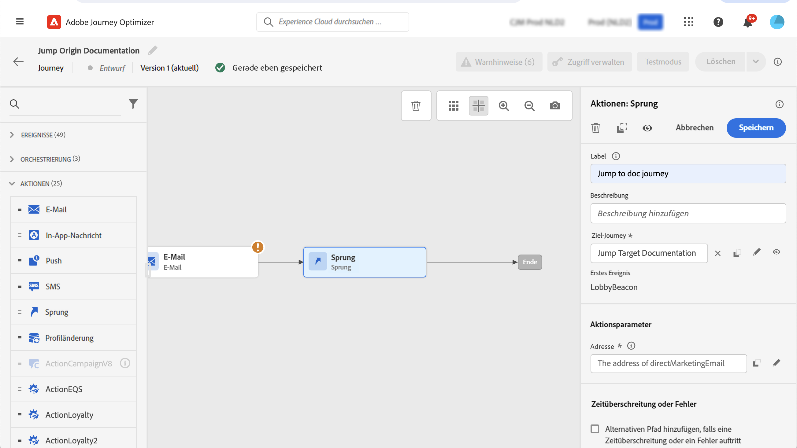
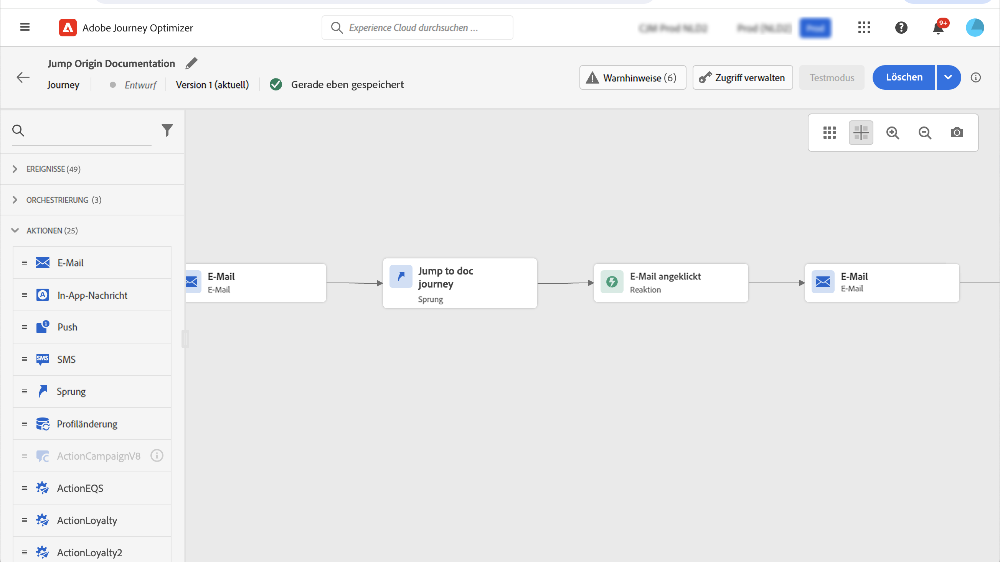

# Springen zwischen Journeys {#jump}

>[!CONTEXTUALHELP]
>id="ajo_journey_jump"
>title="Aktivität „Sprung“"
>abstract="Mit der Aktionsaktivität „Sprung“ können Sie Kontakte von einer Journey in eine andere bewegen. Diese Funktion ermöglicht es Ihnen, das Design sehr komplexer Journeys zu vereinfachen und Journeys basierend auf allgemeinen und wiederverwendbaren Journey-Mustern zu erstellen."

Mit der Aktionsaktivität **[!UICONTROL Sprung]** können Sie Kontakte von einer Journey in eine andere bewegen. Diese Funktion unterstützt:

* Vereinfachung der Gestaltung sehr komplexer Journeys durch Aufteilung in mehrere Journeys
* Erstellung von Journeys anhand allgemeiner und wiederverwendbarer Journey-Muster

Fügen Sie in der Ursprungs-Journey die Aktivität **[!UICONTROL Springen]** hinzu und wählen Sie eine Ziel-Journey aus. Wenn der Kontakt in den **[!UICONTROL Sprungschritt]** eintritt, wird ein internes Ereignis an das erste Ereignis der Ziel-Journey gesendet. Wenn die **[!UICONTROL Sprung]**-Aktion erfolgreich ist, schreitet der Kontakt im Journey fort. Das Verhalten ist mit anderen Aktionen vergleichbar.

Auf der Ziel-Journey wird das erste intern durch die Aktivität **[!UICONTROL Springen]** ausgelöste Ereignis zum individuellen Fluss in der Journey.

## Lebenszyklus {#jump-lifecycle}

Angenommen, Sie haben eine **[!UICONTROL Sprung]**-Aktivität in Journey A zu Journey B hinzugefügt. Journey A ist die **Ursprungs-Journey** und Journey B ist die **Ziel-Journey**.

Im Folgenden finden Sie die verschiedenen Schritte des Ausführungsprozesses:

**Journey A** wird von einem externen Ereignis ausgelöst:

1. Journey A empfängt ein externes Ereignis, das mit einem Kontakt in Verbindung steht.
1. Der Kontakt erreicht den **[!UICONTROL Sprungschritt]**.
1. Der Kontakt wird auf Journey B gepusht und fährt mit den nächsten Schritten in Journey A fort, nach dem **[!UICONTROL Springen]** Schritt.

In Journey B wird das erste Ereignis intern über die Aktivität &quot;**[!UICONTROL &quot;]** Journey A ausgelöst:

1. Journey B erhält ein internes Ereignis von Journey A.
1. Das Individuum beginnt in Journey B zu fließen.

>[!NOTE]
>
>Journey B kann auch über ein externes Ereignis ausgelöst werden.

## Best Practices und Einschränkungen {#jump-limitations}

### Authoring {#jump-limitations-authoring}

* Die **[!UICONTROL Sprungaktivität]** ist nur in Journeys verfügbar, die einen Namespace verwenden.
* Sie können nur in eine Journey springen, die denselben Namespace wie die Ursprungs-Journey verwendet.
* Sie können nicht zu einer Journey springen, die mit einem **Zielgruppen-Qualifizierungsereignis** oder einer Aktivität vom Typ **Zielgruppe lesen** beginnt.
* Dieselbe Journey darf nicht gleichzeitig eine **[!UICONTROL Sprungaktivität]** und ein **Zielgruppen-Qualifizierungsereignis** oder eine Aktivität vom Typ **Zielgruppe lesen** enthalten.
* Sie können beliebig viele **[!UICONTROL Springen]**-Aktivitäten in einen Journey aufnehmen. Nach einem **[!UICONTROL Sprung]** können Sie jede erforderliche Aktivität hinzufügen.
* Sie können beliebig viele Sprungstufen einfügen. Journey A beispielsweise springt zu Journey B, die zu Journey C springt, und so weiter.
* Auch die Ziel-Journey kann beliebig viele **[!UICONTROL Sprungaktivitäten]** umfassen.
* Schleifenmuster werden nicht unterstützt. Es gibt keine Möglichkeit, zwei oder mehr Journey miteinander zu verbinden, was eine Endlosschleife erzeugen würde. Der Konfigurationsbildschirm für **[!UICONTROL Sprungaktivitäten]** verhindert dies.

### Ausführung {#jump-limitations-exec}

* Wenn die **[!UICONTROL Sprungaktivität]** ausgeführt wird, wird die aktuelle Version der Ziel-Journey ausgelöst.
* Eine eindeutige Person kann nur einmal in derselben Journey vorhanden sein. Wenn sich also der von der Ursprungs-Journey gepushte Kontakt bereits auf der Ziel-Journey befindet, gelangt er nicht auf die Ziel-Journey. Bei der Aktivität „Springen **[!UICONTROL wird kein Fehler gemeldet]** da dies ein normales Verhalten ist.

## Konfigurieren der Sprungaktivität {#jump-configure}

1. Konfigurieren Sie die **Ursprungs-Journey**.

   

1. Fügen Sie einem beliebigen Schritt in der Journey eine **[!UICONTROL Sprungaktivität]** der Kategorie **[!UICONTROL AKTIONEN]** hinzu. Fügen Sie einen Titel und eine Beschreibung hinzu.

   

1. Klicken Sie in das Feld **Ziel-Journey**.
Die Liste zeigt alle Journey-Versionen an, die sich im Entwurfs-, Live- oder Testmodus befinden. Journeys, die einen anderen Namespace verwenden oder mit einem **Zielgruppen-Qualifizierungsereignis** beginnen, sind nicht verfügbar. Ziel-Journeys, die ein Schleifenmuster erzeugen würden, werden ebenfalls herausgefiltert.

   

   >[!NOTE]
   >
   >Sie können rechts auf das Symbol **Zielgruppen-Journey öffnen** klicken, um die Ziel-Journey in einem neuen Tab zu öffnen.

1. Wählen Sie die Ziel-Journey aus, zu der Sie springen möchten.
Das Feld **Erstes Ereignis** wird vorab mit dem Namen des ersten Ereignisses der Ziel-Journey gefüllt. Wenn Ihre Ziel-Journey mehrere Ereignisse umfasst, ist der **[!UICONTROL Sprung]** nur zum ersten Ereignis zulässig.

   

1. Im Abschnitt **Aktionsparameter** werden alle Felder des Zielereignisses angezeigt. Ordnen Sie jedes Feld wie bei anderen Aktionstypen Feldern aus dem Ursprungs-Ereignis oder der Datenquelle zu. Diese Informationen werden zur Laufzeit an die Ziel-Journey weitergegeben.
1. Fügen Sie die nächsten Aktivitäten hinzu, um Ihre Ursprungs-Journey zu beenden.

   

   >[!NOTE]
   >
   >Die Identität des Kontakts wird automatisch zugeordnet. Diese Informationen sind auf der Benutzeroberfläche nicht sichtbar.

Ihre **[!UICONTROL Sprungaktivität]** ist konfiguriert. Sobald Ihr Journey live oder im Testmodus ist, werden Personen, die den **[!UICONTROL Sprung]**-Schritt erreichen, auf den Ziel-Journey gepusht.

Wenn in einer Journey eine **[!UICONTROL Sprungaktivität]** konfiguriert ist, wird zu Beginn der Ziel-Journey automatisch ein **[!UICONTROL Sprungeintrittssymbol]** hinzugefügt. Auf diese Weise können Sie erkennen, dass die Journey sowohl extern als auch intern durch eine **[!UICONTROL Sprungaktivität]** ausgelöst werden kann.

## Fehlerbehebung {#jump-troubleshoot}

Fehler treten auf, wenn:

* Die Ziel-Journey existiert nicht mehr
* Die Ziel-Journey ist Entwurf, geschlossen oder gestoppt
* Das erste Ereignis der Ziel-Journey hat sich geändert, und die Zuordnung ist beschädigt

