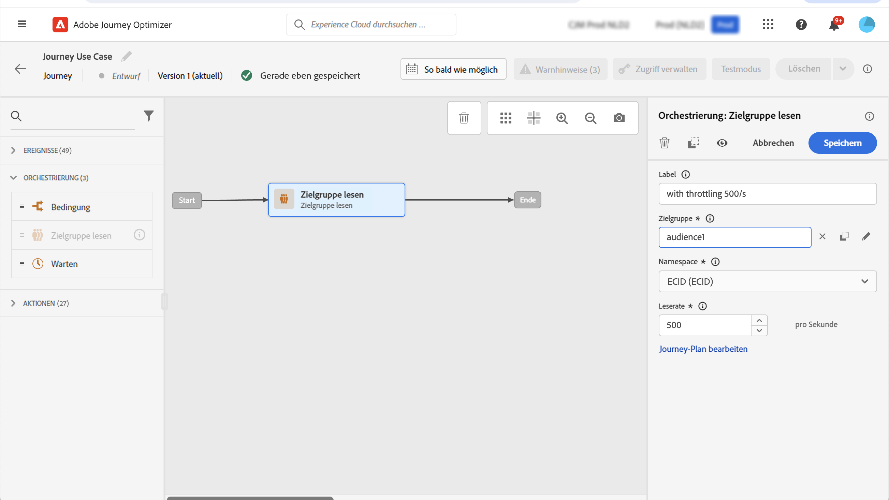
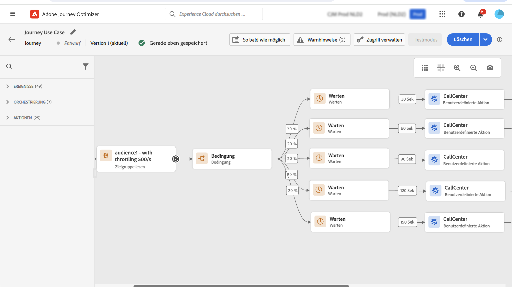

# Anwendungsfall: Begrenzen des Durchsatzes mit externen Datenquellen und benutzerdefinierten Aktionen{#limit-throughput}

## Beschreibung des Anwendungsfalls

Mit Adobe Journey Optimizer können Anwenderinnen und Anwender API-Aufrufe über benutzerdefinierte Aktionen und Datenquellen an externe Systeme senden.

Dies kann auf folgende Arten erfolgen:

* **Datenquellen**: um Informationen aus externen Systemen zu sammeln und im Kontext der Journey zu verwenden, zum Beispiel um Wetterinformationen über die Profilstadt zu erhalten und einen dedizierten Journey-Fluss auf dieser Grundlage zu ermöglichen.

* **Benutzerdefinierte Aktionen**: um Informationen an externe Systeme zu senden, wie etwa zum Senden von E-Mails über eine externe Lösung mithilfe der Orchestrierungsfunktionen von Journey Optimizer zusammen mit Profilinformationen, Audience-Daten und dem Journey-Kontext.

Wenn Sie mit externen Datenquellen oder benutzerdefinierten Aktionen arbeiten, sollten Sie Ihre externen Systeme schützen, indem Sie den Journey-Durchsatz einschränken: bis zu 5.000 Instanzen/Sekunde für unitäre Journeys und bis zu 20.000 Instanzen/Sekunde für durch Zielgruppen ausgelöste Journeys.

Für benutzerdefinierte Aktionen sind Einschränkungsfunktionen auf Produktebene verfügbar. Mehr dazu erfahren Sie auf [dieser Seite](../configuration/external-systems.md#capping).

Für externe Datenquellen können Sie Begrenzungen auf Endpunktebene definieren, um zu verhindern, dass diese externen Systeme durch die Capping-APIs von Journey Optimizer überlastet werden. Dadurch werden jedoch alle verbleibenden Anfragen nach Erreichen des Grenzwerts entfernt. In diesem Abschnitt finden Sie Lösungsansätze, mit denen Sie Ihren Durchsatz optimieren können.

Weiterführende Informationen zur Integration in externe Systeme finden Sie auf dieser [Seite](../configuration/external-systems.md).

## Implementierung

Bei **durch Zielgruppen ausgelösten Journeys** kann die Leserate der Aktivität „Zielgruppe lesen“ definiert werden, die sich auf den Journey-Durchsatz auswirkt. [Weitere Informationen](../building-journeys/read-audience.md)

>[!NOTE]
>
> Dies ist die maximale Anzahl von Profilen, die pro Sekunde in die Journey eintreten können. Diese Rate gilt nur für diese und keine andere Aktivitäten in der Journey. [Mehr dazu](../building-journeys/read-audience.md)

Sie können diesen Wert von 500 bis 20.000 Instanzen pro Sekunde einstellen. Wenn Sie weniger als 500 pro Sekunde benötigen, können Sie auch Bedingungen für die prozentuale Aufspaltung mit Warteaktivitäten hinzufügen, um die Journey in mehrere Zweige zu unterteilen und sie zu einem bestimmten Zeitpunkt auszuführen.

Nehmen wir das Beispiel einer **durch Zielgruppen ausgelösten Journey** mit einer Population von **10.000 Profilen**, welche Daten an ein externes System sendet, das **100 Anfragen/Sekunde** unterstützt.

1. Sie können die Aktivität „Zielgruppe lesen“ definieren, um Profile mit einem Durchsatz von 500 Profilen/Sekunde zu lesen. Somit wird es 20 Sekunden dauern, um alle Ihre Profile zu lesen. Während der ersten Sekunde werden Sie 500 davon lesen, während der zweiten 500 weitere und so weiter.

1. Anschließend können Sie eine Bedingungsaktivität mit einer prozentualen Aufspaltung von 20 % hinzufügen, die pro Sekunde 100 Profile in jeder Verzeigung enthält.

1. Fügen Sie anschließend für jede Verzeigung Warteaktivitäten mit einem bestimmten Timer hinzu. Hier haben wir für jede eine Wartezeit von 30 Sekunden eingerichtet. Pro Sekunde fließen 100 Profile in jede Verzweigung.

   * In Verzeigung 1 warten sie 30 Sekunden, das heißt:
      * In der ersten Sekunde warten 100 Profile bis zur Sekunde 31.
      * In der zweiten Sekunde warten 100 Profile bis zur Sekunde 32 usw.

   * In der Vezweigung 2 warten sie 60 Sekunden, das heißt:
      * In der ersten Sekunde warten 100 Profile bis zur Sekunde 61 (1min01s)
      * In der zweiten Sekunde warten 100 Profile bis zur Sekunde 62 (1min02s) usw.

   * Da wir erwarten, dass alle Profile in maximal 20 Sekunden gelesen werden, gibt es keine Überschneidungen zwischen den einzelnen Verzeigungen, wobei die zweite Verzweigung die letzte ist, bei der Profile in die Bedingung einfließen. Zwischen Sekunde 31 und Sekunde 51 werden alle Profile in der Verzweigung 1 verarbeitet. Zwischen Sekunde 61 (1min01s) und Sekunde 81 (1min21s) werden alle Profile in Verzweigung 2 verarbeitet usw.

   * Als Schutzmaßnahme können Sie auch eine sechste Verzweigung hinzufügen, sodass weniger als 100 Profile pro Verzweigung enthalten sind, insbesondere wenn Ihr externes System nur 100 Anfragen/Sekunde unterstützt.

>[!IMPORTANT]
>
>Wie bei jeder Problemlösung sollten Sie auch diese Vorgehensweise vor der Einführung in eine Produktionsumgebung gründlich testen, um sicherzustellen, dass sie das gewünschte Ergebnis bringt.

Als zusätzliche Leitplanke können Sie auch Begrenzungsfunktionen verwenden.

>[!NOTE]
>
>Im Gegensatz zu Begrenzungsfunktionen, die einen Endpunkt schützen, indem sie für alle Journeys einer Sandbox global angewendet werden, funktioniert dieser Lösungsansatz nur auf Journey-Ebene. Wenn also mehrere Journeys parallel ausgeführt werden und auf denselben Endpunkt abzielen, müssen Sie dies beim Entwerfen Ihrer Journey berücksichtigen. Dieser Lösungsansatz ist daher nicht für jeden Anwendungsfall geeignet.
