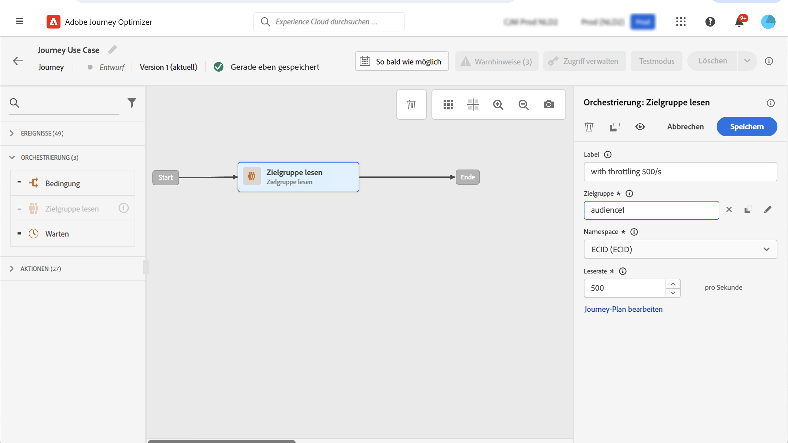
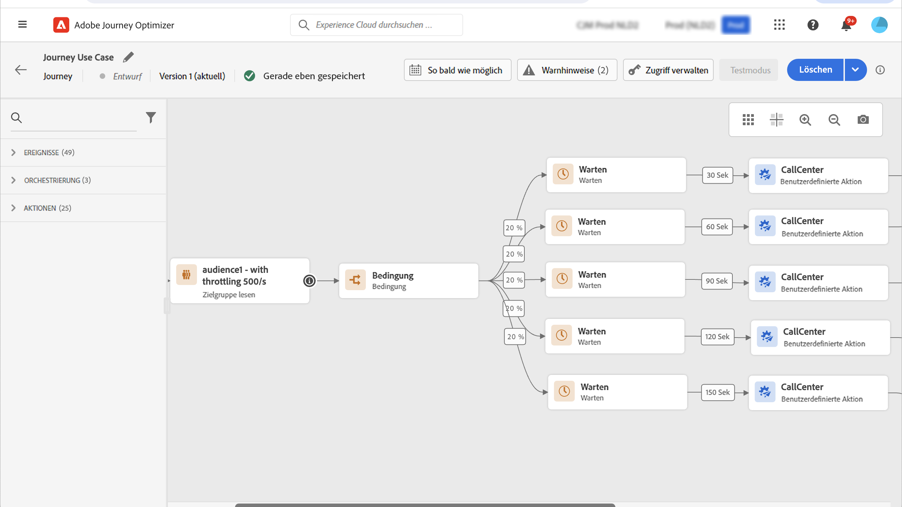

# Anwendungsfall: Begrenzen des Durchsatzes mit externen Datenquellen und benutzerdefinierten Aktionen{#limit-throughput}

>[!BEGINSHADEBOX]

**Auf dieser Seite:** Erfahren Sie, wie Sie die Journey-Verarbeitung mit benutzerdefinierten Aktionen und externen Datenquellen einschränken können, damit externe Systeme nicht über die unterstützte Anzahl von Anfragen pro Sekunde hinaus überfordert werden.

>[!ENDSHADEBOX]

Verwenden Sie diesen Anwendungsfall, um die Journey-Verarbeitung zu drosseln, wenn externe Systeme eine begrenzte Anzahl von Anfragen pro Sekunde verarbeiten müssen.

## Beschreibung des Anwendungsfalls

[!DNL Adobe Journey Optimizer] können Benutzerinnen und Benutzer API-Aufrufe über benutzerdefinierte Aktionen und Datenquellen an externe Systeme senden.

Dies kann auf folgende Arten erfolgen:

* **Datenquellen**: um Informationen aus externen Systemen zu sammeln und im Kontext der Journey zu verwenden, zum Beispiel um Wetterinformationen über die Profilstadt zu erhalten und einen dedizierten Journey-Fluss auf dieser Grundlage zu ermöglichen.

* **Benutzerdefinierte Aktionen**: um Informationen an externe Systeme zu senden, wie etwa zum Senden von E-Mails über eine externe Lösung mithilfe der Orchestrierungsfunktionen von Journey Optimizer zusammen mit Profilinformationen, Zielgruppen-Daten und dem Journey-Kontext.

>[!NOTE]
>
>Da die Antworten jetzt unterstützt werden, sollten Sie für Anwendungsfälle mit externen Datenquellen benutzerdefinierte Aktionen anstelle von Datenquellen verwenden. Weitere Informationen zu Antworten finden Sie in [diesem Abschnitt](../action/action-response.md).

Wenn Sie mit externen Datenquellen oder benutzerdefinierten Aktionen arbeiten, sollten Sie Ihre externen Systeme schützen, indem Sie den Journey-Durchsatz einschränken: bis zu 5.000 Instanzen/Sekunde für unitäre Journeys und bis zu 20.000 Instanzen/Sekunde für durch Zielgruppen ausgelöste Journeys. Weitere Informationen zu Journey-Verarbeitungsraten und -Durchsatz finden Sie in [diesem Abschnitt](entry-management.md#journey-processing-rate).

Für benutzerdefinierte Aktionen sind Einschränkungsfunktionen auf Produktebene verfügbar. Mehr dazu erfahren Sie auf [dieser Seite](../configuration/external-systems.md#capping).

Für externe Datenquellen können Sie Begrenzungen auf Endpunktebene definieren, um zu verhindern, dass diese externen Systeme durch die Capping-APIs von Journey Optimizer überlastet werden. Dadurch werden jedoch alle verbleibenden Anfragen nach Erreichen des Grenzwerts entfernt. In diesem Abschnitt finden Sie Lösungsansätze, mit denen Sie Ihren Durchsatz optimieren können.

Weiterführende Informationen zur Integration in externe Systeme finden Sie auf dieser [Seite](../configuration/external-systems.md).

## Implementierung

Bei **durch Zielgruppen ausgelösten Journeys** kann die Leserate der Aktivität „Zielgruppe lesen“ definiert werden, die sich auf den Journey-Durchsatz auswirkt. [Weitere Informationen](../building-journeys/read-audience.md)

>[!NOTE]
>
> Dies ist die maximale Anzahl von Profilen, die pro Sekunde in die Journey eintreten können. Diese Rate gilt nur für diese und keine andere Aktivitäten in der Journey. [Weitere Informationen](../building-journeys/read-audience.md)

Sie können diesen Wert von 500 bis 20.000 Instanzen pro Sekunde einstellen. Wenn Sie weniger als 500 pro Sekunde benötigen, können Sie auch Bedingungen für die prozentuale Aufspaltung mit Warteaktivitäten hinzufügen, um die Journey in mehrere Zweige zu unterteilen und sie zu einem bestimmten Zeitpunkt auszuführen.

Nehmen wir das Beispiel einer **durch Zielgruppen ausgelösten Journey** mit einer Population von **10.000 Profilen**, die Daten an ein externes System sendet, das **100 Anfragen/Sekunde** unterstützt.

1. Sie können die Aktivität „Zielgruppe lesen“ definieren, um Profile mit einem Durchsatz von 500 Profilen/Sekunde zu lesen. Somit wird es 20 Sekunden dauern, um alle Ihre Profile zu lesen. Während der ersten Sekunde werden Sie 500 davon lesen, während der zweiten 500 weitere und so weiter.

1. Anschließend können Sie eine Bedingungsaktivität mit einer prozentualen Aufspaltung von 20 % hinzufügen, die pro Sekunde 100 Profile in jeder Verzeigung enthält.

1. Fügen Sie anschließend für jede Verzeigung Warteaktivitäten mit einem bestimmten Timer hinzu. Hier haben wir für jede eine Wartezeit von 30 Sekunden eingerichtet. Pro Sekunde fließen 100 Profile in jede Verzweigung.

   * In Verzeigung 1 warten sie 30 Sekunden, das heißt:
      * In der ersten Sekunde warten 100 Profile bis zur Sekunde 31.
      * In der zweiten Sekunde warten 100 Profile bis zur Sekunde 32 usw.

   * In der Vezweigung 2 warten sie 60 Sekunden, das heißt:
      * In der ersten Sekunde warten 100 Profile bis zur Sekunde 61 (1min01s)
      * In der zweiten Sekunde warten 100 Profile bis zur Sekunde 62 (1min02s) usw.

   * Da wir erwarten, dass alle Profile in maximal 20 Sekunden gelesen werden, gibt es keine Überschneidungen zwischen den einzelnen Verzeigungen, wobei die zweite Verzweigung die letzte ist, bei der Profile in die Bedingung einfließen. Zwischen Sekunde 31 und Sekunde 51 werden alle Profile in der Verzweigung 1 verarbeitet. Zwischen Sekunde 61 (1min01s) und Sekunde 81 (1min21s) werden alle Profile in Verzweigung 2 verarbeitet usw.

   * Als Schutzmaßnahme können Sie auch eine sechste Verzweigung hinzufügen, sodass weniger als 100 Profile pro Verzweigung enthalten sind, insbesondere wenn Ihr externes System nur 100 Anfragen/Sekunde unterstützt.

>[!IMPORTANT]
>
>Wie bei jeder Problemlösung sollten Sie auch diese Vorgehensweise vor der Einführung in eine Produktionsumgebung gründlich testen, um sicherzustellen, dass sie das gewünschte Ergebnis bringt.

Als zusätzliche Leitplanke können Sie auch Begrenzungsfunktionen verwenden.

>[!NOTE]
>
>Im Gegensatz zu Begrenzungsfunktionen, die einen Endpunkt schützen, indem sie für alle Journeys einer Sandbox global angewendet werden, funktioniert dieser Lösungsansatz nur auf Journey-Ebene. Wenn also mehrere Journeys parallel ausgeführt werden und auf denselben Endpunkt abzielen, müssen Sie dies beim Entwerfen Ihrer Journey berücksichtigen. Dieser Lösungsansatz ist daher nicht für jeden Anwendungsfall geeignet.

+++ KI-Wissensreferenz

Dieser Abschnitt enthält strukturiertes Wissen zur Unterstützung von Interpretation, Abrufen und Antworten auf Fragen zu diesem Thema.

Zum vollständigen Verständnis sollten diese Informationen mit der Dokumentation auf dieser Seite kombiniert werden. Keine der beiden Quellen ist für Einzelpersonen gedacht. Die Seite beschreibt die Funktion, während dieser Abschnitt zusätzlichen Kontext bietet, der dabei hilft, Begriffe, Absichten, Anwendbarkeit und Begrenzungen zu unterscheiden.

* **TL;DR:** Auf dieser Seite wird erläutert, wie Sie den Journey-Durchsatz einschränken können, wenn externe Datenquellen oder benutzerdefinierte Aktionen eine begrenzte Anzahl von Anfragen pro Sekunde aufweisen, indem Sie die Konfiguration der „Zielgruppenrate lesen“, die Prozentaufspaltung und Warteaktivitäten verwenden.

**intents:**

* Begrenzen des Durchsatzes einer zielgruppengesteuerten Journey, um ein externes System vor Überlastung zu schützen
* Konfigurieren Sie die Leserate der Aktivität Zielgruppe lesen , um zu steuern, wie viele Profile pro Sekunde eintreten.
* Kombinieren Sie prozentuale Aufspaltungsbedingungen und Warteaktivitäten, um die Profilverarbeitung über die Zeit zu verteilen
* Verstehen Sie den Unterschied zwischen Workarounds auf Journey-Ebene und Begrenzungsfunktionen auf Sandbox-Ebene
* Anwenden von Begrenzungsfunktionen auf benutzerdefinierte Aktionen auf Produktebene

**Glossar:**

* **Drosselung/Durchsatzbegrenzung**: Steuern der Rate, mit der Profile durch einen Journey fließen, um zu vermeiden, dass die Anfragekapazität eines externen Systems überschritten wird. *(produktspezifisch)*
* **Leserate der Zielgruppe lesen**: Ein konfigurierbarer Parameter in der Aktivität „Zielgruppe lesen“, der die maximale Anzahl von Profilen pro Sekunde festlegt, die auf die Journey zugreifen (Bereich: 500-20.000 Instanzen/Sekunde). *(produktspezifisch)*
* **Begrenzungs-API**: Eine Journey Optimizer-API, die ein maximales Anfragelimit pro Endpunkt für externe Datenquellen definiert. Anfragen, die über das obere Limit hinausgehen, werden entfernt. *(produktspezifisch)*
* **Bedingung für die prozentuale Aufspaltung**: Eine Bedingungsaktivität, die den Profilfluss in Zweige nach Prozentsatz unterteilt. Wird hier verwendet, um Profile über Pfade für zeitversetzte Wartezeiten zu verteilen. *(produktspezifisch)*

**Leitplanken:**

* Die Leserate der Zielgruppe lesen kann zwischen 500 und 20.000 Instanzen pro Sekunde festgelegt werden. Bei Werten unter 500/s ist eine Abhilfe durch prozentuale Aufspaltungen und Warteaktivitäten erforderlich
* Einzelne Journey unterstützen bis zu 5.000 Instanzen pro Sekunde; Journey-Zielgruppen unterstützen bis zu 20.000 Instanzen pro Sekunde
* Die Problemumgehung durch prozentuale Aufspaltung und Warten funktioniert nur auf Journey-Ebene, nicht auf allen Journey in der Sandbox
* Wenn mehrere Journeys denselben externen Endpunkt parallel ansprechen, berücksichtigt diese Problemumgehung nicht die kombinierte Last. Stattdessen sollten Begrenzungsfunktionen verwendet werden
* Verbleibende Anfragen, die das Begrenzungslimit für externe Datenquellen überschreiten, werden ignoriert und nicht in die Warteschlange gestellt
* Die Problemumgehung muss gründlich getestet werden, bevor sie in die Produktion aufgenommen wird

**Terminologie:**

* Kanonischer Name: Throughput limit — Akronym: none — Varianten: throttling, rate limit, Journey Throughput control
* Synonyme: „Capping“ = „Drosselung“ im Kontext des externen Endpunktschutzes
* Verwechseln Sie nicht: „Begrenzungs-API (Endpunktebene)“ ≠ „Leserate (Journey-Ebene)“ - Die Begrenzungs-API gilt global für alle Journey in einer Sandbox, die auf einen Endpunkt abzielt. Die Leserate und die Aufspaltungs-/Warteumgehung gelten nur für die jeweilige Journey

**FAQ:**

* **F: Wie hoch ist die maximale Leserate, die ich für eine Aktivität vom Typ „Zielgruppe lesen“ festlegen kann?** — Zwischen 500 und 20.000 Profile pro Sekunde. Verwenden Sie für eine Geschwindigkeit unter 500/s eine prozentuale Aufspaltung mit Warteaktivitäten.
* **F: Wie tragen prozentuale Aufspaltungen und Warteaktivitäten dazu bei, den Durchsatz zu begrenzen?** - Durch die Aufspaltung von Profilen in Verzweigungen (z. B. jeweils 20 %) und das Hinzufügen gestaffelter Wartezeiten pro Verzweigung stellen Sie sicher, dass nur eine kontrollierte Anzahl von Profilen das externe System pro Sekunde erreicht.
* **F: Schützt die prozentuale Aufspaltung alle Journey, die auf denselben Endpunkt abzielen?** — Nein, es funktioniert nur auf individueller Journey-Ebene. Wenn mehrere Journey parallel für denselben Endpunkt ausgeführt werden, verwenden Sie stattdessen Begrenzungsfunktionen auf Sandbox-Ebene.
* **F: Was passiert mit Anfragen, die das Begrenzungslimit für eine externe Datenquelle überschreiten?** — Sie werden gelöscht; die Begrenzungs-API stellt keine übermäßigen Anfragen in die Warteschlange.
* **F: Sollte ich benutzerdefinierte Aktionen oder Datenquellen für Anwendungsfälle externer Daten verwenden?** — Benutzerdefinierte Aktionen werden bevorzugt, da sie die Antwortverarbeitung unterstützen. Datenquellen sollten nur verwendet werden, wenn der Anwendungsfall sie speziell erfordert.

+++
