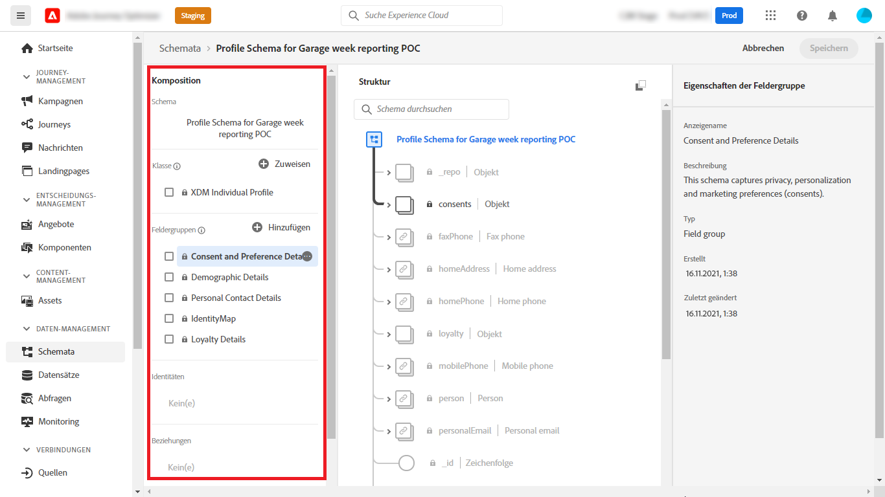
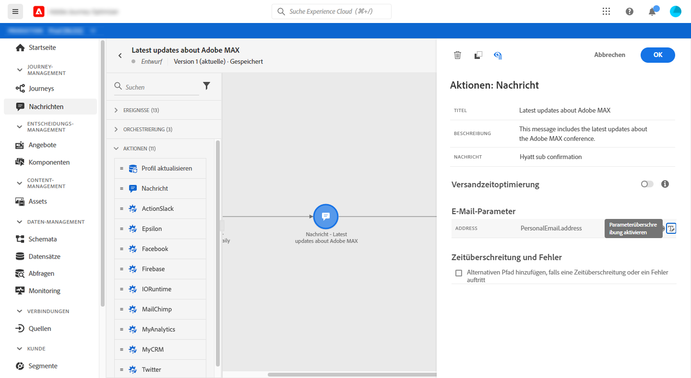
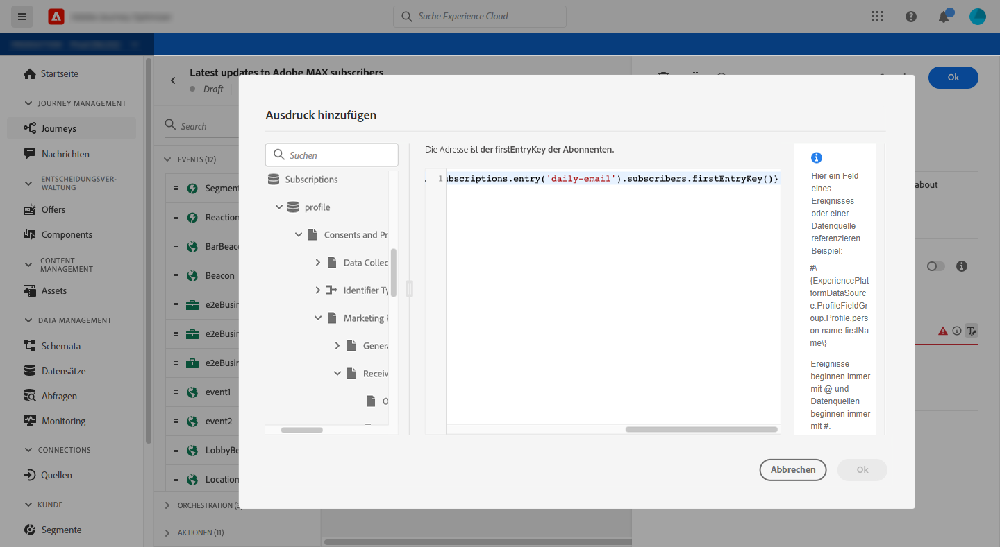
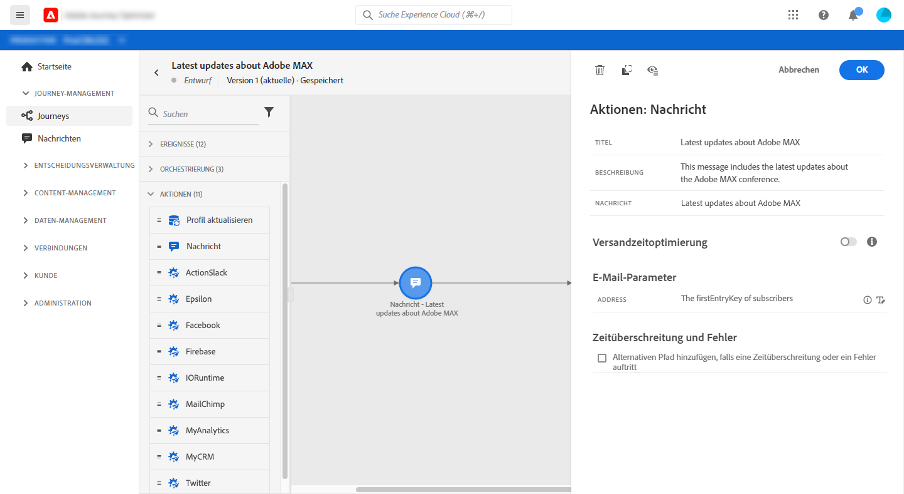

# Nachricht an Abonnenten einer Liste senden

In diesem Anwendungsbeispiel soll eine Journey erstellt werden, um eine Nachricht an die Abonnenten einer Liste zu senden.

In diesem Beispiel wird die **[!UICONTROL Einverständnis und Präferenzdetails]** Feldergruppe aus [!DNL Adobe Experience Platform] verwendet. Um diese Feldergruppe zu finden, verwenden Sie die **[!UICONTROL Data Management]** Menü, wählen **[!UICONTROL Schemas]**. Im **[!UICONTROL Feldergruppen]** den Namen der Feldergruppe im Suchfeld ein.



Gehen Sie wie folgt vor, um diese Journey zu konfigurieren:

1. Erstellen Sie eine Journey, die mit einer **[!UICONTROL Lesen]** Aktivität. [Mehr dazu](journey-gs.md).
1. Hinzufügen einer **[!UICONTROL Nachricht]** -Aktivität mit einer E-Mail an die Journey. [Mehr dazu](journeys-message.md).
1. Im **[!UICONTROL E-Mail-Parameter]** Abschnitt **[!UICONTROL Nachricht]** Aktivitätseinstellungen ersetzen die standardmäßige E-Mail-Adresse (`PersonalEmail.adress`) mit der E-Mail-Adresse der Abonnenten der Liste:

   1. Klicken Sie auf **[!UICONTROL Parameterüberschreibungen aktivieren]** rechts neben dem **[!UICONTROL Adresse]** und klicken Sie auf das **[!UICONTROL Bearbeiten]** Symbol.

      

      Um die E-Mail-Adresse ändern zu können, müssen Sie die Nachricht zuvor veröffentlicht haben.

   1. Geben Sie im Ausdruckseditor den Ausdruck ein, um die E-Mail-Adressen der Abonnenten abzurufen. [Mehr dazu](https://experienceleague.adobe.com/docs/journeys/using/building-advanced-conditions-journeys/expressionadvanced.html?lang=de){target=&quot;_blank&quot;}.

      Dieses Beispiel zeigt einen Ausdruck, der Verweise auf Zuordnungsfelder enthält:

      ```json
      #{ExperiencePlatform.Subscriptions.profile.consents.marketing.email.subscriptions.entry('daily-email').subscribers.firstEntryKey()}
      ```

      In diesem Beispiel werden diese Funktionen verwendet:

      | Funktion | Beschreibung | Beispiel |
      | --- | --- | --- |
      | `entry` | Siehe Element Zuordnung entsprechend dem ausgewählten Namespace . | Spezifische Abonnementlisten |
      | `firstEntryKey` | Abrufen des ersten Eintragsschlüssels einer Zuordnung | Erste E-Mail-Adresse der Abonnenten abrufen |

      In diesem Beispiel erhält die Abonnementliste den Namen `daily-email`. E-Mail-Adressen werden als Schlüssel im `subscribers` -Karte, die mit der Abonnementlisten-Karte verknüpft ist.

      Mehr dazu [Verweise auf Felder](https://experienceleague.adobe.com/docs/journeys/using/building-advanced-conditions-journeys/syntax/field-references.html) in Ausdrücken.

      

   1. Im **[!UICONTROL Ausdruck hinzufügen]** Dialogfeld, klicken Sie auf **[!UICONTROL Ok]**.

   

1. Beenden Sie die Journey mit einer **[!UICONTROL Ende]** Aktivität.


