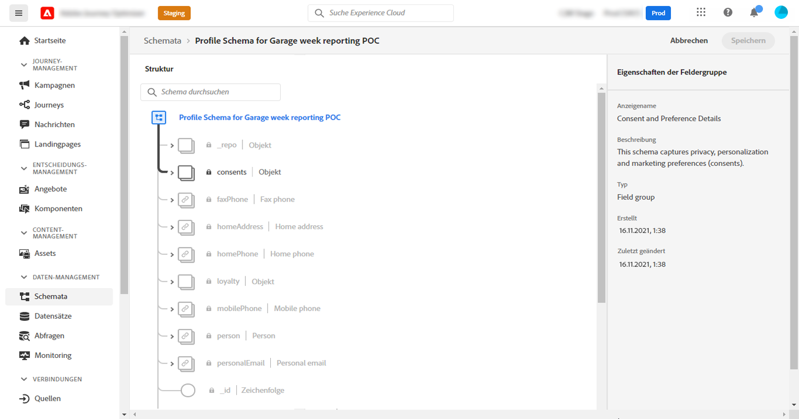
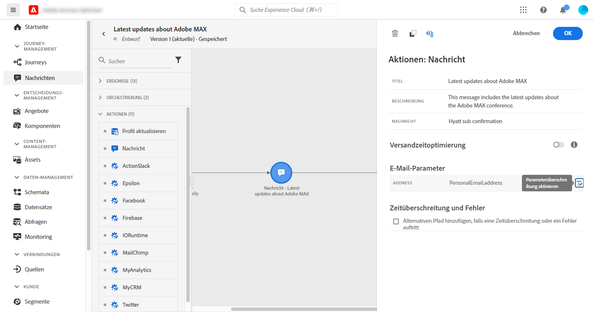
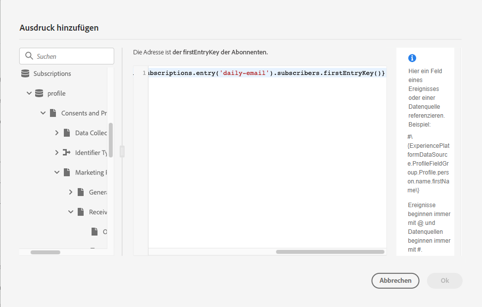

# Senden einer Nachricht an Abonnenten auf einer Liste {#send-a-message-to-the-subscribers-of-a-list}

>[!BEGINSHADEBOX]

**Auf dieser Seite** Erfahren Sie, wie Sie eine Journey erstellen, die eine Nachricht an die Abonnenten auf einer Liste mithilfe der Feldergruppe Einverständnis und Voreinstellungsdetails sendet.

>[!ENDSHADEBOX]

In diesem Anwendungsbeispiel soll eine Journey erstellt werden, um eine Nachricht an die Abonnenten auf einer Liste zu senden.

In diesem Beispiel wird die Feldergruppe **[!UICONTROL Einverständnis und Präferenzdetails]** aus [!DNL Adobe Experience Platform] verwendet. Um diese Feldergruppe zu finden, wählen Sie im Menü **[!UICONTROL Daten-Management]** die Option **[!UICONTROL Schemata]**. Geben Sie auf der Registerkarte **[!UICONTROL Feldergruppen]** im Suchfeld den Namen der Feldergruppe ein.



Gehen Sie wie folgt vor, um diese Journey zu konfigurieren:

1. Erstellen Sie eine Journey, die mit der Aktivität **[!UICONTROL Lesen]** beginnt. Weitere Informationen finden Sie unter [Erstellen der ersten Journey](journey-gs.md).
1. Fügen Sie der Journey die Aktionsaktivität **[!UICONTROL E-Mail]** hinzu. Weitere Informationen zum [Arbeiten mit Kanalaktivitäten](journey-action.md).
1. Ersetzen Sie im Abschnitt **[!UICONTROL E-Mail-Parameter]** der Aktivitätseinstellungen der **[!UICONTROL E-Mail]** die standardmäßige E-Mail-Adresse (`PersonalEmail.adress`) durch die E-Mail-Adresse der Abonnenten auf der Liste:

   1. Klicken Sie auf das Symbol **[!UICONTROL Parameterüberschreibungen aktivieren]** rechts neben dem Feld **[!UICONTROL Adresse]** und klicken Sie auf das Symbol **[!UICONTROL Bearbeiten]**.

      

   1. Geben Sie im Ausdruckseditor den Ausdruck ein, um die E-Mail-Adressen der Abonnenten abzurufen. [Weitere Informationen](expression/expressionadvanced.md).

      Dieses Beispiel zeigt einen Ausdruck, der Verweise auf Zuordnungsfelder enthält:

      ```json
      #{ExperiencePlatform.Subscriptions.profile.consents.marketing.email.subscriptions.entry('daily-email').subscribers.firstEntryKey()}
      ```

      In diesem Beispiel werden die folgenden Funktionen verwendet:

      | Funktion | Beschreibung | Beispiel |
      | --- | --- | --- |
      | `entry` | Verweist auf ein Zuordnungselement entsprechend dem ausgewählten Namespace | Verweis auf eine spezifische Abonnement-Liste |
      | `firstEntryKey` | Ruft den ersten Eintragsschlüssel einer Zuordnung ab | Abrufen der ersten E-Mail-Adresse der Abonnenten |

      In diesem Beispiel erhält die Abonnement-Liste den Namen `daily-email`. E-Mail-Adressen werden als Schlüssel in der Zuordnung `subscribers` definiert, die mit der Zuordnung der Abonnement-Liste verknüpft ist.

      Lesen Sie mehr über [Verweise auf Felder](expression/field-references.md) in Ausdrücken.

      

   1. Klicken Sie im Dialogfeld **[!UICONTROL Ausdruck hinzufügen]** auf **[!UICONTROL OK]**.

>[!CAUTION]
>
>Das Überschreiben von E-Mail-Adressen sollte nur für bestimmte Anwendungsfälle verwendet werden. Meistens müssen Sie die E-Mail-Adresse nicht ändern, da der Wert, der als die primäre Adresse in den **[!UICONTROL Ausführungsfeldern]** definiert ist, derjenige ist, der verwendet werden sollte. [Weitere Informationen](../configuration/primary-email-addresses.md)

+++ KI-Wissensreferenz

Dieser Abschnitt enthält strukturiertes Wissen zur Unterstützung von Interpretation, Abrufen und Antworten auf Fragen zu diesem Thema.

Zum vollständigen Verständnis sollten diese Informationen mit der Dokumentation auf dieser Seite kombiniert werden. Keine der beiden Quellen ist für Einzelpersonen gedacht. Die Seite beschreibt die Funktion, während dieser Abschnitt zusätzlichen Kontext bietet, der dabei hilft, Begriffe, Absichten, Anwendbarkeit und Begrenzungen zu unterscheiden.

* **TL;DR:** Auf dieser Seite wird gezeigt, wie Sie eine Journey erstellen, die eine E-Mail an Abonnenten auf einer Liste sendet, indem Sie den standardmäßigen E-Mail-Adressparameter überschreiben, indem Sie einen Ausdruck verwenden, der Abonnentenadressen aus einem Einverständniszuordnungsfeld liest.

**intents:**

* Erstellen Sie eine Journey, die Abonnenten einer bestimmten Liste anspricht, indem Sie die Aktivität „Zielgruppe lesen“ verwenden
* Überschreiben der Standard-E-Mail-Adresse in einer E-Mail-Aktionsaktivität mit dem Ausdruckseditor
* Verwenden Sie die `entry`- und `firstEntryKey`, um Abonnenten-E-Mail-Adressen aus einer Einverständniszuordnung abzurufen
* Referenzieren Sie die Feldergruppe „Einverständnis“ und „Voreinstellungsdetails“, um auf Daten der Abonnement-Liste zuzugreifen

**Glossar:**

* **Überschreiben von E-Mail-Adressen (Parameterüberschreibungen)**: Eine Aktivitätseinstellung für Journey-E-Mails, die die standardmäßige Profil-E-Mail-Adresse durch einen benutzerdefinierten Ausdruck ersetzt, der für Sonderfälle wie das Targeting von Abonnement-Listen verwendet wird. *(produktspezifisch)*
* **Feldergruppe „Einverständnis und Präferenzdetails**: Eine Adobe Experience Platform-Schemafeldgruppe, die Anmelde- und Einverständnisdaten enthält, einschließlich der `subscriptions`, die zum Speichern von Abonnenten-E-Mail-Adressen verwendet wird. *(produktspezifisch)*
* **`entry`Funktion**: Eine Ausdrucksfunktion, die über ihren Namespace-Schlüssel auf ein Zuordnungselement verweist - wird hier verwendet, um auf eine bestimmte Abonnement-Liste zu verweisen (z. B. `daily-email`). *(produktspezifisch)*
* **`firstEntryKey`Funktion**: Eine Ausdrucksfunktion, die den ersten Schlüssel einer Zuordnung abruft - wird hier verwendet, um die erste E-Mail-Adresse aus der Zuordnung der Abonnenten einer Abonnement-Liste abzurufen. *(produktspezifisch)*

**Leitplanken:**

* Das Überschreiben von E-Mail-Adressen sollte nur für bestimmte Anwendungsfälle wie das Targeting von Abonnement-Listen verwendet werden. In den meisten Fällen sollte die in den Ausführungsfeldern definierte primäre Adresse verwendet werden
* Die Feldergruppe Einverständnis und Voreinstellungsdetails muss im Schema vorhanden sein, damit dieser Anwendungsfall funktioniert
* Der Name der Abonnement-Liste, der im Ausdruck verwendet wird (z. B. `daily-email`), muss genau mit dem in den Daten konfigurierten Namen übereinstimmen

**Terminologie:**

* Kanonischer Name: Email address override — Akronym: none — Varianten: Parameterüberschreibungen, E-Mail-Parameterüberschreibungen
* Synonyme: „Abonnement-Liste“ = „Abonnentenliste“
* Verwechseln Sie nicht: „Überschreiben von E-Mail-Adressen“ ≠ „Primäre E-Mail-Adresse“ - Die primäre E-Mail-Adresse ist die Standardadresse, die in allen Journeys verwendet wird. Die Überschreibung ist ein Aktivitätsausdruck, der nur für Sonderfälle wie den Versand von Abonnement-Listen verwendet wird

**FAQ:**

* **F: Wie sende ich eine E-Mail an Abonnenten einer Abonnement-Liste anstatt an Profil-E-Mail-Adressen?** — Aktivieren Sie im Feld Adresse der Aktivität E-Mail die Parameterüberschreibungen und geben Sie mithilfe der Funktionen `entry` und `firstEntryKey` einen Ausdruck ein, um Adressen aus der Zuordnung der Abonnenten zur Zielabonnement-Liste abzurufen.
* **F: Welche Feldergruppe ist für diesen Anwendungsfall erforderlich?** — Die Feldergruppe Einverständnis und Präferenzdetails aus Adobe Experience Platform, die die `subscriptions`-Zuordnungsstruktur enthält, die zum Speichern von Abonnenten-E-Mail-Adressen verwendet wird.
* **F: Sollte ich beim Targeting von Abonnentinnen und Abonnenten immer das Überschreiben von E-Mail-Adressen verwenden?** — Nein. Das Überschreiben von E-Mail-Adressen ist nur für bestimmte Anwendungsfälle vorgesehen. In den meisten Journeys sollte die in den Ausführungsfeldern definierte primäre Adresse verwendet werden.
* **F: Was bewirkt die `firstEntryKey` in diesem Kontext?** — Es ruft den ersten E-Mail-Adressschlüssel aus der `subscribers` ab, die einer bestimmten Abonnementliste zugeordnet ist, sodass die Journey einzelne Abonnenten ansprechen kann.

+++
