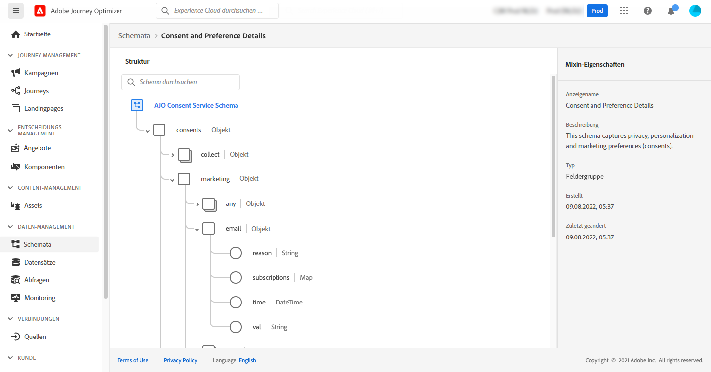

# Anwendungsfall: Senden einer Nachricht an Abonnenten auf einer Liste{#send-a-message-to-the-subscribers-of-a-list}

In diesem Anwendungsbeispiel soll eine Journey erstellt werden, um eine Nachricht an die Abonnenten auf einer Liste zu senden.

In diesem Beispiel wird die Feldergruppe **[!UICONTROL Einverständnis und Präferenzdetails]** aus [!DNL Adobe Experience Platform] verwendet. Um diese Feldergruppe zu finden, wählen Sie im Menü **[!UICONTROL Daten-Management]** die Option **[!UICONTROL Schemas]**. Geben Sie auf der Registerkarte **[!UICONTROL Feldergruppen]** im Suchfeld den Namen der Feldergruppe ein.



Gehen Sie wie folgt vor, um diese Journey zu konfigurieren:

1. Erstellen Sie eine Journey, die mit der Aktivität **[!UICONTROL Lesen]** beginnt. [Weitere Informationen](journey-gs.md).
1. Fügen Sie der Journey die Aktionsativität **[!UICONTROL E-Mail]** hinzu. [Weitere Informationen](journeys-message.md).
1. Ersetzen Sie im Abschnitt **[!UICONTROL E-Mail-Parameter]** der Aktivitätseinstellungen der **[!UICONTROL E-Mail]** die standardmäßige E-Mail-Adresse (`PersonalEmail.adress`) durch die E-Mail-Adresse der Abonnenten auf der Liste:

   1. Klicken Sie auf das Symbol **[!UICONTROL Parameterüberschreibungen aktivieren]** rechts neben dem Feld **[!UICONTROL Adresse]** und klicken Sie auf das Symbol **[!UICONTROL Bearbeiten]**.

      

   1. Geben Sie im Ausdruckseditor den Ausdruck ein, um die E-Mail-Adressen der Abonnenten abzurufen. [Weitere Informationen](expression/expressionadvanced.md).

      Dieses Beispiel zeigt einen Ausdruck, der Verweise auf Zuordnungsfelder enthält:

      ```json
      #{ExperiencePlatform.Subscriptions.profile.consents.marketing.email.subscriptions.entry('daily-email').subscribers.firstEntryKey()}
      ```

      In diesem Beispiel werden die folgenden Funktionen verwendet:

      | Funktion | Beschreibung | Beispiel |
      | --- | --- | --- |
      | `entry` | Verweis auf ein Zuordnungselement entsprechend dem ausgewählten Namespace | Verweis auf eine spezifische Abonnement-Liste |
      | `firstEntryKey` | Abrufen des ersten Eintragsschlüssels einer Zuordnung | Abrufen der ersten E-Mail-Adresse der Abonnenten |

      In diesem Beispiel erhält die Abonnement-Liste den Namen `daily-email`. E-Mail-Adressen werden als Schlüssel in der Zuordnung `subscribers` definiert, die mit der Zuordnung der Abonnement-Liste verknüpft ist.

      Lesen Sie mehr über [Verweise auf Felder](expression/field-references.md) in Ausdrücken.

      

   1. Klicken Sie im Dialogfeld **[!UICONTROL Ausdruck hinzufügen]** auf **[!UICONTROL Ok]**.
