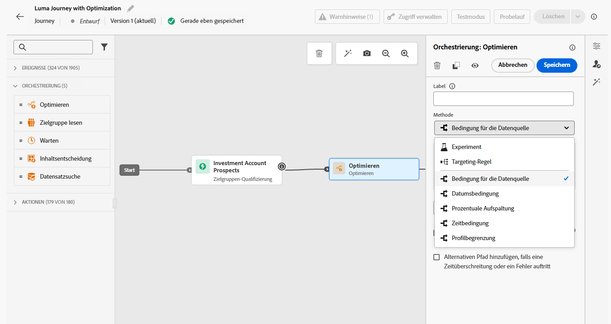

# Erste Schritte mit der Aktivität Optimieren {#journey-path-optimization}

>[!CONTEXTUALHELP]
>id="ajo_journey_optimize"
>title="Aktivität „Optimieren“"
>abstract="Mit **Aktivität „Optimieren** können Sie festlegen, wie Kontakte über Ihren Journey fortschreiten, indem Sie mehrere Pfade auf der Grundlage bestimmter Kriterien wie Experimentieren, Targeting und bestimmter Bedingungen erstellen. Beachten Sie, dass **Aktivität „Optimieren** das neue Vehikel zum Erstellen bedingter Pfade in Journey ist. Sie ersetzt die frühere Aktivität **Bedingung**."

>[!IMPORTANT]
>
>Die Aktivität **Optimieren** ist das neue Vehikel zum Erstellen bedingter Pfade in Journey. Sie ersetzt die frühere Aktivität **Bedingung**, die aus der Benutzeroberfläche entfernt wurde. Die gesamte bedingte Logik wird beibehalten und jetzt über die **Bedingungen** der Aktivität [Optimieren](conditions.md) verarbeitet.
>
>Wenn Sie über Journey verfügen, die **[!UICONTROL Bedingungs]**-Aktivitäten verwendet haben, können Sie diese weiterhin wie zuvor verwenden. Sie werden jetzt mit einem neuen Symbol als **[!UICONTROL Optimieren]**-Aktivitäten mit der **[!UICONTROL Bedingung]**-Methode angezeigt, das Verhalten ist jedoch unverändert. Jede benutzerdefinierte Beschriftung, die Sie auf dem Knoten festgelegt hatten, wird beibehalten.

Mit der Aktivität **Optimieren** können Sie festlegen, wie Einzelpersonen Ihre Journey durchlaufen, indem Sie mehrere **Pfade** auf der Grundlage spezifischer Kriterien erstellen, darunter Experimente, Targeting und bestimmte Bedingungen. So gewährleisten Sie ein Höchstmaß an Engagement und Erfolg, um hochgradig personalisierte und effektive Journeys zu erstellen.

## Was ist ein Journey-Pfad? {#journey-path}

Ein Journey-**Pfad** kann aus beliebigen der folgenden Variablen bestehen: Sequenzierung von Nachrichten, dazwischen liegende Zeit, Anzahl der Nachrichten oder eine beliebige Kombination dieser drei Variablen.

Ein Pfad kann beispielsweise eine E-Mail enthalten, ein anderer zwei SMS-Nachrichten und ein dritter eine E-Mail, einen Knoten, um zwei Stunden zu warten, und dann eine SMS-Nachricht.

## Drei Möglichkeiten zur Optimierung Ihrer Journey {#optimization-methods}

Durch die Aktivität **Optimieren** können Sie die folgenden Aktionen für Ihre Journey-Pfade ausführen:

* [Pfadexperimente ausführen](path-experimentation.md) - Testen Sie verschiedene Pfade basierend auf zufälligen Aufspaltungen, um anhand vordefinierter Erfolgsmetriken (z. B. Konversionsrate, Umsatz, Interaktion) zu bestimmen, welche am besten abschneidet.

* [Nutzen von Zielgruppenregeln](path-targeting.md) - Definieren Sie spezifische Regeln, die erfüllt sein müssen, damit eine Kundin oder ein Kunde auf der Grundlage von Zielgruppensegmenten, Profilattributen oder kontextuellen Daten für die Eingabe eines der Journey-Pfade berechtigt ist. Dadurch wird sichergestellt, dass die richtige Zielgruppe den angegebenen Pfad eingibt.

  >[!AVAILABILITY]
  >
  >Diese Funktion ist derzeit nur eingeschränkt verfügbar. Wenden Sie sich an Ihren Adobe-Support-Mitarbeiter, um Zugriff anzufordern.

* [Bedingungen anwenden](conditions.md) - Erstellen Sie bedingte Pfade basierend auf bestimmten Kriterien wie Datenquellen, Zeit, Datum, Prozentaufspaltungen oder Profilobergrenzen. Dies entspricht der vorherigen Aktivität vom Typ Bedingung .

## Funktionsweise {#how-it-works}

Sobald die Journey live ist, werden die Profile anhand der definierten Kriterien bewertet und basierend auf den passenden Kriterien auf den entsprechenden Pfad der Journey weitergeleitet.

## Nächste Schritte {#next-steps}

Wählen Sie die Optimierungsmethode aus, die am besten zu Ihrem Anwendungsfall passt:

* Möchten Sie testen und erfahren, welcher Pfad am besten funktioniert? → Gehen Sie zu [Pfadexperiment](path-experimentation.md)
* Möchten Sie verschiedene Zielgruppen über bestimmte Pfade senden? → Gehe zu [Pfad-Targeting](path-targeting.md)
* Möchten Sie eine bedingte Logik erstellen (if/then-Szenarien)? → Gehen Sie zu [Bedingungen](conditions.md)
