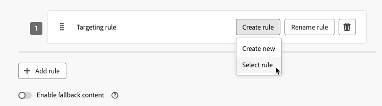

# Aktivität „Optimieren“ {#journey-path-optimization}

>[!CONTEXTUALHELP]
>id="ajo_journey_optimize"
>title="Aktivität „Optimieren“"
>abstract="Mit der Aktivität **Optimieren** können Sie festlegen, wie Einzelpersonen Ihre Journey durchlaufen, indem Sie mehrere Pfade auf der Grundlage spezifischer Kriterien erstellen, darunter Experimente, Targeting und bestimmte Bedingungen."

>[!AVAILABILITY]
>
>Diese Funktion ist nur eingeschränkt verfügbar. Wenden Sie sich an den Adobe-Support, um Zugriff zu erhalten.

Mit der Aktivität **Optimieren** können Sie festlegen, wie Einzelpersonen Ihre Journey durchlaufen, indem Sie mehrere **Pfade** auf der Grundlage spezifischer Kriterien erstellen, darunter Experimente, Targeting und bestimmte Bedingungen. So gewährleisten Sie ein Höchstmaß an Engagement und Erfolg, um hochgradig personalisierte und effektive Journeys zu erstellen.

Ein Journey-**Pfad** kann aus beliebigen der folgenden Variablen bestehen: Sequenzierung von Nachrichten, dazwischen liegende Zeit, Anzahl der Nachrichten oder eine beliebige Kombination dieser drei Variablen.

Ein Pfad kann beispielsweise eine E-Mail enthalten, ein anderer zwei SMS-Nachrichten und ein dritter eine E-Mail, einen Knoten, um zwei Stunden zu warten, und dann eine SMS-Nachricht.

<!--With this feature, [!DNL Journey Optimizer] empowers you with the tools to deliver personalized and optimized paths to your audience, ensuring maximum engagement and success to create highly customized and effective journeys.-->

Mit der Aktivität **Optimieren** können Sie die folgenden Aktionen für die resultierenden Pfade ausführen:

* [Pfadexperimente](#experimentation) durchführen
* [Targeting](#targeting)-Regeln in jedem Journey-Pfad nutzen
* [Bedingungen](#conditions) auf Ihre Pfade anwenden

Sobald die Journey live ist, werden die Profile anhand der definierten Kriterien bewertet und basierend auf den passenden Kriterien auf den entsprechenden Pfad der Journey weitergeleitet.

## Verwenden von Experimenten {#experimentation}

>[!CONTEXTUALHELP]
>id="ajo_path_experiment_success_metric"
>title="Erfolgsmetrik"
>abstract="Die Erfolgsmetrik wird verwendet, um die Abwandlung mit der besten Leistung in einem Experiment zu verfolgen und zu bewerten."
>additional-url="https://experienceleague.adobe.com/de/docs/journey-optimizer/using/orchestrate-journeys/create-journey/success-metrics" text="Konfigurieren und Verfolgen der Journey-Metriken"

Mit Experimenten können Sie verschiedene Pfade auf der Grundlage einer zufälligen Aufteilung testen, um anhand vordefinierter Erfolgsmetriken zu ermitteln, welcher Pfad am besten funktioniert.

Gehen Sie folgendermaßen vor, um Pfadexperimente in einer Journey einzurichten:

Angenommen, Sie möchten drei Pfade vergleichen:

* einen Pfad mit einer E-Mail,
* einen zweiten Pfad mit einem **[!UICONTROL Warteknoten]** von zwei Tagen und einer E-Mail,
* einen dritten Pfad mit einer E-Mail und dann einer SMS-Nachricht.

1. Ziehen Sie aus dem Abschnitt **[!UICONTROL Orchestrierung]** die Aktivität **[!UICONTROL Optimieren]** per Drag-and-Drop auf die Journey-Arbeitsfläche.

1. Fügen Sie ein optionales Label hinzu, damit sich die Aktivität in den Reporting- und Testmodusprotokollen leicht identifizieren lässt.

1. Wählen Sie **[!UICONTROL Experiment]** aus der Dropdown-Liste **[!UICONTROL Methode]** aus.

   {width=65%}

1. Klicken Sie auf **[!UICONTROL Experiment erstellen]**.

1. Wählen Sie die **[!UICONTROL Erfolgsmetrik]**, die Sie für Ihr Experiment festlegen möchten. Weitere Informationen zu den verfügbaren Metriken und zur Konfiguration der Liste finden Sie in [diesem Abschnitt](success-metrics.md).

   {width=80%}

1. Bei Bedarf können Sie Ihrem Versand eine **[!UICONTROL Holdout]**-Gruppe hinzufügen. Diese Gruppe wird keinen Pfad aus diesem Experiment beschreiten.

   >[!NOTE]
   >
   >Wenn Sie den Umschalter aktivieren, werden automatisch 10 % Ihrer Population übernommen. Sie können diesen Prozentsatz bei Bedarf anpassen.

   <!--
    DOES THIS APPLY TO PATH EXPERIMENT?
    IMPORTANT: When a holdout group is used in an action for path experimentation, the holdout assignment only applies to that specific action. After the action is completed, profiles in the holdout group will continue down the journey path and can receive messages from other actions. Therefore, ensure that any subsequent messages do not rely on the receipt of a message by a profile that might be in a holdout group. If they do, you may need to remove the holdout assignment.-->

1. Sie können dann jeder **[!UICONTROL Abwandlung]** einen bestimmten Prozentsatz zuweisen oder einfach den Umschalter **[!UICONTROL Gleichmäßig verteilen]** aktivieren.

   {width=80%}

1. Klicken Sie auf **[!UICONTROL Erstellen]**.

1. Definieren Sie die gewünschten Elemente für jede Verzweigung, die aus dem Experiment resultiert, z. B.:

   * Ziehen Sie eine Aktivität des Typs [E-Mail](../email/create-email.md) auf die erste Verzweigung (**Abwandlung A**).

   * Ziehen Sie eine Aktivität des Typs [Warten](wait-activity.md) von zwei Tagen auf die erste Verzweigung, gefolgt von einer Aktivität des Typs [E-Mail](../email/create-email.md) (**Abwandlung B**).

   * Ziehen Sie eine Aktivität des Typs [E-Mail](../email/create-email.md) auf die dritte Verzweigung, gefolgt von einer Aktivität des Typs [SMS](../sms/create-sms.md) (**Abwandlung C**).

   {width=100%}

1. Nutzen Sie bei Bedarf die Option **[!UICONTROL Alternativen Pfad hinzufügen, falls eine Zeitüberschreitung oder ein Fehler auftritt]**, um eine Ausweichaktion zu definieren. [Weitere Informationen](using-the-journey-designer.md#paths)

1. Wählen Sie eine Kanalaktion aus und verwenden Sie die Schaltfläche **[!UICONTROL Inhalt bearbeiten]**, um auf die Designtools zuzugreifen.

   {width=70%}

1. Von dort aus können Sie mithilfe des linken Bereichs für jede Aktion in Ihrem Experiment zwischen den verschiedenen Inhalten navigieren. Wählen Sie die einzelnen Inhalte aus und gestalten Sie sie nach Bedarf.

   {width=100%}

1. [Veröffentlichen](publish-journey.md) Sie Ihre Journey.

Sobald die Journey live ist, werden die Benutzenden nach dem Zufallsprinzip zugewiesen, um verschiedene Pfade zu durchlaufen. [!DNL Journey Optimizer] verfolgt, welcher Pfad am besten abschneidet, und stellt verwertbare Erkenntnisse zur Verfügung.

Verfolgen Sie den Erfolg Ihrer Journey mit dem Bericht zu Journey-Pfadexperimenten. [Weitere Informationen](../reports/journey-global-report-cja-experimentation.md)

>[!CAUTION]
>
>Bearbeiten Sie die Metadaten eines Pfadexperiments nicht, nachdem es veröffentlicht wurde. Die Bearbeitung der Metadaten unterbricht die Berechnung und das Reporting der Experimentergebnisse.

### Anwendungsfälle für Experimente {#uc-experiment}

Die folgenden Beispiele zeigen, wie Sie mit der Aktivität **[!UICONTROL Optimieren]** zusammen mit der Methode **[!UICONTROL Experiment]** ermitteln, welcher Pfad insgesamt am besten funktioniert.

+++Kanaleffektivität

Testen Sie, ob das Senden der ersten Nachricht per E-Mail oder per SMS zu höheren Konversionen führt.

➡️ Verwenden Sie die Konversionsrate als Erfolgsmetrik (z. B. Käufe, Anmeldungen).

+++

+++Nachrichtenfrequenz

Führen Sie ein Experiment durch, um zu überprüfen, ob der Versand einer E-Mail im Vergleich zu drei E-Mails pro Woche zu mehr Käufen führt.

➡️ Verwenden Sie Käufe oder die Abmelderate als Erfolgsmetrik.

+++

+++Wartezeit zwischen Nachrichten

Vergleichen Sie eine Wartezeit von 24 Stunden mit einer Wartezeit von 72 Stunden vor einem Nachfassen, um zu ermitteln, welcher Zeitraum die Interaktion maximiert.

➡️ Verwenden Sie die Klickrate oder den Umsatz als Erfolgsmetrik.

+++

## Nutzen von Targeting {#targeting}

>[!CONTEXTUALHELP]
>id="ajo_path_targeting_fallback"
>title="Was ist ein Fallback-Pfad?"
>abstract="Mit Fallback-Pfaden kann Ihre Zielgruppe einen alternativen Pfad beschreiten, falls keine der Targeting-Regeln erfüllt ist.  Wenn Sie diese Option nicht aktivieren, werden Zielgruppen, die sich nicht für eine Targeting-Regel qualifizieren, nicht in den Fallback-Pfad aufgenommen und die Journey wird beendet."

Mit Targeting-Regeln können Sie auf der Grundlage bestimmter Zielgruppensegmente bestimmte Regeln oder Qualifizierungen festlegen, die erfüllt sein müssen, damit eine Kundin oder ein Kunde zum Eintritt in einen der Journey-Pfade berechtigt ist<!-- depending on profile attributes or contextual attributes-->.

Im Gegensatz zu Experimenten, bei denen es sich um eine zufällige Zuweisung eines bestimmten Pfads handelt, ist das Targeting deterministisch, da sichergestellt wird, dass die richtige Zielgruppe oder das richtige Profil in den angegebenen Pfad eintritt.

<!--With targeting, specific rules can be defined based on:

* **User profile attributes** such as location (eg. geo-targeting), age, or preferences. For example, users in the US receive a "Golden Gate" promotion, while users in France receive an "Eiffel Tower" promotion.

* **Contextual data** such as device type (eg. device-targeting), time of day, or session details. For example, desktop users receive desktop-optimized content, while mobile users receive mobile-optimized content.

* **Audiences** which can be used to include or exclude profiles that have a particular audience membership.-->

Gehen Sie folgendermaßen vor, um das Targeting in einer Journey einzurichten.

1. Ziehen Sie aus dem Abschnitt **[!UICONTROL Orchestrierung]** die Aktivität **[!UICONTROL Optimieren]** per Drag-and-Drop auf die Journey-Arbeitsfläche.

1. Fügen Sie ein optionales Label hinzu, damit sich die Aktivität in den Reporting- und Testmodusprotokollen leicht identifizieren lässt.

1. Wählen Sie **[!UICONTROL Targeting-Regel]** aus der Dropdown-Liste **[!UICONTROL Methode]** aus.

   {width=60%}

1. Klicken Sie auf **[!UICONTROL Targeting-Regel erstellen]**.

1. Klicken Sie auf **[!UICONTROL Regel erstellen]** > **[!UICONTROL Neu erstellen]** und verwenden Sie den Regel-Builder, um Ihre Kriterien zu definieren.

   {width=100%}

   Definieren Sie beispielsweise eine Regel für Gold-Mitglieder des Treueprogramms (`loyalty.status.equals("Gold", false)`) und eine weitere Regel für die anderen Mitglieder (`loyalty.status.notEqualTo("Gold", false)`).

   

1. Sie können auch auf **[!UICONTROL Regel erstellen]** > **[!UICONTROL Regel auswählen]** klicken, um eine vorhandene Zielgruppenregel auszuwählen, die im Menü **[!UICONTROL Regeln]** erstellt wurde. [Weitere Informationen](../experience-decisioning/rules.md)

   {width=70%}

   In diesem Fall wird die Formel, aus der die Regel besteht, einfach in die Journey-Aktivität kopiert. Spätere Änderungen an dieser Regel im Menü **[!UICONTROL Regeln]** wirken sich nicht auf die Kopie der Journey aus.

   >[!AVAILABILITY]
   >
   >Das [Erstellen von Targeting-Regeln](../experience-decisioning/rules.md#create) im dedizierten [!DNL Journey Optimizer]-Menü ist derzeit für Organisationen verfügbar, die das Entscheidungsfindungs-Add-on erworben haben. Für andere Organisationen ist dies auf Anfrage verfügbar (eingeschränkte Verfügbarkeit).
   >
   >Diese Kapazität wird nach und nach für alle Kundinnen und Kunden eingeführt. Wenden Sie sich in der Zwischenzeit an den Adobe-Support, um Zugriff zu erhalten.

1. Nachdem Sie eine Regel hinzugefügt haben, können Sie sie noch ändern. Wählen Sie **[!UICONTROL Inline bearbeiten]**, um sie mithilfe des Regel-Builders schnell zu aktualisieren, oder **[!UICONTROL Regel auswählen]**, um eine andere vorhandene Regel auszuwählen.

   {width=100%}

   >[!NOTE]
   >
   >Die Inline-Bearbeitung einer Regel hat keine Auswirkungen auf die vorhandene Regel, von der sie stammt.

1. Aktivieren Sie bei Bedarf die Option **[!UICONTROL Fallback-Pfad aktivieren]**. Diese Aktion erstellt einen Fallback-Pfad für die Zielgruppe, die keine der oben definierten Targeting-Regeln erfüllt.

   >[!NOTE]
   >
   >Wenn Sie diese Option nicht aktivieren, treten alle Zielgruppen, die sich nicht für eine Targeting-Regel qualifizieren, nicht in den Fallback-Pfad ein und die Journey wird beendet.

1. Klicken Sie auf **[!UICONTROL Erstellen]**, um Ihre Einstellungen für die Targeting-Regel zu speichern.

1. Kehren Sie zur Journey zurück und fügen Sie bestimmte Aktionen hinzu, um jeden Pfad anzupassen. Erstellen Sie beispielsweise eine E-Mail mit personalisierten Angeboten für Gold-Mitglieder des Treueprogramms und eine SMS-Erinnerung für alle anderen Mitglieder.

   

1. Wenn Sie beim Definieren der Regeleinstellungen die Option **[!UICONTROL Fallback-Inhalte aktivieren]** ausgewählt haben, definieren Sie für den automatisch hinzugefügten Fallback-Pfad eine oder mehrere Aktionen.

   {width=70%}

1. Verwenden Sie bei Bedarf die Option **[!UICONTROL Alternativen Pfad hinzufügen, falls eine Zeitüberschreitung oder ein Fehler auftritt]**, um eine alternative Aktion zu definieren, falls Probleme auftreten. [Weitere Informationen](using-the-journey-designer.md#paths)

1. Gestalten Sie geeignete Inhalte für jede den einzelnen Gruppen entsprechende Aktion, durch die Einstellungen Ihrer Targeting-Regeln definiert werden. Sie können für jede Aktion nahtlos zwischen den verschiedenen Inhalten navigieren.

   

   In diesem Beispiel entwerfen Sie eine E-Mail mit Sonderangeboten für Gold-Mitglieder und eine SMS-Erinnerung für die anderen Mitglieder.

1. [Veröffentlichen](publish-journey.md) Sie Ihre Journey.

Sobald die Journey live ist, wird der für jedes Segment angegebene Pfad verarbeitet, sodass Gold-Mitglieder in den Pfad mit den E-Mail-Angeboten eintreten, während die anderen Mitglieder in den Pfad mit der SMS-Erinnerung eintreten.

Verfolgen Sie den Erfolg Ihrer Journey mit dem Journey-Bericht. [Weitere Informationen](../reports/journey-global-report-cja.md#targeting)

### Anwendungsfälle für Targeting-Regeln {#uc-targeting}

Die folgenden Beispiele zeigen, wie die Aktivität **[!UICONTROL Optimieren]** mit der Methode **[!UICONTROL Targeting-Regel]** verwendet wird, um Pfade für verschiedene Unterzielgruppen zu personalisieren.

+++Segmentspezifische Kanäle

Mitglieder des Treueprogramms mit Gold-Status können personalisierte Angebote per E-Mail erhalten, während alle anderen Mitglieder zu SMS-Erinnerungen weitergeleitet werden.

<!--➡️ Use the revenue per profile or conversion rate as the optimization metric.-->

+++

+++Verhaltensbasiertes Targeting

Kundinnen und Kunden, die eine E-Mail geöffnet, aber nicht geklickt haben, können eine Push-Benachrichtigung erhalten, während diejenigen, die sie überhaupt nicht geöffnet haben, eine SMS erhalten.

<!--➡️ Use the click-through rate or downstream conversions as the optimization metric.-->

+++

+++Targeting bezüglich des Kaufverlaufs

Kundinnen und Kunden, die kürzlich gekauft haben, können in einen kurzen Pfad „Danke + Crossselling“ eintreten, während Kundinnen und Kunden ohne Kaufhistorie eine längere Nurturing-Journey durchlaufen.

<!--➡️ Use the repeat purchase rate or engagement rate as the optimization metric.-->

+++

### Hinzufügen einer Bedingung {#conditions}

Bedingungen sind eine Art von [Targeting](#targeting)-Regeln, mit denen Sie festlegen können, wie sich Personen durch Ihre Journey bewegen, indem Sie auf Grundlage bestimmter Kriterien verschiedene Pfade einrichten.

Erfahren Sie in [diesem Abschnitt](conditions.md), wie Sie eine Bedingung definieren.

Folgende Bedingungstypen sind verfügbar:

* [Datenquellenbedingung](condition-activity.md#data_source_condition)
* [Bedingung für die Uhrzeit](condition-activity.md#time_condition)
* [Prozentuale Aufspaltung](condition-activity.md#percentage_split)
* [Bedingung für das Datum](condition-activity.md#date_condition)
* [Profilbegrenzung](condition-activity.md#profile_cap)
